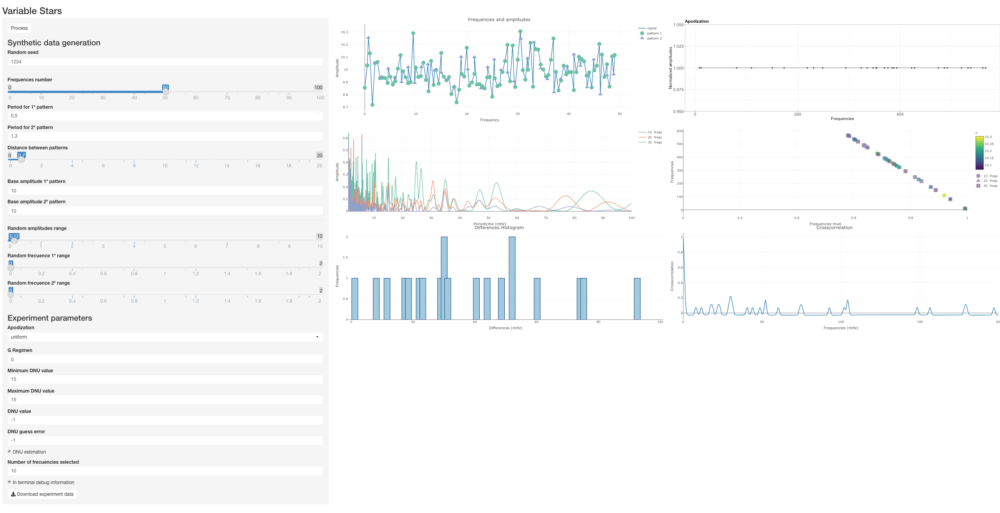

[](https://travis-ci.org/rmaestre/variableStars)


## Introduction

Variable Star package provides the main funtions to analized patterns on variable stars. All funcionalities are programmed in Cpp using RcppArmadillo integrated thorugh Rcpp.

All the code is based on these two papers:

- [Asteroseismic analysis of the CoRoT  $\delta$ Scuti star HD 174936](https://www.aanda.org/articles/aa/full_html/2009/40/aa11932-09/aa11932-09.html)

- [An in-depth study of HD 174966 with CoRoT photometry and HARPS spectroscopy](https://www.aanda.org/articles/aa/full_html/2013/11/aa20256-12/aa20256-12.html)

## Installation

```{r runUI, wrapper=TRUE, eval=FALSE}
install.packages("devtools")
library(devtools)
install_github("rmaestre/variableStars")
runUI()
```

[](docs/figures/ui.png)
 
A UI for experimentation with synthetic data is provided:

```{r runUISynthetic, wrapper=TRUE, eval=FALSE}
library(devtools)
runUI()
```

[](docs/figures/ui_synthetic.png)

## Example of use on a pulsar data

Please, find [here](docs/Experiment_-_HD174936.md) or [here](docs/Experiment_-_HD174966.md) the main execution of the complete package procedure.

## Main Workflow

[](docs/figures/workflow.png)

(The pulsar in the Crab Nebula is composed by images taken by Hubble (red) and Chandra X-Ray(blue))