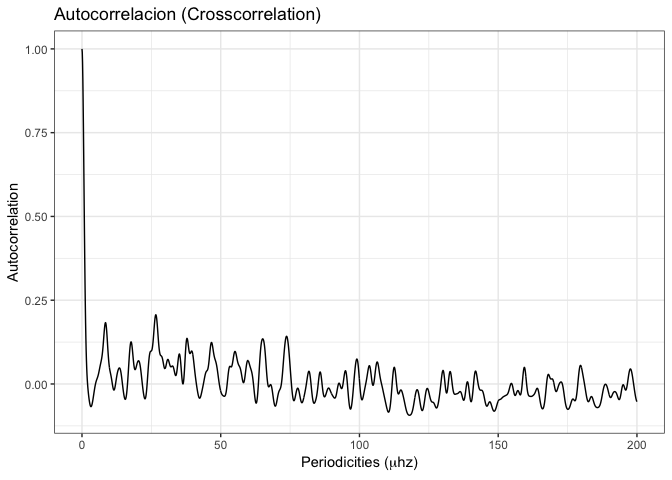
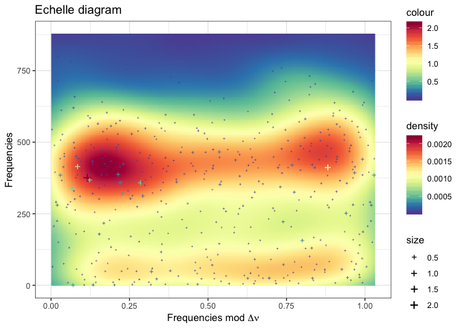

Experiment on HD174936
================
Roberto Maestre
10/24/2018

### Data source

``` r
if (T) {
  dt.star <- data.frame(read.table("../data/table1.dat", sep = "\t"))
  colnames(dt.star) <- c("Seq","frequency","amplitude","Phase","Sig","S/N","rms","e_Freq","e_Amp","e_Phase")
} else {
  dt.star <- data.frame(read.table("../data/freqs.dat", sep = " "))
  colnames(dt.star) <- c("Id","frequency","Freq2","amplitude","Phase","Sig", "S/N","rms", "e_Freq1","e_Amp","e_Phase")
}
head(dt.star)
```

    ##   Seq frequency amplitude     Phase      Sig     S/N   rms    e_Freq
    ## 1   1  32.59857    2.1216  2.395288 7225.844 659.008 2.122 1.724e-05
    ## 2   2  35.65822    1.0158  2.486353 3624.781 336.581 1.495 3.601e-05
    ## 3   3  35.82316    0.7157 -0.411712 2155.327 236.220 1.292 5.112e-05
    ## 4   4  31.11058    0.5646  2.665134 1784.588 174.791 1.191 6.480e-05
    ## 5   5  29.30857    0.5463  1.184620 1714.847 169.363 1.114 6.697e-05
    ## 6   6  31.79202    0.5303 -0.817776 1862.847 164.484 1.046 6.898e-05
    ##    e_Amp  e_Phase
    ## 1 0.0018 0.000851
    ## 2 0.0018 0.001777
    ## 3 0.0018 0.002522
    ## 4 0.0018 0.003197
    ## 5 0.0018 0.003304
    ## 6 0.0018 0.003403

``` r
# Save Data to disk (to be replicated)
write.table(
  dt.star[c("frequency", "amplitude")],
  file = "/tmp/data.csv",
  sep = "\t",
  quote = F,
  row.names = F,
  col.names = F
)
```

Data gathering from the Antonio's PhD thesis.

-   HD174936: table1.dat, <ftp://cdsarc.u-strasbg.fr/pub/cats/J/A+A/506/79/ReadMe>

### Frequencies and amplitudes

``` r
plot_spectrum_ggplot(-5, 80, dt.star)
```


### Experiment execution

``` r
result <- process(
  dt.star$frequency,
  dt.star$amplitude,
  filter = "uniform",
  gRegimen = 0,
  minDnu = 15,
  maxDnu = 95,
  dnuValue = -1,
  dnuGuessError = 10,
  dnuEstimation = TRUE,
  numFrequencies = 30,
  debug = TRUE
)
```

    ## ::: Debug information :::
    ## 
    ## Number of frequences to be processed: 422
    ## Number of frequences after drop the g regimen: 422
    ## Frequencies: 377.298, 412.711, 414.62, 360.076, 339.22, 367.963, 321.916, 387.625, 359.466, 0.660089, 385.889, 158.011, 465.895, 50.0353, 313.119, 421.049, 253.375, 394.708, 452.201, 282.342, 353.054, 425.395, 25.3505, 1.26184, 180.142, 223.276, 327.064, 441.971, 217.898, 433.881, 411.221, 26.6509, 55.7384, 27.6933, 21.9771, 438.165, 361.155, 130.075, 621.412, 529.104, 465.097, 412.321, 281.8, 450.613, 24.7067, 303.347, 345.455, 409.269, 50.6009, 72.8025, 
    ## Range: 30, 60, 90, 
    ##  Iteration over range: 30
    ##    Frequencies selected: 377.298, 412.711, 414.62, 360.076, 339.22, 367.963, 321.916, 387.625, 359.466, 0.660089, 
    ##    Amplitudes selected: 2.1216, 1.0158, 0.7157, 0.5646, 0.5463, 0.5303, 0.3623, 0.3193, 0.2997, 0.2947, 
    ##     Dnu: 9.4051
    ##     Dnu Peak: 9.4051
    ##     Dnu Guess: 0.22003
    ##     Cross correlation calculated:
    ##  Iteration over range: 60
    ##    Frequencies selected: 377.298, 412.711, 414.62, 360.076, 339.22, 367.963, 321.916, 387.625, 359.466, 0.660089, 
    ##    Amplitudes selected: 2.1216, 1.0158, 0.7157, 0.5646, 0.5463, 0.5303, 0.3623, 0.3193, 0.2997, 0.2947, 
    ##  Iteration over range: 90
    ##    Frequencies selected: 377.298, 412.711, 414.62, 360.076, 339.22, 367.963, 321.916, 387.625, 359.466, 0.660089, 
    ##    Amplitudes selected: 2.1216, 1.0158, 0.7157, 0.5646, 0.5463, 0.5303, 0.3623, 0.3193, 0.2997, 0.2947, 
    ## 
    ##  Successful process.

### Apodization

``` r
# Plot frecuency and amplitude
plot_apodization_ggplot(
  data.frame(
    "frequences" = result$apodization$frequences,
    "amplitude" = result$apodization$amp
  )
)
```


### Periodicities

``` r
dt <- prepare_periodicities_dataset(result$fresAmps)
plot_periodicities_ggplot(dt)
```


### Histogram of differences

``` r
dt <- data.frame(result$diffHistogram$histogram)
plot_histogram_ggplot(dt)
```


### Autocorrelation

``` r
dt <- data.frame(result$crossCorrelation)
plot_crosscorrelation_ggplot(dt)
```



### Echelle

#### For first all frecuencies

``` r
dt <- data.frame(
  "x" = result$echelle$modDnuStacked,
  "y" = result$echelle$freMas,
  "h" = result$echelle$amplitudes
)
plot_echelle_ggplot(dt) 
```



#### For first 30 frecuencies

``` r
dt <- data.frame(
  "x" = result$echelleRanges$`30`$modDnuStacked,
  "y" = result$echelleRanges$`30`$freMas,
  "h" = result$echelleRanges$`30`$amplitudes
)
# Plot echelle
plot_echelle_ggplot(dt) 
```


### Computation benchmark

``` r
# m <-
#   microbenchmark(result <- process(
#   dt.star$frequency,
#   dt.star$amplitude,
#   filter = "uniform",
#   gRegimen = 0,
#   minDnu = 15,
#   maxDnu = 95,
#   dnuValue = -1,
#   dnuGuessError = 10,
#   dnuEstimation = TRUE,
#   numFrequencies = 30,
#   debug = F
# )
#                  ,times = 100)
# autoplot(m, log = F) +
#   scale_x_discrete(labels = c("The complete process")) +
#   xlab("")
```
