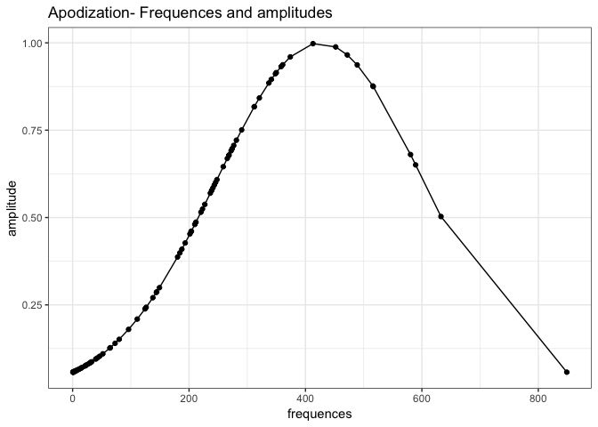
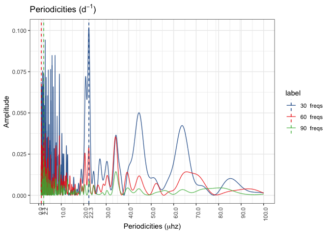
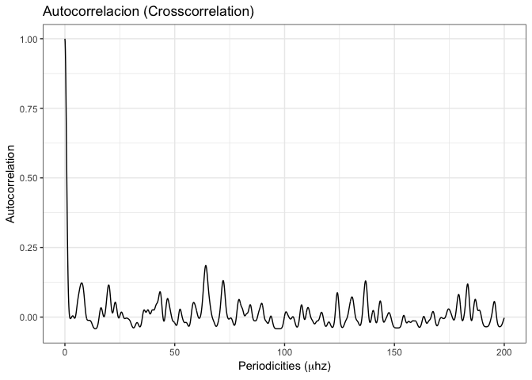
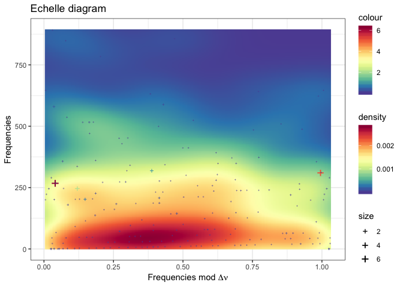
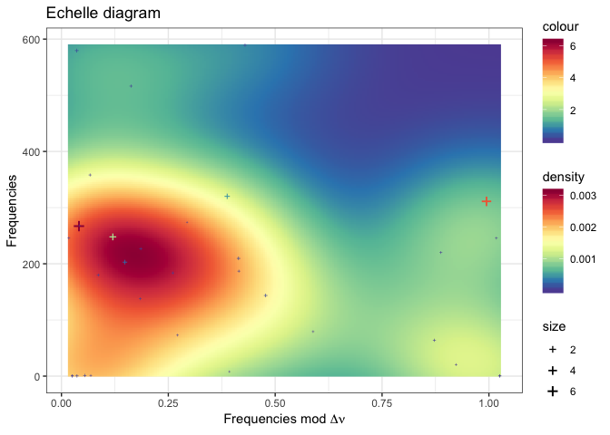

Experiment on HD174966
================
Roberto Maestre
10/24/2018

### Data source

``` r
dt.star <- data.frame(read.table("../data/freqs.dat", sep = " "))
colnames(dt.star) <- c("Id","frequency","Freq2","amplitude","Phase","Sig", "S/N","rms", "e_Freq1","e_Amp","e_Phase")
head(dt.star)
```

    ##   Id frequency    Freq2 amplitude     Phase       Sig      S/N   rms
    ## 1 F1  23.19482 268.4585    6.2902 -0.849284  7928.848 3384.993 6.000
    ## 2 F2  26.95851 312.0198    5.1034 -2.388499 11620.559 2462.099 4.029
    ## 3 F3  21.42080 247.9260    2.0929 -1.891001  9997.027 1083.607 1.779
    ## 4 F4  27.71549 320.7811    0.9973  3.001985  7364.347  482.136 0.987
    ## 5 F5  17.62251 203.9642    0.6038  0.109671  5757.060  261.153 0.691
    ## 6 F6  50.15324 580.4774    0.3111  1.475902  2440.658  170.487 0.535
    ##     e_Freq1  e_Amp  e_Phase
    ## 1 3.760e-06 0.0012 0.000186
    ## 2 4.640e-06 0.0012 0.000229
    ## 3 1.131e-05 0.0012 0.000558
    ## 4 2.374e-05 0.0012 0.001171
    ## 5 3.922e-05 0.0012 0.001935
    ## 6 7.611e-05 0.0012 0.003755

``` r
# Save Data to disk (to be replicated)
write.table(
  dt.star[c("frequency", "amplitude")],
  file = "/tmp/data.csv",
  sep = "\t",
  quote = F,
  row.names = F,
  col.names = F
)
```

Data gathering from the Antonio's PhD thesis.

-   HD174966: freqs.dat, <ftp://cdsarc.u-strasbg.fr/pub/cats/J/A+A/559/A63/ReadMe>

### Frequencies and amplitudes

``` r
plot_spectrum_ggplot(-5, 80, dt.star)
```


### Experiment execution

``` r
result <- process(
  dt.star$frequency,
  dt.star$amplitude,
  filter = "gaussian",
  gRegimen = 0,
  minDnu = 15,
  maxDnu = 95,
  dnuValue = -1,
  dnuGuessError = 10,
  dnuEstimation = TRUE,
  numFrequencies = 30,
  debug = TRUE
)
```

    ## ::: Debug information :::
    ## 
    ## Number of frequences to be processed: 185
    ## Number of frequences after drop the g regimen: 185
    ## Frequencies: 268.459, 312.02, 247.926, 320.781, 203.964, 580.477, 144.431, 209.899, 0.813717, 1.22332, 0.572917, 589.244, 64.0445, 227.093, 516.415, 180.288, 358.219, 184.168, 187.618, 220.447, 137.883, 0.572917, 245.638, 20.585, 1.53127, 72.9452, 80.0116, 268.492, 8.77188, 274.093, 126.305, 64.5769, 2.4563, 238.751, 201.487, 290.434, 1.89104, 281.347, 241.017, 349.85, 276.804, 337.102, 373.958, 6.74187, 42.0906, 312.056, 111.015, 4.21025, 488.9, 2.83232, 
    ## Range: 30, 60, 90, 
    ##  Iteration over range: 30
    ##    Frequencies selected: 268.459, 312.02, 247.926, 320.781, 203.964, 580.477, 144.431, 209.899, 0.813717, 1.22332, 
    ##    Amplitudes selected: 6.2902, 5.1034, 2.0929, 0.9973, 0.6038, 0.3111, 0.2462, 0.2308, 0.172, 0.1694, 
    ##     Dnu: 22.2949
    ##     Dnu Peak: 22.2949
    ##     Dnu Guess: 0.190972
    ##     Cross correlation calculated:
    ##  Iteration over range: 60
    ##    Frequencies selected: 268.459, 312.02, 247.926, 320.781, 203.964, 580.477, 144.431, 209.899, 0.813717, 1.22332, 
    ##    Amplitudes selected: 6.2902, 5.1034, 2.0929, 0.9973, 0.6038, 0.3111, 0.2462, 0.2308, 0.172, 0.1694, 
    ##  Iteration over range: 90
    ##    Frequencies selected: 268.459, 312.02, 247.926, 320.781, 203.964, 580.477, 144.431, 209.899, 0.813717, 1.22332, 
    ##    Amplitudes selected: 6.2902, 5.1034, 2.0929, 0.9973, 0.6038, 0.3111, 0.2462, 0.2308, 0.172, 0.1694, 
    ## 
    ##  Successful process.

### Apodization

``` r
# Plot frecuency and amplitude
plot_apodization_ggplot(
  data.frame(
    "frequences" = result$apodization$frequences,
    "amplitude" = result$apodization$amp
  )
)
```



### Periodicities

``` r
dt <- prepare_periodicities_dataset(result$fresAmps)
plot_periodicities_ggplot(dt)
```



### Histogram of differences

``` r
dt <- data.frame(result$diffHistogram$histogram)
plot_histogram_ggplot(dt)
```


### Autocorrelation

``` r
dt <- data.frame(result$crossCorrelation)
plot_crosscorrelation_ggplot(dt)
```



### Echelle

#### For first all frecuencies

``` r
dt <- data.frame(
  "x" = result$echelle$modDnuStacked,
  "y" = result$echelle$freMas,
  "h" = result$echelle$amplitudes
)
plot_echelle_ggplot(dt) 
```



#### For first 30 frecuencies

``` r
dt <- data.frame(
  "x" = result$echelleRanges$`30`$modDnuStacked,
  "y" = result$echelleRanges$`30`$freMas,
  "h" = result$echelleRanges$`30`$amplitudes
)
# Plot echelle
plot_echelle_ggplot(dt) 
```



### Computation benchmark

``` r
# m <-
#   microbenchmark(result <- process(
#   dt.star$frequency,
#   dt.star$amplitude,
#   filter = "uniform",
#   gRegimen = 0,
#   minDnu = 15,
#   maxDnu = 95,
#   dnuValue = -1,
#   dnuGuessError = 10,
#   dnuEstimation = TRUE,
#   numFrequencies = 30,
#   debug = F
# )
#                  ,times = 100)
# autoplot(m, log = F) +
#   scale_x_discrete(labels = c("The complete process")) +
#   xlab("")
```
