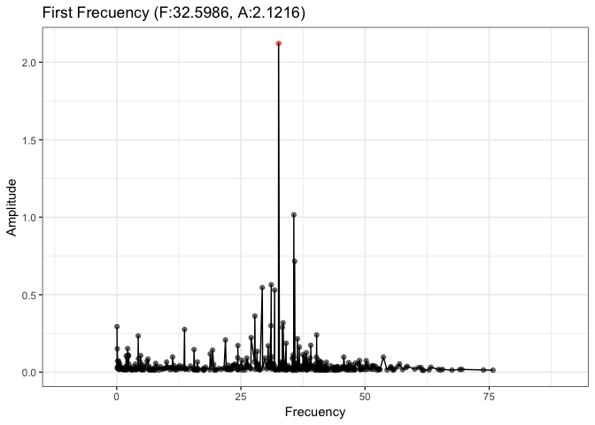
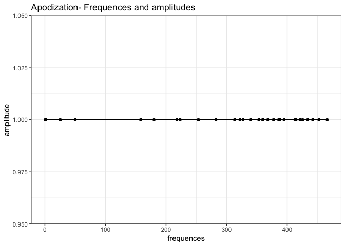
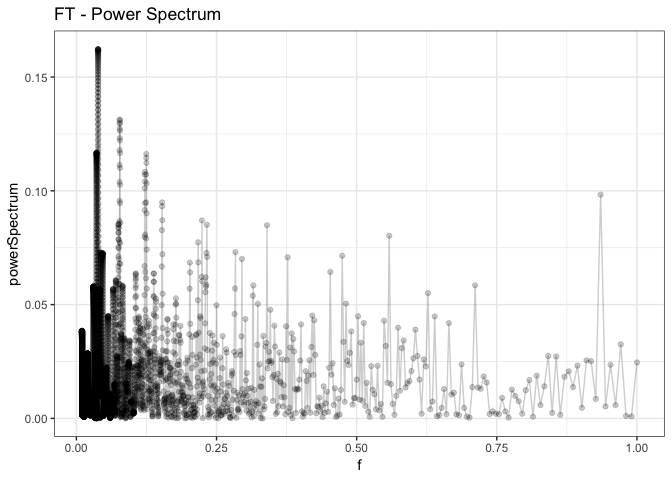
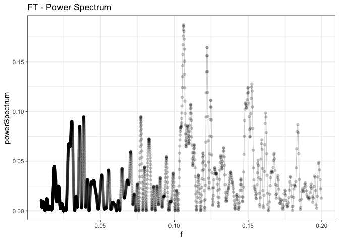
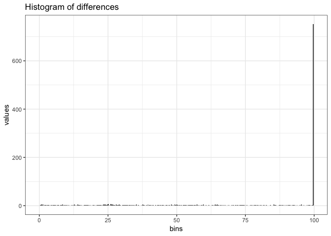
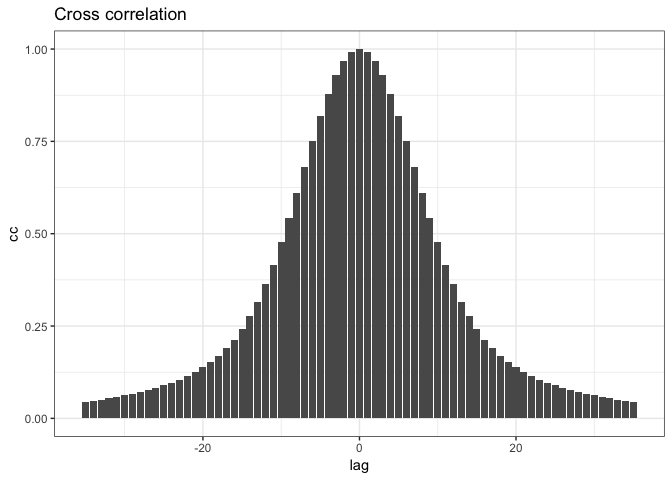

Experiment on HD174936 and HD 174966
================
Roberto Maestre
10/24/2018

Experiment configuration
------------------------

#### Data source

Data gathering from the Antonio's PhD thesis.

-   HD174936: table1.dat, <ftp://cdsarc.u-strasbg.fr/pub/cats/J/A+A/506/79/ReadMe>
-   HD174966: freqs.dat, <ftp://cdsarc.u-strasbg.fr/pub/cats/J/A+A/559/A63/ReadMe>

``` r
if (T) {
  dt <- data.frame(read.table("../data/table1.dat", sep = "\t"))
  colnames(dt) <- c("Seq","frequency","amplitude","Phase","Sig","S/N","rms","e_Freq","e_Amp","e_Phase")
} else {
  dt <- data.frame(read.table("../data/freqs.dat", sep = " "))
  colnames(dt) <- c("Id","frequency","Freq2","amplitude","Phase","Sig", "S/N","rms", "e_Freq1","e_Amp","e_Phase")
}
head(dt)
```

    ##   Seq frequency amplitude     Phase      Sig     S/N   rms    e_Freq
    ## 1   1  32.59857    2.1216  2.395288 7225.844 659.008 2.122 1.724e-05
    ## 2   2  35.65822    1.0158  2.486353 3624.781 336.581 1.495 3.601e-05
    ## 3   3  35.82316    0.7157 -0.411712 2155.327 236.220 1.292 5.112e-05
    ## 4   4  31.11058    0.5646  2.665134 1784.588 174.791 1.191 6.480e-05
    ## 5   5  29.30857    0.5463  1.184620 1714.847 169.363 1.114 6.697e-05
    ## 6   6  31.79202    0.5303 -0.817776 1862.847 164.484 1.046 6.898e-05
    ##    e_Amp  e_Phase
    ## 1 0.0018 0.000851
    ## 2 0.0018 0.001777
    ## 3 0.0018 0.002522
    ## 4 0.0018 0.003197
    ## 5 0.0018 0.003304
    ## 6 0.0018 0.003403

``` r
# Save Data to disk (to be replicated)
write.table(
  dt[c("frequency", "amplitude")],
  file = "/tmp/data.csv",
  sep = "\t",
  quote = F,
  row.names = F,
  col.names = F
)
```

#### Frequences and Amplitudes

``` r
plot_spectrum(-10, 90, dt)
```



Experiment execution
--------------------

process is the main method on the variableStars package to compute and estimate all parameters

``` r
result <- process(
  dt$frequency,
  dt$amplitude,
  filter = "uniform",
  gRegimen = 0,
  minDnu = 15,
  maxDnu = 95,
  dnuValue = -1,
  dnuGuessError = 10,
  dnuEstimation = TRUE,
  numFrequencies = 30,
  debug = TRUE
)
```

    ## ::: Debug information :::
    ## 
    ## Number of frequences to be processed: 422
    ## Number of frequences after drop the g regimen: 422
    ## Frequencies: 377.298, 412.711, 414.62, 360.076, 339.22, 367.963, 321.916, 387.625, 359.466, 0.660089, 385.889, 158.011, 465.895, 50.0353, 313.119, 421.049, 253.375, 394.708, 452.201, 282.342, 
    ## Range: 30, 60, 90, 
    ##  Iteration over range: 30
    ##    Frequencies selected: 377.298, 412.711, 414.62, 360.076, 339.22, 367.963, 321.916, 387.625, 359.466, 0.660089, 385.889, 158.011, 465.895, 50.0353, 313.119, 421.049, 253.375, 394.708, 452.201, 282.342, 
    ##    Amplitudes selected: 2.1216, 1.0158, 0.7157, 0.5646, 0.5463, 0.5303, 0.3623, 0.3193, 0.2997, 0.2947, 0.2906, 0.2759, 0.2407, 0.2343, 0.2232, 0.2162, 0.2081, 0.1873, 0.174, 0.1722, 
    ##     Dnu: 9.4051
    ##     Dnu Peak: 9.4051
    ##     Dnu Guess: 0.22003
    ## frequences   3.7730e+02
    ##    4.1271e+02
    ##    4.1462e+02
    ##    3.6008e+02
    ##    3.3922e+02
    ##    3.6796e+02
    ##    3.2192e+02
    ##    3.8763e+02
    ##    3.5947e+02
    ##    6.6009e-01
    ##    3.8589e+02
    ##    1.5801e+02
    ##    4.6590e+02
    ##    5.0035e+01
    ##    3.1312e+02
    ##    4.2105e+02
    ##    2.5337e+02
    ##    3.9471e+02
    ##    4.5220e+02
    ##    2.8234e+02
    ##    3.5305e+02
    ##    4.2539e+02
    ##    2.5350e+01
    ##    1.2618e+00
    ##    1.8014e+02
    ##    2.2328e+02
    ##    3.2706e+02
    ##    4.4197e+02
    ##    2.1790e+02
    ##    4.3388e+02
    ## 
    ## dnu9.4051
    ## diffs   3.5413e+01
    ##    3.7322e+01
    ##    1.7222e+01
    ##    3.8079e+01
    ##    9.3351e+00
    ##    5.5382e+01
    ##    1.0327e+01
    ##    1.7832e+01
    ##    3.7664e+02
    ##    8.5907e+00
    ##    2.1929e+02
    ##    8.8597e+01
    ##    3.2726e+02
    ##    6.4179e+01
    ##    4.3750e+01
    ##    1.2392e+02
    ##    1.7409e+01
    ##    7.4903e+01
    ##    9.4956e+01
    ##    2.4244e+01
    ##    4.8096e+01
    ##    3.5195e+02
    ##    3.7604e+02
    ##    1.9716e+02
    ##    1.5402e+02
    ##    5.0235e+01
    ##    6.4673e+01
    ##    1.5940e+02
    ##    5.6583e+01
    ##    1.9090e+00
    ##    5.2635e+01
    ##    7.3491e+01
    ##    4.4748e+01
    ##    9.0795e+01
    ##    2.5086e+01
    ##    5.3245e+01
    ##    4.1205e+02
    ##    2.6822e+01
    ##    2.5470e+02
    ##    5.3184e+01
    ##    3.6268e+02
    ##    9.9591e+01
    ##    8.3378e+00
    ##    1.5934e+02
    ##    1.8003e+01
    ##    3.9490e+01
    ##    1.3037e+02
    ##    5.9657e+01
    ##    1.2684e+01
    ##    3.8736e+02
    ##    4.1145e+02
    ##    2.3257e+02
    ##    1.8943e+02
    ##    8.5647e+01
    ##    2.9260e+01
    ##    1.9481e+02
    ##    2.1170e+01
    ##    5.4544e+01
    ##    7.5400e+01
    ##    4.6657e+01
    ##    9.2704e+01
    ##    2.6995e+01
    ##    5.5154e+01
    ##    4.1396e+02
    ##    2.8731e+01
    ##    2.5661e+02
    ##    5.1275e+01
    ##    3.6458e+02
    ##    1.0150e+02
    ##    6.4288e+00
    ##    1.6125e+02
    ##    1.9912e+01
    ##    3.7581e+01
    ##    1.3228e+02
    ##    6.1566e+01
    ##    1.0775e+01
    ##    3.8927e+02
    ##    4.1336e+02
    ##    2.3448e+02
    ##    1.9134e+02
    ##    8.7556e+01
    ##    2.7351e+01
    ##    1.9672e+02
    ##    1.9261e+01
    ##    2.0857e+01
    ##    7.8869e+00
    ##    3.8160e+01
    ##    2.7549e+01
    ##    6.0985e-01
    ##    3.5942e+02
    ##    2.5813e+01
    ##    2.0206e+02
    ##    1.0582e+02
    ##    3.1004e+02
    ##    4.6957e+01
    ##    6.0972e+01
    ##    1.0670e+02
    ##    3.4631e+01
    ##    9.2125e+01
    ##    7.7734e+01
    ##    7.0222e+00
    ##    6.5318e+01
    ##    3.3473e+02
    ##    3.5881e+02
    ##    1.7993e+02
    ##    1.3680e+02
    ##    3.3013e+01
    ##    8.1895e+01
    ##    1.4218e+02
    ##    7.3805e+01
    ##    2.8744e+01
    ##    1.7303e+01
    ##    4.8405e+01
    ##    2.0247e+01
    ##    3.3856e+02
    ##    4.6669e+01
    ##    1.8121e+02
    ##    1.2668e+02
    ##    2.8918e+02
    ##    2.6100e+01
    ##    8.1829e+01
    ##    8.5845e+01
    ##    5.5488e+01
    ##    1.1298e+02
    ##    5.6877e+01
    ##    1.3834e+01
    ##    8.6175e+01
    ##    3.1387e+02
    ##    3.3796e+02
    ##    1.5908e+02
    ##    1.1594e+02
    ##    1.2156e+01
    ##    1.0275e+02
    ##    1.2132e+02
    ##    9.4662e+01
    ##    4.6047e+01
    ##    1.9662e+01
    ##    8.4968e+00
    ##    3.6730e+02
    ##    1.7926e+01
    ##    2.0995e+02
    ##    9.7932e+01
    ##    3.1793e+02
    ##    5.4844e+01
    ##    5.3086e+01
    ##    1.1459e+02
    ##    2.6744e+01
    ##    8.4238e+01
    ##    8.5621e+01
    ##    1.4909e+01
    ##    5.7431e+01
    ##    3.4261e+02
    ##    3.6670e+02
    ##    1.8782e+02
    ##    1.4469e+02
    ##    4.0900e+01
    ##    7.4008e+01
    ##    1.5007e+02
    ##    6.5918e+01
    ##    6.5709e+01
    ##    3.7550e+01
    ##    3.2126e+02
    ##    6.3973e+01
    ##    1.6390e+02
    ##    1.4398e+02
    ##    2.7188e+02
    ##    8.7968e+00
    ##    9.9132e+01
    ##    6.8541e+01
    ##    7.2791e+01
    ##    1.3028e+02
    ##    3.9574e+01
    ##    3.1138e+01
    ##    1.0348e+02
    ##    2.9657e+02
    ##    3.2065e+02
    ##    1.4177e+02
    ##    9.8640e+01
    ##    5.1473e+00
    ##    1.2005e+02
    ##    1.0402e+02
    ##    1.1197e+02
    ##    2.8159e+01
    ##    3.8696e+02
    ##    1.7361e+00
    ##    2.2961e+02
    ##    7.8270e+01
    ##    3.3759e+02
    ##    7.4506e+01
    ##    3.3424e+01
    ##    1.3425e+02
    ##    7.0826e+00
    ##    6.4576e+01
    ##    1.0528e+02
    ##    3.4571e+01
    ##    3.7770e+01
    ##    3.6227e+02
    ##    3.8636e+02
    ##    2.0748e+02
    ##    1.6435e+02
    ##    6.0561e+01
    ##    5.4346e+01
    ##    1.6973e+02
    ##    4.6256e+01
    ##    3.5881e+02
    ##    2.6423e+01
    ##    2.0146e+02
    ##    1.0643e+02
    ##    3.0943e+02
    ##    4.6347e+01
    ##    6.1582e+01
    ##    1.0609e+02
    ##    3.5241e+01
    ##    9.2734e+01
    ##    7.7124e+01
    ##    6.4123e+00
    ##    6.5928e+01
    ##    3.3412e+02
    ##    3.5820e+02
    ##    1.7932e+02
    ##    1.3619e+02
    ##    3.2403e+01
    ##    8.2505e+01
    ##    1.4157e+02
    ##    7.4415e+01
    ##    3.8523e+02
    ##    1.5735e+02
    ##    4.6524e+02
    ##    4.9375e+01
    ##    3.1246e+02
    ##    4.2039e+02
    ##    2.5271e+02
    ##    3.9405e+02
    ##    4.5154e+02
    ##    2.8168e+02
    ##    3.5239e+02
    ##    4.2473e+02
    ##    2.4690e+01
    ##    6.0175e-01
    ##    1.7948e+02
    ##    2.2262e+02
    ##    3.2640e+02
    ##    4.4131e+02
    ##    2.1724e+02
    ##    4.3322e+02
    ##    2.2788e+02
    ##    8.0006e+01
    ##    3.3585e+02
    ##    7.2770e+01
    ##    3.5160e+01
    ##    1.3251e+02
    ##    8.8187e+00
    ##    6.6312e+01
    ##    1.0355e+02
    ##    3.2835e+01
    ##    3.9506e+01
    ##    3.6054e+02
    ##    3.8463e+02
    ##    2.0575e+02
    ##    1.6261e+02
    ##    5.8825e+01
    ##    5.6082e+01
    ##    1.6799e+02
    ##    4.7992e+01
    ##    3.0788e+02
    ##    1.0798e+02
    ##    1.5511e+02
    ##    2.6304e+02
    ##    9.5364e+01
    ##    2.3670e+02
    ##    2.9419e+02
    ##    1.2433e+02
    ##    1.9504e+02
    ##    2.6738e+02
    ##    1.3266e+02
    ##    1.5675e+02
    ##    2.2131e+01
    ##    6.5265e+01
    ##    1.6905e+02
    ##    2.8396e+02
    ##    5.9886e+01
    ##    2.7587e+02
    ##    4.1586e+02
    ##    1.5278e+02
    ##    4.4847e+01
    ##    2.1252e+02
    ##    7.1188e+01
    ##    1.3694e+01
    ##    1.8355e+02
    ##    1.1284e+02
    ##    4.0501e+01
    ##    4.4054e+02
    ##    4.6463e+02
    ##    2.8575e+02
    ##    2.4262e+02
    ##    1.3883e+02
    ##    2.3924e+01
    ##    2.4800e+02
    ##    3.2014e+01
    ##    2.6308e+02
    ##    3.7101e+02
    ##    2.0334e+02
    ##    3.4467e+02
    ##    4.0217e+02
    ##    2.3231e+02
    ##    3.0302e+02
    ##    3.7536e+02
    ##    2.4685e+01
    ##    4.8773e+01
    ##    1.3011e+02
    ##    1.7324e+02
    ##    2.7703e+02
    ##    3.9194e+02
    ##    1.6786e+02
    ##    3.8385e+02
    ##    1.0793e+02
    ##    5.9745e+01
    ##    8.1588e+01
    ##    1.3908e+02
    ##    3.0777e+01
    ##    3.9935e+01
    ##    1.1228e+02
    ##    2.8777e+02
    ##    3.1186e+02
    ##    1.3298e+02
    ##    8.9843e+01
    ##    1.3944e+01
    ##    1.2885e+02
    ##    9.5222e+01
    ##    1.2076e+02
    ##    1.6767e+02
    ##    2.6341e+01
    ##    3.1152e+01
    ##    1.3871e+02
    ##    6.7995e+01
    ##    4.3460e+00
    ##    3.9570e+02
    ##    4.1979e+02
    ##    2.4091e+02
    ##    1.9777e+02
    ##    9.3985e+01
    ##    2.0922e+01
    ##    2.0315e+02
    ##    1.2833e+01
    ##    1.4133e+02
    ##    1.9883e+02
    ##    2.8968e+01
    ##    9.9679e+01
    ##    1.7202e+02
    ##    2.2802e+02
    ##    2.5211e+02
    ##    7.3233e+01
    ##    3.0099e+01
    ##    7.3689e+01
    ##    1.8860e+02
    ##    3.5477e+01
    ##    1.8051e+02
    ##    5.7493e+01
    ##    1.1237e+02
    ##    4.1654e+01
    ##    3.0687e+01
    ##    3.6936e+02
    ##    3.9345e+02
    ##    2.1457e+02
    ##    1.7143e+02
    ##    6.7644e+01
    ##    4.7263e+01
    ##    1.7681e+02
    ##    3.9174e+01
    ##    1.6986e+02
    ##    9.9147e+01
    ##    2.6806e+01
    ##    4.2685e+02
    ##    4.5094e+02
    ##    2.7206e+02
    ##    2.2892e+02
    ##    1.2514e+02
    ##    1.0230e+01
    ##    2.3430e+02
    ##    1.8319e+01
    ##    7.0712e+01
    ##    1.4305e+02
    ##    2.5699e+02
    ##    2.8108e+02
    ##    1.0220e+02
    ##    5.9067e+01
    ##    4.4721e+01
    ##    1.5963e+02
    ##    6.4445e+01
    ##    1.5154e+02
    ##    7.2341e+01
    ##    3.2770e+02
    ##    3.5179e+02
    ##    1.7291e+02
    ##    1.2978e+02
    ##    2.5990e+01
    ##    8.8917e+01
    ##    1.3516e+02
    ##    8.0827e+01
    ##    4.0004e+02
    ##    4.2413e+02
    ##    2.4525e+02
    ##    2.0212e+02
    ##    9.8331e+01
    ##    1.6576e+01
    ##    2.0750e+02
    ##    8.4867e+00
    ##    2.4089e+01
    ##    1.5479e+02
    ##    1.9793e+02
    ##    3.0171e+02
    ##    4.1662e+02
    ##    1.9255e+02
    ##    4.0853e+02
    ##    1.7888e+02
    ##    2.2201e+02
    ##    3.2580e+02
    ##    4.4071e+02
    ##    2.1664e+02
    ##    4.3262e+02
    ##    4.3134e+01
    ##    1.4692e+02
    ##    2.6183e+02
    ##    3.7755e+01
    ##    2.5374e+02
    ##    1.0379e+02
    ##    2.1869e+02
    ##    5.3783e+00
    ##    2.1061e+02
    ##    1.1491e+02
    ##    1.0917e+02
    ##    1.0682e+02
    ##    2.2407e+02
    ##    8.0895e+00
    ##    2.1598e+02
    ## 
    ## bins         0
    ##     0.1411
    ##     0.2822
    ##     0.4232
    ##     0.5643
    ##     0.7054
    ##     0.8465
    ##     0.9875
    ##     1.1286
    ##     1.2697
    ##     1.4108
    ##     1.5518
    ##     1.6929
    ##     1.8340
    ##     1.9751
    ##     2.1161
    ##     2.2572
    ##     2.3983
    ##     2.5394
    ##     2.6805
    ##     2.8215
    ##     2.9626
    ##     3.1037
    ##     3.2448
    ##     3.3858
    ##     3.5269
    ##     3.6680
    ##     3.8091
    ##     3.9501
    ##     4.0912
    ##     4.2323
    ##     4.3734
    ##     4.5144
    ##     4.6555
    ##     4.7966
    ##     4.9377
    ##     5.0788
    ##     5.2198
    ##     5.3609
    ##     5.5020
    ##     5.6431
    ##     5.7841
    ##     5.9252
    ##     6.0663
    ##     6.2074
    ##     6.3484
    ##     6.4895
    ##     6.6306
    ##     6.7717
    ##     6.9127
    ##     7.0538
    ##     7.1949
    ##     7.3360
    ##     7.4771
    ##     7.6181
    ##     7.7592
    ##     7.9003
    ##     8.0414
    ##     8.1824
    ##     8.3235
    ##     8.4646
    ##     8.6057
    ##     8.7467
    ##     8.8878
    ##     9.0289
    ##     9.1700
    ##     9.3110
    ##     9.4521
    ##     9.5932
    ##     9.7343
    ##     9.8754
    ##    10.0164
    ##    10.1575
    ##    10.2986
    ##    10.4397
    ##    10.5807
    ##    10.7218
    ##    10.8629
    ##    11.0040
    ##    11.1450
    ##    11.2861
    ##    11.4272
    ##    11.5683
    ##    11.7093
    ##    11.8504
    ##    11.9915
    ##    12.1326
    ##    12.2737
    ##    12.4147
    ##    12.5558
    ##    12.6969
    ##    12.8380
    ##    12.9790
    ##    13.1201
    ##    13.2612
    ##    13.4023
    ##    13.5433
    ##    13.6844
    ##    13.8255
    ##    13.9666
    ##    14.1077
    ##    14.2487
    ##    14.3898
    ##    14.5309
    ##    14.6720
    ##    14.8130
    ##    14.9541
    ##    15.0952
    ##    15.2363
    ##    15.3773
    ##    15.5184
    ##    15.6595
    ##    15.8006
    ##    15.9416
    ##    16.0827
    ##    16.2238
    ##    16.3649
    ##    16.5060
    ##    16.6470
    ##    16.7881
    ##    16.9292
    ##    17.0703
    ##    17.2113
    ##    17.3524
    ##    17.4935
    ##    17.6346
    ##    17.7756
    ##    17.9167
    ##    18.0578
    ##    18.1989
    ##    18.3399
    ##    18.4810
    ##    18.6221
    ##    18.7632
    ##    18.9043
    ##    19.0453
    ##    19.1864
    ##    19.3275
    ##    19.4686
    ##    19.6096
    ##    19.7507
    ##    19.8918
    ##    20.0329
    ##    20.1739
    ##    20.3150
    ##    20.4561
    ##    20.5972
    ##    20.7382
    ##    20.8793
    ##    21.0204
    ##    21.1615
    ##    21.3026
    ##    21.4436
    ##    21.5847
    ##    21.7258
    ##    21.8669
    ##    22.0079
    ##    22.1490
    ##    22.2901
    ##    22.4312
    ##    22.5722
    ##    22.7133
    ##    22.8544
    ##    22.9955
    ##    23.1365
    ##    23.2776
    ##    23.4187
    ##    23.5598
    ##    23.7009
    ##    23.8419
    ##    23.9830
    ##    24.1241
    ##    24.2652
    ##    24.4062
    ##    24.5473
    ##    24.6884
    ##    24.8295
    ##    24.9705
    ##    25.1116
    ##    25.2527
    ##    25.3938
    ##    25.5348
    ##    25.6759
    ##    25.8170
    ##    25.9581
    ##    26.0992
    ##    26.2402
    ##    26.3813
    ##    26.5224
    ##    26.6635
    ##    26.8045
    ##    26.9456
    ##    27.0867
    ##    27.2278
    ##    27.3688
    ##    27.5099
    ##    27.6510
    ##    27.7921
    ##    27.9331
    ##    28.0742
    ##    28.2153
    ##    28.3564
    ##    28.4975
    ##    28.6385
    ##    28.7796
    ##    28.9207
    ##    29.0618
    ##    29.2028
    ##    29.3439
    ##    29.4850
    ##    29.6261
    ##    29.7671
    ##    29.9082
    ##    30.0493
    ##    30.1904
    ##    30.3314
    ##    30.4725
    ##    30.6136
    ##    30.7547
    ##    30.8958
    ##    31.0368
    ##    31.1779
    ##    31.3190
    ##    31.4601
    ##    31.6011
    ##    31.7422
    ##    31.8833
    ##    32.0244
    ##    32.1654
    ##    32.3065
    ##    32.4476
    ##    32.5887
    ##    32.7297
    ##    32.8708
    ##    33.0119
    ##    33.1530
    ##    33.2941
    ##    33.4351
    ##    33.5762
    ##    33.7173
    ##    33.8584
    ##    33.9994
    ##    34.1405
    ##    34.2816
    ##    34.4227
    ##    34.5637
    ##    34.7048
    ##    34.8459
    ##    34.9870
    ##    35.1280
    ##    35.2691
    ##    35.4102
    ##    35.5513
    ##    35.6924
    ##    35.8334
    ##    35.9745
    ##    36.1156
    ##    36.2567
    ##    36.3977
    ##    36.5388
    ##    36.6799
    ##    36.8210
    ##    36.9620
    ##    37.1031
    ##    37.2442
    ##    37.3853
    ##    37.5263
    ##    37.6674
    ##    37.8085
    ##    37.9496
    ##    38.0907
    ##    38.2317
    ##    38.3728
    ##    38.5139
    ##    38.6550
    ##    38.7960
    ##    38.9371
    ##    39.0782
    ##    39.2193
    ##    39.3603
    ##    39.5014
    ##    39.6425
    ##    39.7836
    ##    39.9246
    ##    40.0657
    ##    40.2068
    ##    40.3479
    ##    40.4890
    ##    40.6300
    ##    40.7711
    ##    40.9122
    ##    41.0533
    ##    41.1943
    ##    41.3354
    ##    41.4765
    ##    41.6176
    ##    41.7586
    ##    41.8997
    ##    42.0408
    ##    42.1819
    ##    42.3230
    ##    42.4640
    ##    42.6051
    ##    42.7462
    ##    42.8873
    ##    43.0283
    ##    43.1694
    ##    43.3105
    ##    43.4516
    ##    43.5926
    ##    43.7337
    ##    43.8748
    ##    44.0159
    ##    44.1569
    ##    44.2980
    ##    44.4391
    ##    44.5802
    ##    44.7213
    ##    44.8623
    ##    45.0034
    ##    45.1445
    ##    45.2856
    ##    45.4266
    ##    45.5677
    ##    45.7088
    ##    45.8499
    ##    45.9909
    ##    46.1320
    ##    46.2731
    ##    46.4142
    ##    46.5552
    ##    46.6963
    ##    46.8374
    ##    46.9785
    ##    47.1196
    ##    47.2606
    ##    47.4017
    ##    47.5428
    ##    47.6839
    ##    47.8249
    ##    47.9660
    ##    48.1071
    ##    48.2482
    ##    48.3892
    ##    48.5303
    ##    48.6714
    ##    48.8125
    ##    48.9535
    ##    49.0946
    ##    49.2357
    ##    49.3768
    ##    49.5179
    ##    49.6589
    ##    49.8000
    ##    49.9411
    ##    50.0822
    ##    50.2232
    ##    50.3643
    ##    50.5054
    ##    50.6465
    ##    50.7875
    ##    50.9286
    ##    51.0697
    ##    51.2108
    ##    51.3518
    ##    51.4929
    ##    51.6340
    ##    51.7751
    ##    51.9162
    ##    52.0572
    ##    52.1983
    ##    52.3394
    ##    52.4805
    ##    52.6215
    ##    52.7626
    ##    52.9037
    ##    53.0448
    ##    53.1858
    ##    53.3269
    ##    53.4680
    ##    53.6091
    ##    53.7501
    ##    53.8912
    ##    54.0323
    ##    54.1734
    ##    54.3145
    ##    54.4555
    ##    54.5966
    ##    54.7377
    ##    54.8788
    ##    55.0198
    ##    55.1609
    ##    55.3020
    ##    55.4431
    ##    55.5841
    ##    55.7252
    ##    55.8663
    ##    56.0074
    ##    56.1484
    ##    56.2895
    ##    56.4306
    ##    56.5717
    ##    56.7128
    ##    56.8538
    ##    56.9949
    ##    57.1360
    ##    57.2771
    ##    57.4181
    ##    57.5592
    ##    57.7003
    ##    57.8414
    ##    57.9824
    ##    58.1235
    ##    58.2646
    ##    58.4057
    ##    58.5467
    ##    58.6878
    ##    58.8289
    ##    58.9700
    ##    59.1111
    ##    59.2521
    ##    59.3932
    ##    59.5343
    ##    59.6754
    ##    59.8164
    ##    59.9575
    ##    60.0986
    ##    60.2397
    ##    60.3807
    ##    60.5218
    ##    60.6629
    ##    60.8040
    ##    60.9450
    ##    61.0861
    ##    61.2272
    ##    61.3683
    ##    61.5094
    ##    61.6504
    ##    61.7915
    ##    61.9326
    ##    62.0737
    ##    62.2147
    ##    62.3558
    ##    62.4969
    ##    62.6380
    ##    62.7790
    ##    62.9201
    ##    63.0612
    ##    63.2023
    ##    63.3433
    ##    63.4844
    ##    63.6255
    ##    63.7666
    ##    63.9077
    ##    64.0487
    ##    64.1898
    ##    64.3309
    ##    64.4720
    ##    64.6130
    ##    64.7541
    ##    64.8952
    ##    65.0363
    ##    65.1773
    ##    65.3184
    ##    65.4595
    ##    65.6006
    ##    65.7416
    ##    65.8827
    ##    66.0238
    ##    66.1649
    ##    66.3060
    ##    66.4470
    ##    66.5881
    ##    66.7292
    ##    66.8703
    ##    67.0113
    ##    67.1524
    ##    67.2935
    ##    67.4346
    ##    67.5756
    ##    67.7167
    ##    67.8578
    ##    67.9989
    ##    68.1399
    ##    68.2810
    ##    68.4221
    ##    68.5632
    ##    68.7043
    ##    68.8453
    ##    68.9864
    ##    69.1275
    ##    69.2686
    ##    69.4096
    ##    69.5507
    ##    69.6918
    ##    69.8329
    ##    69.9739
    ##    70.1150
    ##    70.2561
    ##    70.3972
    ##    70.5383
    ##    70.6793
    ##    70.8204
    ##    70.9615
    ##    71.1026
    ##    71.2436
    ##    71.3847
    ##    71.5258
    ##    71.6669
    ##    71.8079
    ##    71.9490
    ##    72.0901
    ##    72.2312
    ##    72.3722
    ##    72.5133
    ##    72.6544
    ##    72.7955
    ##    72.9366
    ##    73.0776
    ##    73.2187
    ##    73.3598
    ##    73.5009
    ##    73.6419
    ##    73.7830
    ##    73.9241
    ##    74.0652
    ##    74.2062
    ##    74.3473
    ##    74.4884
    ##    74.6295
    ##    74.7705
    ##    74.9116
    ##    75.0527
    ##    75.1938
    ##    75.3349
    ##    75.4759
    ##    75.6170
    ##    75.7581
    ##    75.8992
    ##    76.0402
    ##    76.1813
    ##    76.3224
    ##    76.4635
    ##    76.6045
    ##    76.7456
    ##    76.8867
    ##    77.0278
    ##    77.1688
    ##    77.3099
    ##    77.4510
    ##    77.5921
    ##    77.7332
    ##    77.8742
    ##    78.0153
    ##    78.1564
    ##    78.2975
    ##    78.4385
    ##    78.5796
    ##    78.7207
    ##    78.8618
    ##    79.0028
    ##    79.1439
    ##    79.2850
    ##    79.4261
    ##    79.5671
    ##    79.7082
    ##    79.8493
    ##    79.9904
    ##    80.1315
    ##    80.2725
    ##    80.4136
    ##    80.5547
    ##    80.6958
    ##    80.8368
    ##    80.9779
    ##    81.1190
    ##    81.2601
    ##    81.4011
    ##    81.5422
    ##    81.6833
    ##    81.8244
    ##    81.9654
    ##    82.1065
    ##    82.2476
    ##    82.3887
    ##    82.5298
    ##    82.6708
    ##    82.8119
    ##    82.9530
    ##    83.0941
    ##    83.2351
    ##    83.3762
    ##    83.5173
    ##    83.6584
    ##    83.7994
    ##    83.9405
    ##    84.0816
    ##    84.2227
    ##    84.3637
    ##    84.5048
    ##    84.6459
    ##    84.7870
    ##    84.9281
    ##    85.0691
    ##    85.2102
    ##    85.3513
    ##    85.4924
    ##    85.6334
    ##    85.7745
    ##    85.9156
    ##    86.0567
    ##    86.1977
    ##    86.3388
    ##    86.4799
    ##    86.6210
    ##    86.7620
    ##    86.9031
    ##    87.0442
    ##    87.1853
    ##    87.3264
    ##    87.4674
    ##    87.6085
    ##    87.7496
    ##    87.8907
    ##    88.0317
    ##    88.1728
    ##    88.3139
    ##    88.4550
    ##    88.5960
    ##    88.7371
    ##    88.8782
    ##    89.0193
    ##    89.1603
    ##    89.3014
    ##    89.4425
    ##    89.5836
    ##    89.7247
    ##    89.8657
    ##    90.0068
    ##    90.1479
    ##    90.2890
    ##    90.4300
    ##    90.5711
    ##    90.7122
    ##    90.8533
    ##    90.9943
    ##    91.1354
    ##    91.2765
    ##    91.4176
    ##    91.5586
    ##    91.6997
    ##    91.8408
    ##    91.9819
    ##    92.1230
    ##    92.2640
    ##    92.4051
    ##    92.5462
    ##    92.6873
    ##    92.8283
    ##    92.9694
    ##    93.1105
    ##    93.2516
    ##    93.3926
    ##    93.5337
    ##    93.6748
    ##    93.8159
    ##    93.9569
    ##    94.0980
    ##    94.2391
    ##    94.3802
    ##    94.5213
    ##    94.6623
    ##    94.8034
    ##    94.9445
    ##    95.0856
    ##    95.2266
    ##    95.3677
    ##    95.5088
    ##    95.6499
    ##    95.7909
    ##    95.9320
    ##    96.0731
    ##    96.2142
    ##    96.3552
    ##    96.4963
    ##    96.6374
    ##    96.7785
    ##    96.9196
    ##    97.0606
    ##    97.2017
    ##    97.3428
    ##    97.4839
    ##    97.6249
    ##    97.7660
    ##    97.9071
    ##    98.0482
    ##    98.1892
    ##    98.3303
    ##    98.4714
    ##    98.6125
    ##    98.7536
    ##    98.8946
    ##    99.0357
    ##    99.1768
    ##    99.3179
    ##    99.4589
    ##    99.6000
    ##    99.7411
    ##    99.8822
    ## 
    ##     Cross correlation calculated:-0.0663463, -0.0674715, -0.0676236, -0.0667651, -0.0648855, -0.0620033, -0.0581655, -0.0534425, -0.0479188, -0.0416764, 
    ##  Iteration over range: 60
    ##     Nothing to do
    ##  Iteration over range: 90
    ##     Nothing to do

#### Apodization

``` r
# Plot frecuency and amplitude
ggplot(
  aes(x = frequences, y = amplitude),
  data = data.frame(
    "frequences" = result$ft$frequences,
    "amplitude" = result$ft$amp
  )
) +
  geom_point() +
  geom_line() +
  ggtitle("Apodization- Frequences and amplitudes") +
  theme_bw()
```



#### FT - Power Spectrum

``` r
# Plot frecuency and amplitude
dt <-
  data.frame("f" = result$ft$f,
             "powerSpectrum" = result$ft$powerSpectrum)
ggplot(aes(x = f, y = powerSpectrum), data = dt) +
  geom_point(alpha=0.2) +
  geom_line(alpha=0.2) +
  ggtitle("FT - Power Spectrum") +
  theme_bw()
```



Plot selected spectrum

``` r
# Plot frecuency and amplitude
dt <-
  data.frame("f" = result$ft$f,
             "powerSpectrum" = result$ft$powerSpectrum)
ggplot(aes(x = f, y = powerSpectrum), data = dt[dt$f<0.2,]) +
  geom_point(alpha=0.2) +
  geom_line(alpha=0.2) +
  ggtitle("FT - Power Spectrum") +
  theme_bw()
```



#### Histogram fo differences.

We show the complete histogram

``` r
dt <- data.frame(result$diffHistogram$histogram)
ggplot(aes(x = bins, y = values), data = dt) +
  geom_bar(stat = "identity") +
  ggtitle("Histogram of differences") +
  theme_bw()
```



#### Cross correlation

Simple cross correlation

``` r
cc <- result$crossCorrelation
dt <- data.frame("lag" = seq(round(-1*(length(cc)-1)/2), round((length(cc)-1)/2)), 
                 "cc"=cc)
ggplot(aes(x = lag, y = cc), data = dt) +
  geom_bar(stat = "identity") +
  ggtitle("Cross correlation") +
  theme_bw()
```


