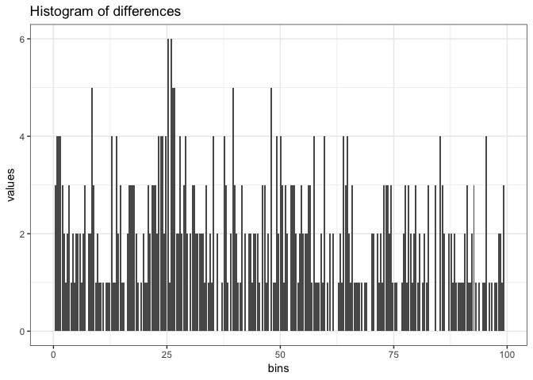

Experiment on HD174936 and HD 174966
================
Roberto Maestre
10/24/2018

Experiment configuration
------------------------

#### Data source

Data gathering from the Antonio's PhD thesis.

-   HD174936: table1.dat, <ftp://cdsarc.u-strasbg.fr/pub/cats/J/A+A/506/79/ReadMe>
-   HD174966: freqs.dat, <ftp://cdsarc.u-strasbg.fr/pub/cats/J/A+A/559/A63/ReadMe>

``` r
if (T) {
  dt <- data.frame(read.table("../data/table1.dat", sep = "\t"))
  colnames(dt) <- c("Seq","frequency","amplitude","Phase","Sig","S/N","rms","e_Freq","e_Amp","e_Phase")
} else {
  dt <- data.frame(read.table("../data/freqs.dat", sep = " "))
  colnames(dt) <- c("Id","frequency","Freq2","amplitude","Phase","Sig", "S/N","rms", "e_Freq1","e_Amp","e_Phase")
}
head(dt)
```

    ##   Seq frequency amplitude     Phase      Sig     S/N   rms    e_Freq
    ## 1   1  32.59857    2.1216  2.395288 7225.844 659.008 2.122 1.724e-05
    ## 2   2  35.65822    1.0158  2.486353 3624.781 336.581 1.495 3.601e-05
    ## 3   3  35.82316    0.7157 -0.411712 2155.327 236.220 1.292 5.112e-05
    ## 4   4  31.11058    0.5646  2.665134 1784.588 174.791 1.191 6.480e-05
    ## 5   5  29.30857    0.5463  1.184620 1714.847 169.363 1.114 6.697e-05
    ## 6   6  31.79202    0.5303 -0.817776 1862.847 164.484 1.046 6.898e-05
    ##    e_Amp  e_Phase
    ## 1 0.0018 0.000851
    ## 2 0.0018 0.001777
    ## 3 0.0018 0.002522
    ## 4 0.0018 0.003197
    ## 5 0.0018 0.003304
    ## 6 0.0018 0.003403

#### Frequences and Amplitudes

``` r
plot_spectrum(-10, 90, dt)
```


Experiment execution
--------------------

process is the main method on the variableStars package to compute and estimate all parameters

``` r
result <- process(
  dt$frequency,
  dt$amplitude,
  filter = "uniform",
  gRegimen = 0,
  minDnu = 15,
  maxDnu = 95,
  dnuValue = -1,
  dnuGuessError = 10,
  dnuEstimation = TRUE,
  numFrequencies = 50,
  debug = TRUE
)
```

    ## ::: Debug information :::
    ## 
    ## Number of frequences to be processed: 422
    ## Number of frequences after drop the g regimen: 422
    ## Frequencies: 377.298, 412.711, 414.62, 360.076, 339.22, 367.963, 321.916, 387.625, 359.466, 0.660089, 385.889, 158.011, 465.895, 50.0353, 313.119, 421.049, 253.375, 394.708, 452.201, 282.342, 
    ## Range: 50, 100, 1266, 
    ##  Iteration over range: 50
    ##    Frequencies selected: 377.298, 412.711, 414.62, 360.076, 339.22, 367.963, 321.916, 387.625, 359.466, 0.660089, 385.889, 158.011, 465.895, 50.0353, 313.119, 421.049, 253.375, 394.708, 452.201, 282.342, 
    ##    Amplitudes selected: 2.1216, 1.0158, 0.7157, 0.5646, 0.5463, 0.5303, 0.3623, 0.3193, 0.2997, 0.2947, 0.2906, 0.2759, 0.2407, 0.2343, 0.2232, 0.2162, 0.2081, 0.1873, 0.174, 0.1722, 
    ##     Dnu: 25.849
    ##     Dnu Peak: 25.849
    ##     Dnu Guess: 0.22003
    ##     Cross correlation calculated:0.0440371, 0.0474561, 0.050956, 0.0545475, 0.0582785, 0.0622278, 0.0664969, 0.0711986, 0.0764467, 0.082349, 
    ##  Iteration over range: 100
    ##     Nothing to do
    ##  Iteration over range: 1266
    ##     Nothing to do

#### Apodization

``` r
# Plot frecuency and amplitude
ggplot(
  aes(x = frequences, y = amplitude),
  data = data.frame(
    "frequences" = result$ft$frequences,
    "amplitude" = result$ft$amp
  )
) +
  geom_point() +
  geom_line() +
  ggtitle("Apodization- Frequences and amplitudes") +
  theme_bw()
```


#### FT - Power Spectrum

``` r
# Plot frecuency and amplitude
dt <-
  data.frame("f" = result$ft$f,
             "powerSpectrum" = result$ft$powerSpectrum)
ggplot(aes(x = f, y = powerSpectrum), data = dt) +
  geom_point(alpha=0.2) +
  geom_line(alpha=0.2) +
  ggtitle("FT - Power Spectrum") +
  theme_bw()
```


Plot selected spectrum

``` r
# Plot frecuency and amplitude
dt <-
  data.frame("f" = result$ft$f,
             "powerSpectrum" = result$ft$powerSpectrum)
ggplot(aes(x = f, y = powerSpectrum), data = dt[dt$f<0.2,]) +
  geom_point(alpha=0.2) +
  geom_line(alpha=0.2) +
  ggtitle("FT - Power Spectrum") +
  theme_bw()
```


#### Histogram fo differences.

We show the complete histogram

``` r
dt <- data.frame(result$diffHistogram$histogram)
ggplot(aes(x = bins, y = values), data = dt) +
  geom_bar(stat = "identity") +
  ggtitle("Histogram of differences") +
  theme_bw()
```


We only show bins with &lt; 100 values

``` r
dt <- data.frame(result$diffHistogram$histogram)
ggplot(aes(x = bins, y = values), data = dt[dt$values < 100,]) +
  geom_bar(stat = "identity") +
  ggtitle("Histogram of differences") +
  theme_bw()
```



#### Cross correlation

Simple cross correlation

``` r
cc <- result$crossCorrelation
dt <- data.frame("lag" = seq(round(-1*(length(cc)-1)/2), round((length(cc)-1)/2)), 
                 "cc"=cc)
ggplot(aes(x = lag, y = cc), data = dt) +
  geom_bar(stat = "identity") +
  ggtitle("Cross correlation") +
  theme_bw()
```


