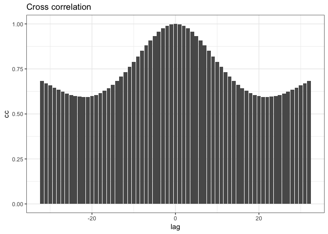

Experiments
================
Roberto Maestre
10/24/2018

Experiment configuration
------------------------

#### Parameters for execution

``` r
paramters = list(
  "filter" = "gaussian",
  "gRegimen" = 0,
  "minDnu" = 15,
  "maxDnu" = 95,
  "dnuValue" = -1,
  "dnuGuessError" = 10,
  "dnuEstimation" = TRUE,
  "numFrequencies" = 30,
  "debug" = TRUE)
```

#### Data source

Choose:

-   dataFlag = T, to use synthetic data generated or,

-   dataFlag = F, to use a real pulsar photometry

``` r
dataFlag = F
```

Data generation
---------------

``` r
# Generate synthetic data or read pulsar data
if (dataFlag) {
  x <- sin(seq(from = 0,
               to = 100,
               by = 1))
  dt <-
    data.frame("time" = seq(from = 1, to = length(x)), "mmag" = x)
} else {
  # Read pulsar data
  dt <- data.table(read.csv("../data/pulsar.tsv", sep = "\t"))
}

# Sampling for large file
dt.plot <- dt
if(dim(dt)[1]>1000) {
  dt.plot <- dt[sample(nrow(dt), 1000),]
}
# Plot photometry
ggplot(aes(time, mmag), data = dt.plot) +
    geom_point() +
    geom_line() +
    theme_bw()
```


``` r
rm(dt.plot) # Drop memory
```

#### Frequences and Amplitudes on photometry data

``` r
# Calculate amplitudes and frequences
dt.spectrum <- data.frame(calculateSpectrum(dt$time, dt$mmag))
# Get max amplitude
maxAmplitude <- dt.spectrum[which.max(dt.spectrum$amplitude), ]
# Plot amplitudes
plot_spectrum(maxAmplitude$frequency - 1.5,
              maxAmplitude$frequency + 1.5,
              dt.spectrum)
```


``` r
# Save Data to disk (to be replicated)
write.table(
  dt.spectrum[c("frequency", "amplitude")],
  file = "/tmp/data.csv",
  sep = "\t",
  quote = F,
  row.names = F,
  col.names = F
)
```

Experiment execution
--------------------

process is the main method on the variableStars package to compute and estimate all parameters

``` r
result <- process(
  dt.spectrum$frequency,
  dt.spectrum$amplitude,
  filter = paramters$filter,
  gRegimen = paramters$gRegimen,
  minDnu = paramters$minDnu,
  maxDnu = paramters$maxDnu,
  dnuValue = paramters$dnuValue,
  dnuGuessError = paramters$dnuGuessError,
  dnuEstimation = paramters$dnuEstimation,
  numFrequencies = paramters$numFrequencies,
  debug = paramters$debug
)
```

    ## ::: Debug information :::
    ## 
    ## Number of frequences to be processed: 43372
    ## Number of frequences after drop the g regimen: 21686
    ## Frequencies: 264.505, 264.113, 260.586, 264.897, 263.721, 265.288, 268.423, 263.329, 256.668, 251.965, 265.68, 252.749, 268.815, 261.762, 262.154, 268.031, 269.207, 271.95, 272.342, 261.37, Range: 30, 60, 65058,  Iteration over range: 30
    ##    Frequencies selected: 264.505, 264.113, 260.586, 264.897, 263.721, 265.288, 268.423, 263.329, 256.668, 251.965, 265.68, 252.749, 268.815, 261.762, 262.154, 268.031, 269.207, 271.95, 272.342, 261.37, 
    ##    Amplitudes selected: 2.18044, 0.514798, 0.512875, 0.489923, 0.370046, 0.343731, 0.263693, 0.263439, 0.251894, 0.221904, 0.221506, 0.184744, 0.164693, 0.159859, 0.128805, 0.128227, 0.123996, 0.112269, 0.112108, 0.111359, 
    ##     Dnu: 1.0198
    ##     Dnu Peak: 3.9304
    ##     Dnu Guess: 82.9435
    ##     Cross correlation calculated:0.682078, 0.670522, 0.658349, 0.646074, 0.634194, 0.623175, 0.613438, 0.605355, 0.599246, 0.595376, 
    ##  Iteration over range: 60
    ##     Nothing to do
    ##  Iteration over range: 65058
    ##     Nothing to do

#### Main results

-   **Dnu** (`result$dnu`) = 1.0198.
-   **DnuGuess** `(result$dnuGuess`) = 82.9434636.
-   **DnuPeak** (`result$dnuPeak`) = 3.9304.
-   **Frequency** (`result$photometry$frequency`) = 264.5047462, 264.1128873, 260.5861574, 264.8966051, 263.7210285, 265.288464, 268.4233351, 263.3291696, 256.6675686, 251.965262, 265.6803229, 252.7489797, 268.8151939, 261.761734, 262.1535929, 268.0314762, 269.2070528, 271.950065, 272.3419239, 261.3698752, 272.7337828, 275.8686538, 248.8303909, 279.7872427, 266.8558995...
-   **Amplitude** (`result$photometry$amplitude`) = 2.1804436, 0.5147979, 0.5128749, 0.4899226, 0.370046, 0.3437311, 0.2636926, 0.2634394, 0.2518944, 0.2219042, 0.2215065, 0.1847437, 0.1646934, 0.1598589, 0.128805, 0.1282273, 0.1239962, 0.1122691, 0.1121075, 0.1113586, 0.1020067, 0.1011121, 0.0864705, 0.0853575, 0.0775335...
-   **Diffs** (`result$diffHistogram$diffs`) = 0.3918589, 3.9185888, 0.3918589, 0.7837178, 0.7837178, 3.9185888, 1.1755766, 7.8371777, 12.5394843, 1.1755766, 11.7557665, 4.3104477, 2.7430122, 2.3511533, 3.5267299, 4.7023066, 7.4453188, 7.8371777, 3.1348711, 8.2290365, 11.3639076, 15.6743553, 15.2824964, 2.3511533, 2.7430122...

#### Apodization

``` r
# Plot frecuency and amplitude
ggplot(
  aes(x = frequences, y = amplitude),
  data = data.frame(
    "frequences" = result$ft$frequences,
    "amplitude" = result$ft$amp
  )
) +
  geom_point() +
  geom_line() +
  ggtitle("Apodization- Frequences and amplitudes") +
  theme_bw()
```


#### FT - Power Spectrum

``` r
# Plot frecuency and amplitude
dt <-
  data.frame("f" = result$ft$f,
             "powerSpectrum" = result$ft$powerSpectrum)
ggplot(aes(x = f, y = powerSpectrum), data = dt) +
  geom_point() +
  geom_line() +
  ggtitle("FT - Power Spectrum") +
  theme_bw()
```


#### Histogram fo differences.

We only show bins with &gt;0 values

``` r
dt <- data.frame(result$diffHistogram$histogram)
ggplot(aes(x = bins, y = values), data = dt[dt$values > 0,]) +
  geom_bar(stat = "identity") +
  ggtitle("Histogram of differences") +
  theme_bw()
```


#### Cross correlation

Simple cross correlation

``` r
cc <- result$crossCorrelation
dt <- data.frame("lag" = seq(round(-1*(length(cc)-1)/2), round((length(cc)-1)/2)), 
                 "cc"=cc)
ggplot(aes(x = lag, y = cc), data = dt) +
  geom_bar(stat = "identity") +
  ggtitle("Cross correlation") +
  theme_bw()
```


