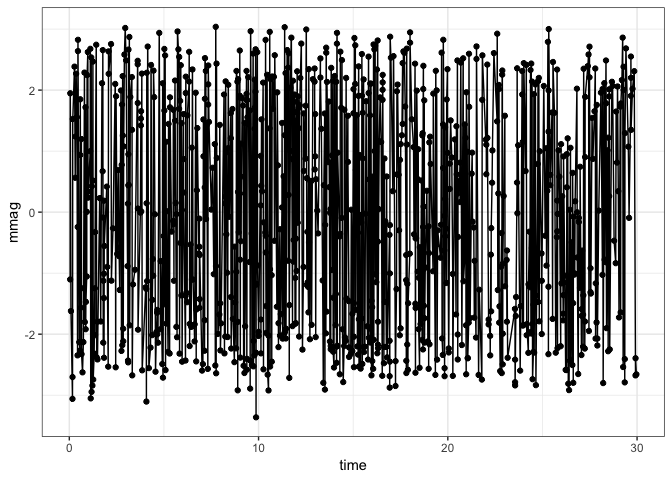
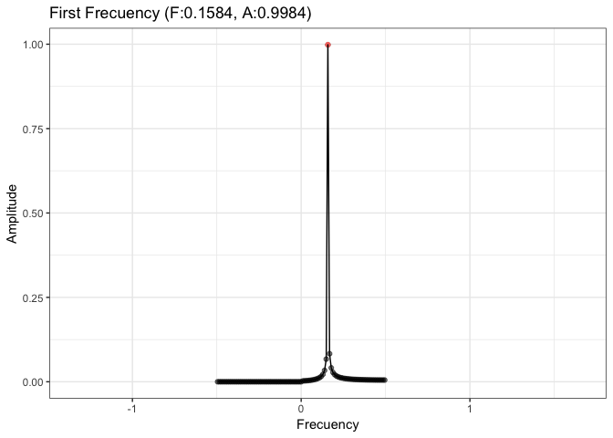
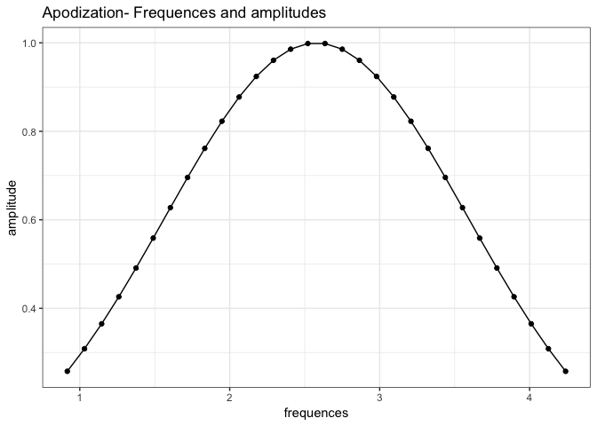
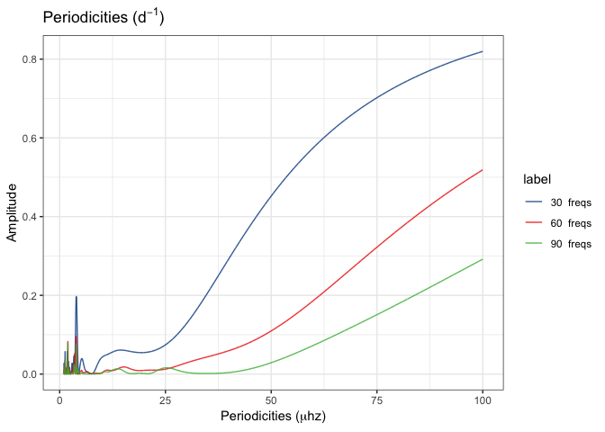

Experiments
================
Roberto Maestre
10/24/2018

Experiment configuration
------------------------

#### Parameters for execution

``` r
paramters = list(
  "filter" = "gaussian",
  "gRegimen" = 0,
  "minDnu" = 15,
  "maxDnu" = 95,
  "dnuValue" = -1,
  "dnuGuessError" = 10,
  "dnuEstimation" = TRUE,
  "numFrequencies" = 30,
  "debug" = TRUE)
```

#### Data source

Choose:

-   dataFlag = T, to use synthetic data generated or,

-   dataFlag = F, to use a real pulsar photometry

``` r
dataFlag = T
```

Data generation
---------------

``` r
# Generate synthetic data or read pulsar data
if (dataFlag) {
  x <- sin(seq(from = 0,
               to = 100,
               by = 1))
  dt <-
    data.frame("time" = seq(from = 1, to = length(x)), "mmag" = x)
} else {
  # Read pulsar data
  dt <- data.table(read.csv("../data/pulsar.tsv", sep = "\t"))
}

# Sampling for large file
dt.plot <- dt
if(dim(dt)[1]>1000) {
  dt.plot <- dt[sample(nrow(dt), 1000),]
}
# Plot photometry
ggplot(aes(time, mmag), data = dt.plot) +
    geom_point() +
    geom_line() +
    theme_bw()
```



``` r
rm(dt.plot) # Drop memory
```

#### Frequences and Amplitudes on photometry data

``` r
# Calculate amplitudes and frequences
dt.spectrum <- calculate_amplitudes(dt$time, dt$mmag)
# Get max amplitude
maxAmplitude <- dt.spectrum[which.max(dt.spectrum$amplitude), ]
# Plot amplitudes
plot_spectrum(maxAmplitude$frequency - 1.5,
              maxAmplitude$frequency + 1.5,
              dt.spectrum)
```



``` r
# Save Data to disk (to be replicated)
write.table(
  dt.spectrum[c("frequency", "amplitude")],
  file = "/tmp/data.csv",
  sep = "\t",
  quote = F,
  row.names = F,
  col.names = F
)
```

Experiment execution
--------------------

process is the main method on the variableStars package to compute and estimate all parameters

``` r
result <- process(
  dt.spectrum$frequency,
  dt.spectrum$amplitude,
  filter = paramters$filter,
  gRegimen = paramters$gRegimen,
  minDnu = paramters$minDnu,
  maxDnu = paramters$maxDnu,
  dnuValue = paramters$dnuValue,
  dnuGuessError = paramters$dnuGuessError,
  dnuEstimation = paramters$dnuEstimation,
  numFrequencies = paramters$numFrequencies,
  debug = paramters$debug
)
```

    ## ::: Debug information :::
    ## Number of frequences to be processed: 101
    ## Number of frequences after drop the g regimen: 50
    ## Sorted frecuences:  1.83352 1.94811 1.71892 2.06271 1.60433
    ## Range:  30 50
    ##  Iteration over range: 30
    ##    Frequencies selected: 30
    ##       1.83352 1.94811 1.71892 2.06271 1.60433 2.1773 1.48973 2.2919 2.40649 1.37514 2.52109 2.63568 1.26054 2.75028 2.86487 2.97946 1.14595 3.09406 3.20865 3.32325 1.03135 3.43784 3.55244 3.66703 3.78163 0.916758 3.89622 4.01082 4.12541 4.24001
    ##    Amplitudes selected:  30
    ##       0.998384 0.0830948 0.0671104 0.041144 0.0335765 0.0278634 0.0218368 0.0213431 0.0174669 0.0158437 0.0148973 0.013069 0.0121994 0.0117024 0.010643 0.00979842 0.00974385 0.00911032 0.00853982 0.00806009 0.0079736 0.00765199 0.00730153 0.00699825 0.00673414 0.00663567 0.00650302 0.0063 0.00612121 0.00596351
    ##     Dnu: 2.0098
    ##     Dnu Peak: 2.0098
    ##     Dnu Guess: 0.305586
    ##  Iteration over range: 50
    ##     Nothing to do

#### Main results

-   **Dnu** (`result$dnu`) = 2.0098.
-   **DnuGuess** `(result$dnuGuess`) = 0.3055861.
-   **DnuPeak** (`result$dnuPeak`) = 2.0098.
-   **Frequency** (`result$photometry$frequency`) = 1.8335167, 1.9481115, 1.7189219, 2.0627063, 1.6043271, 2.1773011, 1.4897323, 2.2918959, 2.4064906, 1.3751375, 2.5210854, 2.6356802, 1.2605427, 2.750275, 2.8648698, 2.9794646, 1.1459479, 3.0940594, 3.2086542, 3.323249, 1.0313531, 3.4378438, 3.5524386, 3.6670334, 3.7816282...
-   **Amplitude** (`result$photometry$amplitude`) = 0.9983844, 0.0830948, 0.0671104, 0.041144, 0.0335765, 0.0278634, 0.0218368, 0.0213431, 0.0174669, 0.0158437, 0.0148973, 0.013069, 0.0121994, 0.0117024, 0.010643, 0.0097984, 0.0097439, 0.0091103, 0.0085398, 0.0080601, 0.0079736, 0.007652, 0.0073015, 0.0069982, 0.0067341...
-   **Diffs** (`result$diffHistogram$diffs`) = 0.1145948, 0.1145948, 0.2291896, 0.2291896, 0.3437844, 0.3437844, 0.4583792, 0.572974, 0.4583792, 0.6875688, 0.8021635, 0.572974, 0.9167583, 1.0313531, 1.1459479, 0.6875688, 1.2605427, 1.3751375, 1.4897323, 0.8021635, 1.6043271, 1.7189219, 1.8335167, 1.9481115, 0.9167583...

#### Apodization

``` r
# Plot frecuency and amplitude
ggplot(
  aes(x = frequences, y = amplitude),
  data = data.frame(
    "frequences" = result$ft$frequences,
    "amplitude" = result$ft$amp
  )
) +
  geom_point() +
  geom_line() +
  ggtitle("Apodization- Frequences and amplitudes") +
  theme_bw()
```



#### FT - Power Spectrum

``` r
# Plot frecuency and amplitude
dt <-
  data.frame("f" = result$ft$f,
             "powerSpectrum" = result$ft$powerSpectrum)
ggplot(aes(x = f, y = powerSpectrum), data = dt) +
  geom_point() +
  geom_line() +
  ggtitle("FT - Power Spectrum") +
  theme_bw()
```



#### Histogram fo differences.

We only show bins with &gt;0 values

``` r
dt <- data.frame(result$diffHistogram$histogram)
ggplot(aes(x = bins, y = values), data = dt[dt$values > 0,]) +
  geom_bar(stat = "identity") +
  ggtitle("Histogram of differences") +
  theme_bw()
```


