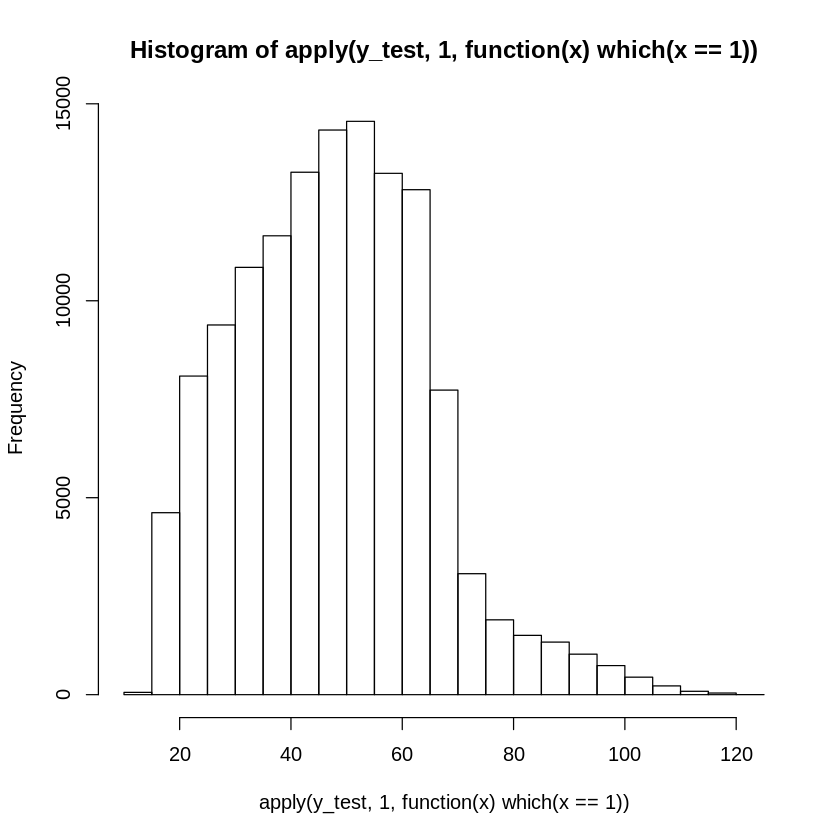

```R
library(variableStars)
library(data.table)
library(ggplot2)
library(RColorBrewer)
library(plotly)
library(keras)
library(plotly)
library(abind)
library(fields)
```

    
    Attaching package: 'plotly'
    
    The following object is masked from 'package:ggplot2':
    
        last_plot
    
    The following object is masked from 'package:stats':
    
        filter
    
    The following object is masked from 'package:graphics':
    
        layout
    
    Loading required package: spam
    Loading required package: dotCall64
    Loading required package: grid
    Spam version 2.2-0 (2018-06-19) is loaded.
    Type 'help( Spam)' or 'demo( spam)' for a short introduction 
    and overview of this package.
    Help for individual functions is also obtained by adding the
    suffix '.spam' to the function name, e.g. 'help( chol.spam)'.
    
    Attaching package: 'spam'
    
    The following objects are masked from 'package:base':
    
        backsolve, forwardsolve
    
    Loading required package: maps
    See www.image.ucar.edu/~nychka/Fields for
     a vignette and other supplements. 


### Read processed files and create big matrix with all rows


```R
setwd("~/Downloads/data/")
system("find . -type f -name \"*.log\" -print0 | xargs -0 cat > ALL.data")
df_all <- data.frame(fread("ALL.data", sep=",", header = F), stringsAsFactors=F)
dim(df_all)
df_all <- df_all[complete.cases(df_all),]
dim(df_all)
```


<ol class=list-inline>
	<li>524099</li>
	<li>614</li>
</ol>


<ol class=list-inline>
	<li>523833</li>
	<li>614</li>
</ol>


### Experiment parameters


```R
# Resolution for target frequency [0-100]
input_resolution <- 0.5
output_resolution <- 1.0

# Input dimension
cuts_breaks <- c(-Inf, seq(0, 101, input_resolution), Inf)
input_dim <- length(cuts_breaks) - 1

# Output dimension
num_classes <-
  length(seq(
    from = 0.1,
    to = 14 / 0.0864,
    by = output_resolution
  )) # Buckets of possible classes
```

### Matrix creation from data


```R
rows <- dim(df_all)[1]
cols <- (dim(df_all)[2] - 2) / 3
dimensions <- 3 # Number of channels
X <- array(0, c(rows, cols, dimensions))
# Y train is a 1D matrix with rows and targets
Y <- matrix(0, nrow = rows, ncol = num_classes)


ind_data <- seq(from=1,to=rows)

# Reshaoe dataframe to matrix slices
X[ind_data, , 1] <- as.matrix(df_all[ind_data, 1:204])
X[ind_data, , 2] <- as.matrix(df_all[ind_data, 204:((204 * 2) - 1)])
X[ind_data, , 3] <- as.matrix(df_all[ind_data, (204 * 2):((204 * 3) - 1)])
Y <- to_categorical(df_all[ind_data, 614:614] / 0.0864, num_classes)

dim(X)
dim(Y)
```


<ol class=list-inline>
	<li>523833</li>
	<li>204</li>
	<li>3</li>
</ol>


<ol class=list-inline>
	<li>523833</li>
	<li>162</li>
</ol>


```R
ind_remove_no_target <- which(apply(Y,1,sum)==1)
paste0("Removing ",length(ind_remove_no_target[ind_remove_no_target==TRUE])," rows with NO target")

X <- X[ind_remove_no_target,,]
Y <- Y[ind_remove_no_target,]

dim(X)
dim(Y)
```


'Removing 1 rows with NO target'


<ol class=list-inline>
	<li>523833</li>
	<li>204</li>
	<li>3</li>
</ol>


<ol class=list-inline>
	<li>523833</li>
	<li>162</li>
</ol>


```R
stopifnot(which(is.na(Y))==FALSE)
stopifnot(which(is.na(X))==FALSE)
```


```R
# Split train/test
smp_size <- floor(0.75 * nrow(X))
set.seed(123)
ind <- sample(seq_len(nrow(X)), size = smp_size)

# Prepare partition
x_train <- X[ind, , ]
x_test  <- X[-ind, , ]
y_train <- Y[ind, ]
y_test  <- Y[-ind, ]
# Check dims
dim(x_train)
dim(y_train)
dim(x_test)
dim(y_test)
```


<ol class=list-inline>
	<li>392874</li>
	<li>204</li>
	<li>3</li>
</ol>


<ol class=list-inline>
	<li>392874</li>
	<li>162</li>
</ol>


<ol class=list-inline>
	<li>130959</li>
	<li>204</li>
	<li>3</li>
</ol>


<ol class=list-inline>
	<li>130959</li>
	<li>162</li>
</ol>


### EDA of data


```R
hist(apply(y_test,1,function(x) which(x==1)))
summary(df_all[ind_data, 614:614])
#stop()
```


       Min. 1st Qu.  Median    Mean 3rd Qu.    Max. 
      1.133   3.013   4.127   4.134   5.125  10.482 





### NN train


```R
top_8_categorical_accuracy <-
  custom_metric("rec_at_8", function(y_true, y_pred) {
    metric_top_k_categorical_accuracy(y_true, y_pred, 8)
  })
top_6_categorical_accuracy <-
  custom_metric("recat_6", function(y_true, y_pred) {
    metric_top_k_categorical_accuracy(y_true, y_pred, 6)
  })
top_4_categorical_accuracy <-
  custom_metric("rec_at_4", function(y_true, y_pred) {
    metric_top_k_categorical_accuracy(y_true, y_pred, 4)
  })
top_2_categorical_accuracy <-
  custom_metric("rec_at_2", function(y_true, y_pred) {
    metric_top_k_categorical_accuracy(y_true, y_pred, 2)
  })


# Create a 1d convolutional NN
model <- keras_model_sequential() %>%
  layer_separable_conv_1d(
    kernel_size = 5,
    filters = 8,
    depth_multiplier = 15,
    input_shape = c(204, 3)
  ) %>%
  layer_max_pooling_1d(pool_size = 2) %>%
  layer_dropout(0.2) %>%
  layer_batch_normalization() %>%


layer_separable_conv_1d(
    kernel_size = 5,
    filters = 8,
    depth_multiplier = 15,
    input_shape = c(204, 3)
  ) %>%
  layer_max_pooling_1d(pool_size = 2) %>%
  layer_dropout(0.2) %>%
  layer_batch_normalization() %>%

  
  layer_flatten() %>%
  layer_dense(units = num_classes, activation = 'softmax')


# Configure a model for categorical classification.
model %>% compile(
  loss = "categorical_crossentropy",
  optimizer = optimizer_adadelta(lr = 0.01),
  metrics = c(
          "accuracy",
          top_2_categorical_accuracy,
          top_4_categorical_accuracy,
          top_6_categorical_accuracy,
          top_8_categorical_accuracy
        )
)
summary(model) # Plot summary

# Fit model
  history <- model %>% fit(
    x_train,
    y_train,
    epochs = 1000,
    batch_size =  250,
    validation_split = 0.2,
    shuffle = T,
    verbose = 2
  )

save_model_hdf5(model, paste0("~/Downloads/model_dnu.h5"))
```

    ________________________________________________________________________________
    Layer (type)                        Output Shape                    Param #     
    ================================================================================
    separable_conv1d_1 (SeparableConv1D (None, 200, 8)                  593         
    ________________________________________________________________________________
    max_pooling1d_1 (MaxPooling1D)      (None, 100, 8)                  0           
    ________________________________________________________________________________
    dropout_1 (Dropout)                 (None, 100, 8)                  0           
    ________________________________________________________________________________
    batch_normalization_1 (BatchNormali (None, 100, 8)                  32          
    ________________________________________________________________________________
    separable_conv1d_2 (SeparableConv1D (None, 96, 8)                   1568        
    ________________________________________________________________________________
    max_pooling1d_2 (MaxPooling1D)      (None, 48, 8)                   0           
    ________________________________________________________________________________
    dropout_2 (Dropout)                 (None, 48, 8)                   0           
    ________________________________________________________________________________
    batch_normalization_2 (BatchNormali (None, 48, 8)                   32          
    ________________________________________________________________________________
    flatten_1 (Flatten)                 (None, 384)                     0           
    ________________________________________________________________________________
    dense_1 (Dense)                     (None, 162)                     62370       
    ================================================================================
    Total params: 64,595
    Trainable params: 64,563
    Non-trainable params: 32
    ________________________________________________________________________________


```R
#model <- load_model_hdf5(paste0("~/Downloads/model_dnu.h5"))
evaluate(model, x_test, y_test)
```


```R
plot(history) +
  theme_bw()
```

### Confusion matrix


```R
Y_test_hat <- predict_classes(model, x_test)
# Calculate confusion matrix
cm <- table(apply(y_test,1,which.max), Y_test_hat)

# Plot matrix
dtCM <- as.data.frame(cm)
colnames(dtCM) <- c("c1","c2","freq")
ggplot(data=dtCM, aes(c1, c2, fill = freq)) +
  geom_raster() +
  scale_fill_gradientn(colours=c("#0000FFFF","#FFFFFFFF","#FF0000FF"))
```


```R
select_test <- 3909

y_hats <- predict(model, x_test)

plot(
  y_hats[select_test,],
  lty = 1,
  ylim = c(0, 1),
  xlim = c(0, 120),
  col = "black",
  xlab = "Frequency",
  ylab = "Prob / Value"
)

lines(x_test[select_test, , 1], lty = 1, col = "blue")
lines(x_test[select_test, , 2], lty = 2, col = "grey")
lines(x_test[select_test, , 3], lty = 3, col = "orange")


abline(
  v = which(y_test[select_test, ]==1)[1],
  col = "red",
  lwd = 3,
  lty = 2
)

abline(
  v = which(y_test[select_test, ]==1)[2],
  col = "red",
  lwd = 3,
  lty = 2
)

legend(
  "topright",
  c("FT", "Diffs", "Autocorrelation"),
  lty = c(1, 2, 3, 4),
  col = c("blue", "grey", "orange")
)
```
