# Aplication of Neural Networks (NN) for infering both the large separation ($\Delta u$) and rotational splitting ($\delta r$) with an application to $\delta$ Scuti stars

This notebook provides the full methodology to:

1)
- Read data processed from 1D-rotating models computed with CESTAM code for a wide range of masses, rotation velocities (slow-to-moderate), and metallicities, representative of A-F star.
- Format and pepare the data for feed the NN
- Run a trainning process
- Validate the NN performance by using several metrics: accuracy@N, absolute errors, porcentual errors.


2)
- Read and preprocess data from $\delta$ scuti stars
- Apply the trained NN to infere values from $\Delta u$ and $\delta r$
- Validate the produced residuals


```R
library(variableStars)
library(data.table)
library(ggplot2)
library(RColorBrewer)
library(plotly)
library(keras)
library(abind)
library(fields)
```

    
    Attaching package: 'plotly'
    
    The following object is masked from 'package:ggplot2':
    
        last_plot
    
    The following object is masked from 'package:stats':
    
        filter
    
    The following object is masked from 'package:graphics':
    
        layout
    
    Loading required package: spam
    Loading required package: dotCall64
    Loading required package: grid
    Spam version 2.2-0 (2018-06-19) is loaded.
    Type 'help( Spam)' or 'demo( spam)' for a short introduction 
    and overview of this package.
    Help for individual functions is also obtained by adding the
    suffix '.spam' to the function name, e.g. 'help( chol.spam)'.
    
    Attaching package: 'spam'
    
    The following objects are masked from 'package:base':
    
        backsolve, forwardsolve
    
    Loading required package: maps
    See www.image.ucar.edu/~nychka/Fields for
     a vignette and other supplements. 


### Auxiliar functions


```R
trunc <-
    function(x, ..., prec = 1)
      base::trunc(x * 10 ^ prec, ...) / 10 ^ prec
  
  
  flat <- function(x) {
    return(paste0(trunc(c(x), prec = 4), collapse = ","))
  }

normalized <- function(x) {
        (x - min(x)) / (max(x) - min(x))
      }
```

### Read processed files and create big matrix with all rows


```R
setwd("~/Downloads/data/")
system("find . -type f -name \"*.log\" -print0 | xargs -0 cat > ALL.data")
df_all <- data.frame(fread("ALL.data", sep=",", header = F), stringsAsFactors=F)
dim(df_all)
df_all <- df_all[complete.cases(df_all),]
dim(df_all)
```


<ol class=list-inline>
	<li>379464</li>
	<li>1626</li>
</ol>


<ol class=list-inline>
	<li>379294</li>
	<li>1626</li>
</ol>


### Global Parameters 


```R
# Resolution for target frequency [0-100]
input_resolution <- 0.25
output_resolution <- 1.0

# Input dimension
cuts_breaks <- c(-Inf, seq(0, 101, input_resolution), Inf)
input_dim <- length(cuts_breaks) - 1

classses <- seq(
    from = 0.0,
    to = 14 / 0.0864,
    by = output_resolution
  )

# Output dimension
num_classes <-
  length(classses) # Buckets of possible classes

print("Output classes (Dnu or dr): ")
classses
print(num_classes)
```

    [1] "Output classes (Dnu or dr): "


<ol class=list-inline>
	<li>0</li>
	<li>1</li>
	<li>2</li>
	<li>3</li>
	<li>4</li>
	<li>5</li>
	<li>6</li>
	<li>7</li>
	<li>8</li>
	<li>9</li>
	<li>10</li>
	<li>11</li>
	<li>12</li>
	<li>13</li>
	<li>14</li>
	<li>15</li>
	<li>16</li>
	<li>17</li>
	<li>18</li>
	<li>19</li>
	<li>20</li>
	<li>21</li>
	<li>22</li>
	<li>23</li>
	<li>24</li>
	<li>25</li>
	<li>26</li>
	<li>27</li>
	<li>28</li>
	<li>29</li>
	<li>30</li>
	<li>31</li>
	<li>32</li>
	<li>33</li>
	<li>34</li>
	<li>35</li>
	<li>36</li>
	<li>37</li>
	<li>38</li>
	<li>39</li>
	<li>40</li>
	<li>41</li>
	<li>42</li>
	<li>43</li>
	<li>44</li>
	<li>45</li>
	<li>46</li>
	<li>47</li>
	<li>48</li>
	<li>49</li>
	<li>50</li>
	<li>51</li>
	<li>52</li>
	<li>53</li>
	<li>54</li>
	<li>55</li>
	<li>56</li>
	<li>57</li>
	<li>58</li>
	<li>59</li>
	<li>60</li>
	<li>61</li>
	<li>62</li>
	<li>63</li>
	<li>64</li>
	<li>65</li>
	<li>66</li>
	<li>67</li>
	<li>68</li>
	<li>69</li>
	<li>70</li>
	<li>71</li>
	<li>72</li>
	<li>73</li>
	<li>74</li>
	<li>75</li>
	<li>76</li>
	<li>77</li>
	<li>78</li>
	<li>79</li>
	<li>80</li>
	<li>81</li>
	<li>82</li>
	<li>83</li>
	<li>84</li>
	<li>85</li>
	<li>86</li>
	<li>87</li>
	<li>88</li>
	<li>89</li>
	<li>90</li>
	<li>91</li>
	<li>92</li>
	<li>93</li>
	<li>94</li>
	<li>95</li>
	<li>96</li>
	<li>97</li>
	<li>98</li>
	<li>99</li>
	<li>100</li>
	<li>101</li>
	<li>102</li>
	<li>103</li>
	<li>104</li>
	<li>105</li>
	<li>106</li>
	<li>107</li>
	<li>108</li>
	<li>109</li>
	<li>110</li>
	<li>111</li>
	<li>112</li>
	<li>113</li>
	<li>114</li>
	<li>115</li>
	<li>116</li>
	<li>117</li>
	<li>118</li>
	<li>119</li>
	<li>120</li>
	<li>121</li>
	<li>122</li>
	<li>123</li>
	<li>124</li>
	<li>125</li>
	<li>126</li>
	<li>127</li>
	<li>128</li>
	<li>129</li>
	<li>130</li>
	<li>131</li>
	<li>132</li>
	<li>133</li>
	<li>134</li>
	<li>135</li>
	<li>136</li>
	<li>137</li>
	<li>138</li>
	<li>139</li>
	<li>140</li>
	<li>141</li>
	<li>142</li>
	<li>143</li>
	<li>144</li>
	<li>145</li>
	<li>146</li>
	<li>147</li>
	<li>148</li>
	<li>149</li>
	<li>150</li>
	<li>151</li>
	<li>152</li>
	<li>153</li>
	<li>154</li>
	<li>155</li>
	<li>156</li>
	<li>157</li>
	<li>158</li>
	<li>159</li>
	<li>160</li>
	<li>161</li>
	<li>162</li>
</ol>


    [1] 163


### Matrix creation from data


```R
# Dataset shape
rows <- dim(df_all)[1]
cols <- (dim(df_all)[2] - 2) / 4

# Number of channels
dimensions <- 4
X <- array(0, c(rows, cols, dimensions))
# Y train is a 1D matrix with rows and targets
Y <- matrix(0, nrow = rows, ncol = num_classes)
ind_data <- seq(from=1,to=rows)
```


```R
# Reshape dataframe to matrix slices
X[ind_data, , 1] <- as.matrix(df_all[ind_data, 1:406])
X[ind_data, , 2] <- as.matrix(df_all[ind_data, 406:((406 * 2) - 1)]) 
X[ind_data, , 3] <- as.matrix(df_all[ind_data, (406 * 2):((406 * 3) - 1)])
X[ind_data, , 4] <- as.matrix(df_all[ind_data, (406 * 3):((406 * 4) - 1)]) / 0.0864
```

#### Select target ($\Delta u$ or $\delta r$) and covert as one-hot encoding

- Index = 1626 : Correspond to $\Delta u$
- Index = 1625 : Correspond to $\delta r$


```R
Y <- to_categorical(df_all[ind_data, 1626:1626] / 0.0864 , num_classes)
```

#### Data normalization


```R
for (i in ind_data){
    X[i, , 1] <- normalized(t(X[i, , 1]))
}
for (i in ind_data){
    X[i, , 2] <- normalized(t(X[i, , 2]))
}
for (i in ind_data){
    X[i, , 3] <- normalized(t(X[i, , 3]))
}
for (i in ind_data){
    X[i, , 4] <- normalized(t(X[i, , 4]))
}
```

### Histogram for target


```R
hist(apply(Y,1,function(x) which(x==1)), main="Histogram for target (Dnu or dr)" , xlab = "Target (Dnu or dr)")
```


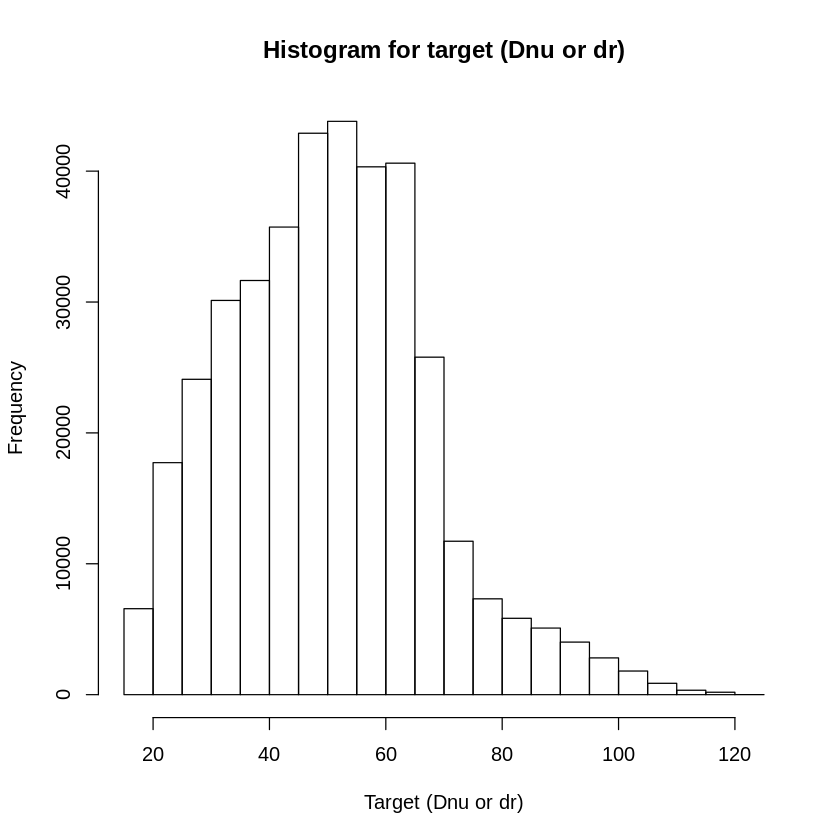


### Check that target is not in the trainind data


```R
print(paste0("Check for target 1:"))
flags <- c()
for (i in seq(from=1,to=rows)){
    flags <- c(flags, df_all[i, 1626:1626] %in% rbind(X[i,,1],X[i,,2],X[i,,3]))
}
print(table(flags))

flags <- c()
print(paste0("Check for target 2:"))
for (i in seq(from=1,to=rows)){
    flags <- c(flags, df_all[i, 1625:1625] %in% rbind(X[i,,1],X[i,,2],X[i,,3]))
}
print(table(flags))
```

    [1] "Check for target 1:"
    flags
     FALSE 
    379294 
    [1] "Check for target 2:"
    flags
     FALSE   TRUE 
    379183    111 


```R
stopifnot(which(is.na(Y))==FALSE)
stopifnot(which(is.na(X))==FALSE)
```

### Split train and test


```R
# Split train/test
smp_size <- floor(0.9 * nrow(X))
set.seed(123)
ind <- sample(seq_len(nrow(X)), size = smp_size)

# Prepare partition
x_train <- X[ind, , ]
x_test  <- X[-ind, , ]
y_train <- Y[ind, ]
y_test  <- Y[-ind, ]
# Check dims
dim(x_train)
dim(y_train)
dim(x_test)
dim(y_test)
```


<ol class=list-inline>
	<li>341364</li>
	<li>406</li>
	<li>4</li>
</ol>


<ol class=list-inline>
	<li>341364</li>
	<li>163</li>
</ol>


<ol class=list-inline>
	<li>37930</li>
	<li>406</li>
	<li>4</li>
</ol>


<ol class=list-inline>
	<li>37930</li>
	<li>163</li>
</ol>


# Deepwise separable convolution NN

### Accuray metrics (from the classication point of view)


```R
top_8_categorical_accuracy <-
  custom_metric("rec_at_8", function(y_true, y_pred) {
    metric_top_k_categorical_accuracy(y_true, y_pred, 8)
  })
top_6_categorical_accuracy <-
  custom_metric("recat_6", function(y_true, y_pred) {
    metric_top_k_categorical_accuracy(y_true, y_pred, 6)
  })
top_4_categorical_accuracy <-
  custom_metric("rec_at_4", function(y_true, y_pred) {
    metric_top_k_categorical_accuracy(y_true, y_pred, 4)
  })
top_2_categorical_accuracy <-
  custom_metric("rec_at_2", function(y_true, y_pred) {
    metric_top_k_categorical_accuracy(y_true, y_pred, 2)
  })
```

### Create model and train's weights checkpoints


```R
checkpoint_dir <- "~/Downloads/test/"
if (T) {
    unlink(checkpoint_dir, recursive = TRUE)
    dir.create(checkpoint_dir)
    filepath <- file.path(checkpoint_dir, "weights.{epoch:02d}-{val_loss:.2f}.hdf5")


# Create checkpoint callback
cp_callback <- callback_model_checkpoint(
  filepath = filepath,
  save_weights_only = TRUE,
  period = 5,
  verbose = 1
)
}

# Create a 1d convolutional NN
model <- keras_model_sequential() %>%
  layer_separable_conv_1d(
    kernel_size = 4,
    filters = 8,
    depth_multiplier = 10,
    input_shape = c(406,4)
  ) %>%
  layer_max_pooling_1d(pool_size = 2) %>%
  layer_dropout(0.3) %>%

  layer_flatten() %>%
  layer_dense(units = num_classes, activation = 'softmax')


# Configure a model for categorical classification.
model %>% compile(
  loss = "categorical_crossentropy",
  optimizer = optimizer_adadelta(lr = 0.01),
  metrics = c(
          "accuracy",
          top_2_categorical_accuracy,
          top_4_categorical_accuracy,
          top_6_categorical_accuracy,
          top_8_categorical_accuracy
        )
)
summary(model) # Plot summary
```

    ________________________________________________________________________________
    Layer (type)                        Output Shape                    Param #     
    ================================================================================
    separable_conv1d_1 (SeparableConv1D (None, 403, 8)                  488         
    ________________________________________________________________________________
    max_pooling1d_1 (MaxPooling1D)      (None, 201, 8)                  0           
    ________________________________________________________________________________
    dropout_1 (Dropout)                 (None, 201, 8)                  0           
    ________________________________________________________________________________
    flatten_1 (Flatten)                 (None, 1608)                    0           
    ________________________________________________________________________________
    dense_1 (Dense)                     (None, 163)                     262267      
    ================================================================================
    Total params: 262,755
    Trainable params: 262,755
    Non-trainable params: 0
    ________________________________________________________________________________


### Run train


```R
if (T) {
# Fit model
  history <- model %>% fit(
    x_train,
    y_train,
    epochs = 200,
    batch_size =  250,
    validation_split = 0.1,
    shuffle = T,
    verbose = 2,
    callbacks = list(cp_callback) 
  )
}
```

### Save model and evaluation on test


```R
#save_model_hdf5(model, "~/Downloads/model_Dnu.h5")
evaluate(model, x_test, y_test)
```


<dl>
	<dt>$loss</dt>
		<dd>2.24245120876859</dd>
	<dt>$acc</dt>
		<dd>0.262457157922489</dd>
	<dt>$rec_at_2</dt>
		<dd>0.449907724752987</dd>
	<dt>$rec_at_4</dt>
		<dd>0.668020036903812</dd>
	<dt>$recat_6</dt>
		<dd>0.791220669648341</dd>
	<dt>$rec_at_8</dt>
		<dd>0.865910888472491</dd>
</dl>


### Plot metrics history


```R
plot(history) +
  theme_bw()
```


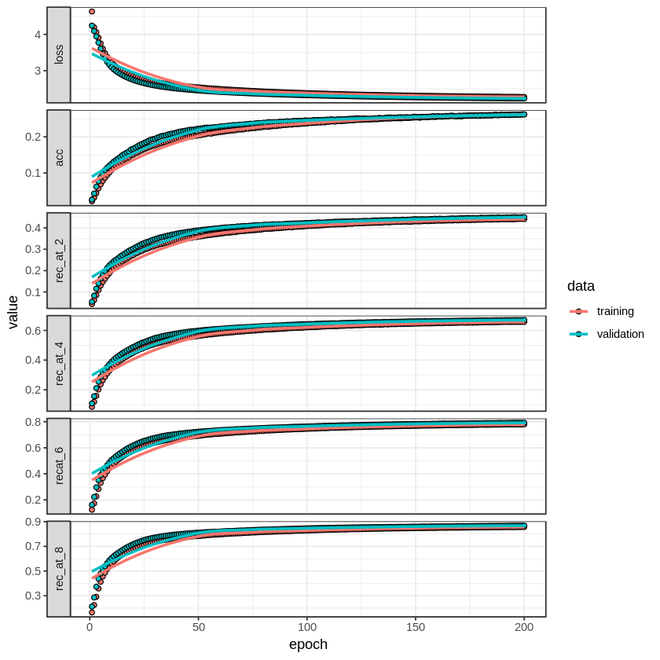


### Confusion matrix


```R
Y_test_hat <- predict_classes(model, x_test)
# Calculate confusion matrix
cm <- table(apply(y_test,1,which.max), Y_test_hat)
# Plot matrix
dtCM <- as.data.frame(cm)
colnames(dtCM) <- c("c1","c2","freq")
dtCM$c1 <- as.numeric(dtCM$c1)
dtCM$c2 <- as.numeric(dtCM$c2)
dtCM$freq <- as.numeric(dtCM$freq)
dim(dtCM)
```


<ol class=list-inline>
	<li>10918</li>
	<li>3</li>
</ol>


```R
ggplot(data=dtCM, aes(c1, c2, fill = freq)) +
  geom_tile() +
  theme(axis.text.x = element_text(angle = 90, hjust = 1)) +
  xlab("Real class") +
  ylab("NN class inference") +
  theme_bw()
```


# Performance metrics with acc@1


```R
# Output dimension
y <- classses[Y_test_hat]
y_hat <- classses[apply(y_test,1,function(x) which(x==1))]
```

### Absolute errors at acc@1


```R
resi <- ((classses[Y_test_hat]) - (classses[apply(y_test,1,function(x) which(x==1))]))
summary(resi)
hist(resi, breaks=100, xlim = c(-50,50), xlab = "absolute errors", main="Absolute Errors Histogram")
```


       Min. 1st Qu.  Median    Mean 3rd Qu.    Max. 
    -84.000  -3.000  -1.000  -1.381   0.000  63.000 


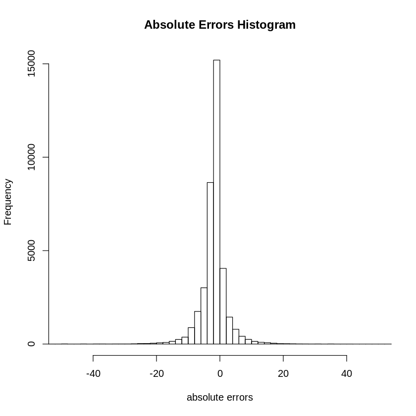


### Percentual errors with acc@1


```R
resi <- ((y - y_hat)/y) * 100      
summary(resi)
hist(resi, breaks=100,, xlim = c(-50,50), xlab = "percentual errors", main="Percentual Errors Histogram")
```


        Min.  1st Qu.   Median     Mean  3rd Qu.     Max. 
    -560.000   -6.329   -2.410   -3.592    0.000   73.750 


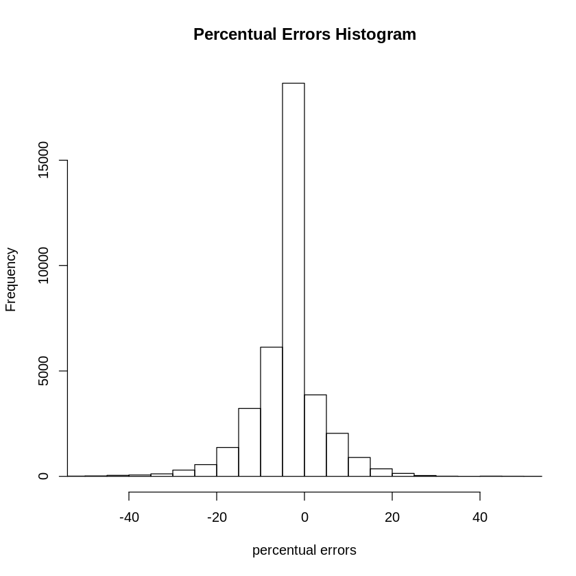


### Visual proof on given data test


```R
select_test <- 100

y_hats <- predict(model, x_test)

plot(
  y_hats[select_test,],
  lty = 1,
  ylim = c(0, 1),
  xlim = c(0, 120),
  col = "black",
  xlab = "Frequency",
  ylab = "Prob / Value"
)


lines(x_test[select_test, , 1], lty = 1, col = "blue")
lines(x_test[select_test, , 2], lty = 2, col = "grey")
lines(x_test[select_test, , 3], lty = 3, col = "orange")
lines(x_test[select_test, , 4], lty = 3, col = "brown")

abline(
  v = which(y_test[select_test, ]==1)[1],
  col = "red",
  lwd = 3,
  lty = 2
)


legend(
  "topright",
  c("FT", "Diffs", "Autocorrelation", "Raw data"),
  lty = c(1, 2, 3, 4),
  col = c("blue", "grey", "orange", "brown")
)
```


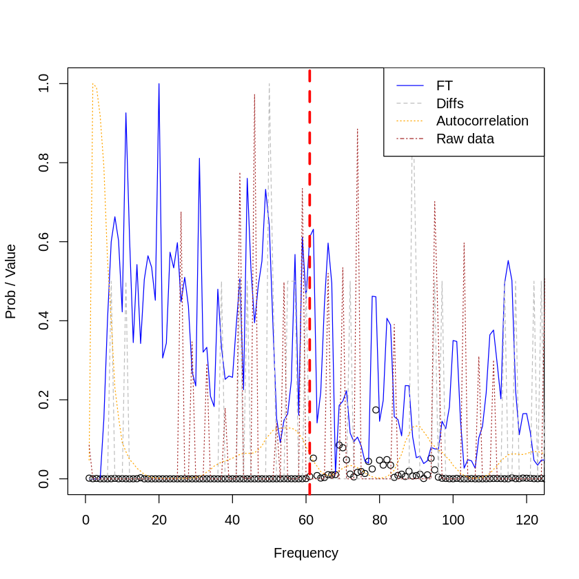


# Validation on $\delta$-scuti stars

### Auxiliar functions


```R
validate_real_star <- function(data, real_dnu, real_dr, numFrequencies=30) {


    
  # Execute experiment
  result <- process(
    frequency = data$V1,
    amplitude = data$V2,
    filter = "uniform",
    gRegimen = 0,
    maxDnu = 1,
    minDnu = 15,
    numFrequencies = numFrequencies,
    dnuGuessError = -1,
    debug = F,
    processFirstRangeOnly = numFrequencies
  )
  
  
    # Save ft of diffs
  ftS <-
    stats.bin(as.numeric(result$fresAmps[[names(result$fresAmps)[1]]]$fInv),
              as.numeric(result$fresAmps[[names(result$fresAmps)[1]]]$b),
              breaks = cuts_breaks)$stats
  ft_1D <- ftS[8, 1:(length(cuts_breaks) - 1)]
  ft_1D[is.na(ft_1D)] <- 0

    diffS <-
      stats.bin(
        as.numeric(result$diffHistogram$histogram$bins),
        as.numeric(result$diffHistogram$histogram$values),
        breaks = cuts_breaks
      )$stats
    diff_2D <- diffS[8, 1:(length(cuts_breaks) - 1)]
    diff_2D[is.na(diff_2D)] <- 0
    
    # Save crosscorrelation
    cross <- stats.bin(
      as.numeric(result$crossCorrelation$index),
      as.numeric(result$crossCorrelation$autocorre),
      breaks = cuts_breaks
    )$stats
    cross_3D <- cross[8, 1:(length(cuts_breaks) - 1)]
    cross_3D[is.na(cross_3D)] <- 0
          
    # Raw information
    rawS <-
      stats.bin(as.numeric(data$V1),
                as.numeric(data$V2),
                breaks = cuts_breaks)$stats
    raw_1D <- rawS[8, 1:(length(cuts_breaks) - 1)]
    raw_1D[is.na(raw_1D)] <- 0
    
    # Assert all dimensions are equal
    stopifnot((length(ft_1D) == length(diff_2D)) ==
                ((length(diff_2D) == length(cross_3D)) ==
                   (
                     length(cross_3D) == length(cuts_breaks) - 1
                   )))
    

  rows <- dim(df_all)[1]
  dimensions <- 4 # Number of channels
  cols <- (dim(df_all)[2] - 2) / 4
  X <- array(0, c(1, cols, dimensions))
  # Y train is a 1D matrix with rows and targets
  Y <- matrix(0, nrow = 1, ncol = num_classes)
  ind_data <- seq(from = 1, to = rows)
    
    
  X[1, , 1] <- normalized(ft_1D)
  X[1, , 2] <- normalized(diff_2D)
  X[1, , 3] <- normalized(cross_3D)
  X[1, , 4] <- normalized(raw_1D)

  print(paste0("Max hist diff:",max(X[1, , 2])))
  print(paste0("Mas acutocorre:",max(X[1, , 3])))
  #print(paste0("Max raw:",max(X[1, , 4])))

  plot(
    seq(
    from = 0.0,
    to = 14 / 0.0864,
    by = 1),
    t(predict(modelDnu, X)),
    lty = 1,
    pch = 2,
    ylim = c(0, 1),
    xlim = c(0, 100),
    col = "black",
    xlab = "Frequency",
    ylab = "Prob / Value"
   )
    
  
  lines(cuts_breaks[1:(length(cuts_breaks)-1)], normalized(X[1, , 1]), lty = 1, col = alpha("blue", 0.4))
  lines(cuts_breaks[1:(length(cuts_breaks)-1)], normalized(X[1, , 2]), lty = 1, col = alpha("grey", 0.4))
  lines(cuts_breaks[1:(length(cuts_breaks)-1)], normalized(X[1, , 3]), lty = 1, col = alpha("orange", 0.4))
  lines(cuts_breaks[1:(length(cuts_breaks)-1)], normalized(X[1, , 4]), lty = 1, col = alpha("brown", 0.4))

  abline(
   v = real_dnu,
   col = "red",
   lwd = 3,
   lty = 2
  )
    
abline(
   v = real_dr,
   col = "blue",
   lwd = 3,
   lty = 2
  )
    
  legend(
    "topright",
    c("FT", "Diffs", "Autocorrelation", "Raw", "NN-Dnu", "NN-dr"),
    lty = c(1, 2, 3, 4,NA,NA),
    pch = c(NA,NA,NA,NA,2,3),
    col = c("blue", "grey", "orange", "brown", "black", "black")
  )
    
    return(as.numeric(which.max(t(predict(modelDnu, X)))))
}


```

### Load best model and weigths


```R
#Read models
# Create a 1d convolutional NN
modelDnu <- keras_model_sequential() %>%
  layer_separable_conv_1d(
    kernel_size = 4,
    filters = 8,
    depth_multiplier = 10,
    input_shape = c(406,4)
  ) %>%
  layer_max_pooling_1d(pool_size = 2) %>%
  layer_dropout(0.3) %>%

  layer_flatten() %>%
  layer_dense(units = num_classes, activation = 'softmax')

modelDnu %>% load_model_weights_hdf5(
  file.path("~/Downloads/test/weights.200-2.24.hdf5")
)
```

### Read delta scuti stars data


```R
# Read file stars
stars_base_dir <- "~/Projects/variableStars/data/deltaScuti/"
setwd(stars_base_dir)
for (file in list.files()) {
    print(file)
    #data <- read.csv(file, sep="", header=F)
    #validate_real_star(data)
}
errors <- data.frame(matrix(ncol=6, nrow=0))
colnames(errors) <- c("star", "NN", "value", "error", "error_percentual", "n")
```

    [1] "CID100866999.lis"
    [1] "CID105906206.lis"
    [1] "HD15082.lis"
    [1] "HD159561.lis"
    [1] "HD172189.lis"
    [1] "KIC10080943.lis"
    [1] "kic10661783.lis"
    [1] "KIC3858884.lis"
    [1] "kic4544587.lis"
    [1] "KIC8262223.lis"
    [1] "KIC9851944.lis"


## CID100866999.lis


```R
# Quitar las frecuencias < 5 ciclos por día.
d <- read.csv(paste0(stars_base_dir,"CID100866999.lis"), sep="", header=F)
print(paste0("Nrows: ", dim(d)[1]))
head(d)
max <- validate_real_star(d, 56, 0) # There is no information about dr
errors <- rbind(errors, data.frame("star"="CID100866999", 
                                   "NN"=max,
                                   "value"=56,
                                   "error"=56-max, 
                                   "error_percentual"=((56-max)/(56))*100, 
                                   "n"=dim(d)[1]))
print(errors)
```

    [1] "Nrows: 8"


<table>
<thead><tr><th scope=col>V1</th><th scope=col>V2</th></tr></thead>
<tbody>
	<tr><td>16.9803</td><td>11.623 </td></tr>
	<tr><td>16.2530</td><td> 0.508 </td></tr>
	<tr><td>21.8711</td><td> 0.449 </td></tr>
	<tr><td>17.5521</td><td> 0.223 </td></tr>
	<tr><td>21.6053</td><td> 0.167 </td></tr>
	<tr><td>17.5674</td><td> 0.151 </td></tr>
</tbody>
</table>


    [1] "Max hist diff:1"
    [1] "Mas acutocorre:1"
              star  NN value error error_percentual n
    1 CID100866999 100    56   -44        -78.57143 8


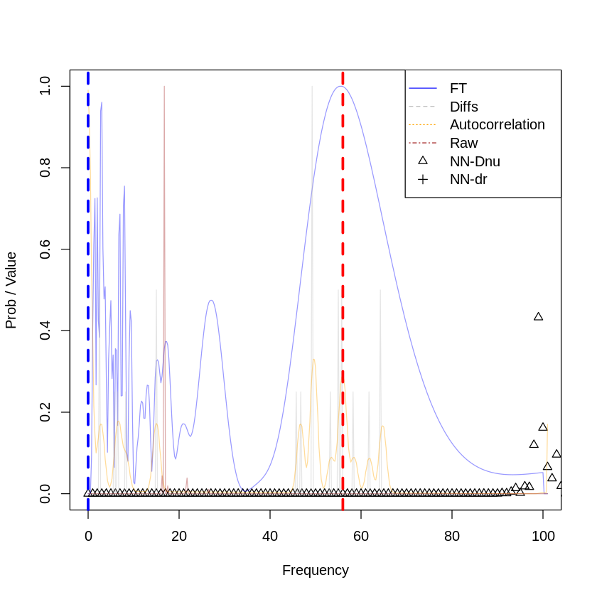


## CID105906206.lis


```R
d <- read.csv(paste0(stars_base_dir,"CID105906206.lis"), sep="", header=F)
head(d)
print(paste0("Nrows: ", dim(d)[1]))
max <- validate_real_star(d, 20, 2.61)
errors <- rbind(errors, data.frame("star"="CID105906206", 
                                   "NN"=max,
                                   "value"=20,
                                   "error"=20-max, 
                                   "error_percentual"=((20-max)/20)*100, 
                                   "n"=dim(d)[1]))
print(errors)
```


<table>
<thead><tr><th scope=col>V1</th><th scope=col>V2</th></tr></thead>
<tbody>
	<tr><td> 9.4175</td><td>2.552  </td></tr>
	<tr><td> 9.0696</td><td>2.296  </td></tr>
	<tr><td>10.7776</td><td>2.150  </td></tr>
	<tr><td> 5.6119</td><td>1.160  </td></tr>
	<tr><td> 8.9203</td><td>0.906  </td></tr>
	<tr><td> 0.1192</td><td>0.880  </td></tr>
</tbody>
</table>


    [1] "Nrows: 202"
    [1] "Max hist diff:1"
    [1] "Mas acutocorre:1"
              star  NN value error error_percentual   n
    1 CID100866999 100    56   -44        -78.57143   8
    2 CID105906206  17    20     3         15.00000 202


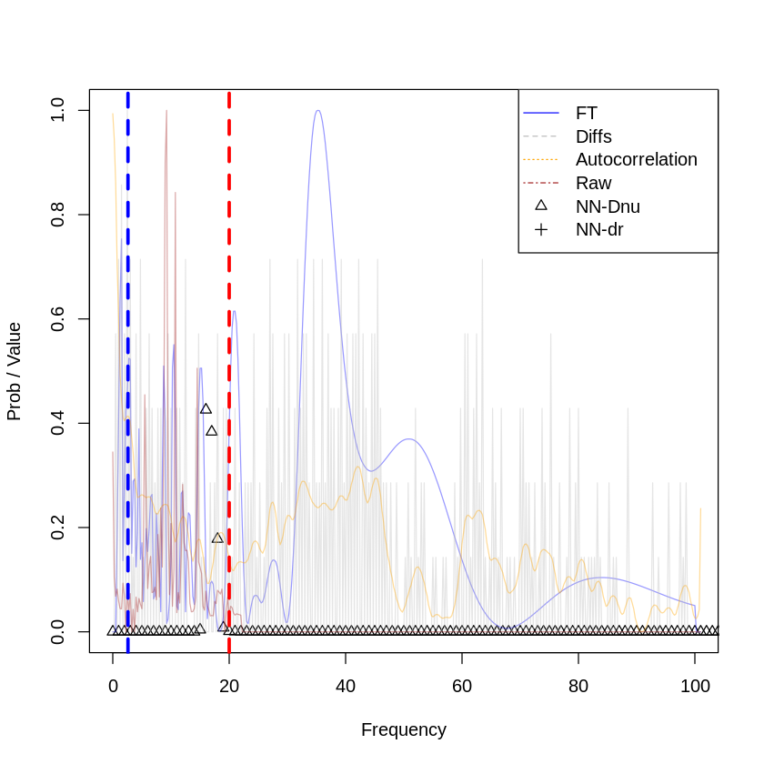


## HD15082.lis


```R
d <- read.csv(paste0(stars_base_dir,"HD15082.lis"), sep="", header=F)
head(d)
print(paste0("Nrows: ", dim(d)[1]))
max <- validate_real_star(d, 80, 14)
errors <- rbind(errors, data.frame("star"="HD15082", 
                                   "NN"=max,
                                   "value"=80,
                                   "error"=80-max, 
                                   "error_percentual"=((80-max)/80)*100, 
                                   "n"=dim(d)[1]))
print(errors)
```


<table>
<thead><tr><th scope=col>V1</th><th scope=col>V2</th></tr></thead>
<tbody>
	<tr><td>20.163899 </td><td>0.05826439</td></tr>
	<tr><td> 9.842703 </td><td>0.05056994</td></tr>
	<tr><td>21.064683 </td><td>0.04185181</td></tr>
	<tr><td> 1.901497 </td><td>0.04169184</td></tr>
	<tr><td>14.207774 </td><td>0.04024543</td></tr>
	<tr><td> 1.028524 </td><td>5.41987344</td></tr>
</tbody>
</table>


    [1] "Nrows: 71"
    [1] "Max hist diff:1"
    [1] "Mas acutocorre:1"
              star  NN value error error_percentual   n
    1 CID100866999 100    56   -44        -78.57143   8
    2 CID105906206  17    20     3         15.00000 202
    3      HD15082 101    80   -21        -26.25000  71


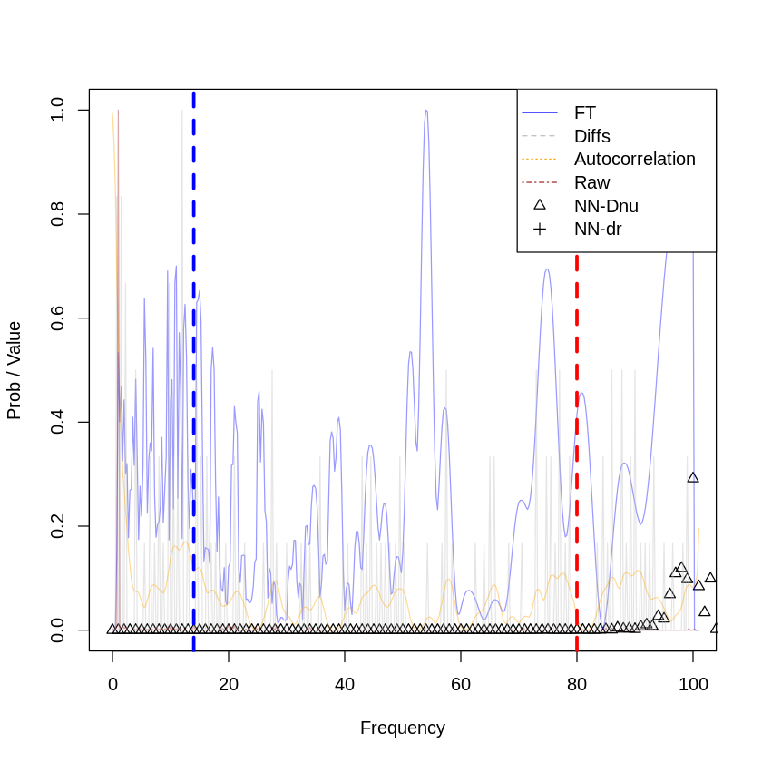


## HD159561.lis


```R
d <- read.csv(paste0(stars_base_dir,"HD159561.lis"), sep="", header=F)
head(d)
print(paste0("Nrows: ", dim(d)[1]))
max <- validate_real_star(d, 38, 19)
errors <- rbind(errors, data.frame("star"="HD159561", 
                                   "NN"=max,
                                   "value"=38,
                                   "error"=38-max, 
                                   "error_percentual"=((38-max)/38)*100, 
                                   "n"=dim(d)[1]))
print(errors)
```


<table>
<thead><tr><th scope=col>V1</th><th scope=col>V2</th></tr></thead>
<tbody>
	<tr><td>10.227</td><td>0.091 </td></tr>
	<tr><td>10.469</td><td>0.104 </td></tr>
	<tr><td>10.619</td><td>0.243 </td></tr>
	<tr><td>11.720</td><td>0.405 </td></tr>
	<tr><td>13.096</td><td>0.144 </td></tr>
	<tr><td>16.124</td><td>0.349 </td></tr>
</tbody>
</table>


    [1] "Nrows: 40"
    [1] "Max hist diff:1"
    [1] "Mas acutocorre:1"
              star  NN value error error_percentual   n
    1 CID100866999 100    56   -44       -78.571429   8
    2 CID105906206  17    20     3        15.000000 202
    3      HD15082 101    80   -21       -26.250000  71
    4     HD159561  35    38     3         7.894737  40


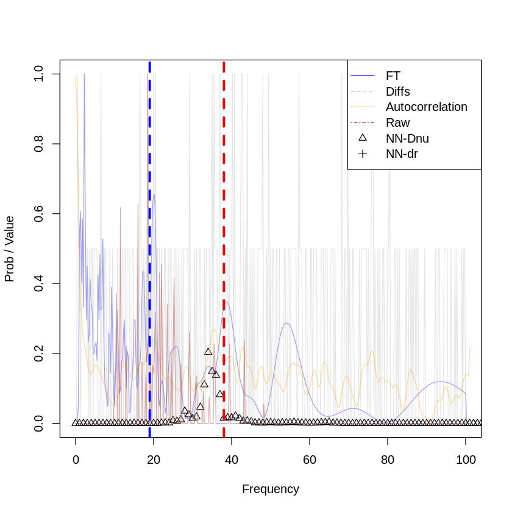


## HD172189.lis


```R
d <- read.csv(paste0(stars_base_dir,"HD172189.lis"), sep="", header=F)
head(d)
print(paste0("Nrows: ", dim(d)[1]))


max <- validate_real_star(d, 19, 4.6)
errors <- rbind(errors, data.frame("star"="HD172189", 
                                   "NN"=max,
                                   "value"=19,
                                   "error"=19-max, 
                                   "error_percentual"=((19-max)/19)*100, 
                                   "n"=dim(d)[1]))
print(errors)
```


<table>
<thead><tr><th scope=col>V1</th><th scope=col>V2</th></tr></thead>
<tbody>
	<tr><td>19.58317    </td><td>4.513889e-05</td></tr>
	<tr><td>17.32212    </td><td>7.523148e-05</td></tr>
	<tr><td>17.94392    </td><td>7.754630e-05</td></tr>
	<tr><td>17.84847    </td><td>7.986111e-05</td></tr>
	<tr><td>19.47873    </td><td>8.333333e-05</td></tr>
	<tr><td>18.02352    </td><td>1.053241e-04</td></tr>
</tbody>
</table>


    [1] "Nrows: 50"
    [1] "Max hist diff:1"
    [1] "Mas acutocorre:1"
              star  NN value error error_percentual   n
    1 CID100866999 100    56   -44       -78.571429   8
    2 CID105906206  17    20     3        15.000000 202
    3      HD15082 101    80   -21       -26.250000  71
    4     HD159561  35    38     3         7.894737  40
    5     HD172189  16    19     3        15.789474  50


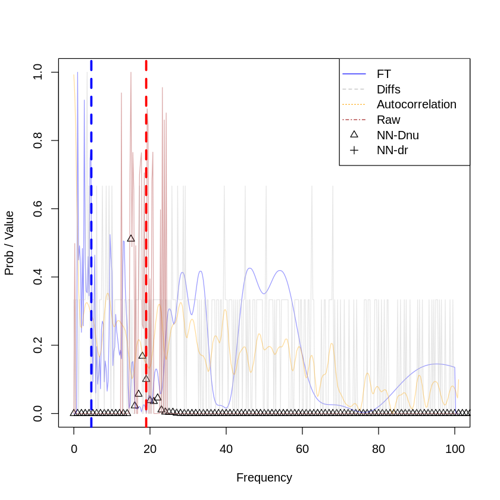


## KIC10080943.lis


```R
d <- read.csv(paste0(stars_base_dir,"KIC10080943.lis"), sep="", header=F)
head(d)
print(paste0("Nrows: ", dim(d)[1]))
max <- validate_real_star(d, 52, 1.7)
errors <- rbind(errors, data.frame("star"="KIC10080943", 
                                   "NN"=max,
                                   "value"=52,
                                   "error"=52-max, 
                                   "error_percentual"=(abs(52-max)/52)*100, 
                                   "n"=dim(d)[1]))
print(errors)
```


<table>
<thead><tr><th scope=col>V1</th><th scope=col>V2</th></tr></thead>
<tbody>
	<tr><td>13.94759</td><td>1360.9  </td></tr>
	<tr><td> 3.33350</td><td>1321.8  </td></tr>
	<tr><td>15.68333</td><td>1241.7  </td></tr>
	<tr><td>12.45258</td><td> 931.5  </td></tr>
	<tr><td>12.89054</td><td> 758.4  </td></tr>
	<tr><td>17.30504</td><td> 616.1  </td></tr>
</tbody>
</table>


    [1] "Nrows: 321"
    [1] "Max hist diff:1"
    [1] "Mas acutocorre:1"
              star  NN value error error_percentual   n
    1 CID100866999 100    56   -44       -78.571429   8
    2 CID105906206  17    20     3        15.000000 202
    3      HD15082 101    80   -21       -26.250000  71
    4     HD159561  35    38     3         7.894737  40
    5     HD172189  16    19     3        15.789474  50
    6  KIC10080943  17    52    35        67.307692 321


## kic10661783.lis


```R
d <- read.csv(paste0(stars_base_dir,"kic10661783.lis"), sep="", header=F)
head(d)
print(paste0("Nrows: ", dim(d)[1]))
max <- validate_real_star(d, 39, 7)
errors <- rbind(errors, data.frame("star"="kic10661783", 
                                   "NN"=max,
                                   "value"=39,
                                   "error"=39-max, 
                                   "error_percentual"=(abs(39-max)/39)*100, 
                                   "n"=dim(d)[1]))
print(errors)
```


<table>
<thead><tr><th scope=col>V1</th><th scope=col>V2</th></tr></thead>
<tbody>
	<tr><td>28.134</td><td>3.07  </td></tr>
	<tr><td>22.338</td><td>3.56  </td></tr>
	<tr><td>29.383</td><td>2.67  </td></tr>
	<tr><td>25.902</td><td>2.02  </td></tr>
	<tr><td>27.810</td><td>0.91  </td></tr>
	<tr><td>24.407</td><td>2.34  </td></tr>
</tbody>
</table>


    [1] "Nrows: 12"
    [1] "Max hist diff:1"
    [1] "Mas acutocorre:1"
              star  NN value error error_percentual   n
    1 CID100866999 100    56   -44       -78.571429   8
    2 CID105906206  17    20     3        15.000000 202
    3      HD15082 101    80   -21       -26.250000  71
    4     HD159561  35    38     3         7.894737  40
    5     HD172189  16    19     3        15.789474  50
    6  KIC10080943  17    52    35        67.307692 321
    7  kic10661783  95    39   -56       143.589744  12


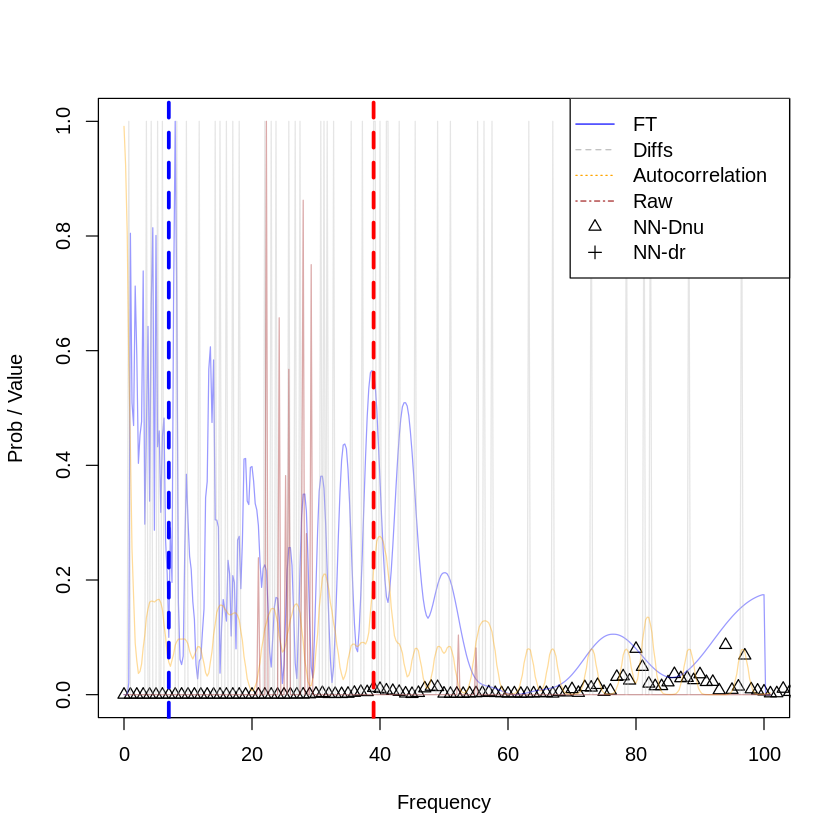


## KIC3858884.lis


```R
d <- read.csv(paste0(stars_base_dir,"KIC3858884.lis"), sep="", header=F)
head(d)
print(paste0("Nrows: ", dim(d)[1]))
max <- validate_real_star(d, 29, 1.9)
errors <- rbind(errors, data.frame("star"="KIC3858884", 
                                   "NN"=max,
                                   "value"=29,
                                   "error"=29-max, 
                                   "error_percentual"=((29-max)/29)*100, 
                                   "n"=dim(d)[1]))
print(errors)
```


<table>
<thead><tr><th scope=col>V1</th><th scope=col>V2</th></tr></thead>
<tbody>
	<tr><td>7.2306</td><td>10.15 </td></tr>
	<tr><td>7.4734</td><td> 9.10 </td></tr>
	<tr><td>9.8376</td><td> 1.96 </td></tr>
	<tr><td>7.5125</td><td> 1.75 </td></tr>
	<tr><td>6.7358</td><td> 1.55 </td></tr>
	<tr><td>9.5191</td><td> 1.24 </td></tr>
</tbody>
</table>


    [1] "Nrows: 400"
    [1] "Max hist diff:1"
    [1] "Mas acutocorre:1"
              star  NN value error error_percentual   n
    1 CID100866999 100    56   -44       -78.571429   8
    2 CID105906206  17    20     3        15.000000 202
    3      HD15082 101    80   -21       -26.250000  71
    4     HD159561  35    38     3         7.894737  40
    5     HD172189  16    19     3        15.789474  50
    6  KIC10080943  17    52    35        67.307692 321
    7  kic10661783  95    39   -56       143.589744  12
    8   KIC3858884  17    29    12        41.379310 400


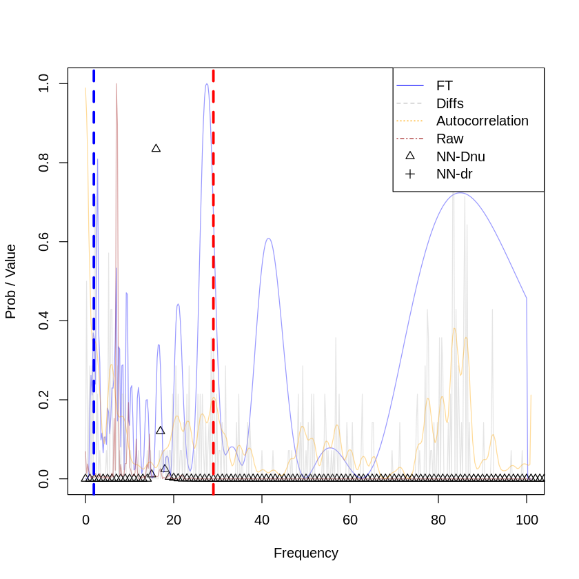


## kic4544587.lis


```R
d <- read.csv(paste0(stars_base_dir,"kic4544587.lis"), sep="", header=F)
head(d)
print(paste0("Nrows: ", dim(d)[1]))
max <- validate_real_star(d, 74, 11)
errors <- rbind(errors, data.frame("star"="kic4544587", 
                                   "NN"=max,
                                   "value"=74,
                                   "error"=74-max, 
                                   "error_percentual"=(abs(74-max)/74)*100, 
                                   "n"=dim(d)[1]))
print(errors)
```


<table>
<thead><tr><th scope=col>V1</th><th scope=col>V2</th></tr></thead>
<tbody>
	<tr><td>48.02231</td><td>0.329   </td></tr>
	<tr><td>41.37020</td><td>0.236   </td></tr>
	<tr><td>44.84695</td><td>0.181   </td></tr>
	<tr><td>46.19662</td><td>0.152   </td></tr>
	<tr><td>48.04449</td><td>0.122   </td></tr>
	<tr><td>39.54280</td><td>0.106   </td></tr>
</tbody>
</table>


    [1] "Nrows: 16"
    [1] "Max hist diff:1"
    [1] "Mas acutocorre:1"
              star  NN value error error_percentual   n
    1 CID100866999 100    56   -44       -78.571429   8
    2 CID105906206  17    20     3        15.000000 202
    3      HD15082 101    80   -21       -26.250000  71
    4     HD159561  35    38     3         7.894737  40
    5     HD172189  16    19     3        15.789474  50
    6  KIC10080943  17    52    35        67.307692 321
    7  kic10661783  95    39   -56       143.589744  12
    8   KIC3858884  17    29    12        41.379310 400
    9   kic4544587  71    74     3         4.054054  16


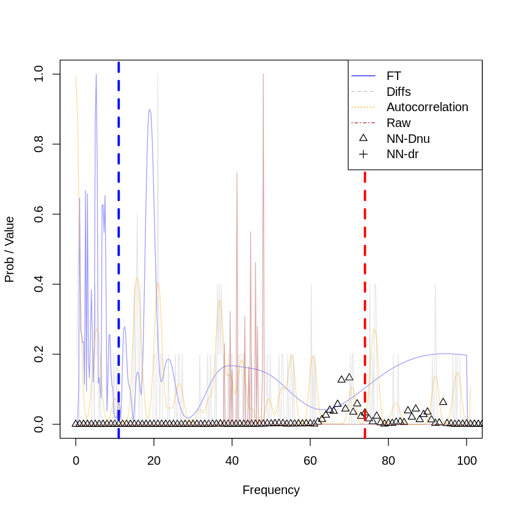


## KIC8262223.lis


```R
d <- read.csv(paste0(stars_base_dir,"KIC8262223.lis"), sep="", header=F)
head(d)
print(paste0("Nrows: ", dim(d)[1]))
max <- validate_real_star(d, 77, 7.2)
errors <- rbind(errors, data.frame("star"="KIC8262223", 
                                   "NN"=max,
                                   "value"=77,
                                   "error"=77-max, 
                                   "error_percentual"=(abs(77-max)/77)*100, 
                                   "n"=dim(d)[1]))
print(errors)
```


<table>
<thead><tr><th scope=col>V1</th><th scope=col>V2</th></tr></thead>
<tbody>
	<tr><td>64.43390</td><td>1.319   </td></tr>
	<tr><td>57.17794</td><td>0.918   </td></tr>
	<tr><td>61.43616</td><td>0.782   </td></tr>
	<tr><td>53.64792</td><td>0.620   </td></tr>
	<tr><td>51.04548</td><td>0.565   </td></tr>
	<tr><td>54.78183</td><td>0.540   </td></tr>
</tbody>
</table>


    [1] "Nrows: 60"


## KIC9851944.lis


```R
d <- read.csv(paste0(stars_base_dir,"KIC9851944.lis"), sep="", header=F)
head(d)
print(paste0("Nrows: ", dim(d)[1]))
max <- validate_real_star(d, 26, 5.3)
errors <- rbind(errors, data.frame("star"="KIC9851944.lis", 
                                   "NN"=max,
                                   "value"=26,
                                   "error"=26-max, 
                                   "error_percentual"=(abs(26-max)/26)*100, 
                                   "n"=dim(d)[1]))
print(errors)
```

## All errors


```R
errors
```


```R
ggplot(aes(y=abs(error), x=1), data=errors) +
    geom_point() +
    geom_text(aes(label=paste0(star,", data=(",n,")")),hjust=-0.5, vjust=0) +
    ggtitle("Dnu Validation on delta scuti stars. Differences between NN and paper results") +
    ylab("Absolute difference = |paper(dnu) - nn(dnu)|") +
    theme_bw()
```


```R
ggplot(aes(y=abs(error), x=n), data=errors) +
    geom_point()  +
     stat_smooth(method="lm", se=F) +
     geom_text(aes(label=paste0(star,", data=(",n,")")),hjust=-0.5, vjust=0) +
     ggtitle("Relation between difference and number of frequencies") +
     ylab("Absolute difference = |paper(dnu) - nn(dnu)|") +
     xlab("Number of frequencies") +
     theme_bw()
```
