```R
library(variableStars)
library(data.table)
library(ggplot2)
library(RColorBrewer)
library(plotly)
library(keras)
library(plotly)
library(abind)
library(fields)
```

    
    Attaching package: 'plotly'
    
    The following object is masked from 'package:ggplot2':
    
        last_plot
    
    The following object is masked from 'package:stats':
    
        filter
    
    The following object is masked from 'package:graphics':
    
        layout
    
    Loading required package: spam
    Loading required package: dotCall64
    Loading required package: grid
    Spam version 2.2-0 (2018-06-19) is loaded.
    Type 'help( Spam)' or 'demo( spam)' for a short introduction 
    and overview of this package.
    Help for individual functions is also obtained by adding the
    suffix '.spam' to the function name, e.g. 'help( chol.spam)'.
    
    Attaching package: 'spam'
    
    The following objects are masked from 'package:base':
    
        backsolve, forwardsolve
    
    Loading required package: maps
    See www.image.ucar.edu/~nychka/Fields for
     a vignette and other supplements. 


### Read processed files and create big matrix with all rows


```R
setwd("~/Downloads/data2/")
system("find . -type f -name \"*.log\" -print0 | xargs -0 cat > ALL.data")
df_all <- data.frame(fread("ALL.data", sep=",", header = F), stringsAsFactors=F)
dim(df_all)
df_all <- df_all[complete.cases(df_all),]
dim(df_all)
```


<ol class=list-inline>
	<li>506823</li>
	<li>1626</li>
</ol>


<ol class=list-inline>
	<li>506557</li>
	<li>1626</li>
</ol>


### Experiment parameters


```R
# Resolution for target frequency [0-100]
input_resolution <- 0.25
output_resolution <- 1.0

# Input dimension
cuts_breaks <- c(-Inf, seq(0, 101, input_resolution), Inf)
input_dim <- length(cuts_breaks) - 1

# Output dimension
num_classes <-
  length(seq(
    from = 0.1,
    to = 14 / 0.0864,
    by = output_resolution
  )) # Buckets of possible classes
```

### Matrix creation from data


```R
rows <- dim(df_all)[1]
cols <- (dim(df_all)[2] - 2) / 4
dimensions <- 4 # Number of channels
X <- array(0, c(rows, cols, dimensions))
# Y train is a 1D matrix with rows and targets
Y <- matrix(0, nrow = rows, ncol = num_classes)
ind_data <- seq(from=1,to=rows)
```


```R
# Reshape dataframe to matrix slices
X[ind_data, , 1] <- as.matrix(df_all[ind_data, 1:406])
X[ind_data, , 2] <- as.matrix(df_all[ind_data, 406:((406 * 2) - 1)])
X[ind_data, , 3] <- as.matrix(df_all[ind_data, (406 * 2):((406 * 3) - 1)])
#X[ind_data, , 4] <- as.matrix(df_all[ind_data, (406 * 3):((406 * 4) - 1)])
X[ind_data, , 4] <- as.matrix(df_all[ind_data, (406 * 3):((406 * 4) - 1)])
Y <- to_categorical(df_all[ind_data, 1626:1626] / 0.0864, num_classes)

dim(X)
dim(Y)
```


<ol class=list-inline>
	<li>506557</li>
	<li>406</li>
	<li>4</li>
</ol>


<ol class=list-inline>
	<li>506557</li>
	<li>162</li>
</ol>


### Check that target is not in the trainind data


```R
print(paste0("Check for target 1:"))
flags <- c()
for (i in seq(from=1,to=rows)){
    flags <- c(flags, df_all[i, 1626:1626] %in% rbind(X[i,,1],X[i,,2],X[i,,3]))
}
print(table(flags))

flags <- c()
print(paste0("Check for target 2:"))
for (i in seq(from=1,to=rows)){
    flags <- c(flags, df_all[i, 1625:1625] %in% rbind(X[i,,1],X[i,,2],X[i,,3]))
}
print(table(flags))
```

    [1] "Check for target 1:"
    flags
     FALSE   TRUE 
    258929      5 
    [1] "Check for target 2:"
    flags
     FALSE   TRUE 
    258711    223 


```R
ind_remove_no_target <- which(apply(Y,1,sum)==1)
paste0("Removing ",length(ind_remove_no_target[ind_remove_no_target==TRUE])," rows with NO target")

X <- X[ind_remove_no_target,,]
Y <- Y[ind_remove_no_target,]

dim(X)
dim(Y)
```


'Removing 1 rows with NO target'


<ol class=list-inline>
	<li>506557</li>
	<li>406</li>
	<li>4</li>
</ol>


<ol class=list-inline>
	<li>506557</li>
	<li>162</li>
</ol>


```R
stopifnot(which(is.na(Y))==FALSE)
stopifnot(which(is.na(X))==FALSE)
```


```R
# Split train/test
smp_size <- floor(0.98 * nrow(X))
set.seed(123)
ind <- sample(seq_len(nrow(X)), size = smp_size)

# Prepare partition
x_train <- X[ind, , ]
x_test  <- X[-ind, , ]
y_train <- Y[ind, ]
y_test  <- Y[-ind, ]
# Check dims
dim(x_train)
dim(y_train)
dim(x_test)
dim(y_test)
```


<ol class=list-inline>
	<li>496425</li>
	<li>406</li>
	<li>4</li>
</ol>


<ol class=list-inline>
	<li>496425</li>
	<li>162</li>
</ol>


<ol class=list-inline>
	<li>10132</li>
	<li>406</li>
	<li>4</li>
</ol>


<ol class=list-inline>
	<li>10132</li>
	<li>162</li>
</ol>


### EDA of data


```R
hist(apply(y_test,1,function(x) which(x==1)))
```


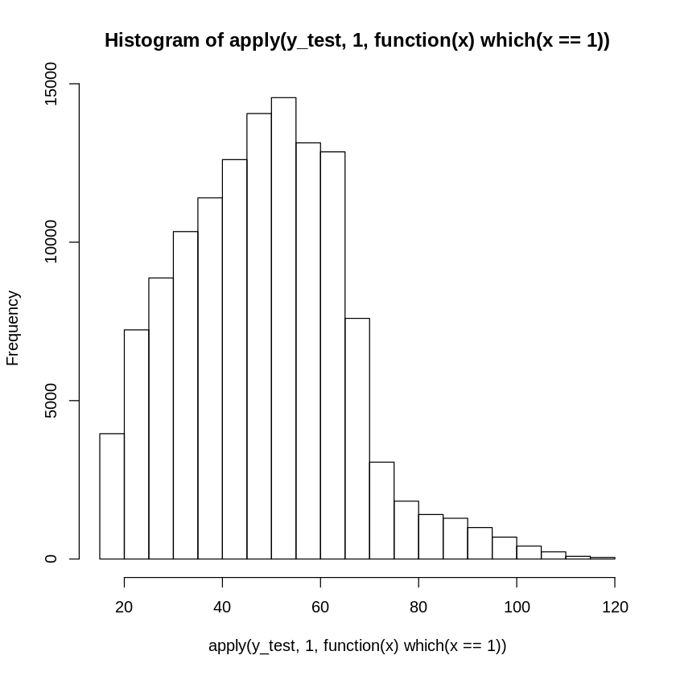


### NN train


```R
top_8_categorical_accuracy <-
  custom_metric("rec_at_8", function(y_true, y_pred) {
    metric_top_k_categorical_accuracy(y_true, y_pred, 8)
  })
top_6_categorical_accuracy <-
  custom_metric("recat_6", function(y_true, y_pred) {
    metric_top_k_categorical_accuracy(y_true, y_pred, 6)
  })
top_4_categorical_accuracy <-
  custom_metric("rec_at_4", function(y_true, y_pred) {
    metric_top_k_categorical_accuracy(y_true, y_pred, 4)
  })
top_2_categorical_accuracy <-
  custom_metric("rec_at_2", function(y_true, y_pred) {
    metric_top_k_categorical_accuracy(y_true, y_pred, 2)
  })
```


```R
checkpoint_dir <- "~/Downloads/test/"
if (T) {
    unlink(checkpoint_dir, recursive = TRUE)
    dir.create(checkpoint_dir)
    filepath <- file.path(checkpoint_dir, "weights.{epoch:02d}-{val_loss:.2f}.hdf5")


# Create checkpoint callback
cp_callback <- callback_model_checkpoint(
  filepath = filepath,
  save_weights_only = TRUE,
  period = 5,
  verbose = 1
)
}
    

# Create a 1d convolutional NN
model <- keras_model_sequential() %>%
  layer_separable_conv_1d(
    kernel_size = 4,
    filters = 8,
    depth_multiplier = 10,
    input_shape = c(406, 4)
  ) %>%
  layer_max_pooling_1d(pool_size = 2) %>%
  layer_dropout(0.2) %>%
  layer_batch_normalization() %>%
layer_separable_conv_1d(
    kernel_size = 2,
    filters = 4,
    depth_multiplier = 20
  ) %>%
  layer_max_pooling_1d(pool_size = 4) %>%
  layer_dropout(0.2) %>%
  layer_batch_normalization() %>%

  layer_flatten() %>%
  layer_dense(units = num_classes, activation = 'softmax')


# Configure a model for categorical classification.
model %>% compile(
  loss = "categorical_crossentropy",
  optimizer = optimizer_adadelta(lr = 0.01),
  metrics = c(
          "accuracy",
          top_2_categorical_accuracy,
          top_4_categorical_accuracy,
          top_6_categorical_accuracy,
          top_8_categorical_accuracy
        )
)
summary(model) # Plot summary
```

    ________________________________________________________________________________
    Layer (type)                        Output Shape                    Param #     
    ================================================================================
    separable_conv1d_9 (SeparableConv1D (None, 403, 8)                  488         
    ________________________________________________________________________________
    max_pooling1d_9 (MaxPooling1D)      (None, 201, 8)                  0           
    ________________________________________________________________________________
    dropout_9 (Dropout)                 (None, 201, 8)                  0           
    ________________________________________________________________________________
    batch_normalization_9 (BatchNormali (None, 201, 8)                  32          
    ________________________________________________________________________________
    separable_conv1d_10 (SeparableConv1 (None, 200, 4)                  964         
    ________________________________________________________________________________
    max_pooling1d_10 (MaxPooling1D)     (None, 50, 4)                   0           
    ________________________________________________________________________________
    dropout_10 (Dropout)                (None, 50, 4)                   0           
    ________________________________________________________________________________
    batch_normalization_10 (BatchNormal (None, 50, 4)                   16          
    ________________________________________________________________________________
    flatten_5 (Flatten)                 (None, 200)                     0           
    ________________________________________________________________________________
    dense_5 (Dense)                     (None, 162)                     32562       
    ================================================================================
    Total params: 34,062
    Trainable params: 34,038
    Non-trainable params: 24
    ________________________________________________________________________________


```R
if (T) {
# Fit model
  history <- model %>% fit(
    x_train,
    y_train,
    epochs = 700,
    batch_size =  250,
    validation_split = 0.1,
    shuffle = T,
    verbose = 2,
    callbacks = list(cp_callback) 
  )
}
```


```R
#model %>% load_model_weights_hdf5(
#  file.path("~/Downloads/checkpointsDnuData2/weights.390-2.26.hdf5")
#)
evaluate(model, x_test, y_test)
# evaluate on delta scuti stars
load("../../docs/GPU/X_scuti.rda")
load("../../docs/GPU/Y_scuti.rda")
evaluate(model, X_scuti, Y_scuti)
```


<dl>
	<dt>$loss</dt>
		<dd>2.4871075745397</dd>
	<dt>$acc</dt>
		<dd>0.200355309910669</dd>
	<dt>$rec_at_2</dt>
		<dd>0.356395578365574</dd>
	<dt>$rec_at_4</dt>
		<dd>0.573332017382472</dd>
	<dt>$recat_6</dt>
		<dd>0.715455981073669</dd>
	<dt>$rec_at_8</dt>
		<dd>0.817508882700667</dd>
</dl>


<dl>
	<dt>$loss</dt>
		<dd>0</dd>
	<dt>$acc</dt>
		<dd>0</dd>
	<dt>$rec_at_2</dt>
		<dd>0.0909090936183929</dd>
	<dt>$rec_at_4</dt>
		<dd>0.0909090936183929</dd>
	<dt>$recat_6</dt>
		<dd>0.0909090936183929</dd>
	<dt>$rec_at_8</dt>
		<dd>0.0909090936183929</dd>
</dl>


```R
plot(history) +
  theme_bw()
```

### Confusion matrix


```R
Y_test_hat <- predict_classes(model, x_test)
# Calculate confusion matrix
cm <- table(apply(y_test,1,which.max), Y_test_hat)
# Plot matrix
dtCM <- as.data.frame(cm)
colnames(dtCM) <- c("c1","c2","freq")
dtCM$c1 <- as.numeric(dtCM$c1)
dtCM$c2 <- as.numeric(dtCM$c2)
dtCM$freq <- as.numeric(dtCM$freq)
dim(dtCM)
```


<ol class=list-inline>
	<li>9464</li>
	<li>3</li>
</ol>


```R
ggplot(data=dtCM, aes(c1, c2, fill = freq)) +
  geom_tile() +
  scale_fill_gradientn(colours=c("#0000FFFF","#FFFFFFFF","#FF0000FF"))+
  theme(axis.text.x = element_text(angle = 90, hjust = 1)) +
  #scale_fill_gradient(breaks=seq(from=-.5, to=4, by=.2))
  scale_x_discrete(breaks=seq(from=0,to=120,by=4), limits=seq(0,120)) +
  scale_y_discrete(breaks=seq(from=0,to=120,by=4), limits=seq(0,120)) 
```


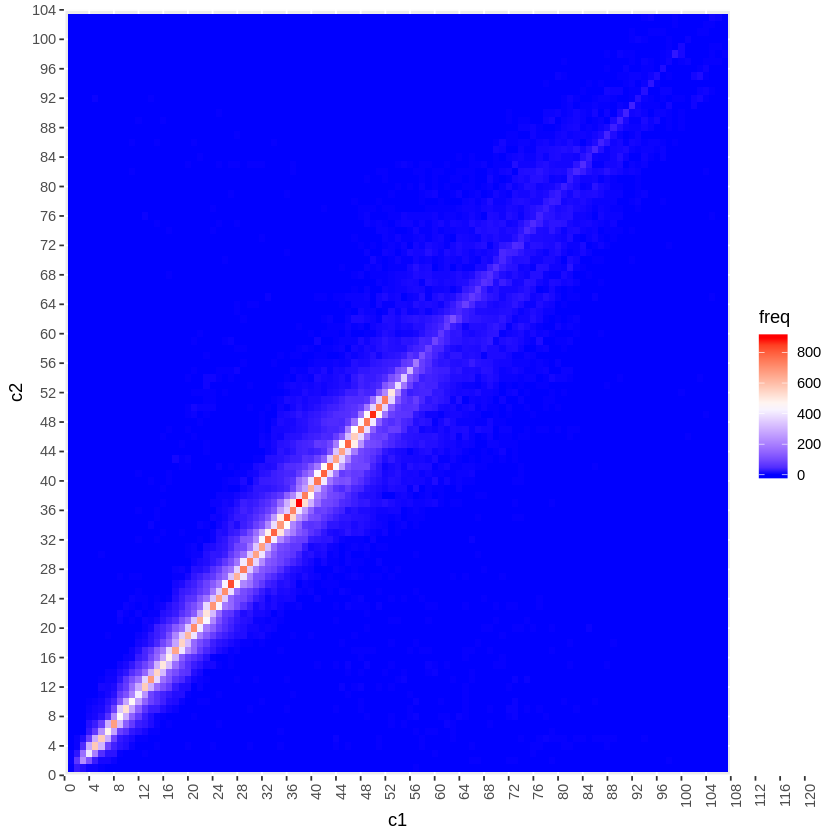


### MSE error acc_at_1


```R
# Output dimension
classes <- seq(
    from = 0.1,
    to = 14 / 0.0864,
    by = output_resolution
  )


hist(((classes[Y_test_hat]) - (classes[apply(y_test,1,function(x) which(x==1))])), breaks=100)
```


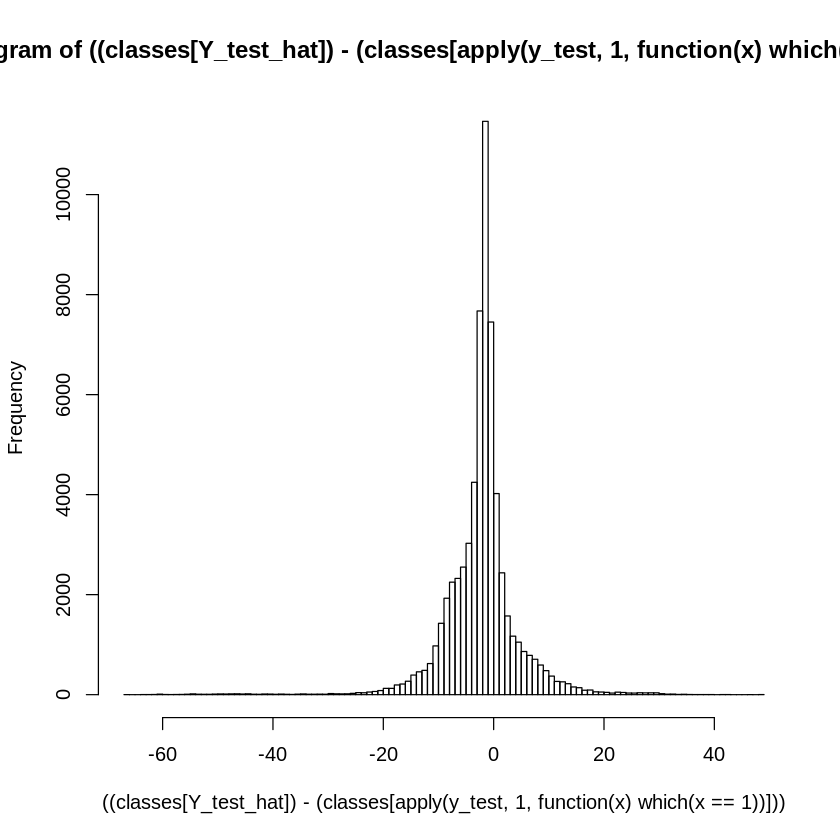


```R
select_test <- 2930

y_hats <- predict(model, x_test)

plot(
  y_hats[select_test,],
  lty = 1,
  ylim = c(0, 1),
  xlim = c(0, 120),
  col = "black",
  xlab = "Frequency",
  ylab = "Prob / Value"
)


lines(x_test[select_test, , 1], lty = 1, col = "blue")
lines(x_test[select_test, , 2], lty = 2, col = "grey")
lines(x_test[select_test, , 3], lty = 3, col = "orange")


abline(
  v = which(y_test[select_test, ]==1)[1],
  col = "red",
  lwd = 3,
  lty = 2
)

abline(
  v = which(y_test[select_test, ]==1)[2],
  col = "red",
  lwd = 3,
  lty = 2
)

legend(
  "topright",
  c("FT", "Diffs", "Autocorrelation"),
  lty = c(1, 2, 3, 4),
  col = c("blue", "grey", "orange")
)
```


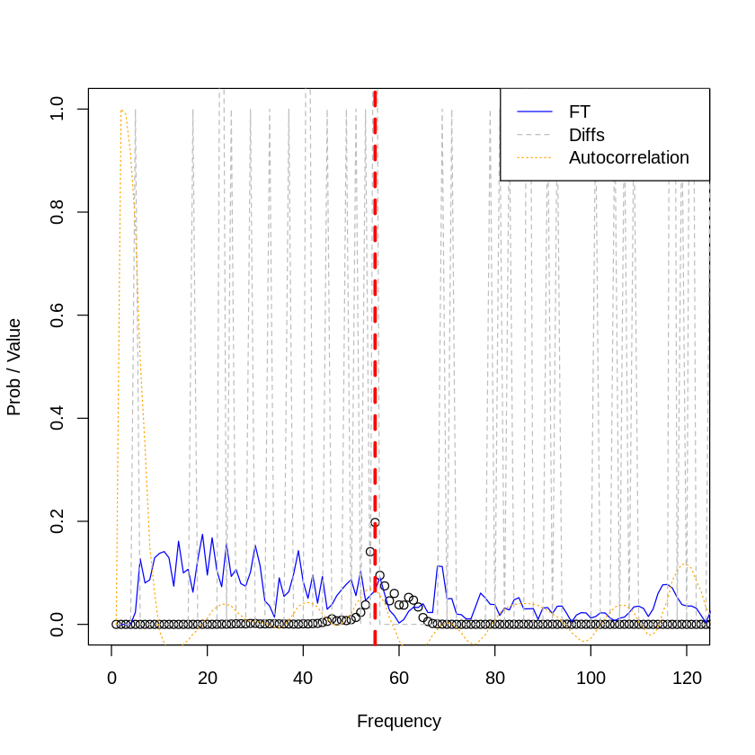


### Auxiliar functions for Validation on $\delta$-scuti stars


```R
trunc <-
    function(x, ..., prec = 1)
      base::trunc(x * 10 ^ prec, ...) / 10 ^ prec
  
  
  flat <- function(x) {
    return(paste0(trunc(c(x), prec = 4), collapse = ","))
  }

normalized <- function(x) {
        (x - min(x)) / (max(x) - min(x))
      }

validate_real_star <- function(data, real_dnu, numFrequencies=30) {


  # Execute experiment
  result <- process(
    frequency = data$V1,
    amplitude = data$V2,
    filter = "uniform",
    gRegimen = 0,
    maxDnu = 1,
    minDnu = 15,
    numFrequencies = numFrequencies,
    dnuGuessError = -1,
    debug = F,
    processFirstRangeOnly = numFrequencies
  )
  
  
    # Save ft of diffs
  ftS <-
    stats.bin(as.numeric(result$fresAmps[[names(result$fresAmps)[1]]]$fInv),
              as.numeric(result$fresAmps[[names(result$fresAmps)[1]]]$b),
              breaks = cuts_breaks)$stats
  ft_1D <- ftS[8, 1:(length(cuts_breaks) - 1)]
  ft_1D[is.na(ft_1D)] <- 0

    diffS <-
      stats.bin(
        as.numeric(result$diffHistogram$histogram$bins),
        as.numeric(result$diffHistogram$histogram$values),
        breaks = cuts_breaks
      )$stats
    diff_2D <- diffS[8, 1:(length(cuts_breaks) - 1)]
    diff_2D[is.na(diff_2D)] <- 0
    
    # Save crosscorrelation
    cross <- stats.bin(
      as.numeric(result$crossCorrelation$index),
      as.numeric(result$crossCorrelation$autocorre),
      breaks = cuts_breaks
    )$stats
    cross_3D <- cross[8, 1:(length(cuts_breaks) - 1)]
    cross_3D[is.na(cross_3D)] <- 0
          
    # Raw information
    rawS <-
      stats.bin(as.numeric(data$V1),
                as.numeric(data$V2),
                breaks = cuts_breaks)$stats
    raw_1D <- rawS[8, 1:(length(cuts_breaks) - 1)]
    raw_1D[is.na(raw_1D)] <- 0
    
    # Assert all dimensions are equal
    stopifnot((length(ft_1D) == length(diff_2D)) ==
                ((length(diff_2D) == length(cross_3D)) ==
                   (
                     length(cross_3D) == length(cuts_breaks) - 1
                   )))
    

  rows <- dim(df_all)[1]
  cols <- (dim(df_all)[2] - 2) / 4
  dimensions <- 4 # Number of channels
  X <- array(0, c(1, cols, 4))
  # Y train is a 1D matrix with rows and targets
  Y <- matrix(0, nrow = 1, ncol = num_classes)
  ind_data <- seq(from = 1, to = rows)
  
  X[1, , 1] <- ft_1D
  X[1, , 2] <- diff_2D
  X[1, , 3] <- cross_3D
  X[1, , 4] <- raw_1D


  plot(
    seq(
    from = 0.1,
    to = 14 / 0.0864,
    by = 1),
    t(predict(modelDnu, X)),
    lty = 1,
    pch = 2,
    ylim = c(0, 1),
    xlim = c(0, 100),
    col = "black",
    xlab = "Frequency",
    ylab = "Prob / Value"
   )
    
  points(
    seq(
    from = 0.1,
    to = 14 / 0.0864,
    by = 1),
    t(predict(modelDr, X)),
    lty = 1,
    pch = 3,
    ylim = c(0, 1),
    xlim = c(0, 100),
    col = "black",
    xlab = "Frequency",
    ylab = "Prob / Value"
   )
  
  lines(cuts_breaks[1:(length(cuts_breaks)-1)], normalized(X[1, , 1]), lty = 1, col = alpha("blue", 0.4))
  lines(cuts_breaks[1:(length(cuts_breaks)-1)], normalized(X[1, , 2]), lty = 1, col = alpha("grey", 0.4))
  lines(cuts_breaks[1:(length(cuts_breaks)-1)], normalized(X[1, , 3]), lty = 1, col = alpha("orange", 0.4))
  lines(cuts_breaks[1:(length(cuts_breaks)-1)], normalized(X[1, , 4]), lty = 1, col = alpha("brown", 0.4))

  abline(
   v = real_dnu,
   col = "red",
   lwd = 3,
   lty = 2
  )
    
  legend(
    "topright",
    c("FT", "Diffs", "Autocorrelation", "Raw", "NN-Dnu", "NN-dr"),
    lty = c(1, 2, 3, 4,NA,NA),
    pch = c(NA,NA,NA,NA,2,3),
    col = c("blue", "grey", "orange", "brown", "black", "black")
  )
    
    return(as.numeric(which.max(t(predict(modelDnu, X)))))
}

```

# Validation on $\delta$-scuti stars


```R
#Read models
# Create a 1d convolutional NN
modelDnu <- keras_model_sequential() %>%
  layer_separable_conv_1d(
    kernel_size = 4,
    filters = 8,
    depth_multiplier = 10,
    input_shape = c(406, 4)
  ) %>%
  layer_max_pooling_1d(pool_size = 2) %>%
  layer_dropout(0.2) %>%
  layer_batch_normalization() %>%
layer_separable_conv_1d(
    kernel_size = 2,
    filters = 4,
    depth_multiplier = 20
  ) %>%
  layer_max_pooling_1d(pool_size = 4) %>%
  layer_dropout(0.2) %>%
  layer_batch_normalization() %>%

  layer_flatten() %>%
  layer_dense(units = num_classes, activation = 'softmax')
# Configure a model for categorical classification.
modelDnu %>% compile(
  loss = "categorical_crossentropy",
  optimizer = optimizer_adadelta(lr = 0.01),
  metrics = c(
          "accuracy",
          top_2_categorical_accuracy,
          top_4_categorical_accuracy,
          top_6_categorical_accuracy,
          top_8_categorical_accuracy
        )
)
modelDnu %>% load_model_weights_hdf5(
  file.path("~/Downloads/test/weights.60-2.50.hdf5")
)


modelDr <- keras_model_sequential() %>%
  layer_separable_conv_1d(
    kernel_size = 4,
    filters = 8,
    depth_multiplier = 10,
    input_shape = c(406, 4)
  ) %>%
  layer_max_pooling_1d(pool_size = 2) %>%
  layer_dropout(0.2) %>%
  layer_batch_normalization() %>%
layer_separable_conv_1d(
    kernel_size = 4,
    filters = 8,
    depth_multiplier = 10
  ) %>%
  layer_max_pooling_1d(pool_size = 2) %>%
  layer_dropout(0.2) %>%
  layer_batch_normalization() %>%
  layer_flatten() %>%
  layer_dense(units = num_classes, activation = 'softmax')
# Configure a model for categorical classification.
modelDr %>% compile(
  loss = "categorical_crossentropy",
  optimizer = optimizer_adadelta(lr = 0.01),
  metrics = c(
          "accuracy",
          top_2_categorical_accuracy,
          top_4_categorical_accuracy,
          top_6_categorical_accuracy,
          top_8_categorical_accuracy
        )
)
modelDr %>% load_model_weights_hdf5(
  file.path("~/Downloads/checkpointsDrData2/weights.80-1.76.hdf5")
)


# Read file stars
stars_base_dir <- "~/Projects/variableStars/data/deltaScuti/"
setwd(stars_base_dir)
for (file in list.files()) {
    print(file)
    #data <- read.csv(file, sep="", header=F)
    #validate_real_star(data)
}
errors <- data.frame(matrix(ncol=3, nrow=0))
colnames(errors) <- c("star", "difference", "n")
#errors
```

    [1] "CID100866999.lis"
    [1] "CID105906206.lis"
    [1] "HD15082.lis"
    [1] "HD159561.lis"
    [1] "HD172189.lis"
    [1] "KIC10080943.lis"
    [1] "kic10661783.lis"
    [1] "KIC3858884.lis"
    [1] "kic4544587.lis"
    [1] "KIC8262223.lis"
    [1] "KIC9851944.lis"


## CID100866999.lis


```R
d <- read.csv(paste0(stars_base_dir,"CID100866999.lis"), sep="", header=F)
head(d)
print(paste0("Nrows: ", dim(d)[1]))
max <- validate_real_star(d, 56)
errors <- rbind(errors, data.frame("star"="CID100866999", "difference"=56-max, "n"=dim(d)[1]))
```


<table>
<thead><tr><th scope=col>V1</th><th scope=col>V2</th></tr></thead>
<tbody>
	<tr><td>16.9803</td><td>11.623 </td></tr>
	<tr><td>16.2530</td><td> 0.508 </td></tr>
	<tr><td>21.8711</td><td> 0.449 </td></tr>
	<tr><td>17.5521</td><td> 0.223 </td></tr>
	<tr><td>21.6053</td><td> 0.167 </td></tr>
	<tr><td>17.5674</td><td> 0.151 </td></tr>
</tbody>
</table>


    [1] "Nrows: 8"


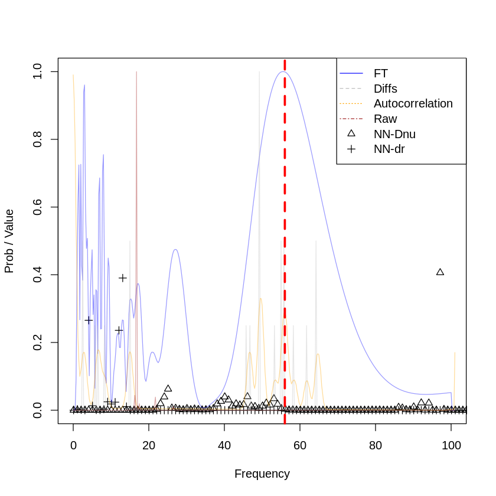


## CID105906206.lis


```R
d <- read.csv(paste0(stars_base_dir,"CID105906206.lis"), sep="", header=F)
head(d)
print(paste0("Nrows: ", dim(d)[1]))
max <- validate_real_star(d, 20)
errors <- rbind(errors, data.frame("star"="CID105906206", "difference"=20-max, "n"=dim(d)[1]))
```


<table>
<thead><tr><th scope=col>V1</th><th scope=col>V2</th></tr></thead>
<tbody>
	<tr><td> 9.4175</td><td>2.552  </td></tr>
	<tr><td> 9.0696</td><td>2.296  </td></tr>
	<tr><td>10.7776</td><td>2.150  </td></tr>
	<tr><td> 5.6119</td><td>1.160  </td></tr>
	<tr><td> 8.9203</td><td>0.906  </td></tr>
	<tr><td> 0.1192</td><td>0.880  </td></tr>
</tbody>
</table>


    [1] "Nrows: 202"


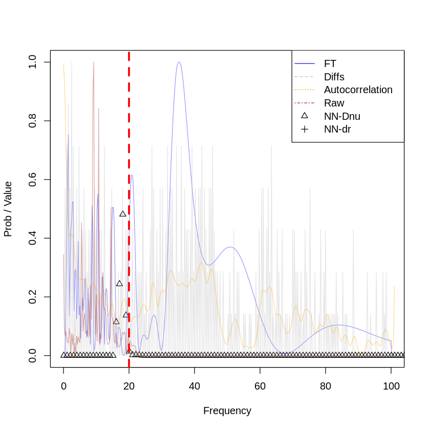


## HD15082.lis


```R
d <- read.csv(paste0(stars_base_dir,"HD15082.lis"), sep="", header=F)
head(d)
print(paste0("Nrows: ", dim(d)[1]))
max <- validate_real_star(d, 80, 30)
errors <- rbind(errors, data.frame("star"="HD15082", "difference"=80-max, "n"=dim(d)[1]))
```


<table>
<thead><tr><th scope=col>V1</th><th scope=col>V2</th></tr></thead>
<tbody>
	<tr><td>20.163899 </td><td>0.05826439</td></tr>
	<tr><td> 9.842703 </td><td>0.05056994</td></tr>
	<tr><td>21.064683 </td><td>0.04185181</td></tr>
	<tr><td> 1.901497 </td><td>0.04169184</td></tr>
	<tr><td>14.207774 </td><td>0.04024543</td></tr>
	<tr><td> 1.028524 </td><td>5.41987344</td></tr>
</tbody>
</table>


    [1] "Nrows: 71"


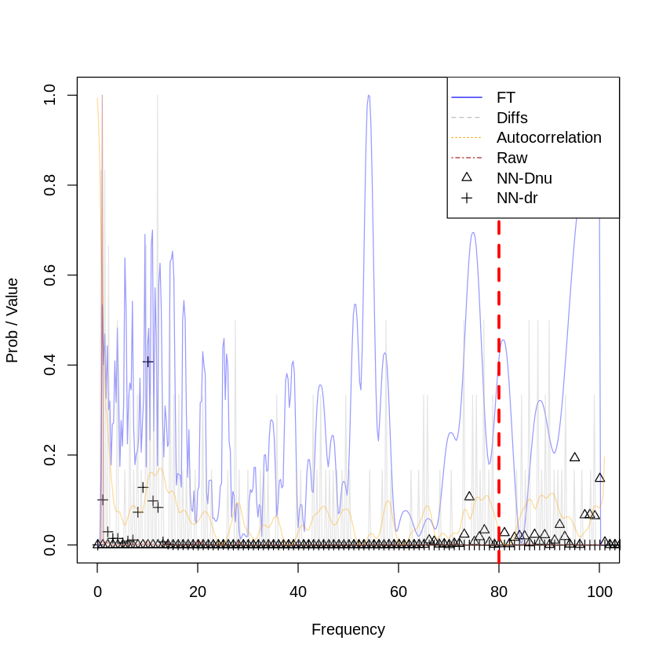


## HD159561.lis


```R
d <- read.csv(paste0(stars_base_dir,"HD159561.lis"), sep="", header=F)
head(d)
print(paste0("Nrows: ", dim(d)[1]))
max <- validate_real_star(d, 38)
errors <- rbind(errors, data.frame("star"="HD159561", "difference"=38-max, "n"=dim(d)[1]))
```


<table>
<thead><tr><th scope=col>V1</th><th scope=col>V2</th></tr></thead>
<tbody>
	<tr><td>10.227</td><td>0.091 </td></tr>
	<tr><td>10.469</td><td>0.104 </td></tr>
	<tr><td>10.619</td><td>0.243 </td></tr>
	<tr><td>11.720</td><td>0.405 </td></tr>
	<tr><td>13.096</td><td>0.144 </td></tr>
	<tr><td>16.124</td><td>0.349 </td></tr>
</tbody>
</table>


    [1] "Nrows: 40"


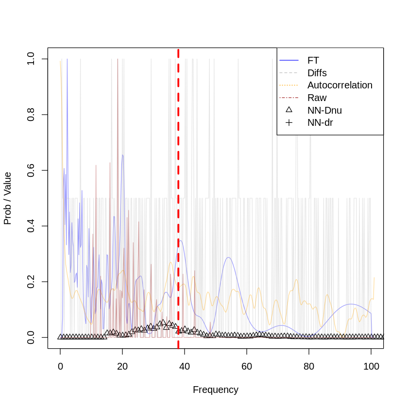


## HD172189.lis


```R
d <- read.csv(paste0(stars_base_dir,"HD172189.lis"), sep="", header=F)
head(d)
print(paste0("Nrows: ", dim(d)[1]))


max <- validate_real_star(d, 19)
errors <- rbind(errors, data.frame("star"="HD172189", "difference"=19-max, "n"=dim(d)[1]))
```


<table>
<thead><tr><th scope=col>V1</th><th scope=col>V2</th></tr></thead>
<tbody>
	<tr><td>19.58317    </td><td>4.513889e-05</td></tr>
	<tr><td>17.32212    </td><td>7.523148e-05</td></tr>
	<tr><td>17.94392    </td><td>7.754630e-05</td></tr>
	<tr><td>17.84847    </td><td>7.986111e-05</td></tr>
	<tr><td>19.47873    </td><td>8.333333e-05</td></tr>
	<tr><td>18.02352    </td><td>1.053241e-04</td></tr>
</tbody>
</table>


    [1] "Nrows: 50"


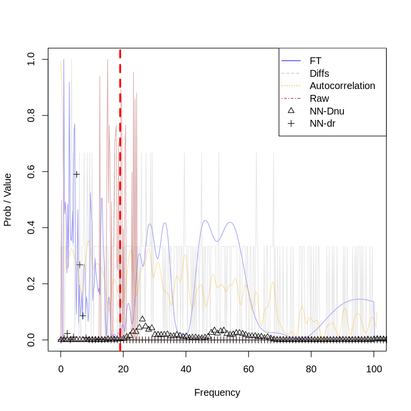


## KIC10080943.lis


```R
d <- read.csv(paste0(stars_base_dir,"KIC10080943.lis"), sep="", header=F)
head(d)
print(paste0("Nrows: ", dim(d)[1]))
max <- validate_real_star(d, 52, 200)
errors <- rbind(errors, data.frame("star"="KIC10080943", "difference"=52-max, "n"=dim(d)[1]))
```


<table>
<thead><tr><th scope=col>V1</th><th scope=col>V2</th></tr></thead>
<tbody>
	<tr><td>13.94759</td><td>1360.9  </td></tr>
	<tr><td> 3.33350</td><td>1321.8  </td></tr>
	<tr><td>15.68333</td><td>1241.7  </td></tr>
	<tr><td>12.45258</td><td> 931.5  </td></tr>
	<tr><td>12.89054</td><td> 758.4  </td></tr>
	<tr><td>17.30504</td><td> 616.1  </td></tr>
</tbody>
</table>


    [1] "Nrows: 321"


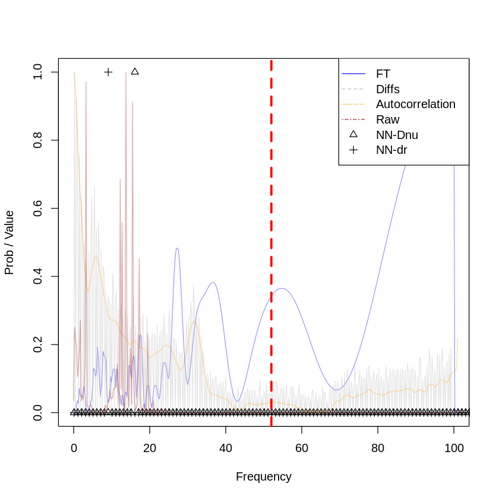


## kic10661783.lis


```R
d <- read.csv(paste0(stars_base_dir,"kic10661783.lis"), sep="", header=F)
head(d)
print(paste0("Nrows: ", dim(d)[1]))
max <- validate_real_star(d, 39, 30)
errors <- rbind(errors, data.frame("star"="kic10661783", "difference"=39-max, "n"=dim(d)[1]))
```


<table>
<thead><tr><th scope=col>V1</th><th scope=col>V2</th></tr></thead>
<tbody>
	<tr><td>28.134</td><td>3.07  </td></tr>
	<tr><td>22.338</td><td>3.56  </td></tr>
	<tr><td>29.383</td><td>2.67  </td></tr>
	<tr><td>25.902</td><td>2.02  </td></tr>
	<tr><td>27.810</td><td>0.91  </td></tr>
	<tr><td>24.407</td><td>2.34  </td></tr>
</tbody>
</table>


    [1] "Nrows: 12"


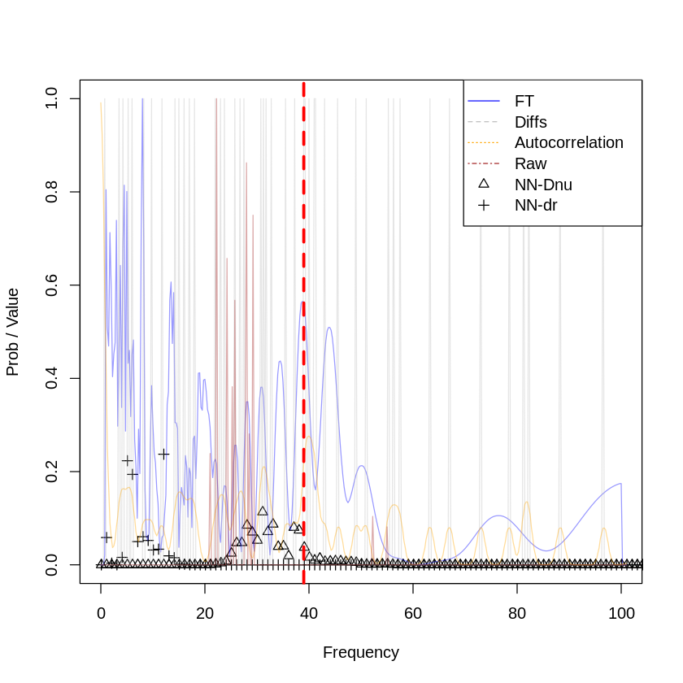


## KIC3858884.lis


```R
d <- read.csv(paste0(stars_base_dir,"KIC3858884.lis"), sep="", header=F)
head(d)
print(paste0("Nrows: ", dim(d)[1]))
max <- validate_real_star(d, 29)
errors <- rbind(errors, data.frame("star"="KIC3858884", "difference"=29-max, "n"=dim(d)[1]))
```


<table>
<thead><tr><th scope=col>V1</th><th scope=col>V2</th></tr></thead>
<tbody>
	<tr><td>7.2306</td><td>10.15 </td></tr>
	<tr><td>7.4734</td><td> 9.10 </td></tr>
	<tr><td>9.8376</td><td> 1.96 </td></tr>
	<tr><td>7.5125</td><td> 1.75 </td></tr>
	<tr><td>6.7358</td><td> 1.55 </td></tr>
	<tr><td>9.5191</td><td> 1.24 </td></tr>
</tbody>
</table>


    [1] "Nrows: 400"


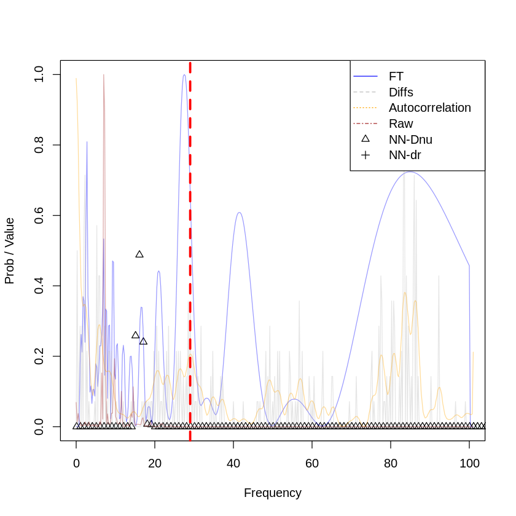


## kic4544587.lis


```R
d <- read.csv(paste0(stars_base_dir,"kic4544587.lis"), sep="", header=F)
head(d)
print(paste0("Nrows: ", dim(d)[1]))
max <- validate_real_star(d, 74)
errors <- rbind(errors, data.frame("star"="kic4544587", "difference"=74-max, "n"=dim(d)[1]))
```


<table>
<thead><tr><th scope=col>V1</th><th scope=col>V2</th></tr></thead>
<tbody>
	<tr><td>48.02231</td><td>0.329   </td></tr>
	<tr><td>41.37020</td><td>0.236   </td></tr>
	<tr><td>44.84695</td><td>0.181   </td></tr>
	<tr><td>46.19662</td><td>0.152   </td></tr>
	<tr><td>48.04449</td><td>0.122   </td></tr>
	<tr><td>39.54280</td><td>0.106   </td></tr>
</tbody>
</table>


    [1] "Nrows: 16"


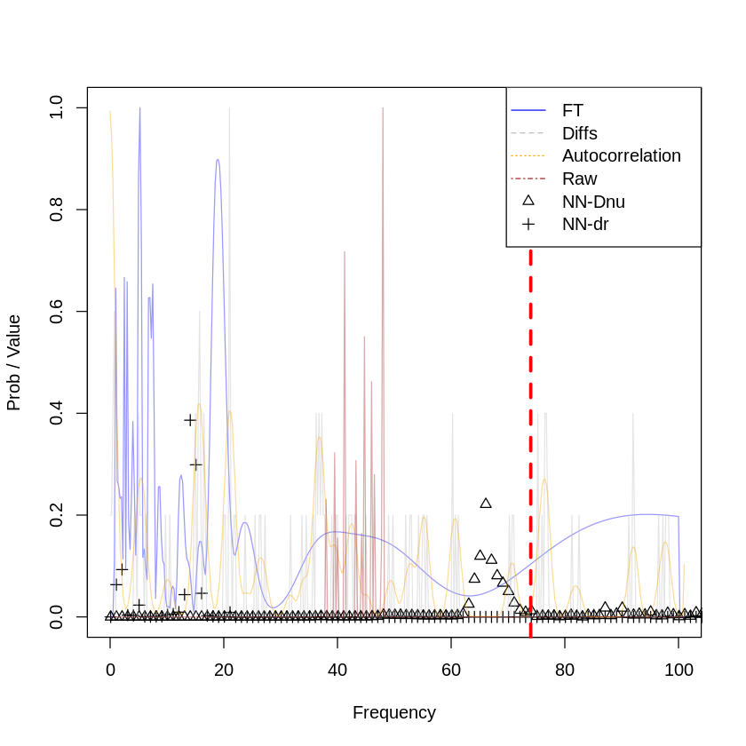


## KIC8262223.lis


```R
d <- read.csv(paste0(stars_base_dir,"KIC8262223.lis"), sep="", header=F)
head(d)
print(paste0("Nrows: ", dim(d)[1]))
max <- validate_real_star(d, 77)
errors <- rbind(errors, data.frame("star"="KIC8262223", "difference"=77-max, "n"=dim(d)[1]))
```


<table>
<thead><tr><th scope=col>V1</th><th scope=col>V2</th></tr></thead>
<tbody>
	<tr><td>64.43390</td><td>1.319   </td></tr>
	<tr><td>57.17794</td><td>0.918   </td></tr>
	<tr><td>61.43616</td><td>0.782   </td></tr>
	<tr><td>53.64792</td><td>0.620   </td></tr>
	<tr><td>51.04548</td><td>0.565   </td></tr>
	<tr><td>54.78183</td><td>0.540   </td></tr>
</tbody>
</table>


    [1] "Nrows: 60"


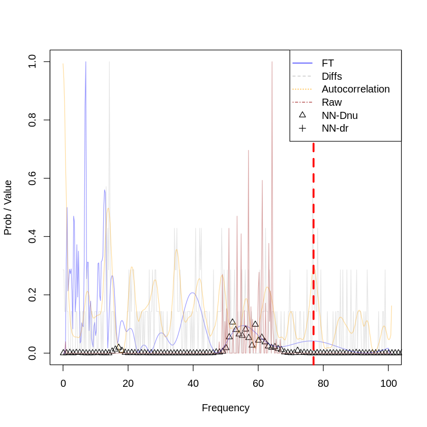


## KIC9851944.lis


```R
d <- read.csv(paste0(stars_base_dir,"KIC9851944.lis"), sep="", header=F)
head(d)
print(paste0("Nrows: ", dim(d)[1]))
max <- validate_real_star(d, 26, 30)
errors <- rbind(errors, data.frame("star"="KIC9851944", "difference"=26-max, "n"=dim(d)[1]))
```


<table>
<thead><tr><th scope=col>V1</th><th scope=col>V2</th></tr></thead>
<tbody>
	<tr><td>10.399692</td><td>0.6530   </td></tr>
	<tr><td>10.176019</td><td>0.5480   </td></tr>
	<tr><td>11.890476</td><td>0.4540   </td></tr>
	<tr><td> 5.097099</td><td>0.4046   </td></tr>
	<tr><td>11.018543</td><td>0.2290   </td></tr>
	<tr><td>12.814916</td><td>0.2232   </td></tr>
</tbody>
</table>


    [1] "Nrows: 52"


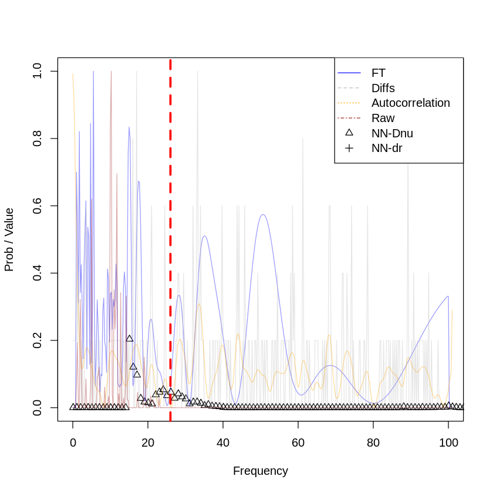


## All errors


```R
errors
mean(errors$difference)
mean((errors$difference)^2)
```


<table>
<thead><tr><th scope=col>star</th><th scope=col>difference</th><th scope=col>n</th></tr></thead>
<tbody>
	<tr><td>CID100866999</td><td>-42         </td><td>  8         </td></tr>
	<tr><td>CID105906206</td><td>  3         </td><td>202         </td></tr>
	<tr><td>HD15082     </td><td>-16         </td><td> 71         </td></tr>
	<tr><td>HD172189    </td><td> -8         </td><td> 50         </td></tr>
	<tr><td>KIC10080943 </td><td> 35         </td><td>321         </td></tr>
	<tr><td>kic10661783 </td><td>  7         </td><td> 12         </td></tr>
	<tr><td>KIC3858884  </td><td> 11         </td><td>400         </td></tr>
	<tr><td>kic4544587  </td><td>  7         </td><td> 16         </td></tr>
	<tr><td>KIC8262223  </td><td> 19         </td><td> 60         </td></tr>
	<tr><td>KIC9851944  </td><td> -4         </td><td> 52         </td></tr>
</tbody>
</table>


1.2


391.4


```R
ggplot(aes(y=abs(difference), x=1), data=errors) +
    geom_point() +
    geom_text(aes(label=paste0(star,", data=(",n,")")),hjust=-0.5, vjust=0) +
    ggtitle("Dnu Validation on delta scuti stars. Differences between NN and paper results") +
    ylab("Absolute difference = |paper(dnu) - nn(dnu)|") +
    theme_bw()
```


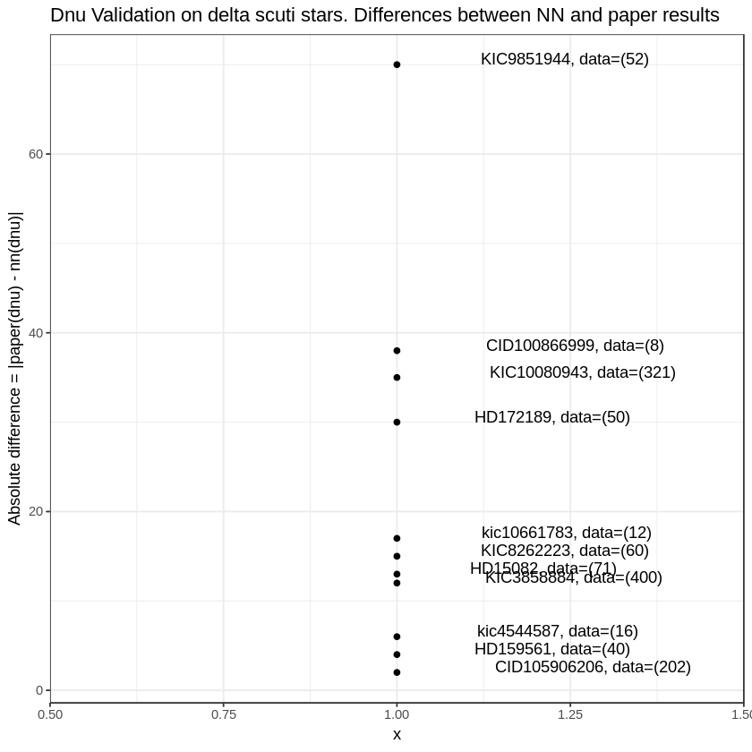


```R
ggplot(aes(y=abs(difference), x=n), data=errors) +
    geom_point()  +
     stat_smooth(method="lm", se=F) +
     geom_text(aes(label=paste0(star,", data=(",n,")")),hjust=-0.5, vjust=0) +
     ggtitle("Relation between difference and number of frequencies") +
     ylab("Absolute difference = |paper(dnu) - nn(dnu)|") +
     xlab("Number of frequencies") +
     theme_bw()
```


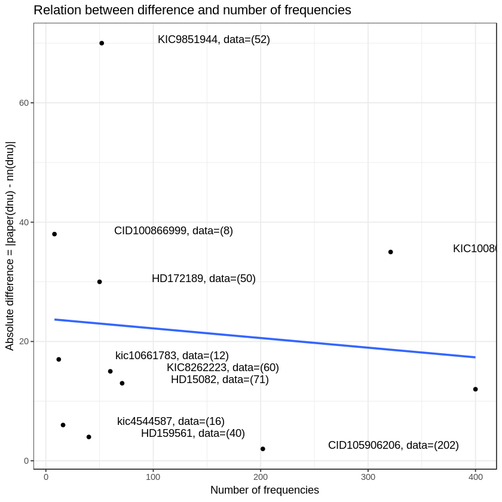

