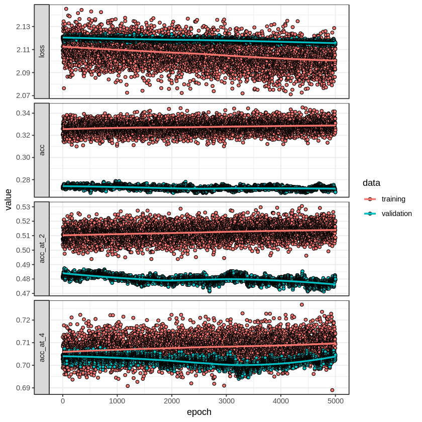
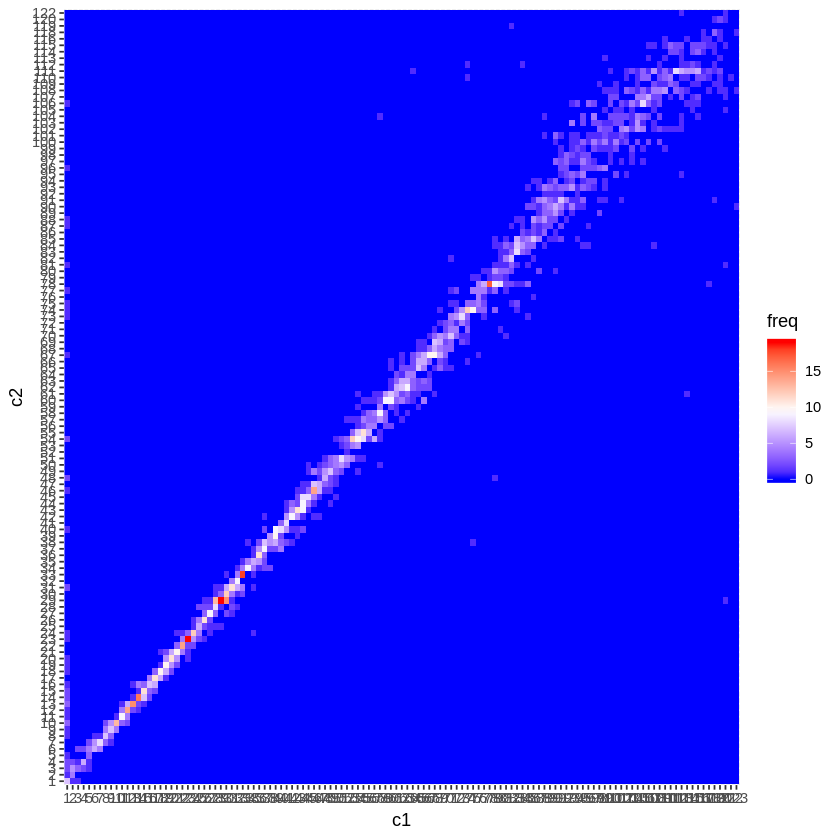
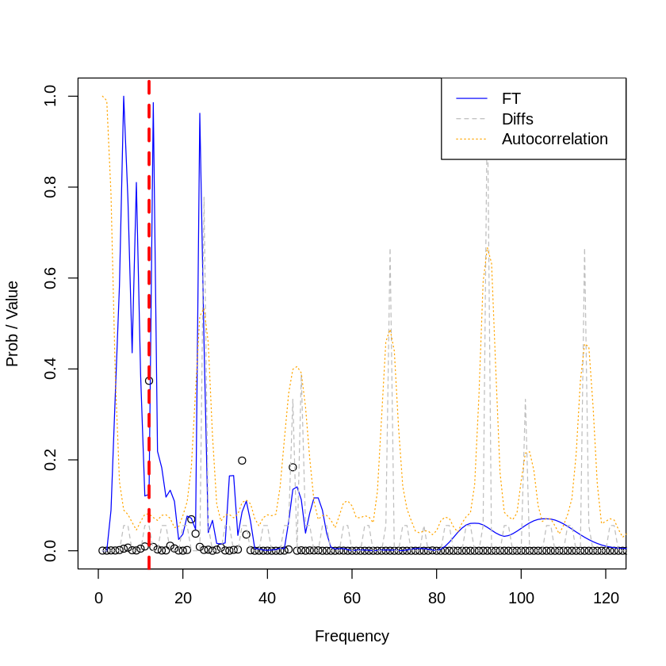
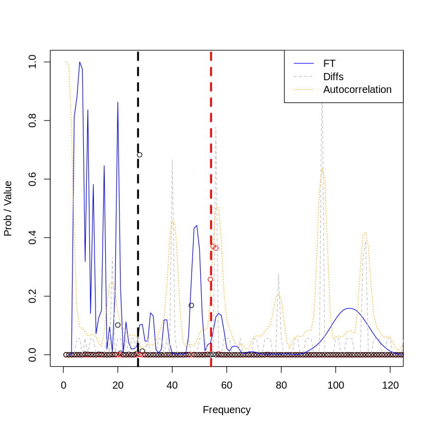

```R
library(variableStars)
library(data.table)
library(ggplot2)
library(RColorBrewer)
library(plotly)
library(keras)
library(plotly)
library(fields)
library(abind)
```

    
    Attaching package: 'plotly'
    
    The following object is masked from 'package:ggplot2':
    
        last_plot
    
    The following object is masked from 'package:stats':
    
        filter
    
    The following object is masked from 'package:graphics':
    
        layout
    
    Loading required package: spam
    Loading required package: dotCall64
    Loading required package: grid
    Spam version 2.2-0 (2018-06-19) is loaded.
    Type 'help( Spam)' or 'demo( spam)' for a short introduction 
    and overview of this package.
    Help for individual functions is also obtained by adding the
    suffix '.spam' to the function name, e.g. 'help( chol.spam)'.
    
    Attaching package: 'spam'
    
    The following objects are masked from 'package:base':
    
        backsolve, forwardsolve
    
    Loading required package: maps
    See www.image.ucar.edu/~nychka/Fields for
     a vignette and other supplements. 


## Global paramters


```R
# Number of rows per batch training
experiment_number <- 10000
# Resolution for target frequency [0-100]
resolution <- 0.5

# Input dimension
cuts_breaks <- c(-Inf, seq(0, 101, resolution), Inf)
input_dim <- length(cuts_breaks) - 1

# Output dimension
num_classes <-
  length(seq(
    from = 0.1,
    to = 14 / 0.0864,
    by = 1
  )) # Buckets of possible classes

normalized <- function(x) {
        (x - min(x)) / (max(x) - min(x))
      }
```

## Auxiliar functions


```R
trunc <-
  function(x, ..., prec = 1)
    base::trunc(x * 10 ^ prec, ...) / 10 ^ prec


c_dnu <- function(x) {
    length(which(x == 1)) == 1
  }
  c_dr <- function(x) {
    length(which(x == 2)) == 1
  }
  c_over <- function(x) {
    length(which(x == 3)) == 1
  }
```

## Architecture


```R
# Create a 1d convolutional NN
model <- keras_model_sequential() %>%
  layer_separable_conv_1d(kernel_size=10,
                          filters=5,
                          depth_multiplier=10,
                          input_shape=c(204,3)) %>%
  #layer_max_pooling_2d(pool_size = c(1,1)) %>%
  layer_dropout(0.2) %>%
  layer_batch_normalization() %>%

  layer_separable_conv_1d(kernel_size=10,
                          filters=5,
                          depth_multiplier=10,
                          input_shape=c(204,3)) %>%
  #layer_max_pooling_2d(pool_size = c(1,1)) %>%
  layer_dropout(0.5) %>%
  layer_batch_normalization() %>%

  layer_flatten() %>%
  layer_dense(units=num_classes, activation='softmax')


# Configure a model for categorical classification.
model %>% compile(
  loss = "categorical_crossentropy",
  optimizer = optimizer_adadelta(lr = 0.01),
  metrics = c("accuracy")
)
summary(model) # Plot summary
```

    ________________________________________________________________________________
    Layer (type)                        Output Shape                    Param #     
    ================================================================================
    separable_conv1d_1 (SeparableConv1D (None, 195, 5)                  455         
    ________________________________________________________________________________
    dropout_1 (Dropout)                 (None, 195, 5)                  0           
    ________________________________________________________________________________
    batch_normalization_1 (BatchNormali (None, 195, 5)                  20          
    ________________________________________________________________________________
    separable_conv1d_2 (SeparableConv1D (None, 186, 5)                  755         
    ________________________________________________________________________________
    dropout_2 (Dropout)                 (None, 186, 5)                  0           
    ________________________________________________________________________________
    batch_normalization_2 (BatchNormali (None, 186, 5)                  20          
    ________________________________________________________________________________
    flatten_1 (Flatten)                 (None, 930)                     0           
    ________________________________________________________________________________
    dense_1 (Dense)                     (None, 162)                     150822      
    ================================================================================
    Total params: 152,072
    Trainable params: 152,052
    Non-trainable params: 20
    ________________________________________________________________________________


### Data generation of frecuency modes


```R
generate_data_modes <- function(deltaNu, nuRange, deltaR, numPoints) {
  # DS to return data
  df <- data.frame()
  # Range for data generation
  range <- c(nuRange[1] * deltaNu, nuRange[2] * deltaNu)
  
  # L0 distance from origin
  range_dl0 <- c(0, 10)
  
  # Avoid negative ranges
  dl0 <- round(runif(1, range_dl0[1], range_dl0[2]), 2)
  while (range[2] - (range[1] + dl0)<0) {
    dl0 <- round(runif(1, range_dl0[1], range_dl0[2]), 2)
  }
  # Vector generation
  l0 <- seq(
    from = range[1] + dl0,
    to = range[2],
    by = (range[2] - (range[1] + dl0)) / numPoints
  )[1:numPoints]
  # Append data
  df <-
    rbind(df, data.frame(
      "frequency" = l0,
      "mode" = "l0",
      "amplitude" = 1
    ))
  
  
  # L1 distance from origin
  dl1 <-
    round(runif(1, 0, l0[2] - l0[1]), 2) # Rand betwee first and second L2
  # Vector generation
  l1 <- seq(
    from = l0[1] + dl1,
    to = range[2],
    by = (range[2] - (l0[1] + dl1)) / numPoints
  )[1:numPoints]
  
  # Append data
  df <-
    rbind(df,
          data.frame(
            "frequency" = l1,
            "mode" = "l1",
            "amplitude" = 0.8
          ))
  
  
  # M-1, M1 distance from l1
  dr <- round(runif(1, 0, deltaNu), 2)
  
  mp1 <- l1 + dr
  ml1 <- l1 - dr
  
  # Append data
  df <-
    rbind(df,
          data.frame(
            "frequency" = mp1,
            "mode" = "mp1",
            "amplitude" = 0.75
          ))
  df <-
    rbind(df,
          data.frame(
            "frequency" = ml1,
            "mode" = "ml1",
            "amplitude" = 0.75
          ))
  
  stopifnot(length(l0) == numPoints) # Length assert for L0
  stopifnot(length(l1) == numPoints) # Length assert for L0
  stopifnot(length(mp1) == numPoints) # Length assert for L0
  stopifnot(length(ml1) == numPoints) # Length assert for L0
  
  return(list(
    "data" = df,
    "dl0" = dl0,
    "dl1" = dl1,
    "dr" = dr / 0.0864,
    "dnu" = (df[2,]$frequency-df[1,]$frequency ) / 0.0864
  ))
}
```

### Random experiment generation


```R
flag = T

for (i in seq(from=1,10)) {
  if (flag) {
    # Save to disk
    load(file = paste("~/Downloads/x_train", i, ".RData", sep = ""))
    load(file = paste("~/Downloads/x_test", i, ".RData", sep = ""))
    load(file = paste("~/Downloads/y_train", i, ".RData", sep = ""))
    load(file = paste("~/Downloads/y_test", i, ".RData", sep = ""))
    
    # Variables name
    assign("x_train", get(paste("x_train", i, sep = "")))
    assign("x_test", get(paste("x_test", i, sep = "")))
    assign("y_train", get(paste("y_train", i, sep = "")))
    assign("y_test", get(paste("y_test", i, sep = "")))
          
      
  } else {
    # Matrix to save genereated data
    #m_xtrain <- matrix(nrow = experiment_number + 1, ncol = input_dim, dim=c(1,3))
    #m_ytrain <- matrix(nrow = experiment_number + 1, ncol = num_classes)
    
    # 2D dimensional array for X train
    rows <- experiment_number + 1
    cols <- input_dim
    dimensions <- 3 # Number of channels
    m_xtrain <- array(0, c(rows, cols, dimensions))
    # Y train is a 1D matrix with rows and targets
    m_ytrain <- matrix(nrow = rows, ncol = num_classes)
    
    # Loop generating data
    count <- 1
    for (experiment in seq(1:(experiment_number + 1))) {
      # Select experiment parameters
      dnu <- trunc(runif(1, 1, 10), prec = 4)
      dr <- trunc(runif(1, 0, dnu), prec = 4)
      # Debug info with experiment configuration
      if (count %% 250 == 0) {
        print(paste("Experiment:",
                    count,
                    " | dnu:",
                    dnu,
                    " | dr:",
                    dr,
                    sep = ""))
      }
      
      # Data generation
      dt <- generate_data_modes(
        deltaNu = dnu,
        deltaR = dr,
        nuRange = c(2.5, 10),
        numPoints = 7
      )
      # Execute experiment
      result <- process(
        frequency = dt$data$frequency,
        amplitude = dt$data$amplitude,
        filter = "uniform",
        gRegimen = 0,
        maxDnu = 1,
        minDnu = 15,
        numFrequencies = ifelse(nrow(dt$data) < 30, 31, nrow(dt) + 1),
        dnuGuessError = -1,
        debug = F
      )
      
      # X data
      # ----------------------
      # Save fourier transform
      ftS <-
        stats.bin(as.numeric(result$fresAmps[[names(result$fresAmps)[1]]]$fInv),
                  as.numeric(result$fresAmps[[names(result$fresAmps)[1]]]$b),
                  breaks = cuts_breaks)$stats
      ft_1D <- ftS[8, 1:(length(cuts_breaks) - 1)]
      ft_1D[is.na(ft_1D)] <- 0
      
      
      # Save histogram of diffs
      diffS <-
        stats.bin(
          as.numeric(result$diffHistogram$histogram$bins),
          as.numeric(result$diffHistogram$histogram$values),
          breaks = cuts_breaks
        )$stats
      diff_2D <- diffS[8, 1:(length(cuts_breaks) - 1)]
      diff_2D[is.na(diff_2D)] <- 0
      
      # Save crosscorrelation
      cross <- stats.bin(
        as.numeric(result$crossCorrelation$index),
        as.numeric(result$crossCorrelation$autocorre),
        breaks = cuts_breaks
      )$stats
      cross_3D <- cross[8, 1:(length(cuts_breaks) - 1)]
      cross_3D[is.na(cross_3D)] <- 0
      
      # Assert all dimensions are equal
      stopifnot((length(ft_1D) == length(diff_2D)) ==
                  ((
                    length(diff_2D) == length(cross_3D)
                  ) ==
                    (
                      length(cross_3D) == length(cuts_breaks) - 1
                    )))
      
      # X data
      m_xtrain[count, , 1] <- normalized(ft_1D)
      m_xtrain[count, , 2] <- normalized(diff_2D)
      m_xtrain[count, , 3] <- normalized(cross_3D)
      
      
      # Y data
      # First pattern [dnu] is coded with "1" in the one-hot encoding
      # Second patter [dr] is coded with "2" in the one-hot encodinf
      m_ytrain[count,] <-
        to_categorical(trunc(dt$dnu, 3), num_classes) + 
        (to_categorical(trunc(dt$dr, 3), num_classes) * 2)
      count <- count + 1
    }
    
    # Split train/test
    smp_size <- floor(0.75 * nrow(m_xtrain))
    set.seed(123)
    ind <- sample(seq_len(nrow(m_xtrain)), size = smp_size)
    
    # Prepare partition
    x_train <- m_xtrain[ind, , ]
    x_test  <- m_xtrain[-ind, , ]
    y_train <- m_ytrain[ind, ]
    y_test  <- m_ytrain[-ind, ]
    
    # Save to disk
    v_name_x_train <- paste("x_train", i, sep = "")
    v_name_x_test  <- paste("x_test", i, sep = "")
    v_name_y_train <- paste("y_train", i, sep = "")
    v_name_y_test  <- paste("y_test", i, sep = "")
    # Assign data to new variables names
    assign(v_name_x_train, x_train)
    assign(v_name_x_test, x_test)
    assign(v_name_y_train, y_train)
    assign(v_name_y_test, y_test)
    # Save variables to disk
    save(
      list = v_name_x_train,
      file = paste("~/Downloads/", v_name_x_train, ".RData", sep = "")
    )
    save(
      list = v_name_x_test,
      file =  paste("~/Downloads/", v_name_x_test, ".RData", sep = "")
    )
    save(
      list = v_name_y_train,
      file = paste("~/Downloads/", v_name_y_train, ".RData", sep = "")
    )
    save(
      list = v_name_y_test,
      file =  paste("~/Downloads/", v_name_y_test, ".RData", sep = "")
    )
  }
  
  
  # Check kind of data
  type = "dr"
  
  if (type == "dnu") {
    # Train
    y_train[which(y_train == 2)] <- 0
    y_train[which(y_train == 3)] <- 1
    # Test  
    y_test[which(y_test == 2)] <- 0
    y_test[which(y_test == 3)] <- 0
    
  } else if (type == "dr") {
    # Train
    y_train[which(y_train == 1)] <- 0
    y_train[which(y_train == 2)] <- 1
    y_train[which(y_train == 3)] <- 1
    # Test 
    y_test[which(y_test == 1)] <- 0
    y_test[which(y_test == 2)] <- 1
    y_test[which(y_test == 3)] <- 1
  } else if (type == "both") {
    # Train
    y_train[which(y_train == 1)] <- 1
    y_train[which(y_train == 2)] <- 1
    y_train[which(y_train == 3)] <- 1
    # Test
    y_test[which(y_test == 1)] <- 1
    y_test[which(y_test == 2)] <- 1
    y_test[which(y_test == 3)] <- 1
  } else {
    stop()
  }
  
  # Fit model
  history <- model %>% fit(
    x_train,
    y_train,
    epochs = 2000,
    batch_size =  250,
    validation_split = 0.2,
    shuffle = T,
    verbose = 1
  )
  
  metrics = evaluate(model, x_test, y_test)
}
```


```R
evaluate(model, x_test, y_test)
```


<dl>
	<dt>$loss</dt>
		<dd>1.48381997069946</dd>
	<dt>$acc</dt>
		<dd>0.493402638956338</dd>
</dl>


#### Load/Save model to sidk


```R
#save_model_hdf5(model, "~/Downloads/model_both.h5")
#model <- load_model_hdf5("~/Downloads/model_dnu.h5")
```

#### Model training


```R
plot(history) +
  theme_bw()
```





#### Confusion matrix


```R
Y_test_hat <- predict_classes(model, x_test) + 1
# Calculate confusion matrix
cm <- table(apply(y_test,1,which.max), Y_test_hat)

# Plot matrix
dtCM <- as.data.frame(cm)
colnames(dtCM) <- c("c1","c2","freq")
ggplot(data=dtCM, aes(c1, c2, fill = freq)) +
  geom_raster() +
  scale_fill_gradientn(colours=c("#0000FFFF","#FFFFFFFF","#FF0000FF"))
```





#### Precission @


```R
precission <- 1
recall <- 4

y_hats <- predict(model, x_test)
n <- dim(x_test)[1]
matchs <- c()
for (i in seq(1:n)) {
  # First diffs (firsts given by the recall) for first frecuency
  diffsF <-
    abs(which(y_test[i, ] == 1)[1] - sort(y_hats[i, ], index.return = TRUE, decreasing =
                                            T)$ix[1:recall])
  # First diffs (firsts given by the recall) for second frecuency
  diffsS <-
    abs(which(y_test[i, ] == 1)[2] - sort(y_hats[i, ], index.return = TRUE, decreasing =
                                            T)$ix[1:recall])
  
  # Check precission and match both patterns
  flag <-
    (ifelse(length(diffsF[diffsF <= precission]) > 1, 1, 0) +
       ifelse(length(diffsS[diffsS <= precission]) > 1, 1, 0)) == 2
  
  # Concatenate
  matchs <- c(matchs, flag)
}
#table(matchs)
f <- as.numeric(table(matchs)["FALSE"])
t <- as.numeric(table(matchs)["TRUE"])

print(paste("Accuracy MAP@: ", recall, ": ", round(t / dim(x_test)[1], 4), sep =
              ""))
```

    [1] "Accuracy MAP@: 4: 0.447"


#### Manual test on validation data


```R
select_test <- 1021

plot(
  y_hats[select_test, ],
  lty = 1,
  ylim = c(0, 1),
  xlim = c(0, 120),
  col = "black",
  xlab = "Frequency",
  ylab = "Prob / Value"
)

lines(x_test[select_test, , 1], lty = 1, col = "blue")
lines(x_test[select_test, , 2], lty = 2, col = "grey")
lines(x_test[select_test, , 3], lty = 3, col = "orange")


abline(
  v = which(y_test[select_test, ]==1)[1],
  col = "red",
  lwd = 3,
  lty = 2
)

abline(
  v = which(y_test[select_test, ]==1)[2],
  col = "red",
  lwd = 3,
  lty = 2
)

legend(
  "topright",
  c("FT", "Diffs", "Autocorrelation"),
  lty = c(1, 2, 3, 4),
  col = c("blue", "grey", "orange")
)
```





#### Generated test


```R
selected_dnu <- 5
selected_dr  <- 3

# Data generation
dt <- generate_data_modes(
  deltaNu = selected_dnu,
  deltaR = selected_dr,
  nuRange = c(2.5, 10),
  numPoints = 7
)

print(paste("Dnu:",trunc(dt$dnu,2)," Dr:",trunc(dt$dr,2), sep=""))

# Execute experiment
result <- process(
  frequency = dt$data$frequency,
  amplitude = dt$data$amplitude,
  filter = "uniform",
  gRegimen = 0,
  maxDnu = 1,
  minDnu = 15,
  numFrequencies = ifelse(nrow(dt$data) < 30, 31, nrow(dt) + 1),
  dnuGuessError = -1,
  debug = F
)


# X data
# ----------------------
# Save fourier transform
ftS <-
  stats.bin(as.numeric(result$fresAmps[[names(result$fresAmps)[1]]]$fInv),
            as.numeric(result$fresAmps[[names(result$fresAmps)[1]]]$b),
            breaks = cuts_breaks)$stats
ft_1D <- ftS[8, 1:(length(cuts_breaks) - 1)]
ft_1D[is.na(ft_1D)] <- 0


# Save histogram of diffs
diffS <-
  stats.bin(
    as.numeric(result$diffHistogram$histogram$bins),
    as.numeric(result$diffHistogram$histogram$values),
    breaks = cuts_breaks
  )$stats
diff_2D <- diffS[8, 1:(length(cuts_breaks) - 1)]
diff_2D[is.na(diff_2D)] <- 0

# Save crosscorrelation
cross <- stats.bin(
  as.numeric(result$crossCorrelation$index),
  as.numeric(result$crossCorrelation$autocorre),
  breaks = cuts_breaks
)$stats
cross_3D <- cross[8, 1:(length(cuts_breaks) - 1)]
cross_3D[is.na(cross_3D)] <- 0

random_x <- array(0, c(1, input_dim, 3))
random_y <- matrix(nrow = 1, ncol = num_classes)

random_x[1, , 1] <- normalized(ft_1D)
random_x[1, , 2] <- normalized(diff_2D)
random_x[1, , 3] <- normalized(cross_3D)

random_y[1,] <- to_categorical(trunc(dt$dnu, 3), num_classes) + 
        (to_categorical(trunc(dt$dr, 3), num_classes) * 2)

# Check kind of data
  type = "dnu"
  
  if (type == "dnu") {
    # Train
    random_y[which(random_y == 2)] <- 0
    random_y[which(random_y == 3)] <- 1
    
  } else if (type == "dr") {
    # Train
    random_y[which(random_y == 1)] <- 0
    random_y[which(random_y == 2)] <- 1
    random_y[which(random_y == 3)] <- 1
  } else if (type == "both") {
    # Train
    random_y[which(random_y == 1)] <- 1
    random_y[which(random_y == 2)] <- 1
    random_y[which(random_y == 3)] <- 1
  } else {
    stop()
  }
```

    [1] "Dnu:54.2 Dr:27.4"


```R
model_dnu <- load_model_hdf5("~/Downloads/model_dnu.h5")
model_dr <- load_model_hdf5("~/Downloads/model_dr.h5")
```


```R
y_hats_dnu <- predict(model_dnu, random_x)
y_hats_dr <-  predict(model, random_x)

plot(
  t(y_hats_dnu),
  lty = 1,
  ylim = c(0, 1),
  xlim = c(0, 120),
  col = "red",
  xlab = "Frequency",
  ylab = "Prob / Value"
)


points(
  t(y_hats_dr),
  lty = 1,
  ylim = c(0, 1),
  xlim = c(0, 120),
  col = "black",
  xlab = "Frequency",
  ylab = "Prob / Value"
)

lines(random_x[1, , 1], lty = 1, col = "blue")
lines(random_x[1, , 2], lty = 2, col = "grey")
lines(random_x[1, , 3], lty = 3, col = "orange")


abline(
  v = dt$dnu,
  col = "red",
  lwd = 3,
  lty = 2
)

abline(
  v = dt$dr,
  col = "black",
  lwd = 3,
  lty = 2
)

legend(
  "topright",
  c("FT", "Diffs", "Autocorrelation"),
  lty = c(1, 2, 3, 4),
  col = c("blue", "grey", "orange")
)

dt$data
```


<table>
<thead><tr><th scope=col>frequency</th><th scope=col>mode</th><th scope=col>amplitude</th></tr></thead>
<tbody>
	<tr><td>17.20000</td><td>l0      </td><td>1.00    </td></tr>
	<tr><td>21.88571</td><td>l0      </td><td>1.00    </td></tr>
	<tr><td>26.57143</td><td>l0      </td><td>1.00    </td></tr>
	<tr><td>31.25714</td><td>l0      </td><td>1.00    </td></tr>
	<tr><td>35.94286</td><td>l0      </td><td>1.00    </td></tr>
	<tr><td>40.62857</td><td>l0      </td><td>1.00    </td></tr>
	<tr><td>45.31429</td><td>l0      </td><td>1.00    </td></tr>
	<tr><td>21.72000</td><td>l1      </td><td>0.80    </td></tr>
	<tr><td>25.76000</td><td>l1      </td><td>0.80    </td></tr>
	<tr><td>29.80000</td><td>l1      </td><td>0.80    </td></tr>
	<tr><td>33.84000</td><td>l1      </td><td>0.80    </td></tr>
	<tr><td>37.88000</td><td>l1      </td><td>0.80    </td></tr>
	<tr><td>41.92000</td><td>l1      </td><td>0.80    </td></tr>
	<tr><td>45.96000</td><td>l1      </td><td>0.80    </td></tr>
	<tr><td>24.09000</td><td>mp1     </td><td>0.75    </td></tr>
	<tr><td>28.13000</td><td>mp1     </td><td>0.75    </td></tr>
	<tr><td>32.17000</td><td>mp1     </td><td>0.75    </td></tr>
	<tr><td>36.21000</td><td>mp1     </td><td>0.75    </td></tr>
	<tr><td>40.25000</td><td>mp1     </td><td>0.75    </td></tr>
	<tr><td>44.29000</td><td>mp1     </td><td>0.75    </td></tr>
	<tr><td>48.33000</td><td>mp1     </td><td>0.75    </td></tr>
	<tr><td>19.35000</td><td>ml1     </td><td>0.75    </td></tr>
	<tr><td>23.39000</td><td>ml1     </td><td>0.75    </td></tr>
	<tr><td>27.43000</td><td>ml1     </td><td>0.75    </td></tr>
	<tr><td>31.47000</td><td>ml1     </td><td>0.75    </td></tr>
	<tr><td>35.51000</td><td>ml1     </td><td>0.75    </td></tr>
	<tr><td>39.55000</td><td>ml1     </td><td>0.75    </td></tr>
	<tr><td>43.59000</td><td>ml1     </td><td>0.75    </td></tr>
</tbody>
</table>




