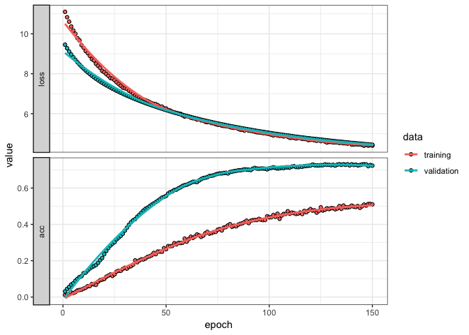
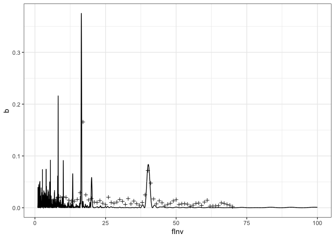

A machine learning approach - Cross categorical crossentropy
================
Roberto Maestre
03/26/2019

A simple MLP classification approach
====================================

We propose a MLP to train a NN by generating synthetic data sample given two patterns frequencies and a distance between them. This generated data (the periodicitiy) is the NN input and the output is the two frequency patterns tramsformed into an *one-hot-encode* vector normalized with a *Softmax activation*.

The loss function used by the NN is the categorical crossentropy, and is defined as:

$$H(y, \\hat{y}) = \\sum\_i y\_i \\log\\Big(\\frac{1}{\\hat{y}}\\Big) = -\\sum\_i y\_i \\log \\hat{y}$$

Thus, given a unseen periodicitiy, the NN will prodives the probabilities over the class oputput distribution. This probabilities plus the periodicitiy itself, can provide an accurate heuristic to find the frequency of the patterns that generate the periodiciticy.

Synthetic Data generation
=========================

``` r
experiment_number <- 10000
input_dim <- 10001 # the perioditicy itself
num_classes <-
  length(seq(from = 0.1, to = 6, by = 0.05)) # Buckets of possible classes
  
if (T) {
  # Save to disk
  load(file = "~/Downloads/x_train.RData")
  load(file = "~/Downloads/x_test.RData")
  load(file = "~/Downloads/y_train.RData")
  load(file = "~/Downloads/y_test.RData")
} else {
  # Matrix to save genereated data
  m_xtrain <- matrix(nrow = experiment_number + 1, ncol = input_dim)
  m_ytrain <-
    matrix(nrow = experiment_number + 1, ncol = num_classes)
  # Loop generating data
  count <- 1
  for (experiment in seq(1:experiment_number)) {
    # Select experiment parameters
    distance <- trunc(runif(1, 0, 10), prec = 4)
    numFreqs <- 100
    periodF <- runif(1, 0.1, 6)
    periodS <- runif(1, 0.1, 6)
    # Debug info with experiment configuration
    if (count %% 250 == 0) {
      print(
        paste(
          "Experiment:",
          count,
          " | distance:",
          distance,
          " | numFreqs:",
          numFreqs,
          " | 1º period:",
          round(periodF, 3),
          " (",
          round(periodF / 0.0864, 3),
          "muHz)",
          " | 2º period:",
          round(periodS, 3),
          " (",
          round(periodS / 0.0864, 3),
          "muHz)",
          sep = ""
        )
      )
    }
    
    # Data generation
    dt <- generate_data(
      numFreqs = numFreqs,
      distance = distance,
      periodF = periodF,
      periodS = periodS,
      baseAMplitudeFirst = 10,
      baseAMplitudeSecond = 10,
      seed = NULL,
      freqOneRandRange = 0.1,
      freqTwoRandRange = 0.1,
      ampRandRange = 1.0
    )
    # Execute experiment
    result <- process(
      frequency = dt$x,
      amplitude = dt$y,
      filter = "uniform",
      gRegimen = 0,
      maxDnu = 15,
      minDnu = 15,
      numFrequencies = ifelse(nrow(dt) < 30, 31, nrow(dt) + 1),
      dnuGuessError = -1,
      debug = F
    )
    
    # X data
    m_xtrain[count, ] <-
      result$fresAmps[[names(result$fresAmps)[1]]]$b
    # Y data
    m_ytrain[count, ] <-
      to_categorical(round(periodF / 0.0864, 3), num_classes) +
      to_categorical(round(periodS / 0.0864, 3), num_classes)
    if (2 %in% m_ytrain[count, ]) {
      # Same frequency collapse in one position
      m_ytrain[count, ] <- m_ytrain[count, ] / 2
    }
    count <- count + 1
  }
  # Remove not valid or empty rows
  AA <- na.omit(m_xtrain)
  m_xtrain <- matrix(AA, nrow = nrow(AA) , ncol = ncol(AA))
  BB <- na.omit(m_ytrain)
  m_ytrain <- matrix(BB, nrow = nrow(BB) , ncol = ncol(BB))
  
  # Split train/test
  smp_size <- floor(0.75 * nrow(m_xtrain))
  set.seed(123)
  ind <- sample(seq_len(nrow(m_xtrain)), size = smp_size)
  
  # Prepare partition
  x_train <- m_xtrain[ind,]
  x_test  <- m_xtrain[-ind,]
  y_train <- m_ytrain[ind,]
  y_test  <- m_ytrain[-ind,]
  
  # Save to disk
  save(x_train, file = "~/Downloads/x_train.RData")
  save(x_test, file = "~/Downloads/x_test.RData")
  save(y_train, file = "~/Downloads/y_train.RData")
  save(y_test, file = "~/Downloads/y_test.RData")
}
```

Deep NN
=======

A deep NN with two layers is proposed as a multiclass classificacion problem.

Data asserts and reshaping for NN
---------------------------------

``` r
# Asserts on data training and test
stopifnot(dim(x_train)[1] == dim(y_train)[1])
stopifnot(dim(x_test)[1] == dim(y_test)[1])
stopifnot(dim(x_train)[2] == dim(x_train)[2])
stopifnot(dim(y_test)[2] == dim(y_train)[2])

# Get input dimension for NN
input_dim <- dim(x_train)[2] # (The periodicitiy dimension)
# Calculate the number of classes
num_classes <- length(seq(from = 0.1, to = 6, by = 0.05))

# Reshape data input for tensor
x_train <-
  array_reshape(x_train, c(nrow(x_train), ncol(x_train), 1))
x_test <- array_reshape(x_test, c(nrow(x_test), ncol(x_test), 1))
```

NN architecture and compile
---------------------------

``` r
# Create a 1d convolutional NN
model <- keras_model_sequential() %>%

  # Encoder
  layer_conv_1d(
    filters = 10,
    kernel_size = 5,
    activation = 'relu',
    input_shape = c(input_dim, 1)
  ) %>%
  layer_max_pooling_1d(pool_size = 3) %>%
  layer_dropout(0.5) %>%
  layer_batch_normalization() %>%
  
  layer_conv_1d(
    filters = 10,
    kernel_size = 10,
    activation = 'relu',
    input_shape = c(input_dim, 1)
  ) %>%
  layer_max_pooling_1d(pool_size = 2) %>%
  layer_dropout(0.5) %>%
  layer_batch_normalization() %>%
  

  layer_flatten() %>%
  layer_dense(num_classes, activation = 'softmax')

# Configure a model for categorical classification.
model %>% compile(
  loss = "categorical_crossentropy",
  optimizer = optimizer_adadelta(lr = 0.005),
  metrics = c("accuracy")
)
summary(model) # Plot summary
```

    ## ___________________________________________________________________________
    ## Layer (type)                     Output Shape                  Param #     
    ## ===========================================================================
    ## conv1d_1 (Conv1D)                (None, 9997, 10)              60          
    ## ___________________________________________________________________________
    ## max_pooling1d_1 (MaxPooling1D)   (None, 3332, 10)              0           
    ## ___________________________________________________________________________
    ## dropout_1 (Dropout)              (None, 3332, 10)              0           
    ## ___________________________________________________________________________
    ## batch_normalization_1 (BatchNorm (None, 3332, 10)              40          
    ## ___________________________________________________________________________
    ## conv1d_2 (Conv1D)                (None, 3323, 10)              1010        
    ## ___________________________________________________________________________
    ## max_pooling1d_2 (MaxPooling1D)   (None, 1661, 10)              0           
    ## ___________________________________________________________________________
    ## dropout_2 (Dropout)              (None, 1661, 10)              0           
    ## ___________________________________________________________________________
    ## batch_normalization_2 (BatchNorm (None, 1661, 10)              40          
    ## ___________________________________________________________________________
    ## flatten_1 (Flatten)              (None, 16610)                 0           
    ## ___________________________________________________________________________
    ## dense_1 (Dense)                  (None, 119)                   1976709     
    ## ===========================================================================
    ## Total params: 1,977,859
    ## Trainable params: 1,977,819
    ## Non-trainable params: 40
    ## ___________________________________________________________________________

NN train
--------

``` r
# Fit model
history <- model %>% fit(
  x_train,
  y_train,
  epochs = 150,
  batch_size =  250,
  validation_split = 0.2,
  shuffle = T
)
```

### Train history

``` r
plot(history) +
  theme_bw()
```



NN evaluation
-------------

### One test

#### Prepare one given row

``` r
id <- 2
sx <- x_test[id,,1]
sy <- y_test[id,]
dim(sy) <- c(1, ncol(y_test))
sy_hat <- predict(model, array_reshape(sx, c(1,length(sx),1)))
```

#### Model evaluation is:

    ## $loss
    ## [1] 8.528385
    ## 
    ## $acc
    ## [1] 0

### All test

``` r
evaluate(model, x_test, y_test)
```

    ## $loss
    ## [1] 4.444778
    ## 
    ## $acc
    ## [1] 0.7045161

#### Check the softmax and real y vectors

All vector prositions (periods frequency patters) must be the same

``` r
which(sy==1)
```

    ## [1]  4 64

``` r
sort(sy_hat, index.return=TRUE, decreasing=T)$ix[1:2]
```

    ## [1] 5 9

Manually test
-------------

``` r
# One manually choosen id
id <- 36
x <- x_test[id,,1]
dim(x) <- c(1, length(x), 1) # Set correct tensor dimension
y_hat <- predict(model, x) # MLP predictions
#plot(t(y_hat))
y <- y_test[id,] # Get real y

# Show real y vs predicted y_hat
which(y == 1)
```

    ## [1] 53 55

``` r
which(y_hat > 0.001) # Choose a probabilistic threshold
```

    ##  [1] 16 18 19 20 21 22 23 26 27 28 29 30 31 32 33 34 36 37 39 42 43 44 45
    ## [24] 46 47 48 49 50 51 52 53 54 55 56 57 58 59 60 61 62 63 64 65 66 67 68
    ## [47] 69

Manually test on new data
-------------------------

``` r
# Select experiment parameters
distance <- trunc(runif(1, 0, 10), prec = 4)
numFreqs <- 100
periodF <- runif(1, 0.1, 6)
periodS <- runif(1, 0.1, 6)
# Debug info with experiment configuration
if (T) {
  print(
    paste(
      " Distance:",
      distance,
      " | numFreqs:",
      numFreqs,
      " | 1º period:",
      round(periodF, 3),
      " (",
      round(periodF / 0.0864, 3),
      "muHz)",
      " | 2º period:",
      round(periodS, 3),
      " (",
      round(periodS / 0.0864, 3),
      "muHz)",
      sep = ""
    )
  )
}
```

    ## [1] " Distance:2 | numFreqs:100 | 1º period:1.421 (16.446muHz) | 2º period:3.467 (40.131muHz)"

``` r
# Data generation
dt <- generate_data(
  numFreqs = numFreqs,
  distance = distance,
  periodF = periodF,
  periodS = periodS,
  baseAMplitudeFirst = 10,
  baseAMplitudeSecond = 10,
  seed = NULL,
  freqOneRandRange = 0.1,
  freqTwoRandRange = 0.1,
  ampRandRange = 1.0
)
# Execute experiment
result <- process(
  frequency = dt$x,
  amplitude = dt$y,
  filter = "uniform",
  gRegimen = 0,
  maxDnu = 15,
  minDnu = 15,
  numFrequencies = ifelse(nrow(dt) < 30, 31, nrow(dt) + 1),
  dnuGuessError = -1,
  debug = F
)

# Plot periodicities
dt <- prepare_periodicities_dataset(result$fresAmps)
# Prepared MLP probabilities
prob_threshold <- 0.001
x <- matrix(result$fresAmps[[names(result$fresAmps)[1]]]$b, nrow = 1)

dim(x) <- c(1, length(x), 1)
y_hat <- predict(model, x)
dtNN <- data.frame("fInv"=which(y_hat>prob_threshold), 
                    "b"=y_hat[which(y_hat>prob_threshold)])
head(dtNN[order(dtNN$b, decreasing = T), ], 50)
```

    ##    fInv           b
    ## 16   17 0.165584862
    ## 39   40 0.071837597
    ## 40   41 0.047665093
    ## 15   16 0.029164469
    ## 17   18 0.025010658
    ## 38   39 0.024967059
    ## 9    10 0.021382408
    ## 25   26 0.020360988
    ## 8     9 0.020202359
    ## 10   11 0.019977743
    ## 7     8 0.019385897
    ## 19   20 0.017878817
    ## 32   33 0.017714130
    ## 41   42 0.017049847
    ## 14   15 0.016189300
    ## 29   30 0.015986163
    ## 49   50 0.015716862
    ## 6     7 0.015508806
    ## 18   19 0.015134173
    ## 11   12 0.014708091
    ## 60   61 0.014570353
    ## 22   23 0.013775656
    ## 43   44 0.013459004
    ## 48   49 0.013319603
    ## 12   13 0.013096754
    ## 34   35 0.012965092
    ## 13   14 0.012778032
    ## 30   31 0.012482124
    ## 59   60 0.010977162
    ## 28   29 0.010961003
    ## 20   21 0.010873494
    ## 37   38 0.010393253
    ## 21   22 0.010230274
    ## 26   27 0.010154047
    ## 44   45 0.009700226
    ## 65   66 0.009536041
    ## 57   58 0.009064601
    ## 23   24 0.008784891
    ## 47   48 0.008693325
    ## 27   28 0.008691930
    ## 66   67 0.008531517
    ## 56   57 0.008492676
    ## 35   36 0.008038684
    ## 4     5 0.007986798
    ## 52   53 0.007890197
    ## 33   34 0.007590037
    ## 51   52 0.007583544
    ## 42   43 0.007518159
    ## 53   54 0.006949290
    ## 46   47 0.006687308

Plot periodicities and &gt;prob\_threshold frequencies from NN
--------------------------------------------------------------

``` r
ggplot(aes(fInv, b), data=dt) +
  geom_line() +
  geom_point(data=dtNN, shape=3) +
  theme_bw()
```


