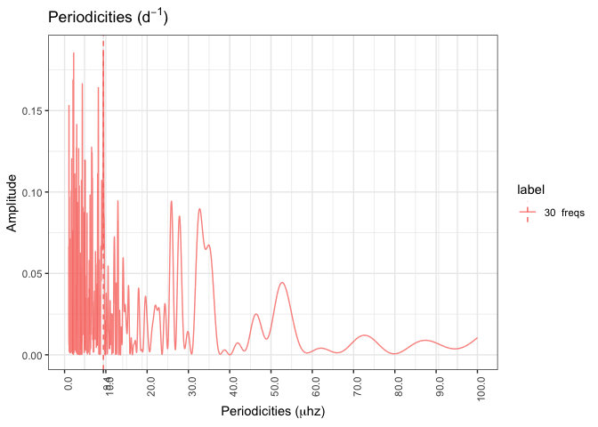
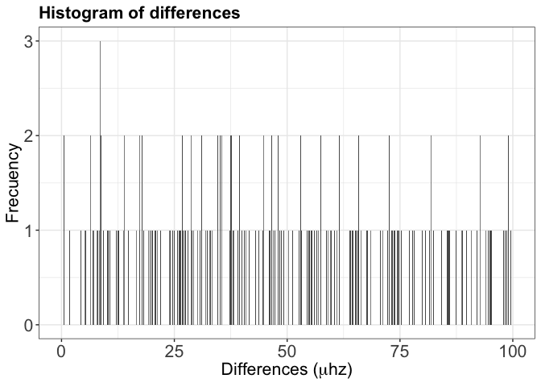
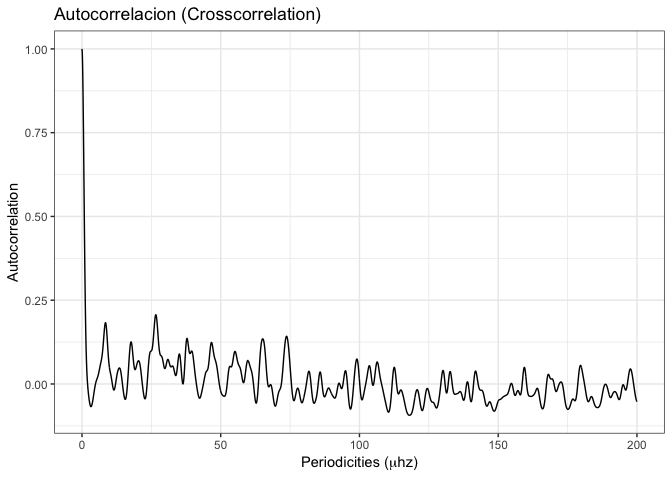
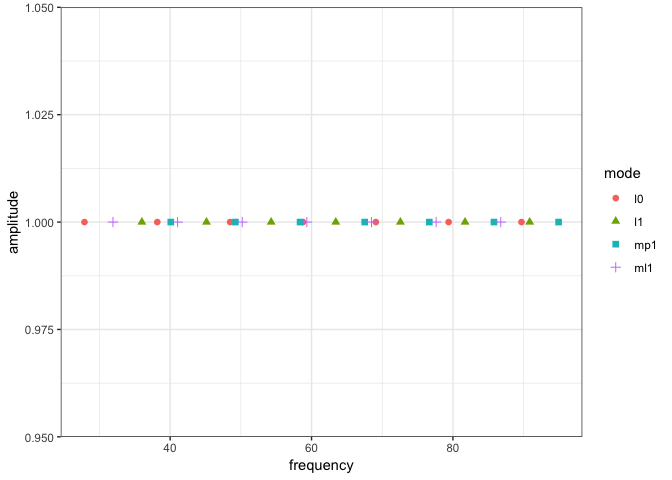
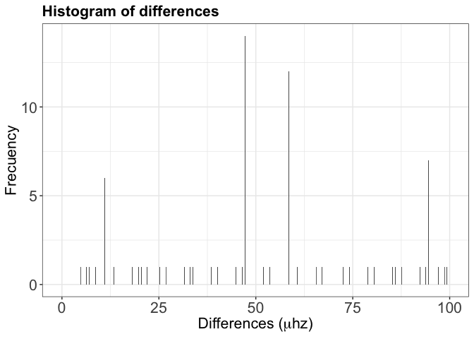
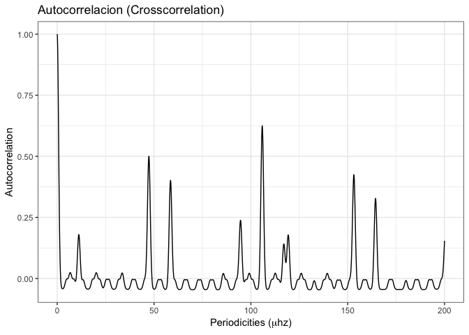
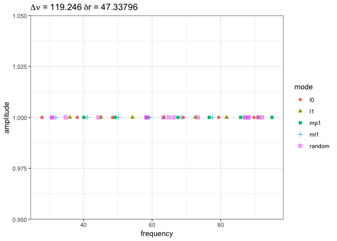
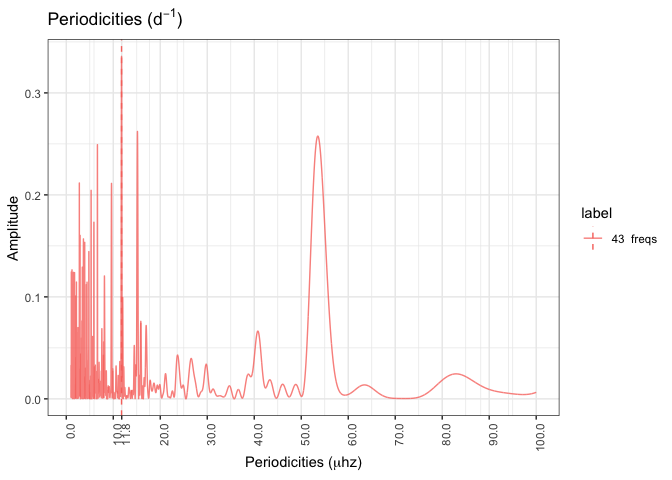
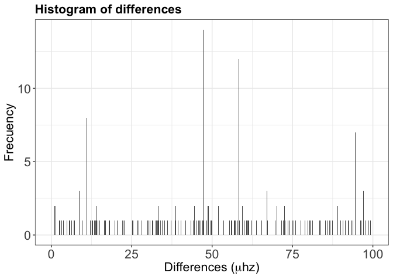
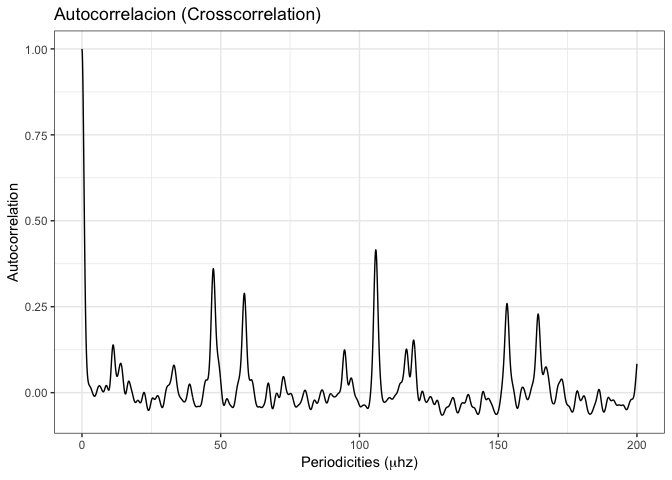

[](https://travis-ci.org/rmaestre/variableStars)

Please, [read the package introduction](https://github.com/rmaestre/variableStars/blob/master/README.md) for initial details about the software, algorithms, workflow and data used.

Neural Network approach for detecting Dnu and dr
================================================

[Depthwise separable convolutions](https://arxiv.org/pdf/1610.02357.pdf) for machine learning consists in *spatial convolution performed independently over each channel of an input, followed by a pointwise convolution, projecting the channels output by the depthwise convolution onto a new channel space. *

The next figure represents an overview of the main Neural Network architecture used to identify Dnu and dr from a given power espectrum of a variable star:


An example of NN output is the following one, in which:

-   **Red** = Information related to Dnu
    -   Vertical red line = Real value of Dnu \[unseen for the NN\]
    -   Red points = Probabilities over Dnu values infered by the NN
-   **Black** = Information related to dr
    -   Vertical black line = Real value of dr \[unseen for the NN\]
    -   Black points = Probabilities dr infered by the NN

(Because each channel is scaled between \[0,1\], these values and the probabilities can be plotted together)


Methodology
===========

Input data
----------

Each input channel channel is processed with the *variableStars* package. The data from the variable star is processed by the main method:

``` r
result <- process(
  dt.star$frequency,
  dt.star$amplitude,
  filter = "uniform",
  gRegimen = 0,
  minDnu = 15,
  maxDnu = 95,
  dnuValue = -1,
  dnuGuessError = 10,
  dnuEstimation = TRUE,
  numFrequencies = 30,
  debug = F
)
```

and each channel is extracted as:

-   **Fourier transform**

``` r
dt <- prepare_periodicities_dataset(result$fresAmps)
dt <- dt[dt$label == "30  freqs", ]
plot_periodicities_ggplot(dt)
```



-   **Histogram of differences**

``` r
dt <- data.frame(result$diffHistogram$histogram)
plot_histogram_ggplot(dt)
```



-   **Autocorrelation**

``` r
dt <- data.frame(result$crossCorrelation)
plot_crosscorrelation_ggplot(dt)
```



Note: The informaction of each channel is scaled between \[0,1\].

Neural Network targets
----------------------

The input for the Nural Network, is bucketized with a given resolution; transforming the frecuency range into classes:

``` r
input_resolution <- 0.5
# Input dimension
cuts_breaks <- c(seq(0, 101, input_resolution))
cuts_breaks
```

    ##   [1]   0.0   0.5   1.0   1.5   2.0   2.5   3.0   3.5   4.0   4.5   5.0
    ##  [12]   5.5   6.0   6.5   7.0   7.5   8.0   8.5   9.0   9.5  10.0  10.5
    ##  [23]  11.0  11.5  12.0  12.5  13.0  13.5  14.0  14.5  15.0  15.5  16.0
    ##  [34]  16.5  17.0  17.5  18.0  18.5  19.0  19.5  20.0  20.5  21.0  21.5
    ##  [45]  22.0  22.5  23.0  23.5  24.0  24.5  25.0  25.5  26.0  26.5  27.0
    ##  [56]  27.5  28.0  28.5  29.0  29.5  30.0  30.5  31.0  31.5  32.0  32.5
    ##  [67]  33.0  33.5  34.0  34.5  35.0  35.5  36.0  36.5  37.0  37.5  38.0
    ##  [78]  38.5  39.0  39.5  40.0  40.5  41.0  41.5  42.0  42.5  43.0  43.5
    ##  [89]  44.0  44.5  45.0  45.5  46.0  46.5  47.0  47.5  48.0  48.5  49.0
    ## [100]  49.5  50.0  50.5  51.0  51.5  52.0  52.5  53.0  53.5  54.0  54.5
    ## [111]  55.0  55.5  56.0  56.5  57.0  57.5  58.0  58.5  59.0  59.5  60.0
    ## [122]  60.5  61.0  61.5  62.0  62.5  63.0  63.5  64.0  64.5  65.0  65.5
    ## [133]  66.0  66.5  67.0  67.5  68.0  68.5  69.0  69.5  70.0  70.5  71.0
    ## [144]  71.5  72.0  72.5  73.0  73.5  74.0  74.5  75.0  75.5  76.0  76.5
    ## [155]  77.0  77.5  78.0  78.5  79.0  79.5  80.0  80.5  81.0  81.5  82.0
    ## [166]  82.5  83.0  83.5  84.0  84.5  85.0  85.5  86.0  86.5  87.0  87.5
    ## [177]  88.0  88.5  89.0  89.5  90.0  90.5  91.0  91.5  92.0  92.5  93.0
    ## [188]  93.5  94.0  94.5  95.0  95.5  96.0  96.5  97.0  97.5  98.0  98.5
    ## [199]  99.0  99.5 100.0 100.5 101.0

The target output, is bucketized, transforming the frecuency range into classes:

``` r
output_resolution <- 1.0
# Output dimension
output_classes <- seq(from = 0,
                      to = 14 / 0.0864,
                      by = output_resolution)
output_classes
```

    ##   [1]   0   1   2   3   4   5   6   7   8   9  10  11  12  13  14  15  16
    ##  [18]  17  18  19  20  21  22  23  24  25  26  27  28  29  30  31  32  33
    ##  [35]  34  35  36  37  38  39  40  41  42  43  44  45  46  47  48  49  50
    ##  [52]  51  52  53  54  55  56  57  58  59  60  61  62  63  64  65  66  67
    ##  [69]  68  69  70  71  72  73  74  75  76  77  78  79  80  81  82  83  84
    ##  [86]  85  86  87  88  89  90  91  92  93  94  95  96  97  98  99 100 101
    ## [103] 102 103 104 105 106 107 108 109 110 111 112 113 114 115 116 117 118
    ## [120] 119 120 121 122 123 124 125 126 127 128 129 130 131 132 133 134 135
    ## [137] 136 137 138 139 140 141 142 143 144 145 146 147 148 149 150 151 152
    ## [154] 153 154 155 156 157 158 159 160 161 162

Note: Input and output dimension are fixed.

Experiment I
============

A simple synthetic data without noise added. 28 frequencies are generated with four clear patters.



The variableStars package process all frequencies and produce the input data for each channel in the NN.

``` r
# Process the data
result <- process(
  dt$data$frequency,
  dt$data$amplitude,
  filter = "uniform",
  gRegimen = 0,
  minDnu = 15,
  maxDnu = 95,
  dnuValue = -1,
  dnuGuessError = 10,
  dnuEstimation = TRUE,
  numFrequencies = nrow(dt$data)+1,
  debug = F
)
plot_periodicities_ggplot(prepare_periodicities_dataset(result$fresAmps))
```


``` r
plot_histogram_ggplot(data.frame(result$diffHistogram$histogram))
```



``` r
plot_crosscorrelation_ggplot(data.frame(result$crossCorrelation))
```



Experiment II
=============

A simple synthetic data noise added. 28 frequencies are generated with four clear patters, plus 15 random frequencies (**53% of random frequencies**).



The variableStars package process all frequencies and produce the input data for each channel in the NN.

``` r
# Process the data
resultNoisy <- process(
  dt$data$frequency,
  dt$data$amplitude,
  filter = "uniform",
  gRegimen = 0,
  minDnu = 15,
  maxDnu = 95,
  dnuValue = -1,
  dnuGuessError = 10,
  dnuEstimation = TRUE,
  numFrequencies = nrow(dt$data) + 1,
  debug = F
)
plot_periodicities_ggplot(prepare_periodicities_dataset(resultNoisy$fresAmps))
```



``` r
plot_histogram_ggplot(data.frame(resultNoisy$diffHistogram$histogram))
```



``` r
plot_crosscorrelation_ggplot(data.frame(resultNoisy$crossCorrelation))
```



Results
=======

Confusion matrix
----------------

(Right image=Dnu, Left image=Dr)

**Experiment I**

 | 

**Experiment II**

 | 

Validation accuracy/recall
--------------------------

In our approach, we use **recall @N**. This metric means that, the correct category (Dnu or dr bucket) is found in the first **N** sorted probabilities that the model gives.

|                     |   loss|  recall\_at\_1|  recall\_at\_2|  recall\_at\_4|
|---------------------|------:|--------------:|--------------:|--------------:|
| Experiment I - Dnu  |  1.630|          0.408|          0.639|          0.853|
| Experiment I - Dr   |  1.801|          0.482|          0.672|          0.812|
| Experiment II - Dnu |  1.814|          0.470|          0.653|          0.816|
| Experiment II - Dr  |  1.896|          0.467|          0.658|          0.802|

Limitations
-----------

-   NNs are really sensible to the data input that has been trained. Despite the fact that NN can generalized very well, a robust corresponding between synthetic data generation (theoretical models) and the process itself must be ensured.

-   A rigorous NN architecture search must me done. The number of layers and its hyperparameters, dramatically impacts in the NN performance. A grid-search on GPUs has been used as first approach. Next output represents several NN architectures search.

<!-- -->

    loss     recall_at_1     recall_at_2     recall_at_4    architecture
    2.8767  0.2015  0.3458  0.5361  [ 6|2|6|3|0.2 ] [ 3|4|9|3|x ] [ 4|8|9|x|0.2 ]
    2.0808  0.479   0.6933  0.8404  [ 10|9|7|2|0.4 ] [  ] [  ]
    2.1148  0.3962  0.6001  0.7832  [ 6|9|2|3|0.5 ] [ 8|2|5|1|0.3 ] [ 10|4|7|1|0.4 ]
    2.4934  0.4486  0.6601  0.8184  [ 9|9|2|1|0.1 ] [ 6|7|3|x|x ] [ 2|2|5|x|0.1 ]
    1.7715  0.4446  0.6617  0.8328  [ 8|5|2|2|0.2 ] [ 2|10|5|2|0.2 ] [ 7|5|10|1|0.2 ]
    3.3669  0.4018  0.6001  0.7453  [ 2|6|5|1|0.2 ] [ 4|10|2|x|0.2 ] [ 4|10|4|x|x ]
    2.303   0.3558  0.5597  0.7461  [ 2|7|7|3|0.4 ] [ 5|2|4|x|0.5 ] [ 6|3|5|x|x ]
    2.2361  0.4402  0.6569  0.8184  [ 8|3|3|1|0.3 ] [  ] [  ]
    1.6902  0.4946  0.6981  0.8588  [ 8|7|10|3|0.3 ] [ 8|9|8|x|0.4 ] [  ]
    2.2283  0.4742  0.6817  0.8316  [ 6|8|7|2|0.3 ] [  ] [  ]
    2.1583  0.461   0.6529  0.8068  [ 10|4|9|3|0.1 ] [  ] [  ]
    1.9071  0.4462  0.6517  0.8132  [ 5|3|10|3|0.4 ] [  ] [  ]
    1.902   0.4482  0.6497  0.81    [ 9|10|6|2|0.3 ] [ 8|9|5|x|0.4 ] [ 2|5|4|2|x ]
    1.8427  0.4798  0.6781  0.8356  [ 8|9|6|3|0.4 ] [  ] [  ]
    1.9565  0.4234  0.6293  0.8128  [ 5|3|6|3|0.4 ] [  ] [ 9|5|5|x|0.1 ]
    1.7707  0.4746  0.6805  0.8352  [ 8|6|4|3|0.5 ] [  ] [ 8|3|4|2|x ]
    2.5479  0.4678  0.6577  0.806   [ 2|9|4|2|0.2 ] [  ] [  ]
    2.0175  0.429   0.6141  0.7652  [ 6|7|10|3|0.2 ] [ 4|5|9|3|x ] [  ]
    1.942   0.4758  0.6801  0.8424  [ 5|4|10|2|0.3 ] [  ] [ 6|4|8|3|x ]
    1.8003  0.4814  0.6745  0.828   [ 5|5|7|2|0.2 ] [ 3|8|10|1|0.2 ] [ 3|4|5|x|x ]
    2.0301  0.4766  0.6905  0.8428  [ 8|8|4|2|0.4 ] [  ] [  ]
    1.854   0.4682  0.6753  0.83    [ 7|2|6|3|0.2 ] [ 2|5|6|x|x ] [  ]
    2.054   0.4074  0.6041  0.788   [ 2|2|3|3|0.3 ] [ 9|10|7|x|x ] [  ]
    2.4722  0.4434  0.6397  0.8088  [ 9|8|8|1|0.4 ] [ 9|3|7|x|x ] [  ]
    1.8565  0.4862  0.6933  0.8472  [ 7|4|5|2|0.3 ] [ 10|3|8|x|x ] [  ]
