Patterns Experiment
================
Roberto Maestre
10/24/2018

Introduction
============

This results can be calculated through the experimental UI available [here](https://github.com/rmaestre/variableStars/tree/master/inst/shiny-examples/experiment).

Experiment structure
====================

``` r
find_peaks <- function(x) {
  # Diff series
  xd <- diff(x)
  # DS to save peaks
  peaks <- c()
  last_sign <- sign(xd[1])
  # Loop over diff values
  for (i in seq(1:length(xd))) {
    if (last_sign != sign(xd[i]) && sign(xd[i])<0) {
      peaks <- c(peaks, i)
    }
    last_sign = sign(xd[i])
  }
  peaks # return peaks index
}

execute_experiment <- function(numFreqs, distance, shift,
                      seed=123, 
                      baseAMplitudeFirst=10, baseAMplitudeSecond=10, 
                      freqOneRandRange=0, freqTwoRandRange=0, ampRandRange=0,
                      selectFirstFrequencies = 30, debug = T) {
  
  # DS to resturn results
  res <- list()
  
  # --------------- Data generation
  dt <- generate_data(numFreqs=numFreqs, distance=distance, shift=shift, seed=seed, 
                      baseAMplitudeFirst=baseAMplitudeFirst, baseAMplitudeSecond=baseAMplitudeSecond, 
                      freqOneRandRange=freqOneRandRange, freqTwoRandRange=freqTwoRandRange, 
                      ampRandRange=ampRandRange)
  
  # Calculate two separations
  firstSeparation <- abs(dt[2,]$x - dt[1,]$x) / 0.0864
  seconSeparation <- abs(dt[2,]$x - dt[3,]$x) / 0.0864
  
 # --------------- Process data and extract patterns
  result <- process(frequency = dt$x, amplitude = dt$y,
                    filter="uniform", gRegimen=0, maxDnu=15, minDnu=15, 
                    numFrequencies=selectFirstFrequencies, dnuGuessError=-1, debug = debug)
  # ---------------  Plot apodization
  res$plots$apo <- plot_apodization(data.frame(
      "frequences" = result$apodization$frequences,
      "amplitude" = result$apodization$amp
    ))
  
  # ---------------  Periodicities
  dt.per <- prepare_periodicities_dataset(result$fresAmps)
  res$plots$periodicities <- plot_periodicities(dt.per)
  inds <- aggregate(b~label, data = dt.per, max)
  maxs <- dt.per[dt.per$b %in% inds$b,]
  # Save data
  res$periodicities$mhz = maxs$fInv 
  res$periodicities$d = maxs$fInv * 0.0864
  res$periodicities$amplitude = maxs$b


  # --------------- Histogram of diffs
  res$histogram = list()

  res$plots$histogram <-  ggplot(aes(x = bins, y = values), data = data.frame(result$diffHistogram$histogram)) +
      geom_bar(stat = "identity") +
      ggtitle("Histogram of differences") +
      theme_bw()
  
  peaks <- find_peaks(result$diffHistogram$histogram$values)
  count = 1
  for (peak in peaks) {
    res$histogram[[paste0(count)]]$mhz =   result$diffHistogram$histogram$bins[peak]
    res$histogram[[paste0(count)]]$value = result$diffHistogram$histogram$values[peak]
    count = count + 1
  }
  

  
  # CrossCorrelation
  res$cross = list()
  res$plots$crosscorrelation <- ggplot(aes(x = index, y = autocorre), data = data.frame(result$crossCorrelation)) +
      geom_line(stat = "identity") +
      ggtitle("Autocorrelacion (Crosscorrelation)") +
      xlab(expression(paste("Periodicities (", mu, "hz)"))) +
      ylab("Autocorrelation") +
      theme_bw()
  
  peaks <- find_peaks(result$crossCorrelation$autocorre)
  count = 1
  for (peak in peaks) {
    if (result$crossCorrelation$autocorre[peak]>0){
      res$cross[[paste0(count)]]$mhz = result$crossCorrelation$index[peak]
      res$cross[[paste0(count)]]$value = result$crossCorrelation$autocorre[peak]
      count = count + 1
    }
  }
  
  res$echelle <- result$echelle
  
   res
}
```

Experiments whitout random amplitudes
=====================================

Execution 0
-----------

Num. frequencies: 20

Distance between patterns: 8

Shift: 1

::: Debug information :::

Number of frequences to be processed: 21 Number of frequences after drop the g regimen: 20 Frequencies: 104.167, 185.185, 289.352, 370.37, 474.537, 555.556, 659.722, 740.741, 844.907, 925.926, 1030.09, 1111.11, 1215.28, 1296.3, 1400.46, 1481.48, 1585.65, 1666.67, 1770.83, 1851.85, Range: 20, Iteration over range: 20 Frequencies selected: 104.167, 185.185, 289.352, 370.37, 474.537, 555.556, 659.722, 740.741, 844.907, 925.926, Amplitudes selected: 10, 10, 10, 10, 10, 10, 10, 10, 10, 10, Dnu: 11.5732 Dnu Peak: 11.5732 Dnu Guess: 0 Cross correlation calculated:

Successful process.

##### Apodization


##### Periodicities

Peak:11.5732mhz (d^-1=0.99992448) Amplitude: 0.999521731252805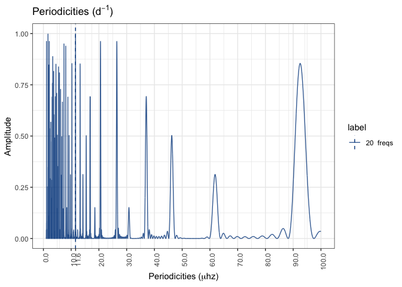

##### Histogram

Peak 1: 80.896668mhz. Value:10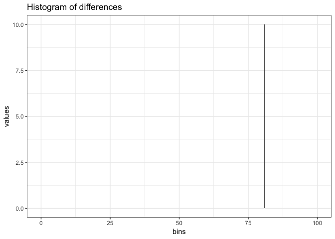

##### Crosscorrelation

Peak 1: 81.0405202601301mhz. Value:0.489874138735662

Peak 2: 104.252126063032mhz. Value:0.439528422464012

Peak 3: 185.292646323162mhz. Value:0.899070817572193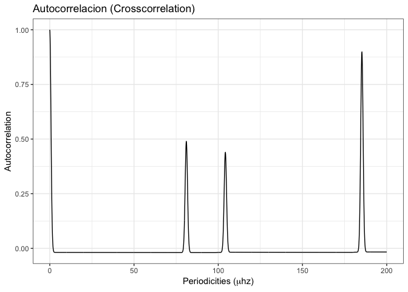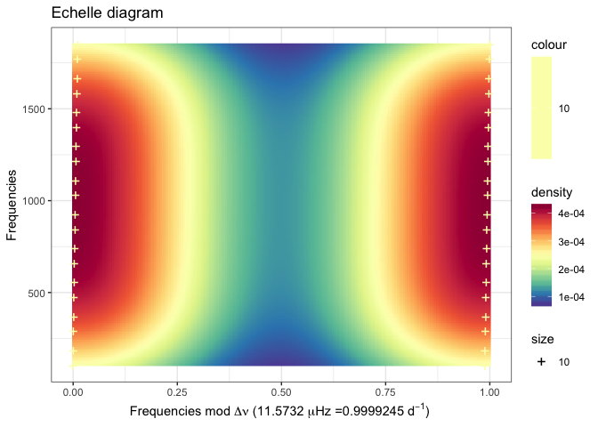

Execution 1
-----------

Num. frequencies: 20

Distance between patterns: 8

Shift: 2

::: Debug information :::

Number of frequences to be processed: 21 Number of frequences after drop the g regimen: 20 Frequencies: 115.741, 185.185, 300.926, 370.37, 486.111, 555.556, 671.296, 740.741, 856.481, 925.926, 1041.67, 1111.11, 1226.85, 1296.3, 1412.04, 1481.48, 1597.22, 1666.67, 1782.41, 1851.85, Range: 20, Iteration over range: 20 Frequencies selected: 115.741, 185.185, 300.926, 370.37, 486.111, 555.556, 671.296, 740.741, 856.481, 925.926, Amplitudes selected: 10, 10, 10, 10, 10, 10, 10, 10, 10, 10, Dnu: 23.1463 Dnu Peak: 23.1463 Dnu Guess: 0 Cross correlation calculated:

Successful process.

##### Apodization


##### Periodicities

Peak:23.1463mhz (d^-1=1.99984032) Amplitude: 0.999866547195696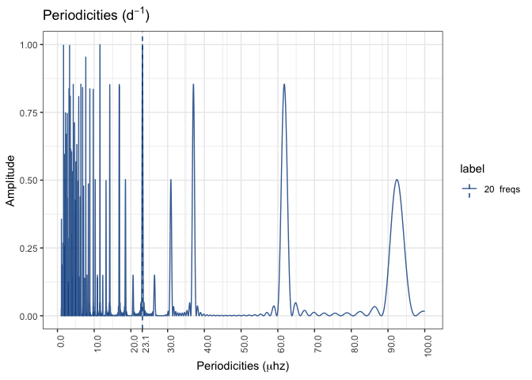

##### Histogram

Peak 1: 69.4389mhz. Value:10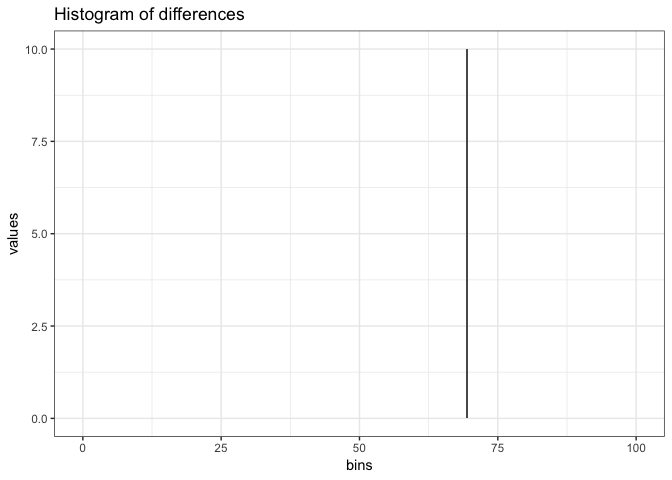

##### Crosscorrelation

Peak 1: 69.4347173586793mhz. Value:0.489238626856114

Peak 2: 115.75787893947mhz. Value:0.439495280064981

Peak 3: 185.292646323162mhz. Value:0.899070817572193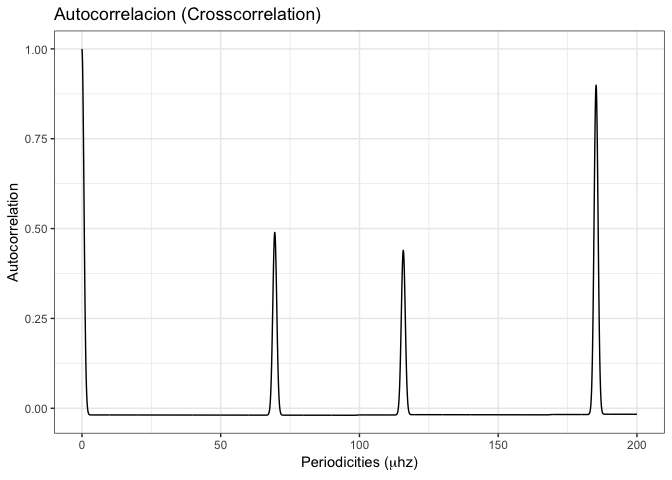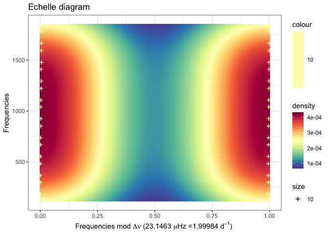

Execution 2
-----------

Num. frequencies: 20

Distance between patterns: 8

Shift: 3

::: Debug information :::

Number of frequences to be processed: 21 Number of frequences after drop the g regimen: 20 Frequencies: 127.315, 185.185, 312.5, 370.37, 497.685, 555.556, 682.87, 740.741, 868.056, 925.926, 1053.24, 1111.11, 1238.43, 1296.3, 1423.61, 1481.48, 1608.8, 1666.67, 1793.98, 1851.85, Range: 20, Iteration over range: 20 Frequencies selected: 127.315, 185.185, 312.5, 370.37, 497.685, 555.556, 682.87, 740.741, 868.056, 925.926, Amplitudes selected: 10, 10, 10, 10, 10, 10, 10, 10, 10, 10, Dnu: 11.5732 Dnu Peak: 11.5732 Dnu Guess: 0 Cross correlation calculated:

Successful process.

##### Apodization


##### Periodicities

Peak:11.5732mhz (d^-1=0.99992448) Amplitude: 0.999523081749058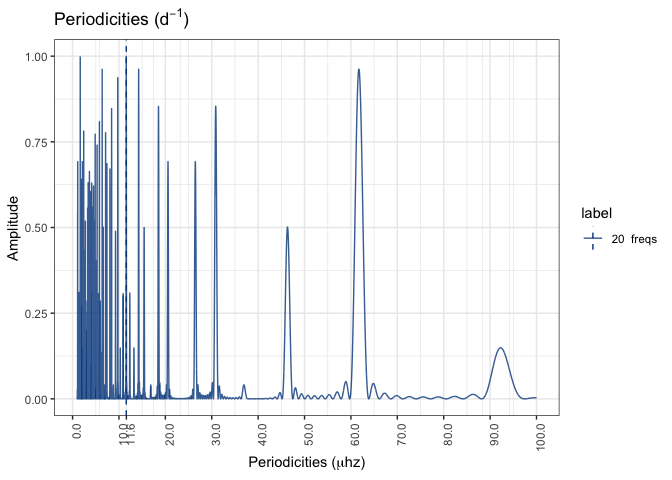

##### Histogram

Peak 1: 57.808134mhz. Value:10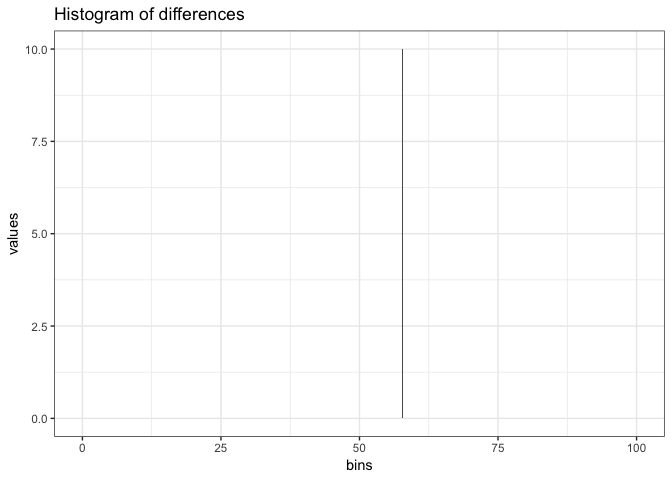

##### Crosscorrelation

Peak 1: 57.9289644822411mhz. Value:0.489657495017426

Peak 2: 127.36368184092mhz. Value:0.439928209974254

Peak 3: 185.292646323162mhz. Value:0.899070817572192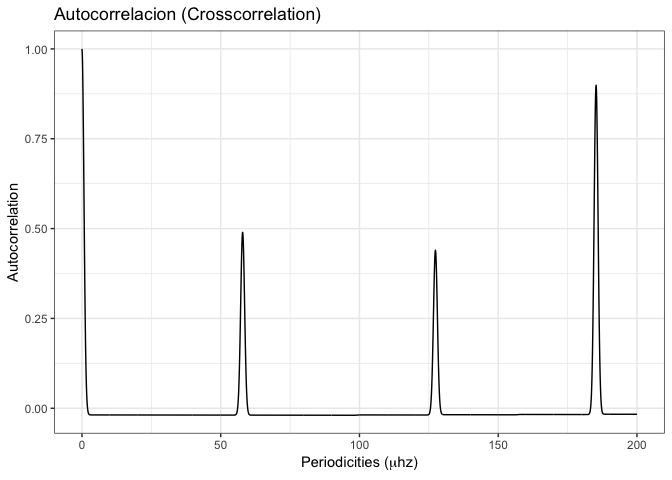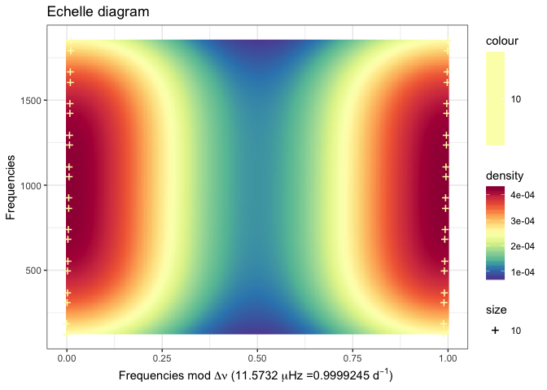

Execution 3
-----------

Num. frequencies: 20

Distance between patterns: 8

Shift: 4

::: Debug information :::

Number of frequences to be processed: 21 Number of frequences after drop the g regimen: 20 Frequencies: 138.889, 185.185, 324.074, 370.37, 509.259, 555.556, 694.444, 740.741, 879.63, 925.926, 1064.81, 1111.11, 1250, 1296.3, 1435.19, 1481.48, 1620.37, 1666.67, 1805.56, 1851.85, Range: 20, Iteration over range: 20 Frequencies selected: 138.889, 185.185, 324.074, 370.37, 509.259, 555.556, 694.444, 740.741, 879.63, 925.926, Amplitudes selected: 10, 10, 10, 10, 10, 10, 10, 10, 10, 10, Dnu: 46.2925 Dnu Peak: 46.2925 Dnu Guess: 0 Cross correlation calculated:

Successful process.

##### Apodization

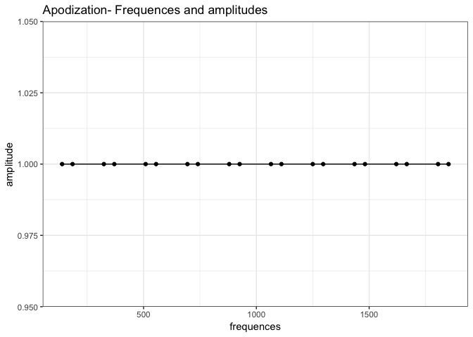

##### Periodicities

Peak:46.2925mhz (d^-1=3.999672) Amplitude: 0.999964888589627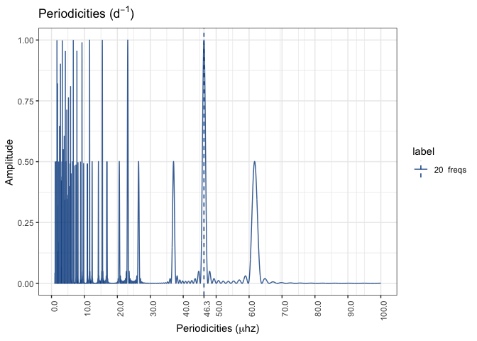

##### Histogram

Peak 1: 45.829575mhz. Value:10

##### Crosscorrelation

Peak 1: 46.3231615807904mhz. Value:0.49028955583556

Peak 2: 138.969484742371mhz. Value:0.439716902078412

Peak 3: 185.292646323162mhz. Value:0.899070817572192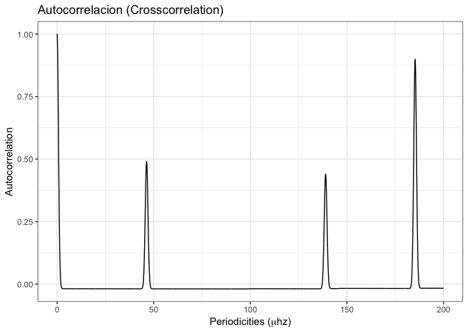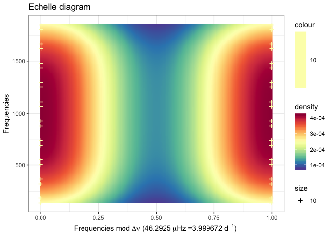

Execution 4
-----------

Num. frequencies: 20

Distance between patterns: 8

Shift: 5

::: Debug information :::

Number of frequences to be processed: 21 Number of frequences after drop the g regimen: 20 Frequencies: 150.463, 185.185, 335.648, 370.37, 520.833, 555.556, 706.019, 740.741, 891.204, 925.926, 1076.39, 1111.11, 1261.57, 1296.3, 1446.76, 1481.48, 1631.94, 1666.67, 1817.13, 1851.85, Range: 20, Iteration over range: 20 Frequencies selected: 150.463, 185.185, 335.648, 370.37, 520.833, 555.556, 706.019, 740.741, 891.204, 925.926, Amplitudes selected: 10, 10, 10, 10, 10, 10, 10, 10, 10, 10, Dnu: 11.5732 Dnu Peak: 11.5732 Dnu Guess: 0 Cross correlation calculated:

Successful process.

##### Apodization


##### Periodicities

Peak:11.5732mhz (d^-1=0.99992448) Amplitude: 0.99952398208057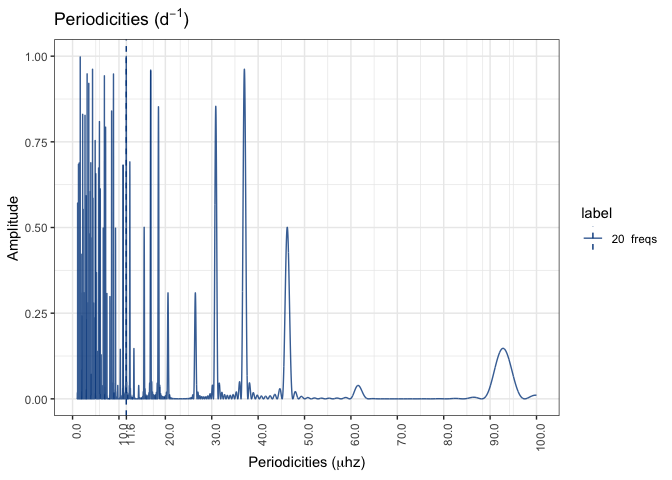

##### Histogram

Peak 1: 34.7196mhz. Value:10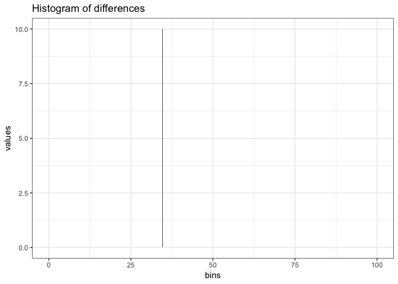

##### Crosscorrelation

Peak 1: 34.7173586793397mhz. Value:0.490205594416557

Peak 2: 150.575287643822mhz. Value:0.439787060083737

Peak 3: 185.292646323162mhz. Value:0.899070817572192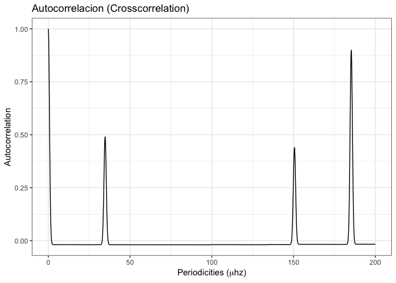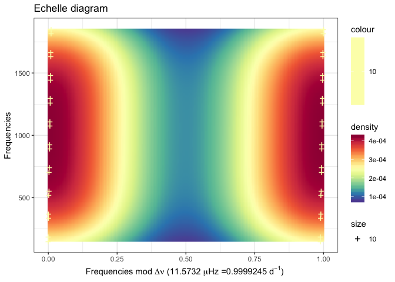

Execution 5
-----------

Num. frequencies: 20

Distance between patterns: 8

Shift: 6

::: Debug information :::

Number of frequences to be processed: 21 Number of frequences after drop the g regimen: 20 Frequencies: 162.037, 185.185, 347.222, 370.37, 532.407, 555.556, 717.593, 740.741, 902.778, 925.926, 1087.96, 1111.11, 1273.15, 1296.3, 1458.33, 1481.48, 1643.52, 1666.67, 1828.7, 1851.85, Range: 20, Iteration over range: 20 Frequencies selected: 162.037, 185.185, 347.222, 370.37, 532.407, 555.556, 717.593, 740.741, 902.778, 925.926, Amplitudes selected: 10, 10, 10, 10, 10, 10, 10, 10, 10, 10, Dnu: 23.1463 Dnu Peak: 23.1463 Dnu Guess: 0 Cross correlation calculated:

Successful process.

##### Apodization


##### Periodicities

Peak:23.1463mhz (d^-1=1.99984032) Amplitude: 0.999867050513546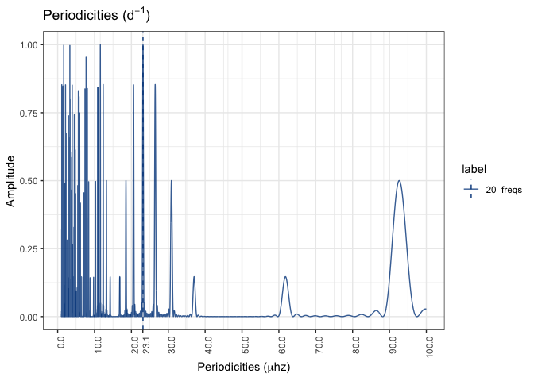

##### Histogram

Peak 1: 22.914837mhz. Value:10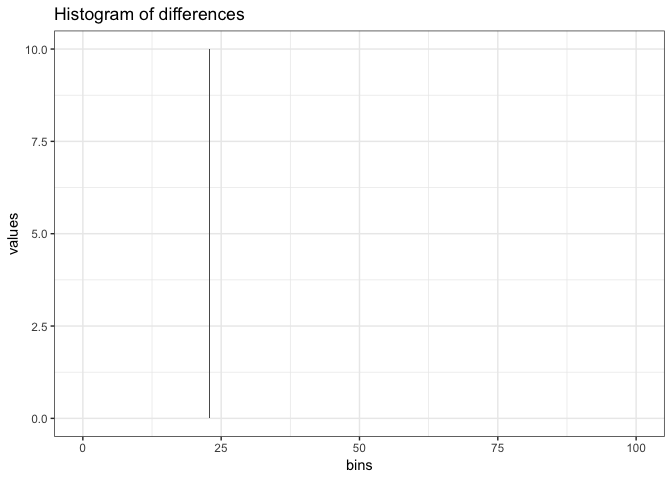

##### Crosscorrelation

Peak 1: 23.1115557778889mhz. Value:0.489406428782854

Peak 2: 162.08104052026mhz. Value:0.44016261658217

Peak 3: 185.292646323162mhz. Value:0.899070817572193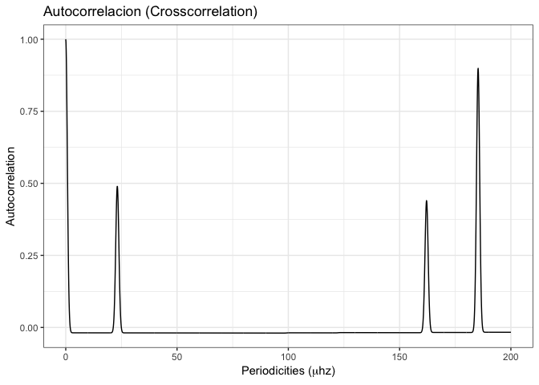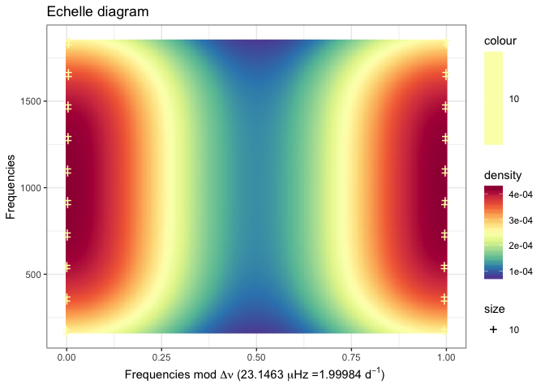

Execution 6
-----------

Num. frequencies: 20

Distance between patterns: 8

Shift: 7

::: Debug information :::

Number of frequences to be processed: 21 Number of frequences after drop the g regimen: 20 Frequencies: 173.611, 185.185, 358.796, 370.37, 543.981, 555.556, 729.167, 740.741, 914.352, 925.926, 1099.54, 1111.11, 1284.72, 1296.3, 1469.91, 1481.48, 1655.09, 1666.67, 1840.28, 1851.85, Range: 20, Iteration over range: 20 Frequencies selected: 173.611, 185.185, 358.796, 370.37, 543.981, 555.556, 729.167, 740.741, 914.352, 925.926, Amplitudes selected: 10, 10, 10, 10, 10, 10, 10, 10, 10, 10, Dnu: 11.5732 Dnu Peak: 11.5732 Dnu Guess: 0 Cross correlation calculated:

Successful process.

##### Apodization


##### Periodicities

Peak:11.5732mhz (d^-1=0.99992448) Amplitude: 0.999524432246528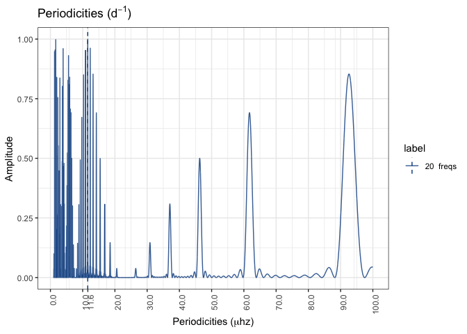

##### Histogram

Peak 1: 11.457468mhz. Value:10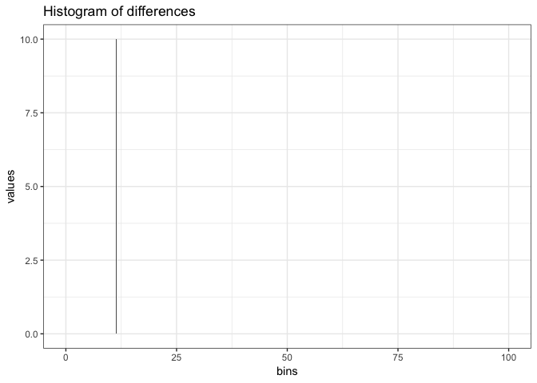

##### Crosscorrelation

Peak 1: 11.6058029014507mhz. Value:0.490279436085672

Peak 2: 173.686843421711mhz. Value:0.440448026034615

Peak 3: 185.292646323162mhz. Value:0.899070817572193

Peak 4: 196.7983991996mhz. Value:0.440550527392634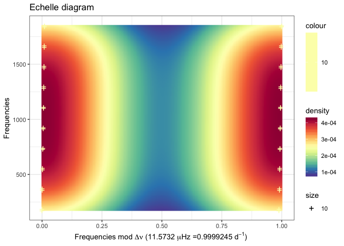

Execution 7
-----------

Num. frequencies: 20

Distance between patterns: 8

Shift: 8

::: Debug information :::

Number of frequences to be processed: 21 Number of frequences after drop the g regimen: 20 Frequencies: 185.185, 185.185, 370.37, 370.37, 555.556, 555.556, 740.741, 740.741, 925.926, 925.926, 1111.11, 1111.11, 1296.3, 1296.3, 1481.48, 1481.48, 1666.67, 1666.67, 1851.85, 1851.85, Range: 20, Iteration over range: 20 Frequencies selected: 185.185, 185.185, 370.37, 370.37, 555.556, 555.556, 740.741, 740.741, 925.926, 925.926, Amplitudes selected: 10, 10, 10, 10, 10, 10, 10, 10, 10, 10, Dnu: 92.5948 Dnu Peak: 92.5948 Dnu Guess: 0 Cross correlation calculated:

Successful process.

##### Apodization

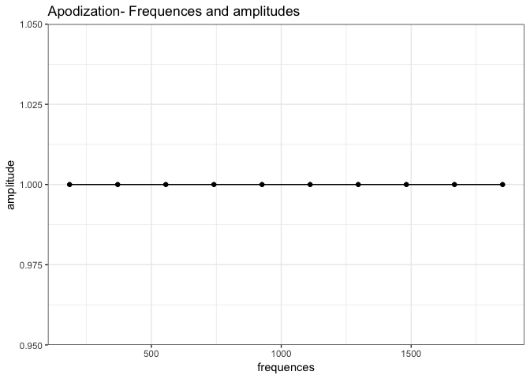

##### Periodicities

Peak:92.5948mhz (d^-1=8.00019072) Amplitude: 0.999999259601818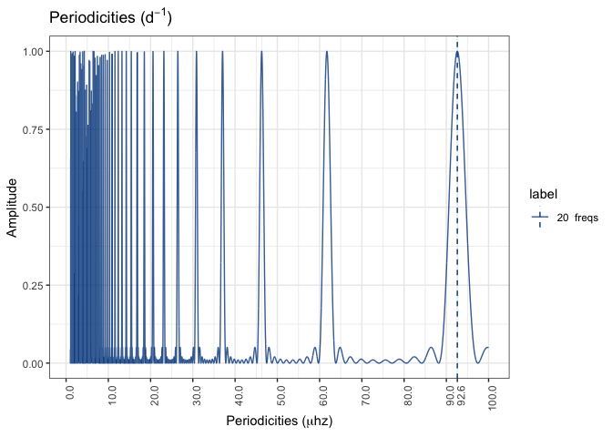

##### Histogram

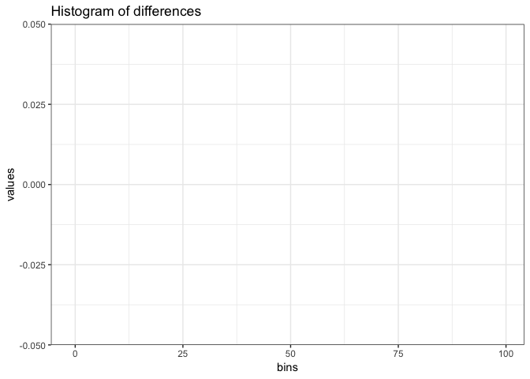

##### Crosscorrelation

Peak 1: 185.292646323162mhz. Value:0.899032816331812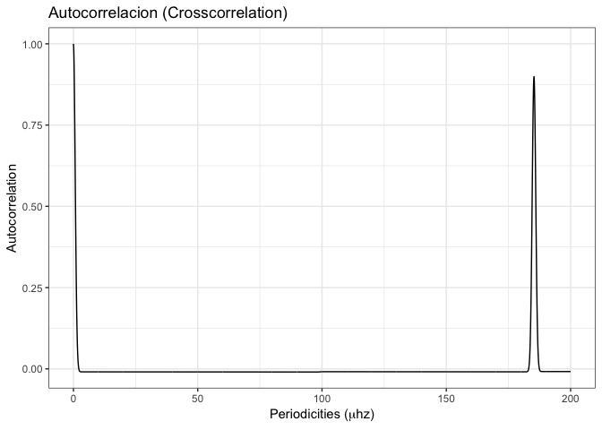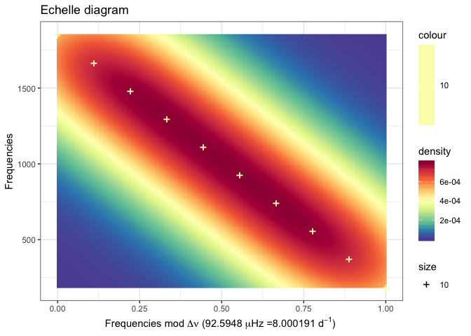

Execution 8
-----------

Num. frequencies: 20

Distance between patterns: 8

Shift: 9

::: Debug information :::

Number of frequences to be processed: 21 Number of frequences after drop the g regimen: 20 Frequencies: 196.759, 185.185, 381.944, 370.37, 567.13, 555.556, 752.315, 740.741, 937.5, 925.926, 1122.69, 1111.11, 1307.87, 1296.3, 1493.06, 1481.48, 1678.24, 1666.67, 1863.43, 1851.85, Range: 20, Iteration over range: 20 Frequencies selected: 196.759, 185.185, 381.944, 370.37, 567.13, 555.556, 752.315, 740.741, 937.5, 925.926, Amplitudes selected: 10, 10, 10, 10, 10, 10, 10, 10, 10, 10, Dnu: 11.5732 Dnu Peak: 11.5732 Dnu Guess: 0 Cross correlation calculated:

Successful process.

##### Apodization

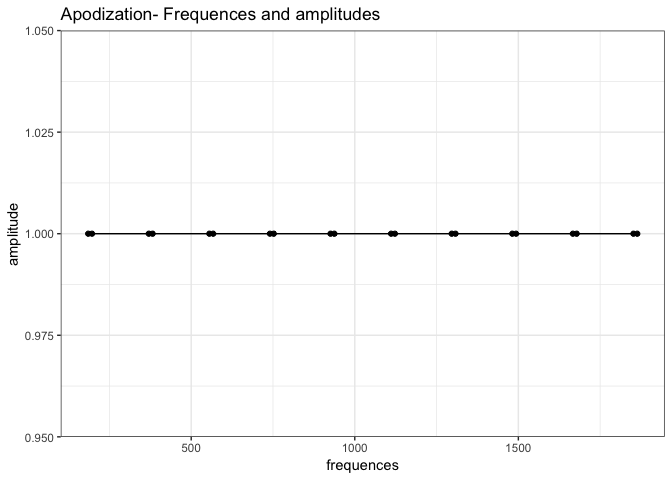

##### Periodicities

Peak:11.5732mhz (d^-1=0.99992448) Amplitude: 0.999524432246528

##### Histogram

Peak 1: 11.457468mhz. Value:10

##### Crosscorrelation

Peak 1: 11.6058029014507mhz. Value:0.49033852654058

Peak 2: 173.686843421711mhz. Value:0.440095923714808

Peak 3: 185.292646323162mhz. Value:0.898167013580332

Peak 4: 196.898449224612mhz. Value:0.440081157605458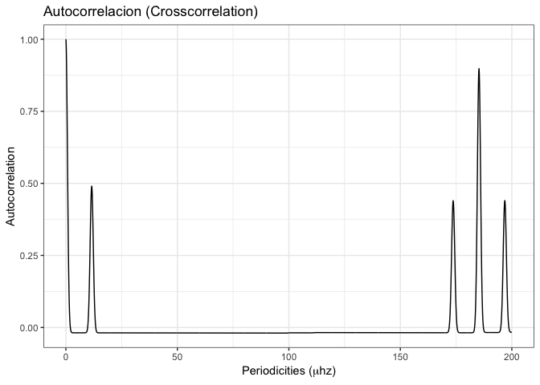

Experiments whit random amplitudes
==================================

Execution 0
-----------

Num. frequencies: 20

Distance between patterns: 8

Shift: 1

::: Debug information :::

Number of frequences to be processed: 21 Number of frequences after drop the g regimen: 20 Frequencies: 1400.46, 474.537, 185.185, 925.926, 1666.67, 1481.48, 555.556, 1111.11, 1030.09, 370.37, 1215.28, 289.352, 104.167, 844.907, 1770.83, 1296.3, 740.741, 1851.85, 659.722, 1585.65, Range: 10, 20, Iteration over range: 10 Frequencies selected: 1400.46, 474.537, 185.185, 925.926, 1666.67, 1481.48, 555.556, 1111.11, 1030.09, 370.37, Amplitudes selected: 13.5738, 13.4301, 13.1174, 12.4482, 11.4027, 10.9957, 10.9218, 10.8015, 10.7196, 10.2586, Dnu: 11.5732 Dnu Peak: 11.5732 Dnu Guess: 0 Cross correlation calculated: Iteration over range: 20 Frequencies selected: 1400.46, 474.537, 185.185, 925.926, 1666.67, 1481.48, 555.556, 1111.11, 1030.09, 370.37, Amplitudes selected: 13.5738, 13.4301, 13.1174, 12.4482, 11.4027, 10.9957, 10.9218, 10.8015, 10.7196, 10.2586,

Successful process.

##### Apodization


##### Periodicities

Peak:11.5732mhz (d^-1=0.99992448) Amplitude: 0.999609118234612 Peak:11.5732mhz (d^-1=0.99992448) Amplitude: 0.999521731252805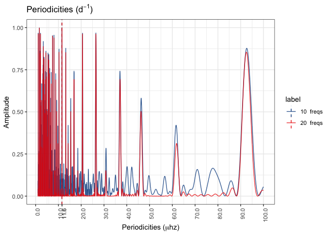

##### Histogram

Peak 1: 80.896668mhz. Value:3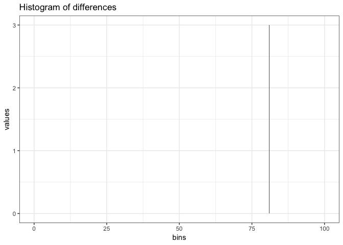

##### Crosscorrelation

Peak 1: 81.0405202601301mhz. Value:0.29237980506326

Peak 2: 104.252126063032mhz. Value:0.191994693881553

Peak 3: 185.292646323162mhz. Value:0.39409628411294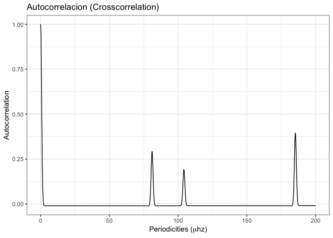

Execution 1
-----------

Num. frequencies: 20

Distance between patterns: 8

Shift: 2

::: Debug information :::

Number of frequences to be processed: 21 Number of frequences after drop the g regimen: 20 Frequencies: 1412.04, 486.111, 185.185, 925.926, 1666.67, 1481.48, 555.556, 1111.11, 1041.67, 370.37, 1226.85, 300.926, 115.741, 856.481, 1782.41, 1296.3, 740.741, 1851.85, 671.296, 1597.22, Range: 10, 20, Iteration over range: 10 Frequencies selected: 1412.04, 486.111, 185.185, 925.926, 1666.67, 1481.48, 555.556, 1111.11, 1041.67, 370.37, Amplitudes selected: 13.5738, 13.4301, 13.1174, 12.4482, 11.4027, 10.9957, 10.9218, 10.8015, 10.7196, 10.2586, Dnu: 23.1463 Dnu Peak: 23.1463 Dnu Guess: 0 Cross correlation calculated: Iteration over range: 20 Frequencies selected: 1412.04, 486.111, 185.185, 925.926, 1666.67, 1481.48, 555.556, 1111.11, 1041.67, 370.37, Amplitudes selected: 13.5738, 13.4301, 13.1174, 12.4482, 11.4027, 10.9957, 10.9218, 10.8015, 10.7196, 10.2586,

Successful process.

##### Apodization


##### Periodicities

Peak:23.1463mhz (d^-1=1.99984032) Amplitude: 0.999890596478313 Peak:23.1463mhz (d^-1=1.99984032) Amplitude: 0.999866547195696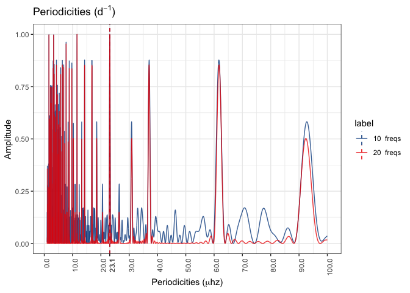

##### Histogram

Peak 1: 69.4389mhz. Value:3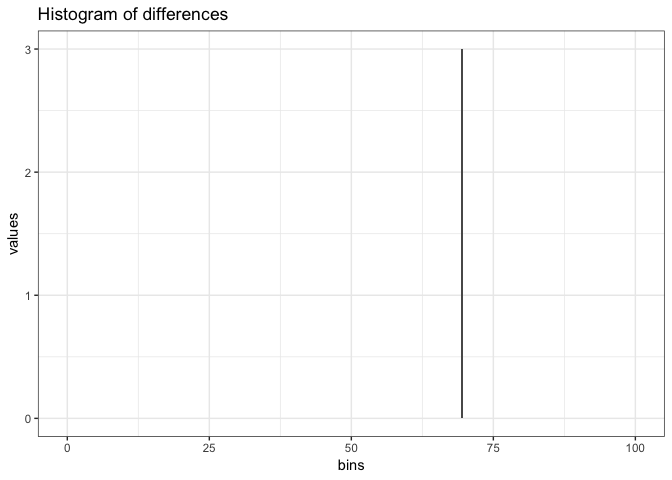

##### Crosscorrelation

Peak 1: 69.4347173586793mhz. Value:0.292008196500072

Peak 2: 115.75787893947mhz. Value:0.192003414053239

Peak 3: 185.292646323162mhz. Value:0.394096284112939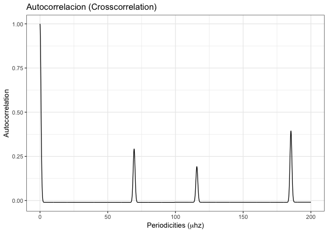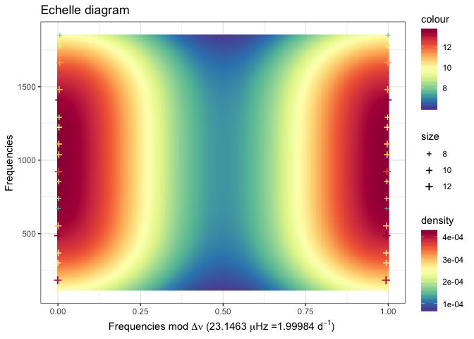

Execution 2
-----------

Num. frequencies: 20

Distance between patterns: 8

Shift: 3

::: Debug information :::

Number of frequences to be processed: 21 Number of frequences after drop the g regimen: 20 Frequencies: 1423.61, 497.685, 185.185, 925.926, 1666.67, 1481.48, 555.556, 1111.11, 1053.24, 370.37, 1238.43, 312.5, 127.315, 868.056, 1793.98, 1296.3, 740.741, 1851.85, 682.87, 1608.8, Range: 10, 20, Iteration over range: 10 Frequencies selected: 1423.61, 497.685, 185.185, 925.926, 1666.67, 1481.48, 555.556, 1111.11, 1053.24, 370.37, Amplitudes selected: 13.5738, 13.4301, 13.1174, 12.4482, 11.4027, 10.9957, 10.9218, 10.8015, 10.7196, 10.2586, Dnu: 11.5732 Dnu Peak: 11.5732 Dnu Guess: 0 Cross correlation calculated: Iteration over range: 20 Frequencies selected: 1423.61, 497.685, 185.185, 925.926, 1666.67, 1481.48, 555.556, 1111.11, 1053.24, 370.37, Amplitudes selected: 13.5738, 13.4301, 13.1174, 12.4482, 11.4027, 10.9957, 10.9218, 10.8015, 10.7196, 10.2586,

Successful process.

##### Apodization


##### Periodicities

Peak:11.5732mhz (d^-1=0.99992448) Amplitude: 0.999607803454957 Peak:11.5732mhz (d^-1=0.99992448) Amplitude: 0.999523081749058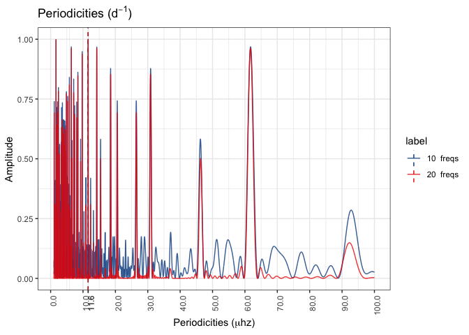

##### Histogram

Peak 1: 57.808134mhz. Value:3

##### Crosscorrelation

Peak 1: 57.9289644822411mhz. Value:0.292243217120516

Peak 2: 127.36368184092mhz. Value:0.192161144354966

Peak 3: 185.292646323162mhz. Value:0.394096284112938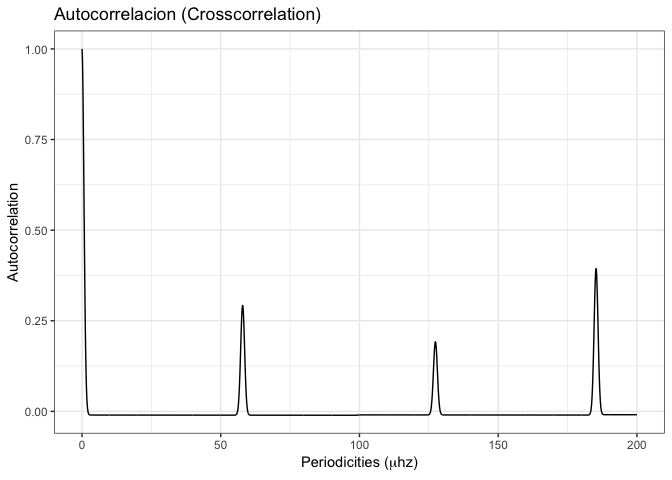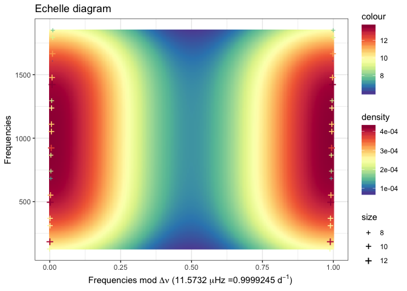

Execution 3
-----------

Num. frequencies: 20

Distance between patterns: 8

Shift: 4

::: Debug information :::

Number of frequences to be processed: 21 Number of frequences after drop the g regimen: 20 Frequencies: 1435.19, 509.259, 185.185, 925.926, 1666.67, 1481.48, 555.556, 1111.11, 1064.81, 370.37, 1250, 324.074, 138.889, 879.63, 1805.56, 1296.3, 740.741, 1851.85, 694.444, 1620.37, Range: 10, 20, Iteration over range: 10 Frequencies selected: 1435.19, 509.259, 185.185, 925.926, 1666.67, 1481.48, 555.556, 1111.11, 1064.81, 370.37, Amplitudes selected: 13.5738, 13.4301, 13.1174, 12.4482, 11.4027, 10.9957, 10.9218, 10.8015, 10.7196, 10.2586, Dnu: 46.2925 Dnu Peak: 46.2925 Dnu Guess: 0 Cross correlation calculated: Iteration over range: 20 Frequencies selected: 1435.19, 509.259, 185.185, 925.926, 1666.67, 1481.48, 555.556, 1111.11, 1064.81, 370.37, Amplitudes selected: 13.5738, 13.4301, 13.1174, 12.4482, 11.4027, 10.9957, 10.9218, 10.8015, 10.7196, 10.2586,

Successful process.

##### Apodization


##### Periodicities

Peak:46.2925mhz (d^-1=3.999672) Amplitude: 0.999971037321705 Peak:46.2925mhz (d^-1=3.999672) Amplitude: 0.999964888589627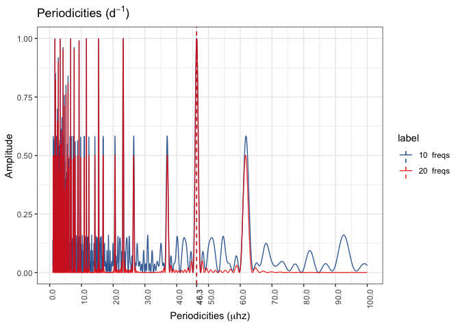

##### Histogram

Peak 1: 45.829575mhz. Value:3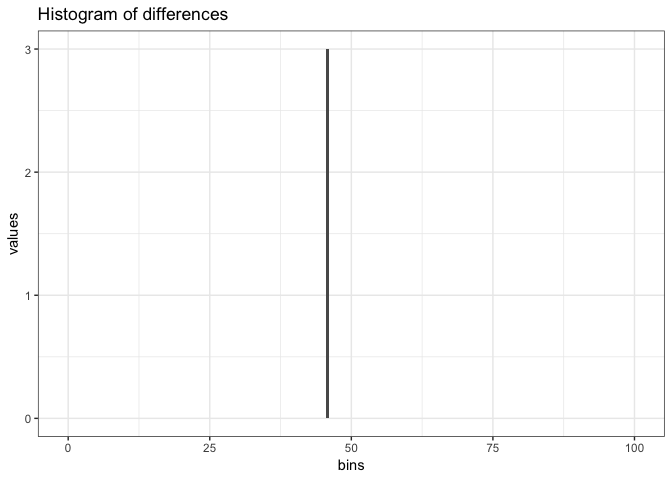

##### Crosscorrelation

Peak 1: 46.3231615807904mhz. Value:0.292625686538441

Peak 2: 138.969484742371mhz. Value:0.192033501109819

Peak 3: 185.292646323162mhz. Value:0.394096284112939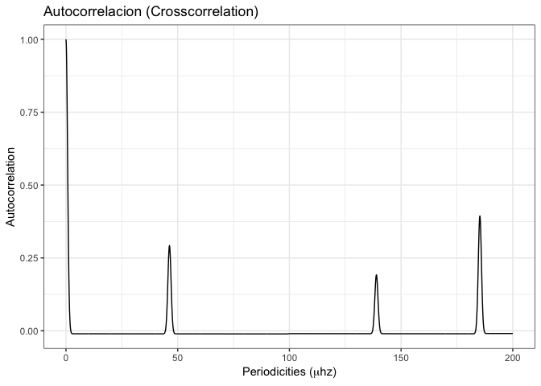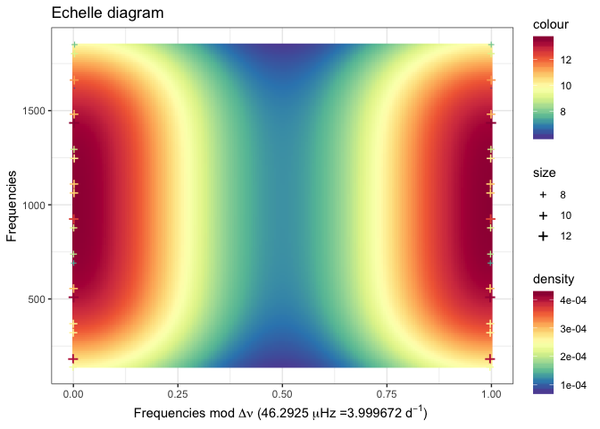

Execution 4
-----------

Num. frequencies: 20

Distance between patterns: 8

Shift: 5

::: Debug information :::

Number of frequences to be processed: 21 Number of frequences after drop the g regimen: 20 Frequencies: 1446.76, 520.833, 185.185, 925.926, 1666.67, 1481.48, 555.556, 1111.11, 1076.39, 370.37, 1261.57, 335.648, 150.463, 891.204, 1817.13, 1296.3, 740.741, 1851.85, 706.019, 1631.94, Range: 10, 20, Iteration over range: 10 Frequencies selected: 1446.76, 520.833, 185.185, 925.926, 1666.67, 1481.48, 555.556, 1111.11, 1076.39, 370.37, Amplitudes selected: 13.5738, 13.4301, 13.1174, 12.4482, 11.4027, 10.9957, 10.9218, 10.8015, 10.7196, 10.2586, Dnu: 11.5732 Dnu Peak: 11.5732 Dnu Guess: 0 Cross correlation calculated: Iteration over range: 20 Frequencies selected: 1446.76, 520.833, 185.185, 925.926, 1666.67, 1481.48, 555.556, 1111.11, 1076.39, 370.37, Amplitudes selected: 13.5738, 13.4301, 13.1174, 12.4482, 11.4027, 10.9957, 10.9218, 10.8015, 10.7196, 10.2586,

Successful process.

##### Apodization


##### Periodicities

Peak:11.5732mhz (d^-1=0.99992448) Amplitude: 0.999606110490137 Peak:11.5732mhz (d^-1=0.99992448) Amplitude: 0.99952398208057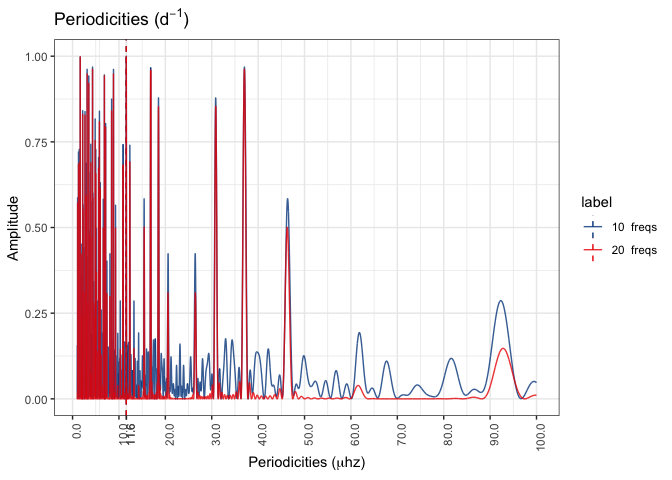

##### Histogram

Peak 1: 34.7196mhz. Value:3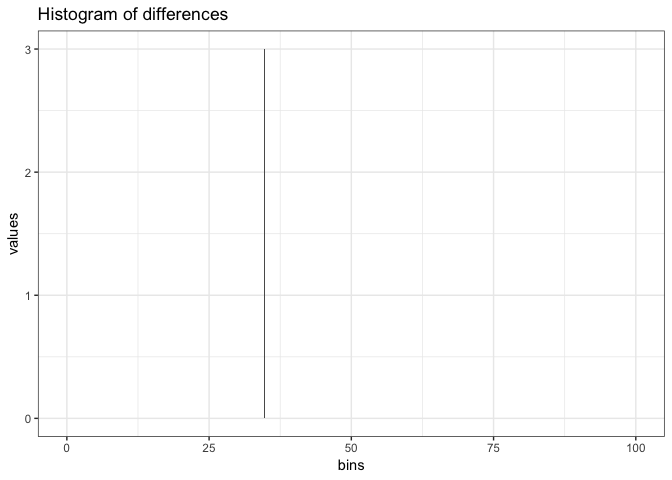

##### Crosscorrelation

Peak 1: 34.7173586793397mhz. Value:0.292580072731532

Peak 2: 150.575287643822mhz. Value:0.191620742988568

Peak 3: 185.292646323162mhz. Value:0.394096284112938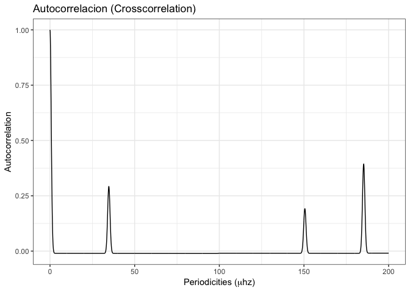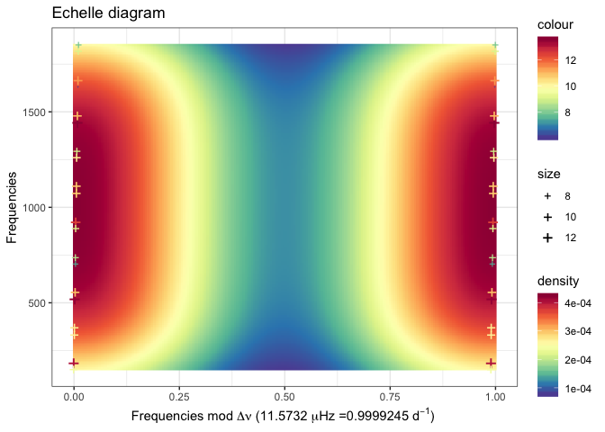

Execution 5
-----------

Num. frequencies: 20

Distance between patterns: 8

Shift: 6

::: Debug information :::

Number of frequences to be processed: 21 Number of frequences after drop the g regimen: 20 Frequencies: 1458.33, 532.407, 185.185, 925.926, 1666.67, 1481.48, 555.556, 1111.11, 1087.96, 370.37, 1273.15, 347.222, 162.037, 902.778, 1828.7, 1296.3, 740.741, 1851.85, 717.593, 1643.52, Range: 10, 20, Iteration over range: 10 Frequencies selected: 1458.33, 532.407, 185.185, 925.926, 1666.67, 1481.48, 555.556, 1111.11, 1087.96, 370.37, Amplitudes selected: 13.5738, 13.4301, 13.1174, 12.4482, 11.4027, 10.9957, 10.9218, 10.8015, 10.7196, 10.2586, Dnu: 23.1463 Dnu Peak: 23.1463 Dnu Guess: 0 Cross correlation calculated: Iteration over range: 20 Frequencies selected: 1458.33, 532.407, 185.185, 925.926, 1666.67, 1481.48, 555.556, 1111.11, 1087.96, 370.37, Amplitudes selected: 13.5738, 13.4301, 13.1174, 12.4482, 11.4027, 10.9957, 10.9218, 10.8015, 10.7196, 10.2586,

Successful process.

##### Apodization


##### Periodicities

Peak:23.1463mhz (d^-1=1.99984032) Amplitude: 0.999889650187404 Peak:23.1463mhz (d^-1=1.99984032) Amplitude: 0.999867050513546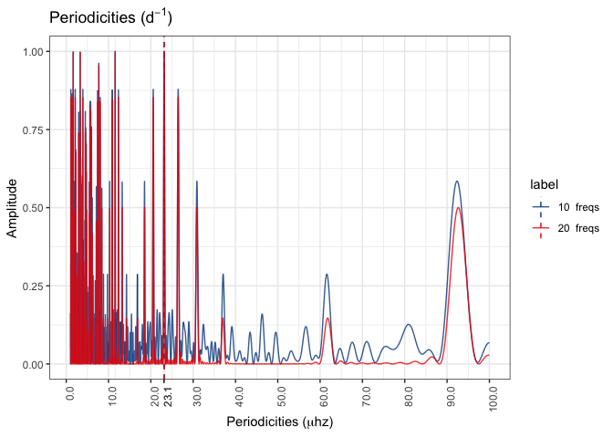

##### Histogram

Peak 1: 22.914837mhz. Value:3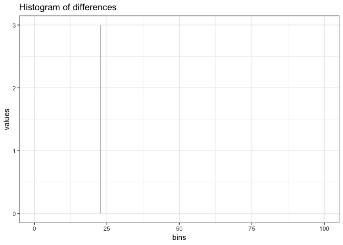

##### Crosscorrelation

Peak 1: 23.1115557778889mhz. Value:0.292106851077687

Peak 2: 162.08104052026mhz. Value:0.191816851060316

Peak 3: 185.292646323162mhz. Value:0.394096284112938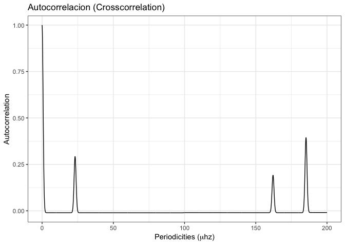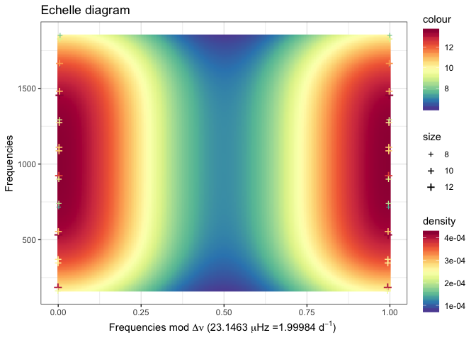

Execution 6
-----------

Num. frequencies: 20

Distance between patterns: 8

Shift: 7

::: Debug information :::

Number of frequences to be processed: 21 Number of frequences after drop the g regimen: 20 Frequencies: 1469.91, 543.981, 185.185, 925.926, 1666.67, 1481.48, 555.556, 1111.11, 1099.54, 370.37, 1284.72, 358.796, 173.611, 914.352, 1840.28, 1296.3, 740.741, 1851.85, 729.167, 1655.09, Range: 10, 20, Iteration over range: 10 Frequencies selected: 1469.91, 543.981, 185.185, 925.926, 1666.67, 1481.48, 555.556, 1111.11, 1099.54, 370.37, Amplitudes selected: 13.5738, 13.4301, 13.1174, 12.4482, 11.4027, 10.9957, 10.9218, 10.8015, 10.7196, 10.2586, Dnu: 11.5732 Dnu Peak: 11.5732 Dnu Guess: 0 Cross correlation calculated: Iteration over range: 20 Frequencies selected: 1469.91, 543.981, 185.185, 925.926, 1666.67, 1481.48, 555.556, 1111.11, 1099.54, 370.37, Amplitudes selected: 13.5738, 13.4301, 13.1174, 12.4482, 11.4027, 10.9957, 10.9218, 10.8015, 10.7196, 10.2586,

Successful process.

##### Apodization

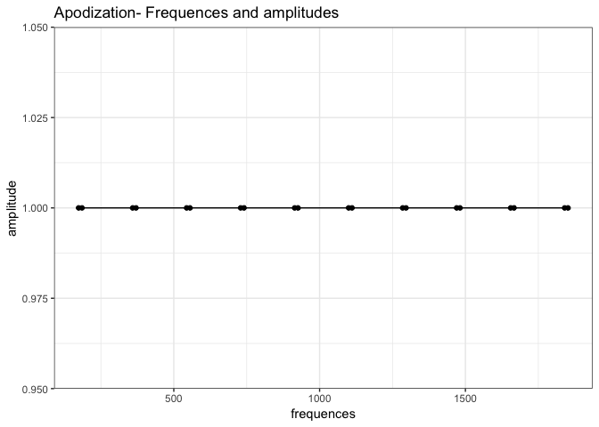

##### Periodicities

Peak:11.5732mhz (d^-1=0.99992448) Amplitude: 0.999604039341676 Peak:11.5732mhz (d^-1=0.99992448) Amplitude: 0.999524432246528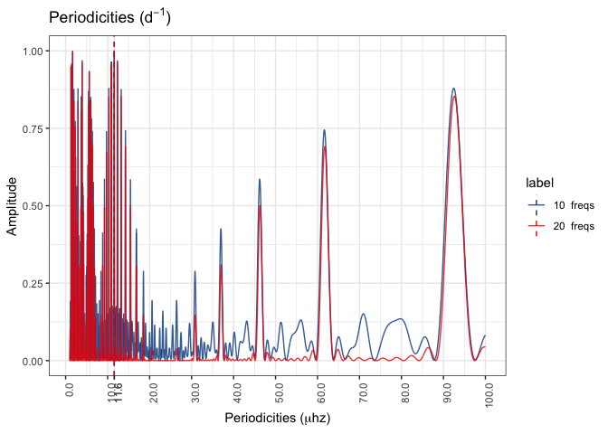

##### Histogram

Peak 1: 11.457468mhz. Value:3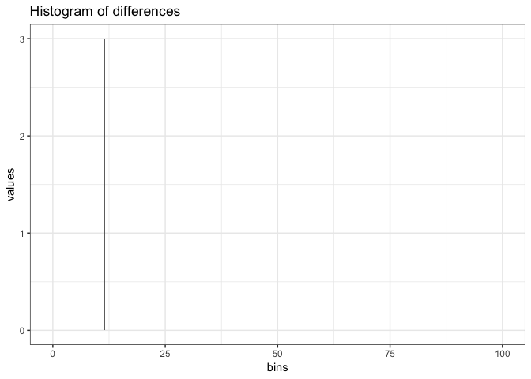

##### Crosscorrelation

Peak 1: 11.6058029014507mhz. Value:0.292622939900477

Peak 2: 173.686843421711mhz. Value:0.1919067153813

Peak 3: 185.292646323162mhz. Value:0.394096284112937

Peak 4: 196.7983991996mhz. Value:0.0915408063505066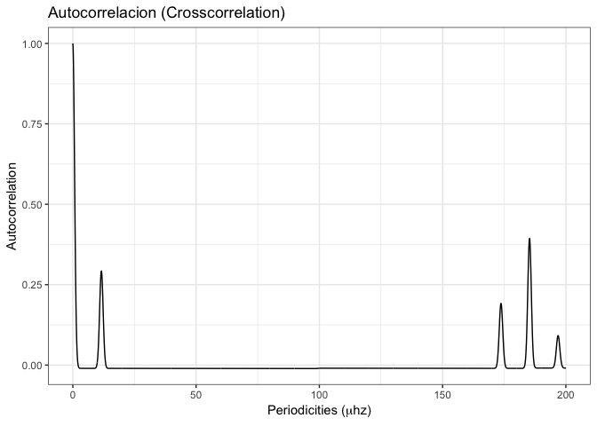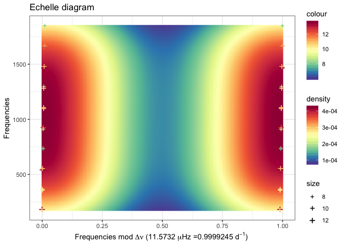

Execution 7
-----------

Num. frequencies: 20

Distance between patterns: 8

Shift: 8

::: Debug information :::

Number of frequences to be processed: 21 Number of frequences after drop the g regimen: 20 Frequencies: 1481.48, 555.556, 185.185, 925.926, 1666.67, 1481.48, 555.556, 1111.11, 1111.11, 370.37, 1296.3, 370.37, 185.185, 925.926, 1851.85, 1296.3, 740.741, 1851.85, 740.741, 1666.67, Range: 10, 20, Iteration over range: 10 Frequencies selected: 1481.48, 555.556, 185.185, 925.926, 1666.67, 1481.48, 555.556, 1111.11, 1111.11, 370.37, Amplitudes selected: 13.5738, 13.4301, 13.1174, 12.4482, 11.4027, 10.9957, 10.9218, 10.8015, 10.7196, 10.2586, Dnu: 92.5948 Dnu Peak: 92.5948 Dnu Guess: 0 Cross correlation calculated: Iteration over range: 20 Frequencies selected: 1481.48, 555.556, 185.185, 925.926, 1666.67, 1481.48, 555.556, 1111.11, 1111.11, 370.37, Amplitudes selected: 13.5738, 13.4301, 13.1174, 12.4482, 11.4027, 10.9957, 10.9218, 10.8015, 10.7196, 10.2586,

Successful process.

##### Apodization


##### Periodicities

Peak:92.5948mhz (d^-1=8.00019072) Amplitude: 0.999999381655302 Peak:92.5948mhz (d^-1=8.00019072) Amplitude: 0.999999259601818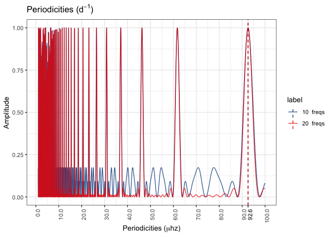

##### Histogram


##### Crosscorrelation

Peak 1: 185.292646323162mhz. Value:0.433940096216259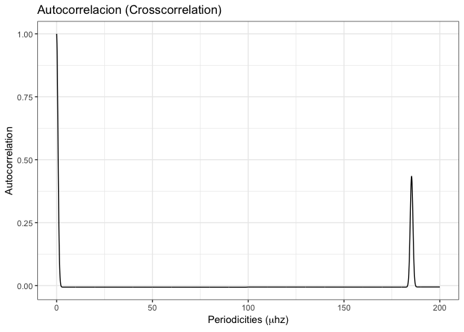

Execution 8
-----------

Num. frequencies: 20

Distance between patterns: 8

Shift: 9

::: Debug information :::

Number of frequences to be processed: 21 Number of frequences after drop the g regimen: 20 Frequencies: 1493.06, 567.13, 185.185, 925.926, 1666.67, 1481.48, 555.556, 1111.11, 1122.69, 370.37, 1307.87, 381.944, 196.759, 937.5, 1863.43, 1296.3, 740.741, 1851.85, 752.315, 1678.24, Range: 10, 20, Iteration over range: 10 Frequencies selected: 1493.06, 567.13, 185.185, 925.926, 1666.67, 1481.48, 555.556, 1111.11, 1122.69, 370.37, Amplitudes selected: 13.5738, 13.4301, 13.1174, 12.4482, 11.4027, 10.9957, 10.9218, 10.8015, 10.7196, 10.2586, Dnu: 11.5732 Dnu Peak: 11.5732 Dnu Guess: 0 Cross correlation calculated: Iteration over range: 20 Frequencies selected: 1493.06, 567.13, 185.185, 925.926, 1666.67, 1481.48, 555.556, 1111.11, 1122.69, 370.37, Amplitudes selected: 13.5738, 13.4301, 13.1174, 12.4482, 11.4027, 10.9957, 10.9218, 10.8015, 10.7196, 10.2586,

Successful process.

##### Apodization


##### Periodicities

Peak:11.5732mhz (d^-1=0.99992448) Amplitude: 0.99960159001144 Peak:11.5732mhz (d^-1=0.99992448) Amplitude: 0.999524432246529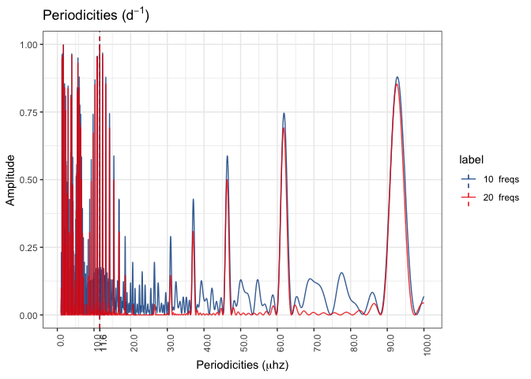

##### Histogram

Peak 1: 11.457468mhz. Value:3

##### Crosscorrelation

Peak 1: 11.6058029014507mhz. Value:0.292622939900476

Peak 2: 173.686843421711mhz. Value:0.0908931091323395

Peak 3: 185.292646323162mhz. Value:0.394096284112938

Peak 4: 196.7983991996mhz. Value:0.192320943449286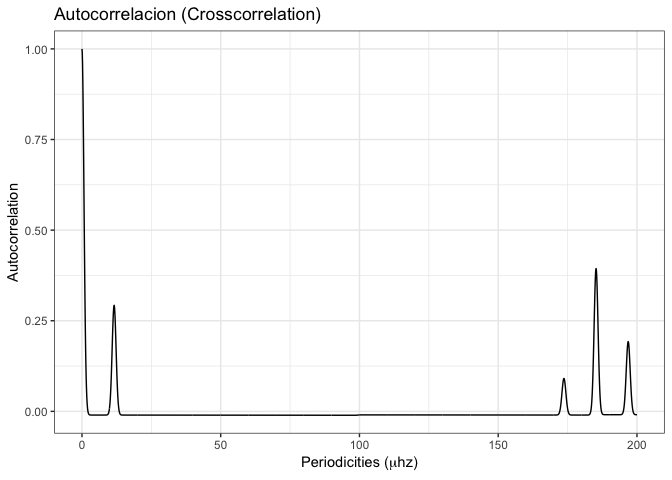

Experiments whit random amplitudes. Boostrapping
================================================

Execution 9
-----------

Num. frequencies: 20

Distance between patterns: 8

Shift: 9

Successful process.

Successful process.

Successful process.

Successful process.

Successful process.

Successful process.

Successful process.

Successful process.

Successful process.

Successful process.

Successful process.

Successful process.

Successful process.

Successful process.

Successful process.

Successful process.

Successful process.

Successful process.

Successful process.

Successful process.

Successful process.

Successful process.

Successful process.

Successful process.

Successful process.

Successful process.

Successful process.

Successful process.

Successful process.

Successful process.

Successful process.

Successful process.

Successful process.

Successful process.

Successful process.

Successful process.

Successful process.

Successful process.

Successful process.

Successful process.

Successful process.

Successful process.

Successful process.

Successful process.

Successful process.

Successful process.

Successful process.

Successful process.

Successful process.

Successful process.

Successful process.

Successful process.

Successful process.

Successful process.

Successful process.

Successful process.

Successful process.

Successful process.

Successful process.

Successful process.

Successful process.

Successful process.

Successful process.

Successful process.

Successful process.

Successful process.

Successful process.

Successful process.

Successful process.

Successful process.

Successful process.

Successful process.

Successful process.

Successful process.

Successful process.

Successful process.

Successful process.

Successful process.

Successful process.

Successful process.

Successful process.

Successful process.

Successful process.

Successful process.

Successful process.

Successful process.

Successful process.

Successful process.

Successful process.

Successful process.

Successful process.

Successful process.

Successful process.

Successful process.

Successful process.

Successful process.

Successful process.

Successful process.

Successful process.

Successful process.

Successful process. 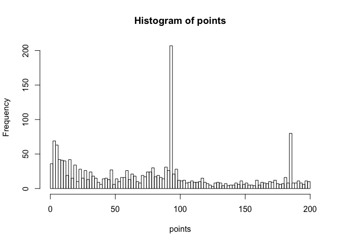
