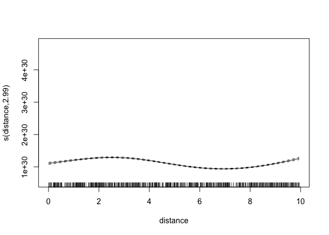
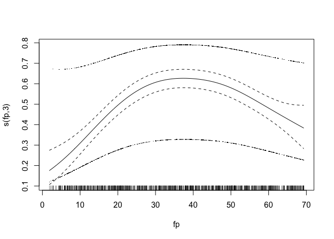

Patterns Experiment
================
Roberto Maestre
10/24/2018

Introduction
============

This results can be calculated through the experimental UI available [here](https://github.com/rmaestre/variableStars/tree/master/inst/shiny-examples/experiment).

Data Generation
===============

``` r
# Select experiment parameters
distance <- 1
numFreqs <- 100
#set.seed(82914)
set.seed(4132093)
periodF <- 0.192
periodS <- 5.29
# Debug info with experiment configuration
print(
  paste(
    " First period:",
    round(periodF, 3),
    " (",
    round(periodF / 0.0864, 3),
    "muHz)",
    " Second period:",
    round(periodS, 3),
    " (",
    round(periodS / 0.0864, 3),
    "muHz)",
    sep = ""
  )
)
```

    ## [1] " First period:0.192 (2.222muHz) Second period:5.29 (61.227muHz)"

``` r
# Data generation
dt <- generate_data(
  numFreqs = numFreqs,
  distance = distance,
  periodF = periodF,
  periodS = periodS,
  baseAMplitudeFirst = 10,
  baseAMplitudeSecond = 10,
  seed = NULL,
  freqOneRandRange = 0.0,
  freqTwoRandRange = 0.0,
  ampRandRange = 1.0
)
# Execute experiment
result <- process(
  frequency = dt$x,
  amplitude = dt$y,
  filter = "uniform",
  gRegimen = 0,
  maxDnu = 15,
  minDnu = 15,
  numFrequencies = ifelse(nrow(dt) == 30, 31, nrow(dt)),
  dnuGuessError = -1,
  debug = F
)
```

Periodicities
-------------

Histogram
---------

Crosscorrelation
----------------

Simple MC
=========

``` r
# size <- 10001 # for calculated amplitudes and frequencies
# experiments <- 1 # number of trials
# percentageOfData <- 100
# 
# count <- 1
# periodicities <-
#   data.frame(matrix(ncol = size, nrow = experiments)) # empty DS to save results
# for (i in seq(from = 1, to = experiments, by = 1)) {
#   percent <- round((nrow(dt) * percentageOfData) / 100)
#   dtSampling <- dt[sample(nrow(dt), percent), ]
# 
#   # Execute experiment
#   resultSampling <- process(
#     frequency = dtSampling$x,
#     amplitude = dtSampling$y,
#     filter = "uniform",
#     gRegimen = 0,
#     maxDnu = 15,
#     minDnu = 15,
#     numFrequencies = nrow(dtSampling) + 1,
#     # process all frecuencies
#     dnuGuessError = -1,
#     debug = F
#   )
#   # Get perioditicies amplitudes and save
#   for (name in names(resultSampling$fresAmps)) {
#     periodicities[count,] <- t(resultSampling$fresAmps[[name]]$b)
#     count <- count + 1
#   }
# }
# 
# # Z-scores of SD
# means <- apply(periodicities, 2, mean, na.rm = TRUE)
# sds <- apply(periodicities, 2, sd, na.rm = TRUE)
# periodicitiesZScored <- (periodicities - means) / sds
# 
# library(reshape2)
# dtZScored <- data.frame(as.matrix(periodicitiesZScored))
# colnames(dtZScored) <- resultSampling$fresAmps[[name]]$fInv
# dtZScored$experiment <- seq.int(nrow(dtZScored))
# 
# 
# dtZScoredMelted <- melt(dtZScored, id.vars = 'experiment')
# dtZScoredMelted <- subset(dtZScoredMelted, value>=5&value<=5000)
# 
# dtZScoredMelted$variable <- as.numeric(as.character(dtZScoredMelted$variable))
# 
# 
# # ggplot(aes(x = variable, y = value, group=experiment), data=dtZScoredMelted) +
# #   geom_point(alpha=0.05) +
# #   scale_x_continuous(breaks=seq(0, ncol(dtZScored), 10)) +
# #   #geom_vline(mapping=aes(xintercept=periodF/0.0864), color="blue") +
# #   #geom_vline(mapping=aes(xintercept=periodS/0.0864), color="red") +
# #   theme_bw()


# Calculate normal
result <- process(
  frequency = dt$x,
  amplitude = dt$y,
  filter = "uniform",
  gRegimen = 0,
  maxDnu = 15,
  minDnu = 15,
  numFrequencies = 30,
  dnuGuessError = -1,
  debug = F
)

size <- 10001 
count <- 1
periodicities <-
  data.frame(matrix(ncol = size, nrow = length(names(result$fresAmps))))
for (name in names(result$fresAmps)) {
  periodicities[count, ] <- t(result$fresAmps[[name]]$b)
  count <- count + 1
}


# # # Calculate mean and sd for all periodicities
dtMerg <- merge(
   prepare_periodicities_dataset(result$fresAmps),
   data.frame("fInv" = result$fresAmps[[names(result$fresAmps)[1]]]$fInv),
   by = "fInv"
)

dtAgg <- data.frame(aggregate(dtMerg$b, by=list(fInv=dtMerg$fInv), FUN=sum))
colnames(dtAgg) <- c("fInv", "b")
```

Get maxs

``` r
# Get network library
library(igraph)
```

    ## Warning: package 'igraph' was built under R version 3.5.2

    ## 
    ## Attaching package: 'igraph'

    ## The following object is masked from 'package:plotly':
    ## 
    ##     groups

    ## The following objects are masked from 'package:stats':
    ## 
    ##     decompose, spectrum

    ## The following object is masked from 'package:base':
    ## 
    ##     union

``` r
library(rgexf)
```

    ## Loading required package: XML

    ## Loading required package: Rook

``` r
trunc <-
  function(x, ..., prec = 1)
    base::trunc(x * 10 ^ prec, ...) / 10 ^ prec


# Paramters
truncPrecision <- 0

# Empty list to save edges
edges <- c()

# Get n
dtAgg$b <- dtAgg$b / (dtAgg$fInv^-1)
hsFreqs <- head(dtAgg[with(dtAgg, order(b)),], 1000)
fs <- trunc(hsFreqs$fInv, prec = truncPrecision)
n <- length(fs)

dtHist <- data.frame("freq" = 0,
                     "residuals" = 0,
                     "b" = 0)

for (i in seq(1:n)) {
  m <- c()
  for (x in seq(from = i + 1, to = n)) {
    mod = fs[i] %% fs[x]
    m <- c(m, ifelse(mod < 0.2, fs[x],-1))
    if (!is.na(mod) & mod < 0.1) {
      if (fs[i] != fs[x]) {
        if (fs[i] > 3.0 & fs[x] > 3.0) {
          edges <- c(fs[i], fs[x], edges)
          #print(paste(fs[i], " ", fs[x], collapse = " "))
        }
      }
    }
  }
}

# Create graph
g <- graph(as.character(edges),
           directed = F)

# Calculate degree
E(g)$weight <- 1
g <- simplify(g, edge.attr.comb = list(weight = "sum"))
# Calculate normalized weigths
E(g)$width <-
  (E(g)$weight - min(E(g)$weight)) / (max(E(g)$weight) - min(E(g)$weight))

# Calculate amplitude
amplitudes = c()
for (vName in V(g)$name) {
  amplitudes <-
    c(mean(hsFreqs[trunc(hsFreqs$fInv, prec = truncPrecision) == trunc(as.numeric(vName), prec =
                                                                         truncPrecision), ]$b), amplitudes)
}

# normalized amplitudes
amplitudes <-
  (amplitudes - min(amplitudes)) / (max(amplitudes) - min(amplitudes))
# Plot and remove vertex
clusterlouvain <- cluster_louvain(g)
e <- get.edgelist(g)
plot(
  delete.vertices(simplify(g), degree(g) == 0),
  edge.width = E(g)$width * 10,
  vertex.size = amplitudes * 10,
  node.width = 1,
  #layout = layout_nicely,
  layout = layout_as_tree,
  vertex.color = rainbow(3, alpha = 0.6)[clusterlouvain$membership],
  vertex.label = trunc(as.numeric(V(g)$name), prec = truncPrecision),
  rescale = T
)
```


``` r
#cat("My title", as.character(igraph.to.gexf(g, position=NULL)), file="~/Downloads/perio.gexf", sep="n", append=F)
```

``` r
# Experiment results
results <- data.frame(matrix(ncol = 7, nrow = 1))
colnames(results) <-
  c("fp", "sp", "fpos", "spos", "nfreq", "distance", "numFreqs")
count <- 1

for (experiment in seq(1:1000)) {
  # Select experiment parameters
  distance <- trunc(runif(1, 0, 10), prec=4)
  numFreqs <- 100
  periodF <- trunc(runif(1, 0.1, 6), prec=4)
  periodS <- trunc(runif(1, 0.1, 6), prec=4)
  # Debug info with experiment configuration
  if (count %% 10 == 0) {
    print(
      paste(
        "Experiment:",
        count,
        " | distance:",
        distance,
        " | numFreqs:",
        numFreqs,
        " | 1º period:",
        round(periodF, 3),
        " (",
        round(periodF / 0.0864, 3),
        "muHz)",
        " | 2º period:",
        round(periodS, 3),
        " (",
        round(periodS / 0.0864, 3),
        "muHz)",
        sep = ""
      )
    )
  }
  
  # Data generation
  dt <- generate_data(
    numFreqs = numFreqs,
    distance = distance,
    periodF = periodF,
    periodS = periodS,
    baseAMplitudeFirst = 10,
    baseAMplitudeSecond = 10,
    seed = NULL,
    freqOneRandRange = 0.1,
    freqTwoRandRange = 0.1,
    ampRandRange = 1.0
  )
  # Execute experiment
  result <- process(
    frequency = dt$x,
    amplitude = dt$y,
    filter = "uniform",
    gRegimen = 0,
    maxDnu = 15,
    minDnu = 15,
    numFrequencies = ifelse(nrow(dt) == 30, 31, nrow(dt)+1),
    dnuGuessError = -1,
    debug = F
  )
  
  #plot_histogram(data.frame(result$diffHistogram$histogram))
  
  #Check into histogram by sorting by desc amplitudes
  dtHist <- data.frame(result$diffHistogram$histogram)
  dtHist <- dtHist[dtHist$values != 0,]
  
  # Match
  binF <-
    dtHist[which.min((trunc(dtHist$bins, prec = 1) - trunc(periodF / 0.0864, prec =
                                                             1)) ^ 2) + 1,]
  binS <-
    dtHist[which.min((trunc(dtHist$bins, prec = 1) - trunc(periodS / 0.0864, prec =
                                                             1)) ^ 2) + 1,]
  # Reorder
  dtHist <- dtHist[with(dtHist, order(-values)), ]
  row.names(dtHist) <- seq(1:dim(dtHist)[1])
  
  
  #print(which(trunc(dtHist$bins, prec = 1) == trunc(binF$bins, prec = 1))[1])
  #print(which(trunc(dtHist$bins, prec = 1) == trunc(binS$bins, prec = 1))[1])
  
  results[count, "fp"] <- periodF / 0.0864
  results[count, "sp"] <- periodS / 0.0864
  fposVal <- which(trunc(dtHist$bins, prec = 1) == trunc(binF$bins, prec = 1))[1]
  sposVal <- which(trunc(dtHist$bins, prec = 1) == trunc(binS$bins, prec = 1))[1]
  results[count, "fpos"] <- ifelse(is.na(fposVal),stop(),fposVal)
  results[count, "spos"] <- ifelse(is.na(sposVal),stop(),sposVal)
  results[count, "nfreq"] <- nrow(dt)
  results[count, "nBins"] <- nrow(dtHist)
  results[count, "distance"] <- distance
  results[count, "numFreqs"] <- numFreqs
  count <- count + 1
}
```

    ## [1] "Experiment:10 | distance:1.9861 | numFreqs:100 | 1º period:1.038 (12.01muHz) | 2º period:4.54 (52.541muHz)"
    ## [1] "Experiment:20 | distance:4.6922 | numFreqs:100 | 1º period:1.052 (12.177muHz) | 2º period:5.892 (68.198muHz)"
    ## [1] "Experiment:30 | distance:0.7766 | numFreqs:100 | 1º period:3.855 (44.62muHz) | 2º period:1.381 (15.987muHz)"
    ## [1] "Experiment:40 | distance:8.7542 | numFreqs:100 | 1º period:0.328 (3.791muHz) | 2º period:0.587 (6.789muHz)"
    ## [1] "Experiment:50 | distance:6.6556 | numFreqs:100 | 1º period:0.33 (3.821muHz) | 2º period:0.703 (8.137muHz)"
    ## [1] "Experiment:60 | distance:2.3688 | numFreqs:100 | 1º period:3.146 (36.407muHz) | 2º period:3.663 (42.395muHz)"
    ## [1] "Experiment:70 | distance:9.3655 | numFreqs:100 | 1º period:5.762 (66.686muHz) | 2º period:2.182 (25.259muHz)"
    ## [1] "Experiment:80 | distance:7.0593 | numFreqs:100 | 1º period:3.028 (35.051muHz) | 2º period:3.283 (38.002muHz)"
    ## [1] "Experiment:90 | distance:7.8682 | numFreqs:100 | 1º period:3.678 (42.574muHz) | 2º period:2.588 (29.953muHz)"
    ## [1] "Experiment:100 | distance:1.0941 | numFreqs:100 | 1º period:1.564 (18.108muHz) | 2º period:1.736 (20.098muHz)"
    ## [1] "Experiment:110 | distance:5.8672 | numFreqs:100 | 1º period:5.196 (60.133muHz) | 2º period:1.224 (14.169muHz)"
    ## [1] "Experiment:120 | distance:5.392 | numFreqs:100 | 1º period:1.403 (16.233muHz) | 2º period:0.612 (7.082muHz)"
    ## [1] "Experiment:130 | distance:8.5769 | numFreqs:100 | 1º period:1.781 (20.609muHz) | 2º period:2.976 (34.442muHz)"
    ## [1] "Experiment:140 | distance:8.1962 | numFreqs:100 | 1º period:2.264 (26.204muHz) | 2º period:3.82 (44.218muHz)"
    ## [1] "Experiment:150 | distance:5.6637 | numFreqs:100 | 1º period:5.695 (65.914muHz) | 2º period:2.963 (34.294muHz)"
    ## [1] "Experiment:160 | distance:9.9889 | numFreqs:100 | 1º period:5.611 (64.939muHz) | 2º period:0.734 (8.497muHz)"
    ## [1] "Experiment:170 | distance:1.0359 | numFreqs:100 | 1º period:4.861 (56.262muHz) | 2º period:1.45 (16.78muHz)"
    ## [1] "Experiment:180 | distance:9.1233 | numFreqs:100 | 1º period:5.432 (62.872muHz) | 2º period:5.704 (66.016muHz)"
    ## [1] "Experiment:190 | distance:6.5211 | numFreqs:100 | 1º period:4.018 (46.508muHz) | 2º period:1.184 (13.707muHz)"
    ## [1] "Experiment:200 | distance:6.3279 | numFreqs:100 | 1º period:5.216 (60.374muHz) | 2º period:5.486 (63.491muHz)"
    ## [1] "Experiment:210 | distance:5.5305 | numFreqs:100 | 1º period:3.696 (42.775muHz) | 2º period:4.525 (52.377muHz)"
    ## [1] "Experiment:220 | distance:4.0405 | numFreqs:100 | 1º period:0.929 (10.751muHz) | 2º period:0.924 (10.697muHz)"
    ## [1] "Experiment:230 | distance:1.8216 | numFreqs:100 | 1º period:3.589 (41.537muHz) | 2º period:4.792 (55.457muHz)"
    ## [1] "Experiment:240 | distance:6.9551 | numFreqs:100 | 1º period:5.803 (67.162muHz) | 2º period:0.705 (8.157muHz)"
    ## [1] "Experiment:250 | distance:9.2691 | numFreqs:100 | 1º period:1.036 (11.986muHz) | 2º period:5.61 (64.933muHz)"
    ## [1] "Experiment:260 | distance:6.0353 | numFreqs:100 | 1º period:5.905 (68.347muHz) | 2º period:3.698 (42.796muHz)"
    ## [1] "Experiment:270 | distance:8.8226 | numFreqs:100 | 1º period:1.078 (12.481muHz) | 2º period:3.724 (43.103muHz)"
    ## [1] "Experiment:280 | distance:9.9415 | numFreqs:100 | 1º period:3.831 (44.339muHz) | 2º period:1.269 (14.69muHz)"
    ## [1] "Experiment:290 | distance:0.0073 | numFreqs:100 | 1º period:3.666 (42.432muHz) | 2º period:4.978 (57.617muHz)"
    ## [1] "Experiment:300 | distance:2.8218 | numFreqs:100 | 1º period:5.925 (68.579muHz) | 2º period:3.692 (42.736muHz)"
    ## [1] "Experiment:310 | distance:1.0173 | numFreqs:100 | 1º period:3.449 (39.92muHz) | 2º period:2.906 (33.638muHz)"
    ## [1] "Experiment:320 | distance:0.2208 | numFreqs:100 | 1º period:3.805 (44.043muHz) | 2º period:4.453 (51.544muHz)"
    ## [1] "Experiment:330 | distance:8.9353 | numFreqs:100 | 1º period:1.287 (14.896muHz) | 2º period:2.829 (32.742muHz)"
    ## [1] "Experiment:340 | distance:9.2455 | numFreqs:100 | 1º period:3.825 (44.266muHz) | 2º period:5.5 (63.662muHz)"
    ## [1] "Experiment:350 | distance:7.6167 | numFreqs:100 | 1º period:0.804 (9.31muHz) | 2º period:4.859 (56.24muHz)"
    ## [1] "Experiment:360 | distance:0.6703 | numFreqs:100 | 1º period:2.577 (29.822muHz) | 2º period:3.48 (40.278muHz)"
    ## [1] "Experiment:370 | distance:9.7452 | numFreqs:100 | 1º period:3.038 (35.156muHz) | 2º period:3.605 (41.721muHz)"
    ## [1] "Experiment:380 | distance:4.4593 | numFreqs:100 | 1º period:5.261 (60.887muHz) | 2º period:3.924 (45.417muHz)"
    ## [1] "Experiment:390 | distance:2.3386 | numFreqs:100 | 1º period:4.32 (50.006muHz) | 2º period:2.663 (30.823muHz)"
    ## [1] "Experiment:400 | distance:2.1111 | numFreqs:100 | 1º period:0.326 (3.779muHz) | 2º period:3.237 (37.462muHz)"
    ## [1] "Experiment:410 | distance:7.4085 | numFreqs:100 | 1º period:3.017 (34.917muHz) | 2º period:0.364 (4.213muHz)"
    ## [1] "Experiment:420 | distance:9.4688 | numFreqs:100 | 1º period:3.24 (37.502muHz) | 2º period:5.837 (67.559muHz)"
    ## [1] "Experiment:430 | distance:9.6912 | numFreqs:100 | 1º period:3.417 (39.551muHz) | 2º period:4.197 (48.578muHz)"
    ## [1] "Experiment:440 | distance:5.5886 | numFreqs:100 | 1º period:0.989 (11.444muHz) | 2º period:1.939 (22.442muHz)"
    ## [1] "Experiment:450 | distance:4.2492 | numFreqs:100 | 1º period:3.963 (45.867muHz) | 2º period:0.785 (9.089muHz)"
    ## [1] "Experiment:460 | distance:7.8396 | numFreqs:100 | 1º period:0.457 (5.285muHz) | 2º period:4.941 (57.193muHz)"
    ## [1] "Experiment:470 | distance:2.0963 | numFreqs:100 | 1º period:1.119 (12.953muHz) | 2º period:1.446 (16.737muHz)"
    ## [1] "Experiment:480 | distance:7.5943 | numFreqs:100 | 1º period:4.992 (57.773muHz) | 2º period:1.463 (16.928muHz)"
    ## [1] "Experiment:490 | distance:0.1312 | numFreqs:100 | 1º period:4.899 (56.699muHz) | 2º period:2.123 (24.566muHz)"
    ## [1] "Experiment:500 | distance:8.1307 | numFreqs:100 | 1º period:4.502 (52.102muHz) | 2º period:4.825 (55.848muHz)"
    ## [1] "Experiment:510 | distance:0.622 | numFreqs:100 | 1º period:0.943 (10.911muHz) | 2º period:3.44 (39.812muHz)"
    ## [1] "Experiment:520 | distance:0.8523 | numFreqs:100 | 1º period:0.498 (5.766muHz) | 2º period:1.31 (15.162muHz)"
    ## [1] "Experiment:530 | distance:0.9671 | numFreqs:100 | 1º period:4.556 (52.727muHz) | 2º period:4.824 (55.832muHz)"
    ## [1] "Experiment:540 | distance:4.9047 | numFreqs:100 | 1º period:0.289 (3.347muHz) | 2º period:4.763 (55.126muHz)"
    ## [1] "Experiment:550 | distance:0.8244 | numFreqs:100 | 1º period:1.86 (21.524muHz) | 2º period:1.456 (16.855muHz)"
    ## [1] "Experiment:560 | distance:2.4993 | numFreqs:100 | 1º period:3.612 (41.803muHz) | 2º period:1.175 (13.598muHz)"
    ## [1] "Experiment:570 | distance:9.9025 | numFreqs:100 | 1º period:2.509 (29.042muHz) | 2º period:1.61 (18.637muHz)"
    ## [1] "Experiment:580 | distance:2.7764 | numFreqs:100 | 1º period:2.749 (31.823muHz) | 2º period:3.871 (44.802muHz)"
    ## [1] "Experiment:590 | distance:2.072 | numFreqs:100 | 1º period:3.834 (44.377muHz) | 2º period:0.397 (4.593muHz)"
    ## [1] "Experiment:600 | distance:4.1844 | numFreqs:100 | 1º period:5.983 (69.251muHz) | 2º period:0.145 (1.677muHz)"
    ## [1] "Experiment:610 | distance:3.4234 | numFreqs:100 | 1º period:3.585 (41.494muHz) | 2º period:0.366 (4.24muHz)"
    ## [1] "Experiment:620 | distance:6.5689 | numFreqs:100 | 1º period:2.87 (33.219muHz) | 2º period:0.761 (8.811muHz)"
    ## [1] "Experiment:630 | distance:5.1581 | numFreqs:100 | 1º period:5.347 (61.888muHz) | 2º period:4.951 (57.306muHz)"
    ## [1] "Experiment:640 | distance:2.2256 | numFreqs:100 | 1º period:1.205 (13.942muHz) | 2º period:1.125 (13.024muHz)"
    ## [1] "Experiment:650 | distance:9.3504 | numFreqs:100 | 1º period:0.554 (6.418muHz) | 2º period:4.807 (55.632muHz)"
    ## [1] "Experiment:660 | distance:2.7579 | numFreqs:100 | 1º period:4.53 (52.431muHz) | 2º period:4.386 (50.762muHz)"
    ## [1] "Experiment:670 | distance:2.431 | numFreqs:100 | 1º period:0.803 (9.294muHz) | 2º period:1.659 (19.206muHz)"
    ## [1] "Experiment:680 | distance:3.2501 | numFreqs:100 | 1º period:5.985 (69.269muHz) | 2º period:4.782 (55.353muHz)"
    ## [1] "Experiment:690 | distance:5.0518 | numFreqs:100 | 1º period:5.9 (68.284muHz) | 2º period:2.299 (26.609muHz)"
    ## [1] "Experiment:700 | distance:0.4783 | numFreqs:100 | 1º period:4.343 (50.262muHz) | 2º period:3.841 (44.451muHz)"
    ## [1] "Experiment:710 | distance:8.1731 | numFreqs:100 | 1º period:1.398 (16.184muHz) | 2º period:2.142 (24.792muHz)"
    ## [1] "Experiment:720 | distance:6.2746 | numFreqs:100 | 1º period:3.118 (36.09muHz) | 2º period:4.856 (56.2muHz)"
    ## [1] "Experiment:730 | distance:6.0764 | numFreqs:100 | 1º period:5.608 (64.911muHz) | 2º period:3.904 (45.182muHz)"
    ## [1] "Experiment:740 | distance:6.3152 | numFreqs:100 | 1º period:5.903 (68.325muHz) | 2º period:1.233 (14.27muHz)"
    ## [1] "Experiment:750 | distance:9.5752 | numFreqs:100 | 1º period:1.4 (16.204muHz) | 2º period:5.48 (63.424muHz)"
    ## [1] "Experiment:760 | distance:4.2488 | numFreqs:100 | 1º period:4.11 (47.571muHz) | 2º period:4.517 (52.275muHz)"
    ## [1] "Experiment:770 | distance:7.3097 | numFreqs:100 | 1º period:3.175 (36.744muHz) | 2º period:4.898 (56.686muHz)"
    ## [1] "Experiment:780 | distance:6.0114 | numFreqs:100 | 1º period:1.66 (19.216muHz) | 2º period:0.23 (2.664muHz)"
    ## [1] "Experiment:790 | distance:9.8906 | numFreqs:100 | 1º period:2.498 (28.91muHz) | 2º period:4.178 (48.359muHz)"
    ## [1] "Experiment:800 | distance:5.3636 | numFreqs:100 | 1º period:4.752 (55muHz) | 2º period:5.037 (58.301muHz)"
    ## [1] "Experiment:810 | distance:3.707 | numFreqs:100 | 1º period:5.751 (66.561muHz) | 2º period:5.029 (58.209muHz)"
    ## [1] "Experiment:820 | distance:6.3685 | numFreqs:100 | 1º period:5.04 (58.334muHz) | 2º period:5.475 (63.368muHz)"
    ## [1] "Experiment:830 | distance:0.7175 | numFreqs:100 | 1º period:3.46 (40.044muHz) | 2º period:0.497 (5.756muHz)"
    ## [1] "Experiment:840 | distance:6.4024 | numFreqs:100 | 1º period:5.604 (64.866muHz) | 2º period:1.576 (18.237muHz)"
    ## [1] "Experiment:850 | distance:6.8335 | numFreqs:100 | 1º period:4.232 (48.985muHz) | 2º period:5.106 (59.1muHz)"
    ## [1] "Experiment:860 | distance:6.6679 | numFreqs:100 | 1º period:5.05 (58.453muHz) | 2º period:3.324 (38.476muHz)"
    ## [1] "Experiment:870 | distance:9.9078 | numFreqs:100 | 1º period:1.887 (21.841muHz) | 2º period:4.953 (57.326muHz)"
    ## [1] "Experiment:880 | distance:2.8977 | numFreqs:100 | 1º period:4.12 (47.686muHz) | 2º period:1.087 (12.582muHz)"
    ## [1] "Experiment:890 | distance:0.3124 | numFreqs:100 | 1º period:4.068 (47.08muHz) | 2º period:1.016 (11.758muHz)"
    ## [1] "Experiment:900 | distance:3.0213 | numFreqs:100 | 1º period:5.08 (58.801muHz) | 2º period:3.688 (42.683muHz)"
    ## [1] "Experiment:910 | distance:6.7861 | numFreqs:100 | 1º period:2.55 (29.52muHz) | 2º period:2.086 (24.141muHz)"
    ## [1] "Experiment:920 | distance:2.3608 | numFreqs:100 | 1º period:0.416 (4.816muHz) | 2º period:4.8 (55.552muHz)"
    ## [1] "Experiment:930 | distance:5.6251 | numFreqs:100 | 1º period:4.825 (55.848muHz) | 2º period:0.834 (9.659muHz)"
    ## [1] "Experiment:940 | distance:8.7887 | numFreqs:100 | 1º period:1.93 (22.334muHz) | 2º period:0.742 (8.583muHz)"
    ## [1] "Experiment:950 | distance:0.3372 | numFreqs:100 | 1º period:0.748 (8.653muHz) | 2º period:3.766 (43.586muHz)"
    ## [1] "Experiment:960 | distance:6.7773 | numFreqs:100 | 1º period:1.073 (12.421muHz) | 2º period:2.864 (33.142muHz)"
    ## [1] "Experiment:970 | distance:5.2601 | numFreqs:100 | 1º period:3.937 (45.569muHz) | 2º period:2.985 (34.545muHz)"
    ## [1] "Experiment:980 | distance:2.4259 | numFreqs:100 | 1º period:4.096 (47.402muHz) | 2º period:5.314 (61.508muHz)"
    ## [1] "Experiment:990 | distance:3.3372 | numFreqs:100 | 1º period:0.607 (7.021muHz) | 2º period:3.415 (39.521muHz)"
    ## [1] "Experiment:1000 | distance:3.2541 | numFreqs:100 | 1º period:1.804 (20.88muHz) | 2º period:3.222 (37.293muHz)"

``` r
# Feature generation
results$gap <- (results$fp - results$sp) ^ 2
results$first <- ifelse(results$fpos < 30, 1, 0)
results$fpsp <- results$fp + results$sp

results$fpos_norm <- results$fpos / results$numFreqs

# Remove outliers based on boxplot
resultsFilter <- results[results$nfreq < 1000,]
resultsFilter <- resultsFilter[resultsFilter$fpos < 400,]
```

fir non-lineal model

    ## 
    ## Family: poisson 
    ## Link function: log 
    ## 
    ## Formula:
    ## fpos_norm ~ nfreq + distance
    ## 
    ## Parametric coefficients:
    ##               Estimate Std. Error z value Pr(>|z|)    
    ## (Intercept) -0.6737683  0.0852354  -7.905 2.68e-15 ***
    ## nfreq        0.0026923  0.0002348  11.469  < 2e-16 ***
    ## distance    -0.0185983  0.0138230  -1.345    0.178    
    ## ---
    ## Signif. codes:  0 '***' 0.001 '**' 0.01 '*' 0.05 '.' 0.1 ' ' 1
    ## 
    ## 
    ## R-sq.(adj) =  0.0425   Deviance explained = 12.7%
    ## UBRE = -0.28751  Scale est. = 1         n = 917


    ## 
    ## Family: poisson 
    ## Link function: log 
    ## 
    ## Formula:
    ## fpos ~ s(nfreq, k = 4) + s(distance, k = 4)
    ## 
    ## Parametric coefficients:
    ##             Estimate Std. Error z value Pr(>|z|)    
    ## (Intercept) 4.018492   0.004669   860.8   <2e-16 ***
    ## ---
    ## Signif. codes:  0 '***' 0.001 '**' 0.01 '*' 0.05 '.' 0.1 ' ' 1
    ## 
    ## Approximate significance of smooth terms:
    ##               edf Ref.df  Chi.sq p-value    
    ## s(nfreq)    2.995      3 22163.2  <2e-16 ***
    ## s(distance) 2.997      3   670.7  <2e-16 ***
    ## ---
    ## Signif. codes:  0 '***' 0.001 '**' 0.01 '*' 0.05 '.' 0.1 ' ' 1
    ## 
    ## R-sq.(adj) =  0.222   Deviance explained = 28.6%
    ## UBRE = 56.741  Scale est. = 1         n = 917



    ## 
    ## Family: binomial 
    ## Link function: logit 
    ## 
    ## Formula:
    ## first ~ s(fp)
    ## 
    ## Parametric coefficients:
    ##             Estimate Std. Error z value Pr(>|z|)
    ## (Intercept) -0.09174    0.06828  -1.343    0.179
    ## 
    ## Approximate significance of smooth terms:
    ##         edf Ref.df Chi.sq  p-value    
    ## s(fp) 3.861  4.788  49.94 1.52e-09 ***
    ## ---
    ## Signif. codes:  0 '***' 0.001 '**' 0.01 '*' 0.05 '.' 0.1 ' ' 1
    ## 
    ## R-sq.(adj) =  0.0569   Deviance explained = 4.61%
    ## UBRE = 0.33166  Scale est. = 1         n = 917


