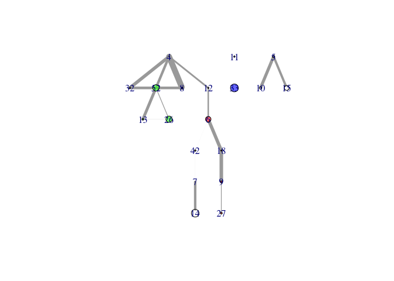
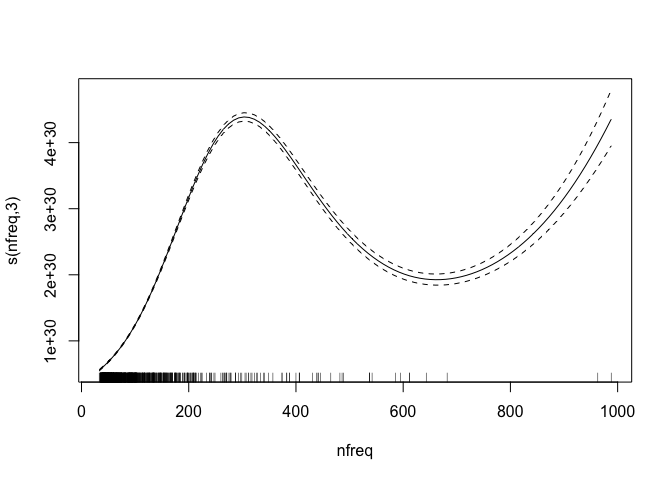

Patterns Experiment
================
Roberto Maestre
10/24/2018

Introduction
============

This results can be calculated through the experimental UI available [here](https://github.com/rmaestre/variableStars/tree/master/inst/shiny-examples/experiment).

Data Generation
===============

``` r
# Select experiment parameters
distance <- 1
numFreqs <- 100
#set.seed(82914)
set.seed(4132093)
periodF <- 0.192
periodS <- 5.29
# Debug info with experiment configuration
print(
  paste(
    " First period:",
    round(periodF, 3),
    " (",
    round(periodF / 0.0864, 3),
    "muHz)",
    " Second period:",
    round(periodS, 3),
    " (",
    round(periodS / 0.0864, 3),
    "muHz)",
    sep = ""
  )
)
```

    ## [1] " First period:0.192 (2.222muHz) Second period:5.29 (61.227muHz)"

``` r
# Data generation
dt <- generate_data(
  numFreqs = numFreqs,
  distance = distance,
  periodF = periodF,
  periodS = periodS,
  baseAMplitudeFirst = 10,
  baseAMplitudeSecond = 10,
  seed = NULL,
  freqOneRandRange = 0.0,
  freqTwoRandRange = 0.0,
  ampRandRange = 1.0
)
# Execute experiment
result <- process(
  frequency = dt$x,
  amplitude = dt$y,
  filter = "uniform",
  gRegimen = 0,
  maxDnu = 15,
  minDnu = 15,
  numFrequencies = ifelse(nrow(dt) == 30, 31, nrow(dt)),
  dnuGuessError = -1,
  debug = F
)
```

Periodicities
-------------

Histogram
---------

Crosscorrelation
----------------

Simple MC
=========

``` r
# size <- 10001 # for calculated amplitudes and frequencies
# experiments <- 1 # number of trials
# percentageOfData <- 100
# 
# count <- 1
# periodicities <-
#   data.frame(matrix(ncol = size, nrow = experiments)) # empty DS to save results
# for (i in seq(from = 1, to = experiments, by = 1)) {
#   percent <- round((nrow(dt) * percentageOfData) / 100)
#   dtSampling <- dt[sample(nrow(dt), percent), ]
# 
#   # Execute experiment
#   resultSampling <- process(
#     frequency = dtSampling$x,
#     amplitude = dtSampling$y,
#     filter = "uniform",
#     gRegimen = 0,
#     maxDnu = 15,
#     minDnu = 15,
#     numFrequencies = nrow(dtSampling) + 1,
#     # process all frecuencies
#     dnuGuessError = -1,
#     debug = F
#   )
#   # Get perioditicies amplitudes and save
#   for (name in names(resultSampling$fresAmps)) {
#     periodicities[count,] <- t(resultSampling$fresAmps[[name]]$b)
#     count <- count + 1
#   }
# }
# 
# # Z-scores of SD
# means <- apply(periodicities, 2, mean, na.rm = TRUE)
# sds <- apply(periodicities, 2, sd, na.rm = TRUE)
# periodicitiesZScored <- (periodicities - means) / sds
# 
# library(reshape2)
# dtZScored <- data.frame(as.matrix(periodicitiesZScored))
# colnames(dtZScored) <- resultSampling$fresAmps[[name]]$fInv
# dtZScored$experiment <- seq.int(nrow(dtZScored))
# 
# 
# dtZScoredMelted <- melt(dtZScored, id.vars = 'experiment')
# dtZScoredMelted <- subset(dtZScoredMelted, value>=5&value<=5000)
# 
# dtZScoredMelted$variable <- as.numeric(as.character(dtZScoredMelted$variable))
# 
# 
# # ggplot(aes(x = variable, y = value, group=experiment), data=dtZScoredMelted) +
# #   geom_point(alpha=0.05) +
# #   scale_x_continuous(breaks=seq(0, ncol(dtZScored), 10)) +
# #   #geom_vline(mapping=aes(xintercept=periodF/0.0864), color="blue") +
# #   #geom_vline(mapping=aes(xintercept=periodS/0.0864), color="red") +
# #   theme_bw()


# Calculate normal
result <- process(
  frequency = dt$x,
  amplitude = dt$y,
  filter = "uniform",
  gRegimen = 0,
  maxDnu = 15,
  minDnu = 15,
  numFrequencies = 30,
  dnuGuessError = -1,
  debug = F
)

size <- 10001 
count <- 1
periodicities <-
  data.frame(matrix(ncol = size, nrow = length(names(result$fresAmps))))
for (name in names(result$fresAmps)) {
  periodicities[count, ] <- t(result$fresAmps[[name]]$b)
  count <- count + 1
}


# # # Calculate mean and sd for all periodicities
dtMerg <- merge(
   prepare_periodicities_dataset(result$fresAmps),
   data.frame("fInv" = result$fresAmps[[names(result$fresAmps)[1]]]$fInv),
   by = "fInv"
)

dtAgg <- data.frame(aggregate(dtMerg$b, by=list(fInv=dtMerg$fInv), FUN=sum))
colnames(dtAgg) <- c("fInv", "b")
```

Get maxs

``` r
# Get network library
library(igraph)
```

    ## Warning: package 'igraph' was built under R version 3.5.2

    ## 
    ## Attaching package: 'igraph'

    ## The following object is masked from 'package:plotly':
    ## 
    ##     groups

    ## The following objects are masked from 'package:stats':
    ## 
    ##     decompose, spectrum

    ## The following object is masked from 'package:base':
    ## 
    ##     union

``` r
library(rgexf)
```

    ## Loading required package: XML

    ## Loading required package: Rook

``` r
trunc <-
  function(x, ..., prec = 1)
    base::trunc(x * 10 ^ prec, ...) / 10 ^ prec


# Paramters
truncPrecision <- 0

# Empty list to save edges
edges <- c()

# Get n
dtAgg$b <- dtAgg$b / (dtAgg$fInv^-1)
hsFreqs <- head(dtAgg[with(dtAgg, order(b)),], 1000)
fs <- trunc(hsFreqs$fInv, prec = truncPrecision)
n <- length(fs)

dtHist <- data.frame("freq" = 0,
                     "residuals" = 0,
                     "b" = 0)

for (i in seq(1:n)) {
  m <- c()
  for (x in seq(from = i + 1, to = n)) {
    mod = fs[i] %% fs[x]
    m <- c(m, ifelse(mod < 0.2, fs[x],-1))
    if (!is.na(mod) & mod < 0.1) {
      if (fs[i] != fs[x]) {
        if (fs[i] > 3.0 & fs[x] > 3.0) {
          edges <- c(fs[i], fs[x], edges)
          #print(paste(fs[i], " ", fs[x], collapse = " "))
        }
      }
    }
  }
}

# Create graph
g <- graph(as.character(edges),
           directed = F)

# Calculate degree
E(g)$weight <- 1
g <- simplify(g, edge.attr.comb = list(weight = "sum"))
# Calculate normalized weigths
E(g)$width <-
  (E(g)$weight - min(E(g)$weight)) / (max(E(g)$weight) - min(E(g)$weight))

# Calculate amplitude
amplitudes = c()
for (vName in V(g)$name) {
  amplitudes <-
    c(mean(hsFreqs[trunc(hsFreqs$fInv, prec = truncPrecision) == trunc(as.numeric(vName), prec =
                                                                         truncPrecision), ]$b), amplitudes)
}

# normalized amplitudes
amplitudes <-
  (amplitudes - min(amplitudes)) / (max(amplitudes) - min(amplitudes))
# Plot and remove vertex
clusterlouvain <- cluster_louvain(g)
e <- get.edgelist(g)
plot(
  delete.vertices(simplify(g), degree(g) == 0),
  edge.width = E(g)$width * 10,
  vertex.size = amplitudes * 10,
  node.width = 1,
  #layout = layout_nicely,
  layout = layout_as_tree,
  vertex.color = rainbow(3, alpha = 0.6)[clusterlouvain$membership],
  vertex.label = trunc(as.numeric(V(g)$name), prec = truncPrecision),
  rescale = T
)
```



``` r
#cat("My title", as.character(igraph.to.gexf(g, position=NULL)), file="~/Downloads/perio.gexf", sep="n", append=F)
```

Sistematic experiments
======================

``` r
# Experiment results
results <- data.frame(matrix(ncol = 7, nrow = 1))
colnames(results) <-
  c("fp", "sp", "fpos", "spos", "nfreq", "distance", "numFreqs")
count <- 1

for (experiment in seq(1:1000)) {
  # Select experiment parameters
  distance <- trunc(runif(1, 0, 10), prec=4)
  numFreqs <- 100
  periodF <- trunc(runif(1, 0.1, 6), prec=4)
  periodS <- trunc(runif(1, 0.1, 6), prec=4)
  # Debug info with experiment configuration
  if (count %% 10 == 0) {
    print(
      paste(
        "Experiment:",
        count,
        " | distance:",
        distance,
        " | numFreqs:",
        numFreqs,
        " | 1º period:",
        round(periodF, 3),
        " (",
        round(periodF / 0.0864, 3),
        "muHz)",
        " | 2º period:",
        round(periodS, 3),
        " (",
        round(periodS / 0.0864, 3),
        "muHz)",
        sep = ""
      )
    )
  }
  
  # Data generation
  dt <- generate_data(
    numFreqs = numFreqs,
    distance = distance,
    periodF = periodF,
    periodS = periodS,
    baseAMplitudeFirst = 10,
    baseAMplitudeSecond = 10,
    seed = NULL,
    freqOneRandRange = 0.1,
    freqTwoRandRange = 0.1,
    ampRandRange = 1.0
  )
  # Execute experiment
  result <- process(
    frequency = dt$x,
    amplitude = dt$y,
    filter = "uniform",
    gRegimen = 0,
    maxDnu = 15,
    minDnu = 15,
    numFrequencies = ifelse(nrow(dt) == 30, 31, nrow(dt)+1),
    dnuGuessError = -1,
    debug = F
  )
  
  #plot_histogram(data.frame(result$diffHistogram$histogram))
  
  #Check into histogram by sorting by desc amplitudes
  dtHist <- data.frame(result$diffHistogram$histogram)
  dtHist <- dtHist[dtHist$values != 0,]
  
  # Match
  binF <-
    dtHist[which.min((trunc(dtHist$bins, prec = 1) - trunc(periodF / 0.0864, prec =
                                                             1)) ^ 2) + 1,]
  binS <-
    dtHist[which.min((trunc(dtHist$bins, prec = 1) - trunc(periodS / 0.0864, prec =
                                                             1)) ^ 2) + 1,]
  # Reorder
  dtHist <- dtHist[with(dtHist, order(-values)), ]
  row.names(dtHist) <- seq(1:dim(dtHist)[1])
  
  
  #print(which(trunc(dtHist$bins, prec = 1) == trunc(binF$bins, prec = 1))[1])
  #print(which(trunc(dtHist$bins, prec = 1) == trunc(binS$bins, prec = 1))[1])
  
  results[count, "fp"] <- periodF / 0.0864
  results[count, "sp"] <- periodS / 0.0864
  fposVal <- which(trunc(dtHist$bins, prec = 1) == trunc(binF$bins, prec = 1))[1]
  sposVal <- which(trunc(dtHist$bins, prec = 1) == trunc(binS$bins, prec = 1))[1]
  results[count, "fpos"] <- ifelse(is.na(fposVal),stop(),fposVal)
  results[count, "spos"] <- ifelse(is.na(sposVal),stop(),sposVal)
  results[count, "nfreq"] <- nrow(dt)
  results[count, "nBins"] <- nrow(dtHist)
  results[count, "distance"] <- distance
  results[count, "numFreqs"] <- numFreqs
  count <- count + 1
}
```

    ## [1] "Experiment:10 | distance:6.4456 | numFreqs:100 | 1º period:3.905 (45.192muHz) | 2º period:5.462 (63.213muHz)"
    ## [1] "Experiment:20 | distance:8.8444 | numFreqs:100 | 1º period:3.28 (37.968muHz) | 2º period:4.276 (49.495muHz)"
    ## [1] "Experiment:30 | distance:5.6696 | numFreqs:100 | 1º period:4.39 (50.806muHz) | 2º period:1.851 (21.419muHz)"
    ## [1] "Experiment:40 | distance:2.6413 | numFreqs:100 | 1º period:0.807 (9.336muHz) | 2º period:5.684 (65.789muHz)"
    ## [1] "Experiment:50 | distance:2.9304 | numFreqs:100 | 1º period:3.504 (40.558muHz) | 2º period:3.313 (38.341muHz)"
    ## [1] "Experiment:60 | distance:8.9907 | numFreqs:100 | 1º period:5.952 (68.891muHz) | 2º period:2.439 (28.225muHz)"
    ## [1] "Experiment:70 | distance:9.6057 | numFreqs:100 | 1º period:5.048 (58.421muHz) | 2º period:3.196 (36.987muHz)"
    ## [1] "Experiment:80 | distance:9.317 | numFreqs:100 | 1º period:4.662 (53.955muHz) | 2º period:5.2 (60.184muHz)"
    ## [1] "Experiment:90 | distance:3.5453 | numFreqs:100 | 1º period:4.377 (50.661muHz) | 2º period:3.012 (34.858muHz)"
    ## [1] "Experiment:100 | distance:8.4025 | numFreqs:100 | 1º period:0.959 (11.095muHz) | 2º period:1.018 (11.787muHz)"
    ## [1] "Experiment:110 | distance:7.7256 | numFreqs:100 | 1º period:4.556 (52.734muHz) | 2º period:2.431 (28.139muHz)"
    ## [1] "Experiment:120 | distance:1.7142 | numFreqs:100 | 1º period:5.333 (61.73muHz) | 2º period:1.925 (22.282muHz)"
    ## [1] "Experiment:130 | distance:0.3818 | numFreqs:100 | 1º period:2.397 (27.744muHz) | 2º period:4.601 (53.247muHz)"
    ## [1] "Experiment:140 | distance:0.0032 | numFreqs:100 | 1º period:3.981 (46.072muHz) | 2º period:1.22 (14.118muHz)"
    ## [1] "Experiment:150 | distance:1.8747 | numFreqs:100 | 1º period:3.828 (44.304muHz) | 2º period:5.976 (69.162muHz)"
    ## [1] "Experiment:160 | distance:3.4376 | numFreqs:100 | 1º period:5.49 (63.541muHz) | 2º period:0.988 (11.434muHz)"
    ## [1] "Experiment:170 | distance:1.7869 | numFreqs:100 | 1º period:5.233 (60.566muHz) | 2º period:1.171 (13.556muHz)"
    ## [1] "Experiment:180 | distance:6.5874 | numFreqs:100 | 1º period:2.809 (32.516muHz) | 2º period:5.367 (62.112muHz)"
    ## [1] "Experiment:190 | distance:7.1061 | numFreqs:100 | 1º period:3.99 (46.176muHz) | 2º period:2.379 (27.531muHz)"
    ## [1] "Experiment:200 | distance:6.0831 | numFreqs:100 | 1º period:0.875 (10.131muHz) | 2º period:5.529 (63.998muHz)"
    ## [1] "Experiment:210 | distance:2.0183 | numFreqs:100 | 1º period:5.715 (66.15muHz) | 2º period:2.269 (26.264muHz)"
    ## [1] "Experiment:220 | distance:5.1226 | numFreqs:100 | 1º period:1.225 (14.182muHz) | 2º period:0.23 (2.664muHz)"
    ## [1] "Experiment:230 | distance:4.2282 | numFreqs:100 | 1º period:3.295 (38.141muHz) | 2º period:4.677 (54.135muHz)"
    ## [1] "Experiment:240 | distance:4.2897 | numFreqs:100 | 1º period:4.043 (46.791muHz) | 2º period:1.001 (11.583muHz)"
    ## [1] "Experiment:250 | distance:5.0763 | numFreqs:100 | 1º period:5.1 (59.028muHz) | 2º period:3.971 (45.957muHz)"
    ## [1] "Experiment:260 | distance:2.0954 | numFreqs:100 | 1º period:1.632 (18.888muHz) | 2º period:2.428 (28.1muHz)"
    ## [1] "Experiment:270 | distance:4.9855 | numFreqs:100 | 1º period:4.817 (55.753muHz) | 2º period:3.127 (36.192muHz)"
    ## [1] "Experiment:280 | distance:1.7786 | numFreqs:100 | 1º period:1.995 (23.088muHz) | 2º period:3.77 (43.63muHz)"
    ## [1] "Experiment:290 | distance:7.6321 | numFreqs:100 | 1º period:3.382 (39.142muHz) | 2º period:1.525 (17.652muHz)"
    ## [1] "Experiment:300 | distance:0.8735 | numFreqs:100 | 1º period:4.799 (55.542muHz) | 2º period:0.255 (2.949muHz)"
    ## [1] "Experiment:310 | distance:5.6 | numFreqs:100 | 1º period:3.397 (39.322muHz) | 2º period:1.985 (22.973muHz)"
    ## [1] "Experiment:320 | distance:3.7467 | numFreqs:100 | 1º period:0.978 (11.324muHz) | 2º period:1.49 (17.243muHz)"
    ## [1] "Experiment:330 | distance:5.104 | numFreqs:100 | 1º period:2.376 (27.497muHz) | 2º period:4.687 (54.243muHz)"
    ## [1] "Experiment:340 | distance:3.4623 | numFreqs:100 | 1º period:3.971 (45.966muHz) | 2º period:0.558 (6.457muHz)"
    ## [1] "Experiment:350 | distance:8.84 | numFreqs:100 | 1º period:2.382 (27.574muHz) | 2º period:4.367 (50.539muHz)"
    ## [1] "Experiment:360 | distance:6.2531 | numFreqs:100 | 1º period:3.521 (40.75muHz) | 2º period:0.858 (9.928muHz)"
    ## [1] "Experiment:370 | distance:8.6029 | numFreqs:100 | 1º period:1.346 (15.576muHz) | 2º period:3.204 (37.089muHz)"
    ## [1] "Experiment:380 | distance:7.0753 | numFreqs:100 | 1º period:3.633 (42.053muHz) | 2º period:0.369 (4.27muHz)"
    ## [1] "Experiment:390 | distance:3.8193 | numFreqs:100 | 1º period:4.243 (49.113muHz) | 2º period:3.791 (43.874muHz)"
    ## [1] "Experiment:400 | distance:8.0587 | numFreqs:100 | 1º period:4.033 (46.681muHz) | 2º period:0.981 (11.355muHz)"
    ## [1] "Experiment:410 | distance:1.131 | numFreqs:100 | 1º period:5.426 (62.803muHz) | 2º period:2.542 (29.421muHz)"
    ## [1] "Experiment:420 | distance:1.6721 | numFreqs:100 | 1º period:5.814 (67.295muHz) | 2º period:2.64 (30.558muHz)"
    ## [1] "Experiment:430 | distance:9.9354 | numFreqs:100 | 1º period:3.947 (45.688muHz) | 2º period:5.073 (58.715muHz)"
    ## [1] "Experiment:440 | distance:9.1226 | numFreqs:100 | 1º period:1.073 (12.419muHz) | 2º period:4.729 (54.737muHz)"
    ## [1] "Experiment:450 | distance:9.7288 | numFreqs:100 | 1º period:2.333 (27.001muHz) | 2º period:2.042 (23.63muHz)"
    ## [1] "Experiment:460 | distance:8.6496 | numFreqs:100 | 1º period:5.212 (60.321muHz) | 2º period:1.86 (21.531muHz)"
    ## [1] "Experiment:470 | distance:5.2828 | numFreqs:100 | 1º period:5.739 (66.429muHz) | 2º period:2.557 (29.595muHz)"
    ## [1] "Experiment:480 | distance:4.9634 | numFreqs:100 | 1º period:4.626 (53.544muHz) | 2º period:5.882 (68.083muHz)"
    ## [1] "Experiment:490 | distance:6.426 | numFreqs:100 | 1º period:5.219 (60.409muHz) | 2º period:4.344 (50.284muHz)"
    ## [1] "Experiment:500 | distance:5.3367 | numFreqs:100 | 1º period:2.182 (25.249muHz) | 2º period:0.717 (8.296muHz)"
    ## [1] "Experiment:510 | distance:8.7376 | numFreqs:100 | 1º period:2.962 (34.285muHz) | 2º period:4.766 (55.163muHz)"
    ## [1] "Experiment:520 | distance:4.3275 | numFreqs:100 | 1º period:3.281 (37.972muHz) | 2º period:5.452 (63.105muHz)"
    ## [1] "Experiment:530 | distance:5.6899 | numFreqs:100 | 1º period:3.857 (44.644muHz) | 2º period:0.335 (3.874muHz)"
    ## [1] "Experiment:540 | distance:5.4555 | numFreqs:100 | 1º period:5.626 (65.112muHz) | 2º period:1.787 (20.679muHz)"
    ## [1] "Experiment:550 | distance:5.7853 | numFreqs:100 | 1º period:2.676 (30.973muHz) | 2º period:3.423 (39.618muHz)"
    ## [1] "Experiment:560 | distance:6.8251 | numFreqs:100 | 1º period:1.452 (16.801muHz) | 2º period:2.11 (24.419muHz)"
    ## [1] "Experiment:570 | distance:5.9247 | numFreqs:100 | 1º period:1.537 (17.793muHz) | 2º period:2.714 (31.413muHz)"
    ## [1] "Experiment:580 | distance:8.3336 | numFreqs:100 | 1º period:0.152 (1.755muHz) | 2º period:0.744 (8.612muHz)"
    ## [1] "Experiment:590 | distance:3.4996 | numFreqs:100 | 1º period:5.085 (58.852muHz) | 2º period:5.114 (59.184muHz)"
    ## [1] "Experiment:600 | distance:9.3852 | numFreqs:100 | 1º period:1.795 (20.777muHz) | 2º period:2.107 (24.391muHz)"
    ## [1] "Experiment:610 | distance:8.961 | numFreqs:100 | 1º period:1.886 (21.823muHz) | 2º period:1.717 (19.87muHz)"
    ## [1] "Experiment:620 | distance:7.4196 | numFreqs:100 | 1º period:4.983 (57.672muHz) | 2º period:0.58 (6.715muHz)"
    ## [1] "Experiment:630 | distance:6.8919 | numFreqs:100 | 1º period:3.134 (36.277muHz) | 2º period:0.808 (9.354muHz)"
    ## [1] "Experiment:640 | distance:7.5869 | numFreqs:100 | 1º period:5.367 (62.122muHz) | 2º period:0.268 (3.105muHz)"
    ## [1] "Experiment:650 | distance:8.1776 | numFreqs:100 | 1º period:0.405 (4.69muHz) | 2º period:1.095 (12.669muHz)"
    ## [1] "Experiment:660 | distance:0.1842 | numFreqs:100 | 1º period:4.525 (52.377muHz) | 2º period:3.559 (41.189muHz)"
    ## [1] "Experiment:670 | distance:2.133 | numFreqs:100 | 1º period:2.58 (29.865muHz) | 2º period:2.913 (33.715muHz)"
    ## [1] "Experiment:680 | distance:1.0081 | numFreqs:100 | 1º period:0.961 (11.12muHz) | 2º period:2.453 (28.39muHz)"
    ## [1] "Experiment:690 | distance:9.106 | numFreqs:100 | 1º period:0.271 (3.134muHz) | 2º period:0.249 (2.882muHz)"
    ## [1] "Experiment:700 | distance:8.5858 | numFreqs:100 | 1º period:4.413 (51.08muHz) | 2º period:0.958 (11.083muHz)"
    ## [1] "Experiment:710 | distance:7.0419 | numFreqs:100 | 1º period:3.303 (38.225muHz) | 2º period:4.593 (53.159muHz)"
    ## [1] "Experiment:720 | distance:8.6417 | numFreqs:100 | 1º period:0.726 (8.4muHz) | 2º period:3.493 (40.426muHz)"
    ## [1] "Experiment:730 | distance:4.5484 | numFreqs:100 | 1º period:4.101 (47.464muHz) | 2º period:3.829 (44.321muHz)"
    ## [1] "Experiment:740 | distance:3.3708 | numFreqs:100 | 1º period:5.805 (67.186muHz) | 2º period:0.755 (8.743muHz)"
    ## [1] "Experiment:750 | distance:5.5899 | numFreqs:100 | 1º period:4.693 (54.317muHz) | 2º period:0.49 (5.676muHz)"
    ## [1] "Experiment:760 | distance:1.6021 | numFreqs:100 | 1º period:5.231 (60.544muHz) | 2º period:1.187 (13.735muHz)"
    ## [1] "Experiment:770 | distance:6.8644 | numFreqs:100 | 1º period:2.803 (32.442muHz) | 2º period:5.936 (68.703muHz)"
    ## [1] "Experiment:780 | distance:6.6225 | numFreqs:100 | 1º period:3.803 (44.014muHz) | 2º period:3.084 (35.691muHz)"
    ## [1] "Experiment:790 | distance:6.3871 | numFreqs:100 | 1º period:2.338 (27.058muHz) | 2º period:4.831 (55.917muHz)"
    ## [1] "Experiment:800 | distance:5.641 | numFreqs:100 | 1º period:5.983 (69.245muHz) | 2º period:4.415 (51.096muHz)"
    ## [1] "Experiment:810 | distance:3.1395 | numFreqs:100 | 1º period:4.489 (51.954muHz) | 2º period:0.619 (7.167muHz)"
    ## [1] "Experiment:820 | distance:4.7584 | numFreqs:100 | 1º period:5.258 (60.856muHz) | 2º period:4.512 (52.22muHz)"
    ## [1] "Experiment:830 | distance:7.2395 | numFreqs:100 | 1º period:2.806 (32.473muHz) | 2º period:5.045 (58.389muHz)"
    ## [1] "Experiment:840 | distance:3.0911 | numFreqs:100 | 1º period:5.624 (65.09muHz) | 2º period:0.964 (11.154muHz)"
    ## [1] "Experiment:850 | distance:9.3528 | numFreqs:100 | 1º period:4.753 (55.01muHz) | 2º period:3.408 (39.449muHz)"
    ## [1] "Experiment:860 | distance:2.7862 | numFreqs:100 | 1º period:1.603 (18.554muHz) | 2º period:1.262 (14.608muHz)"
    ## [1] "Experiment:870 | distance:9.2139 | numFreqs:100 | 1º period:4.657 (53.897muHz) | 2º period:1.264 (14.635muHz)"
    ## [1] "Experiment:880 | distance:0.0343 | numFreqs:100 | 1º period:3.032 (35.088muHz) | 2º period:3.174 (36.733muHz)"
    ## [1] "Experiment:890 | distance:5.1494 | numFreqs:100 | 1º period:5.728 (66.294muHz) | 2º period:1.502 (17.387muHz)"
    ## [1] "Experiment:900 | distance:4.1014 | numFreqs:100 | 1º period:2.909 (33.672muHz) | 2º period:1.283 (14.851muHz)"
    ## [1] "Experiment:910 | distance:7.0095 | numFreqs:100 | 1º period:4.827 (55.866muHz) | 2º period:4.89 (56.598muHz)"
    ## [1] "Experiment:920 | distance:6.994 | numFreqs:100 | 1º period:3.603 (41.698muHz) | 2º period:5.039 (58.325muHz)"
    ## [1] "Experiment:930 | distance:4.3098 | numFreqs:100 | 1º period:3.393 (39.266muHz) | 2º period:3.24 (37.505muHz)"
    ## [1] "Experiment:940 | distance:3.4544 | numFreqs:100 | 1º period:2.995 (34.666muHz) | 2º period:3.338 (38.634muHz)"
    ## [1] "Experiment:950 | distance:8.8913 | numFreqs:100 | 1º period:4.342 (50.255muHz) | 2º period:5.638 (65.253muHz)"
    ## [1] "Experiment:960 | distance:0.3573 | numFreqs:100 | 1º period:3.403 (39.39muHz) | 2º period:3.008 (34.814muHz)"
    ## [1] "Experiment:970 | distance:8.8938 | numFreqs:100 | 1º period:4.968 (57.501muHz) | 2º period:1.559 (18.047muHz)"
    ## [1] "Experiment:980 | distance:0.7941 | numFreqs:100 | 1º period:1.54 (17.828muHz) | 2º period:5.84 (67.591muHz)"
    ## [1] "Experiment:990 | distance:4.1457 | numFreqs:100 | 1º period:5.622 (65.073muHz) | 2º period:4.519 (52.3muHz)"
    ## [1] "Experiment:1000 | distance:4.8515 | numFreqs:100 | 1º period:2.754 (31.876muHz) | 2º period:1.335 (15.457muHz)"

``` r
# Feature generation
results$gap <- (results$fp - results$sp) ^ 2
results$first <- ifelse(results$fpos < 30, 1, 0)
results$fpsp <- results$fp + results$sp

results$fpos_norm <- results$fpos / results$numFreqs

# Remove outliers based on boxplot
resultsFilter <- results[results$nfreq < 1000,]
resultsFilter <- resultsFilter[resultsFilter$fpos < 400,]
```

Check poisson distribution
==========================


Fit lineal model
================

    ## 
    ## Family: poisson 
    ## Link function: log 
    ## 
    ## Formula:
    ## fpos_norm ~ nfreq + distance
    ## 
    ## Parametric coefficients:
    ##               Estimate Std. Error z value Pr(>|z|)    
    ## (Intercept) -0.6247481  0.0850292  -7.347 2.02e-13 ***
    ## nfreq        0.0028952  0.0002128  13.605  < 2e-16 ***
    ## distance    -0.0257204  0.0141374  -1.819   0.0689 .  
    ## ---
    ## Signif. codes:  0 '***' 0.001 '**' 0.01 '*' 0.05 '.' 0.1 ' ' 1
    ## 
    ## 
    ## R-sq.(adj) =  0.0172   Deviance explained = 15.5%
    ## UBRE = -0.22349  Scale est. = 1         n = 894


Fit non-lineal model
====================

    ## 
    ## Family: poisson 
    ## Link function: log 
    ## 
    ## Formula:
    ## fpos ~ s(nfreq, k = 4) + s(distance, k = 4)
    ## 
    ## Parametric coefficients:
    ##             Estimate Std. Error z value Pr(>|z|)    
    ## (Intercept) 4.039591   0.004725     855   <2e-16 ***
    ## ---
    ## Signif. codes:  0 '***' 0.001 '**' 0.01 '*' 0.05 '.' 0.1 ' ' 1
    ## 
    ## Approximate significance of smooth terms:
    ##               edf Ref.df  Chi.sq p-value    
    ## s(nfreq)    2.998      3 27077.6  <2e-16 ***
    ## s(distance) 2.991      3   695.6  <2e-16 ***
    ## ---
    ## Signif. codes:  0 '***' 0.001 '**' 0.01 '*' 0.05 '.' 0.1 ' ' 1
    ## 
    ## R-sq.(adj) =  0.258   Deviance explained = 32.7%
    ## UBRE =  60.36  Scale est. = 1         n = 894



Fit probability to match frecuency on \[0-30\] first differences
================================================================

    ## 
    ## Family: binomial 
    ## Link function: logit 
    ## 
    ## Formula:
    ## first ~ s(fp)
    ## 
    ## Parametric coefficients:
    ##             Estimate Std. Error z value Pr(>|z|)
    ## (Intercept) -0.09452    0.06907  -1.368    0.171
    ## 
    ## Approximate significance of smooth terms:
    ##         edf Ref.df Chi.sq  p-value    
    ## s(fp) 2.996  3.735  49.89 5.61e-10 ***
    ## ---
    ## Signif. codes:  0 '***' 0.001 '**' 0.01 '*' 0.05 '.' 0.1 ' ' 1
    ## 
    ## R-sq.(adj) =  0.0598   Deviance explained = 4.76%
    ## UBRE = 0.32776  Scale est. = 1         n = 894


