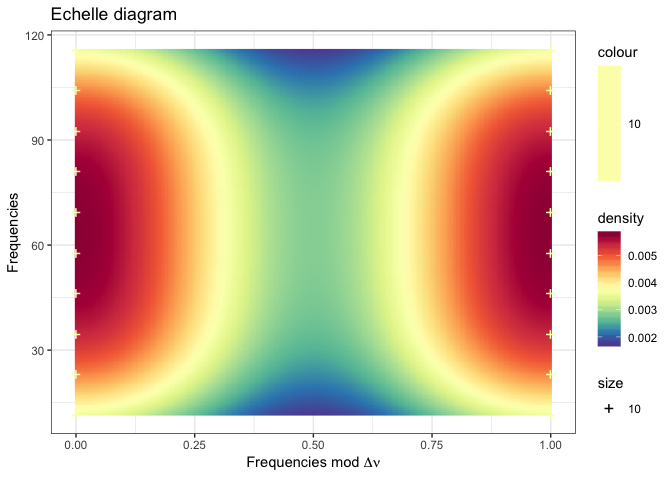
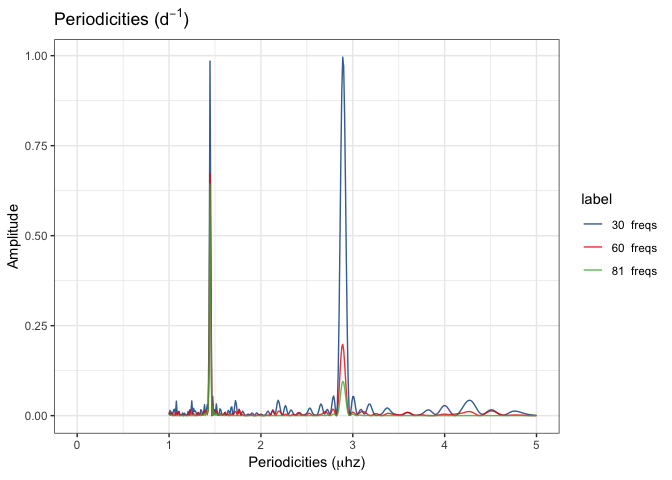

Synthetic Experiment. I
================
Roberto Maestre
12/17/2018

Experiment I
------------

``` r
# Generate first pattern
dt.spectrum <- data.frame(
  "frequency" = seq(from=0, to=10, by=1) ,
  "amplitude" = 10
)
# Get max amplitude
maxAmplitude <- dt.spectrum[which.max(dt.spectrum$amplitude), ]
# Plot amplitudes
plot_spectrum(min(dt.spectrum$frequency)-1,
              max(dt.spectrum$frequency)+1,
              dt.spectrum)
```


Experiment execution

    ## ::: Debug information :::
    ## 
    ## Number of frequences to be processed: 11
    ## Number of frequences after drop the g regimen: 10
    ## Frequencies: 11.5741, 23.1481, 34.7222, 46.2963, 57.8704, 69.4444, 81.0185, 92.5926, 104.167, 115.741, 
    ## Range: 10, 
    ##  Iteration over range: 10
    ##    Frequencies selected: 11.5741, 23.1481, 34.7222, 46.2963, 57.8704, 69.4444, 81.0185, 92.5926, 104.167, 115.741, 
    ##    Amplitudes selected: 10, 10, 10, 10, 10, 10, 10, 10, 10, 10, 
    ##     Dnu: 11.5732
    ##     Dnu Peak: 11.5732
    ##     Dnu Guess: 3.85802
    ##     Cross correlation calculated:




Experiment II
-------------

``` r
# Generate first pattern
dt.spectrum <- data.frame(
  "frequency" = seq(from=0, to=10, by=1) ,
  "amplitude" = 10
)
# Generate second pattern as the biased first
dt.spectrum.bias <- data.frame(dt.spectrum)
dt.spectrum.bias$frequency <- dt.spectrum.bias$frequency + 0.25
dt.spectrum.bias$amplitude <- 5
  
#All together
dt.spectrum <- rbind(dt.spectrum, dt.spectrum.bias)
# Get max amplitude
maxAmplitude <- dt.spectrum[which.max(dt.spectrum$amplitude), ]
# Plot amplitudes
plot_spectrum(min(dt.spectrum$frequency)-1,
              max(dt.spectrum$frequency)+1,
              dt.spectrum)
```


Experiment execution

    ## ::: Debug information :::
    ## 
    ## Number of frequences to be processed: 22
    ## Number of frequences after drop the g regimen: 21
    ## Frequencies: 11.5741, 23.1481, 34.7222, 46.2963, 57.8704, 69.4444, 81.0185, 92.5926, 104.167, 115.741, 2.89352, 14.4676, 26.0417, 37.6157, 49.1898, 60.7639, 72.338, 83.912, 95.4861, 107.06, 
    ## Range: 21, 
    ##  Iteration over range: 21
    ##    Frequencies selected: 11.5741, 23.1481, 34.7222, 46.2963, 57.8704, 69.4444, 81.0185, 92.5926, 104.167, 115.741, 
    ##    Amplitudes selected: 10, 10, 10, 10, 10, 10, 10, 10, 10, 10, 
    ##     Dnu: 2.8909
    ##     Dnu Peak: 2.8909
    ##     Dnu Guess: 0.964506
    ##     Cross correlation calculated:


Experiment III
--------------

``` r
# Generate first pattern
dt.spectrum <- data.frame(
  "frequency" = seq(from=0, to=10, by=0.25) ,
  "amplitude" = 10 
)
dt.spectrum$amplitude <- dt.spectrum$amplitude + rnorm(nrow(dt.spectrum),0,1.0)
# Generate second pattern as the biased first
dt.spectrum.bias <- data.frame(dt.spectrum)
dt.spectrum.bias$frequency <- dt.spectrum.bias$frequency + 0.15
dt.spectrum.bias$amplitude <- 5 + rnorm(nrow(dt.spectrum.bias),0,1.0)
  
#All together
dt.spectrum <- rbind(dt.spectrum, dt.spectrum.bias)
# Get max amplitude
maxAmplitude <- dt.spectrum[which.max(dt.spectrum$amplitude), ]
# Plot amplitudes
plot_spectrum(min(dt.spectrum$frequency)-1,
              max(dt.spectrum$frequency)+1,
              dt.spectrum)
```


Experiment execution

    ## ::: Debug information :::
    ## 
    ## Number of frequences to be processed: 82
    ## Number of frequences after drop the g regimen: 81
    ## Frequencies: 60.7639, 14.4676, 46.2963, 109.954, 86.8056, 43.4028, 104.167, 66.5509, 72.338, 8.68056, 89.6991, 63.6574, 107.06, 98.3796, 69.4444, 26.0417, 17.3611, 34.7222, 49.1898, 112.847, 
    ## Range: 30, 60, 81, 
    ##  Iteration over range: 30
    ##    Frequencies selected: 60.7639, 14.4676, 46.2963, 109.954, 86.8056, 43.4028, 104.167, 66.5509, 72.338, 8.68056, 
    ##    Amplitudes selected: 11.6237, 11.5179, 11.3128, 11.2562, 11.2159, 11.0321, 10.6311, 10.6266, 10.599, 10.5851, 
    ##     Dnu: 2.8909
    ##     Dnu Peak: 2.8909
    ##     Dnu Guess: 1.92901
    ##     Cross correlation calculated:
    ##  Iteration over range: 60
    ##    Frequencies selected: 60.7639, 14.4676, 46.2963, 109.954, 86.8056, 43.4028, 104.167, 66.5509, 72.338, 8.68056, 
    ##    Amplitudes selected: 11.6237, 11.5179, 11.3128, 11.2562, 11.2159, 11.0321, 10.6311, 10.6266, 10.599, 10.5851, 
    ##  Iteration over range: 81
    ##    Frequencies selected: 60.7639, 14.4676, 46.2963, 109.954, 86.8056, 43.4028, 104.167, 66.5509, 72.338, 8.68056, 
    ##    Amplitudes selected: 11.6237, 11.5179, 11.3128, 11.2562, 11.2159, 11.0321, 10.6311, 10.6266, 10.599, 10.5851,




Experiment IV
-------------

``` r
# Generate first pattern
dt.spectrum <- data.frame(
  "frequency" = seq(from=0, to=10, by=0.25) + rnorm(nrow(dt.spectrum.bias),0,0.1) ,
  "amplitude" = 10 
)
# Generate second pattern as the biased first
dt.spectrum.bias <- data.frame(dt.spectrum)
dt.spectrum.bias$frequency <- dt.spectrum.bias$frequency + rnorm(nrow(dt.spectrum.bias),0,0.1)
dt.spectrum.bias$amplitude <- 5 + rnorm(nrow(dt.spectrum.bias),0,1.0)
  
#All together
dt.spectrum <- rbind(dt.spectrum, dt.spectrum.bias)
# Get max amplitude
maxAmplitude <- dt.spectrum[which.max(dt.spectrum$amplitude), ]
# Plot amplitudes
plot_spectrum(min(dt.spectrum$frequency)-1,
              max(dt.spectrum$frequency)+1,
              dt.spectrum)
```


Experiment execution

    ## ::: Debug information :::
    ## 
    ## Number of frequences to be processed: 82
    ## Number of frequences after drop the g regimen: 81
    ## Frequencies: 0.576375, 3.72331, 4.06342, 9.54308, 12.1136, 14.7651, 15.312, 19.4521, 23.7544, 24.6813, 29.2946, 31.8298, 33.9409, 38.3168, 40.5375, 42.4359, 45.7718, 48.7506, 52.2282, 53.8325, 
    ## Range: 30, 60, 81, 
    ##  Iteration over range: 30
    ##    Frequencies selected: 0.576375, 3.72331, 4.06342, 9.54308, 12.1136, 14.7651, 15.312, 19.4521, 23.7544, 24.6813, 
    ##    Amplitudes selected: 10, 10, 10, 10, 10, 10, 10, 10, 10, 10, 
    ##     Dnu: 2.8216
    ##     Dnu Peak: 2.8216
    ##     Dnu Guess: 0.192125
    ##     Cross correlation calculated:
    ##  Iteration over range: 60
    ##    Frequencies selected: 0.576375, 3.72331, 4.06342, 9.54308, 12.1136, 14.7651, 15.312, 19.4521, 23.7544, 24.6813, 
    ##    Amplitudes selected: 10, 10, 10, 10, 10, 10, 10, 10, 10, 10, 
    ##  Iteration over range: 81
    ##    Frequencies selected: 0.576375, 3.72331, 4.06342, 9.54308, 12.1136, 14.7651, 15.312, 19.4521, 23.7544, 24.6813, 
    ##    Amplitudes selected: 10, 10, 10, 10, 10, 10, 10, 10, 10, 10,


