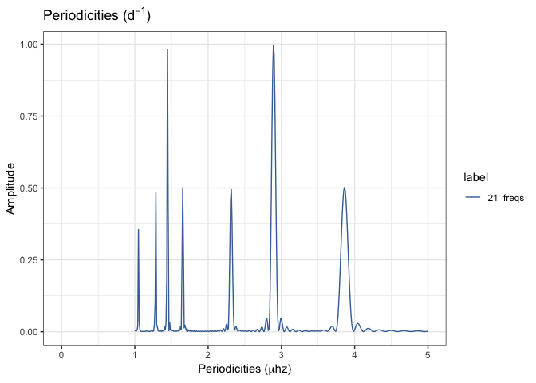
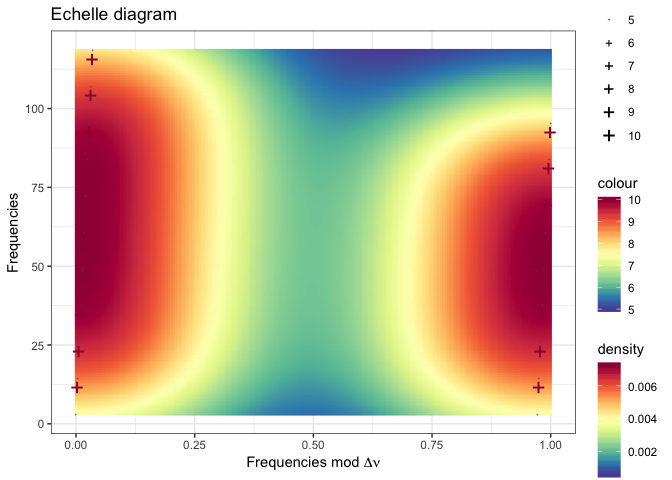
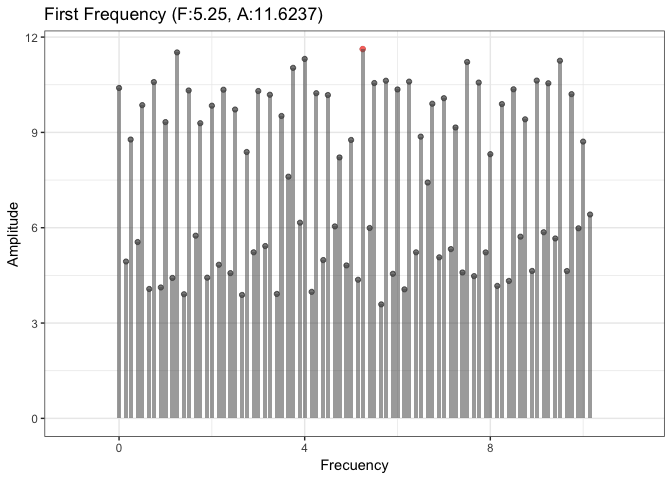
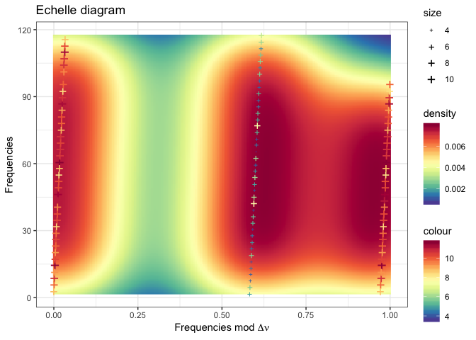

Synthetic Experiment. I
================
Roberto Maestre
12/17/2018

Experiment I
------------

``` r
# Generate first pattern
dt.spectrum <- data.frame(
  "frequency" = seq(from=0, to=10, by=0.25) ,
  "amplitude" = 10
)
# Get max amplitude
maxAmplitude <- dt.spectrum[which.max(dt.spectrum$amplitude), ]
# Plot amplitudes
plot_spectrum(min(dt.spectrum$frequency)-1,
              max(dt.spectrum$frequency)+1,
              dt.spectrum)
```


Experiment execution

    ## ::: Debug information :::
    ## 
    ## Number of frequences to be processed: 41
    ## Number of frequences after drop the g regimen: 40
    ## Frequencies: 2.89352, 5.78704, 8.68056, 11.5741, 14.4676, 17.3611, 20.2546, 23.1481, 26.0417, 28.9352, 31.8287, 34.7222, 37.6157, 40.5093, 43.4028, 46.2963, 49.1898, 52.0833, 54.9769, 57.8704, 
    ## Range: 30, 40, 
    ##  Iteration over range: 30
    ##    Frequencies selected: 2.89352, 5.78704, 8.68056, 11.5741, 14.4676, 17.3611, 20.2546, 23.1481, 26.0417, 28.9352, 
    ##    Amplitudes selected: 10, 10, 10, 10, 10, 10, 10, 10, 10, 10, 
    ##     Dnu: 2.8909
    ##     Dnu Peak: 2.8909
    ##     Dnu Guess: 0.964506
    ##     Cross correlation calculated:
    ##  Iteration over range: 40
    ##    Frequencies selected: 2.89352, 5.78704, 8.68056, 11.5741, 14.4676, 17.3611, 20.2546, 23.1481, 26.0417, 28.9352, 
    ##    Amplitudes selected: 10, 10, 10, 10, 10, 10, 10, 10, 10, 10,


Experiment II
-------------

``` r
# Generate first pattern
dt.spectrum <- data.frame(
  "frequency" = seq(from=0, to=10, by=0.25) ,
  "amplitude" = 10
)
# Generate second pattern as the biased first
dt.spectrum.bias <- data.frame(dt.spectrum)
dt.spectrum.bias$frequency <- dt.spectrum.bias$frequency + 0.15
dt.spectrum.bias$amplitude <- 5
  
#All together
dt.spectrum <- rbind(dt.spectrum, dt.spectrum.bias)
# Get max amplitude
maxAmplitude <- dt.spectrum[which.max(dt.spectrum$amplitude), ]
# Plot amplitudes
plot_spectrum(min(dt.spectrum$frequency)-1,
              max(dt.spectrum$frequency)+1,
              dt.spectrum)
```


Experiment execution

    ## ::: Debug information :::
    ## 
    ## Number of frequences to be processed: 82
    ## Number of frequences after drop the g regimen: 81
    ## Frequencies: 2.89352, 5.78704, 8.68056, 11.5741, 14.4676, 17.3611, 20.2546, 23.1481, 26.0417, 28.9352, 31.8287, 34.7222, 37.6157, 40.5093, 43.4028, 46.2963, 49.1898, 52.0833, 54.9769, 57.8704, 
    ## Range: 30, 60, 81, 
    ##  Iteration over range: 30
    ##    Frequencies selected: 2.89352, 5.78704, 8.68056, 11.5741, 14.4676, 17.3611, 20.2546, 23.1481, 26.0417, 28.9352, 
    ##    Amplitudes selected: 10, 10, 10, 10, 10, 10, 10, 10, 10, 10, 
    ##     Dnu: 2.8909
    ##     Dnu Peak: 2.8909
    ##     Dnu Guess: 0.964506
    ##     Cross correlation calculated:
    ##  Iteration over range: 60
    ##    Frequencies selected: 2.89352, 5.78704, 8.68056, 11.5741, 14.4676, 17.3611, 20.2546, 23.1481, 26.0417, 28.9352, 
    ##    Amplitudes selected: 10, 10, 10, 10, 10, 10, 10, 10, 10, 10, 
    ##  Iteration over range: 81
    ##    Frequencies selected: 2.89352, 5.78704, 8.68056, 11.5741, 14.4676, 17.3611, 20.2546, 23.1481, 26.0417, 28.9352, 
    ##    Amplitudes selected: 10, 10, 10, 10, 10, 10, 10, 10, 10, 10,





Experiment III
--------------

``` r
# Generate first pattern
dt.spectrum <- data.frame(
  "frequency" = seq(from=0, to=10, by=0.25) ,
  "amplitude" = 10
)
# Generate second pattern as the biased first
dt.spectrum.bias <- data.frame(dt.spectrum)
dt.spectrum.bias$frequency <- dt.spectrum.bias$frequency + 0.15
dt.spectrum.bias$amplitude <- 5 + rnorm(nrow(dt.spectrum.bias),0,1.0)
  
#All together
dt.spectrum <- rbind(dt.spectrum, dt.spectrum.bias)
# Get max amplitude
maxAmplitude <- dt.spectrum[which.max(dt.spectrum$amplitude), ]
# Plot amplitudes
plot_spectrum(min(dt.spectrum$frequency)-1,
              max(dt.spectrum$frequency)+1,
              dt.spectrum)
```



Experiment execution

    ## ::: Debug information :::
    ## 
    ## Number of frequences to be processed: 82
    ## Number of frequences after drop the g regimen: 81
    ## Frequencies: 2.89352, 5.78704, 8.68056, 11.5741, 14.4676, 17.3611, 20.2546, 23.1481, 26.0417, 28.9352, 31.8287, 34.7222, 37.6157, 40.5093, 43.4028, 46.2963, 49.1898, 52.0833, 54.9769, 57.8704, 
    ## Range: 30, 60, 81, 
    ##  Iteration over range: 30
    ##    Frequencies selected: 2.89352, 5.78704, 8.68056, 11.5741, 14.4676, 17.3611, 20.2546, 23.1481, 26.0417, 28.9352, 
    ##    Amplitudes selected: 10, 10, 10, 10, 10, 10, 10, 10, 10, 10, 
    ##     Dnu: 2.8909
    ##     Dnu Peak: 2.8909
    ##     Dnu Guess: 0.964506
    ##     Cross correlation calculated:
    ##  Iteration over range: 60
    ##    Frequencies selected: 2.89352, 5.78704, 8.68056, 11.5741, 14.4676, 17.3611, 20.2546, 23.1481, 26.0417, 28.9352, 
    ##    Amplitudes selected: 10, 10, 10, 10, 10, 10, 10, 10, 10, 10, 
    ##  Iteration over range: 81
    ##    Frequencies selected: 2.89352, 5.78704, 8.68056, 11.5741, 14.4676, 17.3611, 20.2546, 23.1481, 26.0417, 28.9352, 
    ##    Amplitudes selected: 10, 10, 10, 10, 10, 10, 10, 10, 10, 10,




Experiment IV
-------------

``` r
# Generate first pattern
dt.spectrum <- data.frame(
  "frequency" = seq(from=0, to=10, by=0.25) + rnorm(nrow(dt.spectrum.bias),0,0.1) ,
  "amplitude" = 10
)
# Generate second pattern as the biased first
dt.spectrum.bias <- data.frame(dt.spectrum)
dt.spectrum.bias$frequency <- dt.spectrum.bias$frequency + rnorm(nrow(dt.spectrum.bias),0,0.1)
dt.spectrum.bias$amplitude <- 5 + rnorm(nrow(dt.spectrum.bias),0,1.0)
  
#All together
dt.spectrum <- rbind(dt.spectrum, dt.spectrum.bias)
# Get max amplitude
maxAmplitude <- dt.spectrum[which.max(dt.spectrum$amplitude), ]
# Plot amplitudes
plot_spectrum(min(dt.spectrum$frequency)-1,
              max(dt.spectrum$frequency)+1,
              dt.spectrum)
```


Experiment execution

    ## ::: Debug information :::
    ## 
    ## Number of frequences to be processed: 82
    ## Number of frequences after drop the g regimen: 80
    ## Frequencies: 1.20124, 5.64731, 8.5489, 9.58222, 14.4498, 15.8333, 18.1244, 24.2436, 25.3428, 28.1587, 31.1338, 35.3752, 38.234, 38.8629, 42.1377, 45.2593, 49.5743, 52.4696, 53.8387, 56.6919, 
    ## Range: 30, 60, 80, 
    ##  Iteration over range: 30
    ##    Frequencies selected: 1.20124, 5.64731, 8.5489, 9.58222, 14.4498, 15.8333, 18.1244, 24.2436, 25.3428, 28.1587, 
    ##    Amplitudes selected: 10, 10, 10, 10, 10, 10, 10, 10, 10, 10, 
    ##     Dnu: 1.2178
    ##     Dnu Peak: 1.2178
    ##     Dnu Guess: 0.400415
    ##     Cross correlation calculated:
    ##  Iteration over range: 60
    ##    Frequencies selected: 1.20124, 5.64731, 8.5489, 9.58222, 14.4498, 15.8333, 18.1244, 24.2436, 25.3428, 28.1587, 
    ##    Amplitudes selected: 10, 10, 10, 10, 10, 10, 10, 10, 10, 10, 
    ##  Iteration over range: 80
    ##    Frequencies selected: 1.20124, 5.64731, 8.5489, 9.58222, 14.4498, 15.8333, 18.1244, 24.2436, 25.3428, 28.1587, 
    ##    Amplitudes selected: 10, 10, 10, 10, 10, 10, 10, 10, 10, 10,


