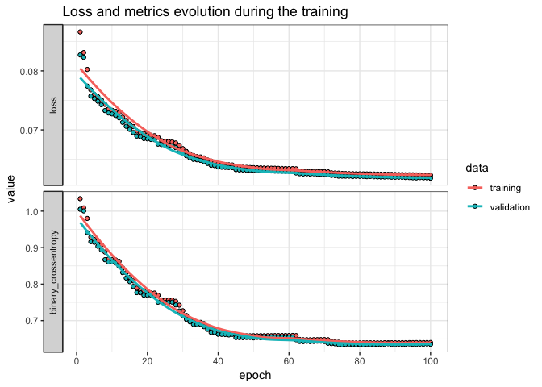
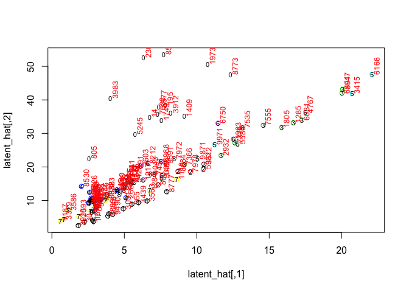
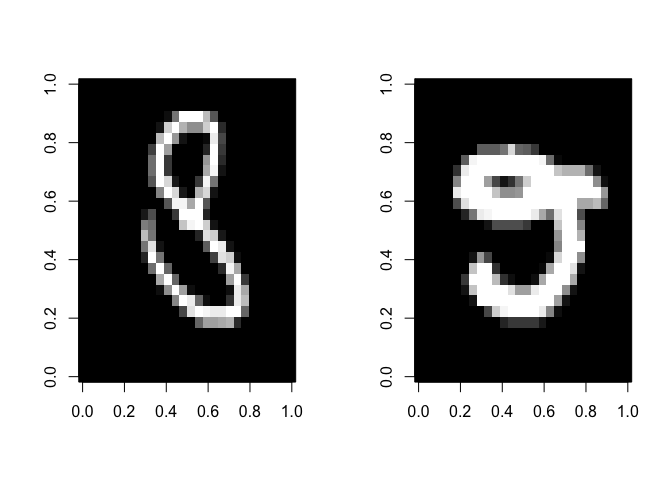
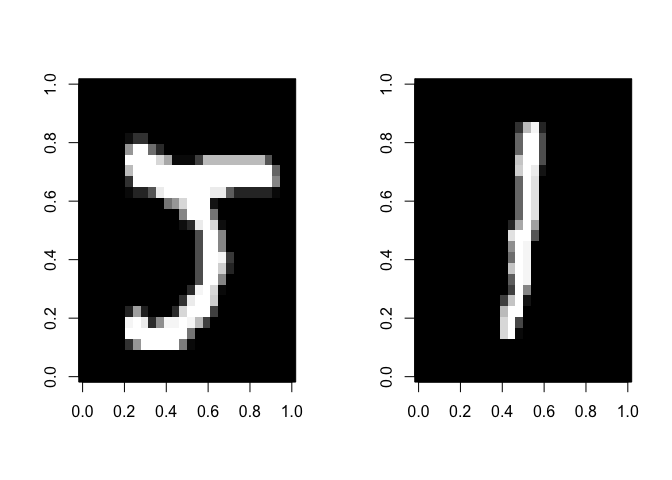
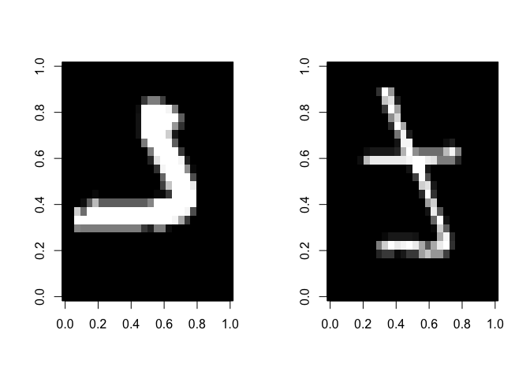

Simple Autoencoder on the MNIST
================
Roberto Maestre
12/12/2018

### Data source

We use Mnist as simple example. Mnist consist in vectors of 28x28 pixels with associated label from 0-9-

``` r
# Using mnist data
mnist <- dataset_mnist()

# Get train / test
x_train <- mnist$train$x
y_train <- mnist$train$y
x_test <- mnist$test$x
y_test <- mnist$test$y
# reshape
dim(x_train) <- c(nrow(x_train), 784)
dim(x_test) <- c(nrow(x_test), 784)
# rescale
x_train <- x_train / 255
x_test <- x_test / 255
# one-hot encode to categories
y_train <- to_categorical(y_train, 10)
y_test <- to_categorical(y_test, 10)
```

### Model Hyperparameters

We use Mnist as simple example. Mnist consist in vectors of 28x28 pixels with associated label from 0-9-

``` r
encoding_dim <- 2 # latent dimensions
input_dim <- 784  # input dim
```

### Model set-up

Model creation as a deep Autoencoder.

``` r
# Create secuential model as an Autoencoder
model <- keras_model_sequential() %>%
  # Encoder
  layer_dense(4 * encoding_dim, input_shape=input_dim, activation='relu') %>%
  layer_dense(2 * encoding_dim, activation='relu') %>%
  layer_dense(encoding_dim, activation='relu', name="latent") %>%
  # Decoder
  layer_dense(2 * encoding_dim, activation='relu') %>%
  layer_dense(4 * encoding_dim, activation='relu') %>%
  layer_dense(input_dim, activation='relu')
```

Model compilation

``` r
# Configure a model for categorical classification.
model %>% compile(
  loss = "mse",
  optimizer = optimizer_adam(lr = 0.001),
  metrics = c("binary_crossentropy")
)
summary(model) # Plot summary
```

    ## ___________________________________________________________________________
    ## Layer (type)                     Output Shape                  Param #     
    ## ===========================================================================
    ## dense_1 (Dense)                  (None, 8)                     6280        
    ## ___________________________________________________________________________
    ## dense_2 (Dense)                  (None, 4)                     36          
    ## ___________________________________________________________________________
    ## latent (Dense)                   (None, 2)                     10          
    ## ___________________________________________________________________________
    ## dense_3 (Dense)                  (None, 4)                     12          
    ## ___________________________________________________________________________
    ## dense_4 (Dense)                  (None, 8)                     40          
    ## ___________________________________________________________________________
    ## dense_5 (Dense)                  (None, 784)                   7056        
    ## ===========================================================================
    ## Total params: 13,434
    ## Trainable params: 13,434
    ## Non-trainable params: 0
    ## ___________________________________________________________________________

### Model set-up

By using SGD (Adam optimizer), we fit the weigths of the autoencoder with the training data

``` r
# Fit model
history <- model %>% fit(
  x_train,
  x_train,
  epochs = 100,
  batch_size = 250,
  validation_split = 0.2
)
```

``` r
plot(history) + 
  ggtitle("Loss and metrics evolution during the training") +
  theme_bw()
```



Evaluate in test

``` r
model %>% evaluate(x_test, x_test, verbose = 1)
```

    ## $loss
    ## [1] 0.06235133
    ## 
    ## $binary_crossentropy
    ## [1] 0.6430591

### Get latent components (i.e: the hidden layer)

``` r
hidden_layer <- keras_model(inputs = model$input,
                            outputs = model$get_layer("latent")$output)
```

### Plot latent representation from test data

``` r
set.seed(123456)
ids <- sample(nrow(x_test), 100)
x_test_sample <- x_test[ids, ]
# Get intermediate layer
latent_hat <- predict(hidden_layer, x_test_sample)
plot(latent_hat, col= mnist$test$y[ids])
# Plot sample numbers
text(latent_hat, labels=mnist$test$y[ids], cex= 0.7)
text(latent_hat, labels=ids, cex= 0.8, srt=90, pos=4, col=2)
```



``` r
# Function to plot together two numbers
plotDigit <- function(idOne, idTwo, x_test, y) {
  print(paste("Digits:",y[idOne],",",y[idTwo],sep=" "))
  par(mfrow=c(1,2))
  image(t(matrix(x_test[idOne,], ncol = 28, nrow = 28)), col  = gray((0:32)/32))
  image(t(matrix(x_test[idTwo,], ncol = 28, nrow = 28)), col  = gray((0:32)/32))
  par(mfrow=c(1,1))
}
# Plot digits together
plotDigit(3344,391, x_test, mnist$test$y)
```

    ## [1] "Digits: 8 , 2"



``` r
plotDigit(800,30, x_test, mnist$test$y)
```

    ## [1] "Digits: 2 , 1"



``` r
plotDigit(3329,1284, x_test, mnist$test$y)
```

    ## [1] "Digits: 7 , 7"


