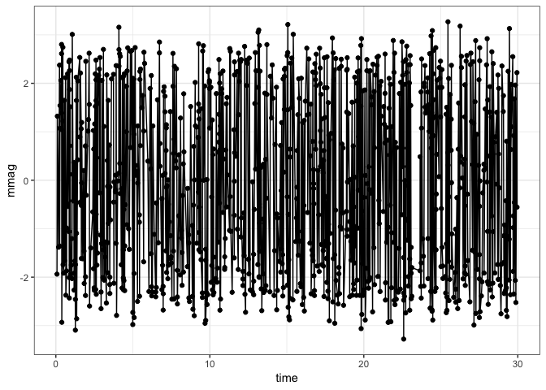
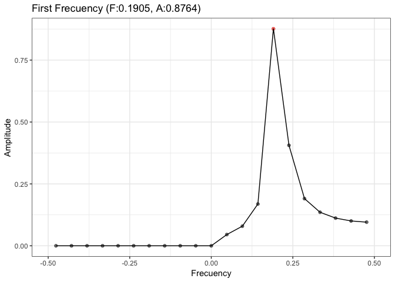
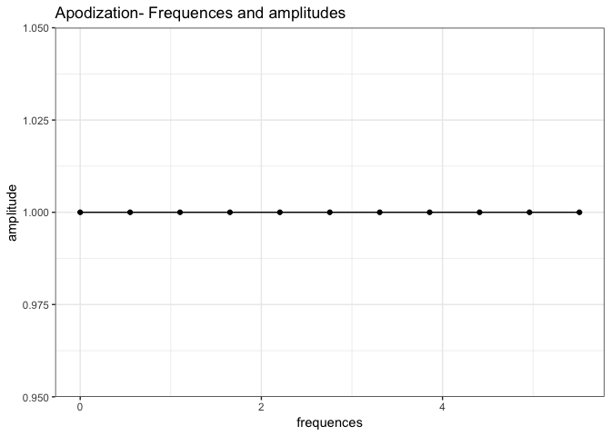
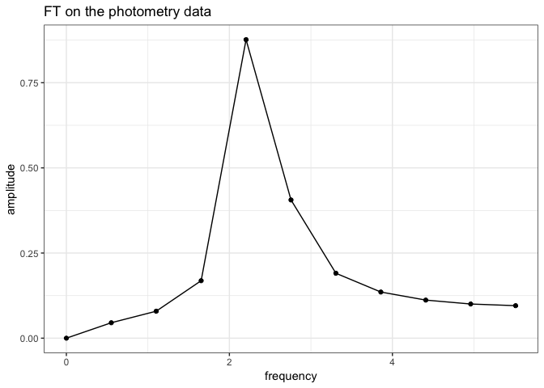
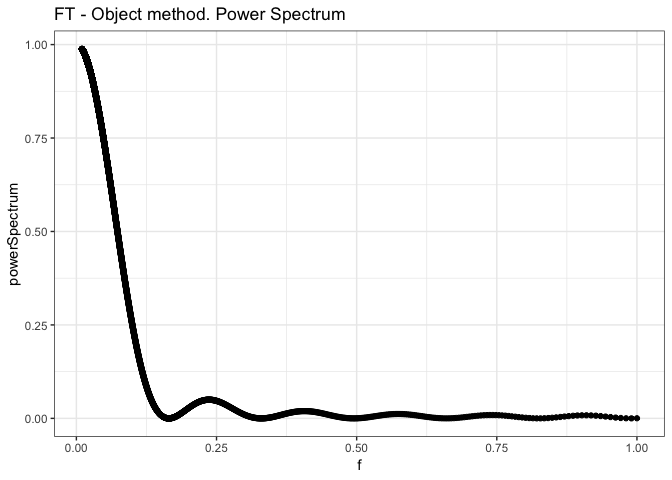
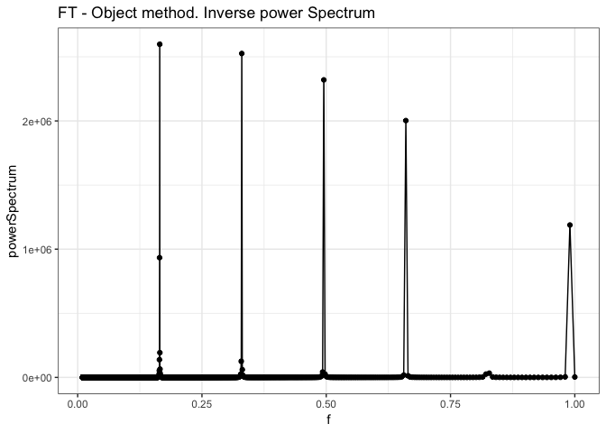
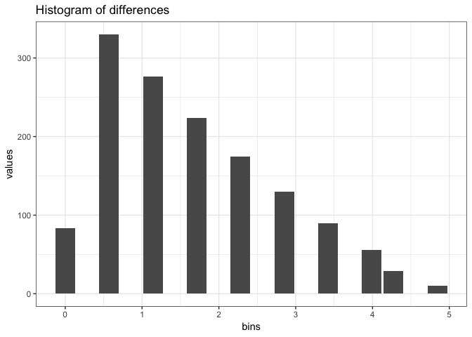

Synthetic data
================
Roberto Maestre
10/24/2018

### Synthetic data generation representing photometry

This first example is used to check the main procedure workflow results.

``` r
# Linear space with equal separation
x <- sin(seq(from = 0,
         to = 100,
         by = 5))
# Add secuential times
dt.test <-
  data.frame("time" = seq(from = 1, to = length(x)), "mmag" = x)

# Plot
ggplot(aes(time, mmag), data = dt.test) +
  geom_point() +
  geom_line() +
  theme_bw()
```



Calculate amplitures by FT

``` r
# Calculate amplitudes and frequence
dt.spectrum <- calculate_amplitudes(dt.test$time, dt.test$mmag)
# Plot amplitudes
plot_spectrum(-0.5, 0.5, dt.spectrum)
```



``` r
# Save data
# Save DF to disk
write.table(dt.spectrum[c("frequency", "amplitude")], file = "/tmp/data.csv", 
          sep = "\t",
          quote = F, 
          row.names = F, 
          col.names = F)
```

Main procedure call

``` r
out <- go(
  dt.spectrum$frequency,
  dt.spectrum$amplitude,
  filter = "uniform",
  gRegimen = 0,
  numFrequencies = 30
)
```

#### Fourier Transform on the photometry data

``` r
# Plot frecuency and amplitude
ggplot(aes(x = frequences, y = amplitude), 
       data = data.frame("frequences"=out$ft$frequences, "amplitude"=out$ft$amp)) +
  geom_point() +
  geom_line() +
  ggtitle("Apodization- Frequences and amplitudes") +
  theme_bw()
```



#### Fourier Transform on the photometry data

``` r
# Plot frecuency and amplitude
ggplot(aes(x = frequency, y = amplitude),
       data = data.frame(out$photometry)) +
  geom_point() +
  geom_line() +
  ggtitle("FT on the photometry data") +
  theme_bw()
```



``` r
# Plot frecuency and amplitude
dt <-
  data.frame("f" = out$ft$f,
             "powerSpectrum" = out$ft$powerSpectrum)
ggplot(aes(x = f, y = powerSpectrum), data = dt) +
  geom_point() +
  geom_line() +
  ggtitle("FT - Object method. Power Spectrum") +
  theme_bw()
```



``` r
# Plot frecuency and amplitude
ggplot(
  aes(x = f, y = powerSpectrum),
  data = data.frame(
    "f" = out$ft$f,
    "powerSpectrum" = out$ft$powerSpectrumInverse
  )
) +
  geom_point() +
  geom_line() +
  ggtitle("FT - Object method. Inverse power Spectrum") +
  theme_bw()
```



``` r
dt <- data.frame(out$diff$diffHistogram$histogram)
ggplot(aes(x = bins, y = values), data = dt[dt$values > 0, ]) +
  geom_bar(stat = "identity") +
  ggtitle("Histogram of differences") +
  theme_bw()
```


