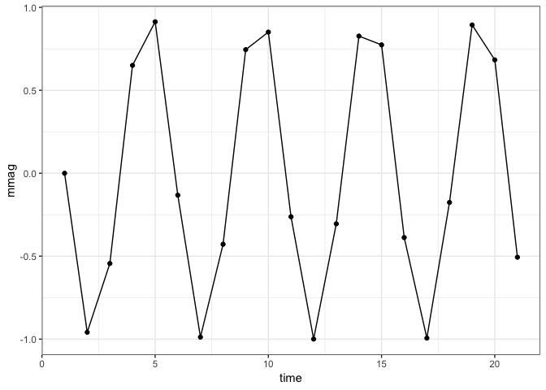
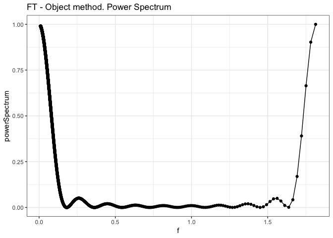
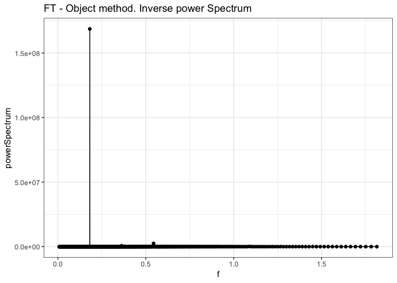
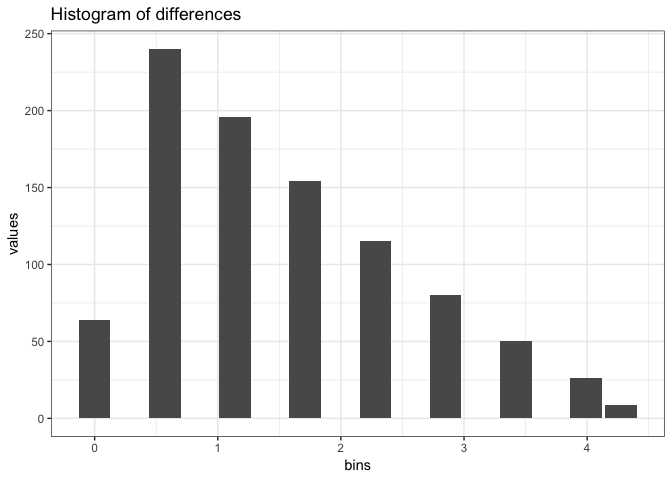

Variable Stars - Main workflow with simple synthetic data
================
Roberto Maestre
11/16/2018

### Synthetic data generation representing photometry

This first example is used to check the main procedure workflow results.

``` r
# Linear space with equal separation
x <- sin(seq(from = 0,
         to = 100,
         by = 5))
# Add secuential times
dt.test <-
  data.frame("time" = seq(from = 1, to = length(x)), "mmag" = x)

# Plot
ggplot(aes(time, mmag), data = dt.test) +
  geom_point() +
  geom_line() +
  theme_bw()
```



Main procedure call

``` r
out <- go(dt.test$time,
          dt.test$mmag,
          filter = "uniform",
          g_regimen = 0.1)
```

#### Fourier Transform on the photometry data

``` r
# Plot frecuency and amplitude
ggplot(aes(x = frequency, y = amplitude), data = data.frame(out$photometry)) +
  geom_point() +
  geom_line() +
  ggtitle("FT on the photometry data") +
  theme_bw()
```


``` r
# Plot frecuency and amplitude
dt <-
  data.frame("f" = out$ft$f,
             "powerSpectrum" = out$ft$powerSpectrum)
ggplot(aes(x = f, y = powerSpectrum), data = dt) +
  geom_point() +
  geom_line() +
  ggtitle("FT - Object method. Power Spectrum") +
  theme_bw()
```



``` r
# Plot frecuency and amplitude
ggplot(
  aes(x = f, y = powerSpectrum),
  data = data.frame(
    "f" = out$ft$f,
    "powerSpectrum" = out$ft$powerSpectrumInverse
  )
) +
  geom_point() +
  geom_line() +
  ggtitle("FT - Object method. Inverse power Spectrum") +
  theme_bw()
```



``` r
dt <- data.frame(out$diff$diffHistogram$histogram)
ggplot(aes(x = bins, y = values), data = dt[dt$values > 0, ]) +
  geom_bar(stat = "identity") +
  ggtitle("Histogram of differences") +
  theme_bw()
```


